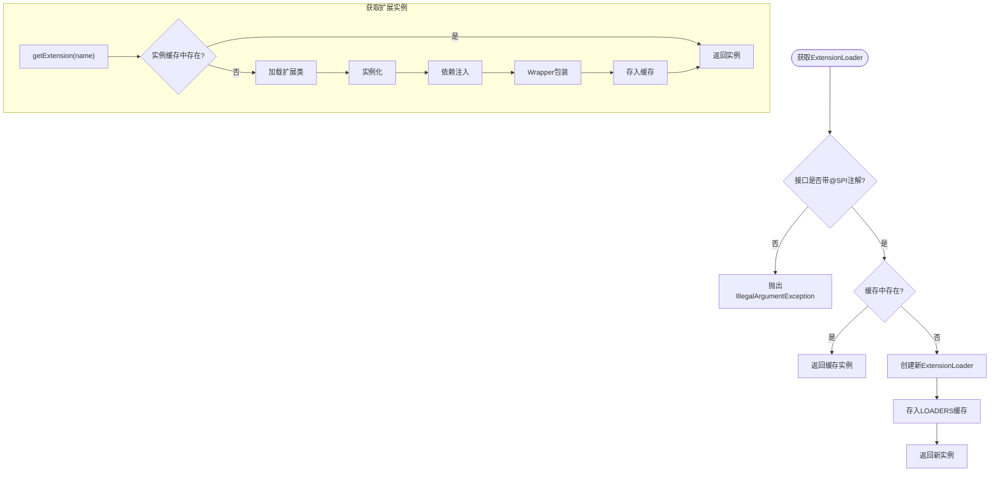
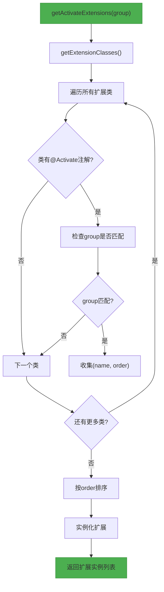
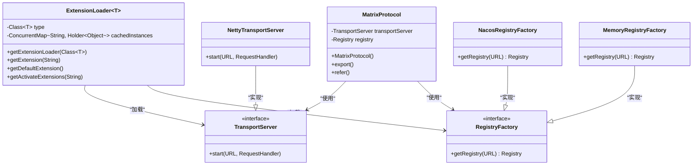

# SPI扩展机制

<cite>
**本文档中引用的文件**  
- [SPI.java](file://matrix-rpc-spi/src/main/java/io/homeey/matrix/rpc/spi/SPI.java)
- [ExtensionLoader.java](file://matrix-rpc-spi/src/main/java/io/homeey/matrix/rpc/spi/ExtensionLoader.java)
- [Activate.java](file://matrix-rpc-spi/src/main/java/io/homeey/matrix/rpc/spi/Activate.java)
- [MatrixProtocol.java](file://matrix-rpc-runtime/src/main/java/io/homeey/matrix/rpc/runtime/MatrixProtocol.java)
- [TransportServer.java](file://matrix-rpc-transport/matrix-rpc-transport-api/src/main/java/io/homeey/matrix/rpc/transport/api/TransportServer.java)
- [RegistryFactory.java](file://matrix-rpc-registry/matrix-rpc-register-api/src/main/java/io/homeey/matrix/rpc/registry/api/RegistryFactory.java)
- [io.homeey.matrix.rpc.transport.api.TransportServer](file://matrix-rpc-transport/matrix-rpc-transport-netty/src/main/resources/META-INF/matrix/io.homeey.matrix.rpc.transport.api.TransportServer)
- [io.homeey.matrix.rpc.registry.api.RegistryFactory](file://matrix-rpc-registry/matrix-rpc-registry-nacos/src/main/resources/META-INF/matrix/io.homeey.matrix.rpc.registry.api.RegistryFactory)
- [io.homeey.matrix.rpc.registry.api.RegistryFactory](file://matrix-rpc-registry/matrix-rpc-registy-memory/src/main/resources/META-INF/matrix/io.homeey.matrix.rpc.registry.api.RegistryFactory)
- [io.homeey.matrix.rpc.filter.Filter](file://matrix-rpc-filter/matrix-rpc-filter-builtin/src/main/resources/META-INF/matrix/io.homeey.matrix.rpc.filter.Filter)
- [io.homeey.matrix.rpc.cluster.api.LoadBalance](file://matrix-rpc-cluster/matrix-rpc-cluster-loadbalance/src/main/resources/META-INF/matrix/io.homeey.matrix.rpc.cluster.api.LoadBalance)
- [io.homeey.matrix.rpc.codec.api.Codec](file://matrix-rpc-codec/matrix-rpc-codec-kryo/src/main/resources/META-INF/matrix/io.homeey.matrix.rpc.codec.api.Codec)
</cite>

## 目录
1. [引言](#引言)
2. [SPI注解机制](#spi注解机制)
3. [ExtensionLoader扩展加载器](#extensionloader扩展加载器)
4. [@Activate条件激活机制](#activate条件激活机制)
5. [SPI在MatrixProtocol中的实际应用](#spi在matrixprotocol中的实际应用)
6. [开发自定义SPI扩展指南](#开发自定义spi扩展指南)
7. [总结](#总结)

## 引言
Matrix RPC框架采用SPI（Service Provider Interface）机制实现高度可扩展的架构设计。该机制允许框架核心与具体实现解耦，开发者可以通过简单的配置方式插入自定义组件，如传输层、注册中心、序列化协议等。本文档深入解析Matrix RPC的SPI扩展机制，涵盖`@SPI`、`ExtensionLoader`、`@Activate`等核心组件的工作原理，并通过实际代码示例说明其在框架中的应用。

## SPI注解机制

`@SPI`注解用于标记可扩展的接口，是SPI机制的起点。任何被`@SPI`注解的接口都表示其为一个可插拔的扩展点。

该注解定义在`SPI.java`中，具有以下特性：
- 作用于接口类型（`ElementType.TYPE`）
- 运行时保留（`RetentionPolicy.RUNTIME`）
- 可选的默认扩展名通过`value()`指定

例如，`TransportServer`接口使用`@SPI("netty")`注解，表示该接口是一个SPI扩展点，默认实现为`netty`：

```java
@SPI("netty")
public interface TransportServer extends Closeable {
    void start(URL url, RequestHandler requestHandler);
}
```

同样，`RegistryFactory`接口也通过`@SPI("nacos")`指定默认注册中心实现为Nacos。

**本节说明了SPI注解如何标记可扩展接口并指定默认实现。**

**节来源**
- [SPI.java](file://matrix-rpc-spi/src/main/java/io/homeey/matrix/rpc/spi/SPI.java#L1-L15)
- [TransportServer.java](file://matrix-rpc-transport/matrix-rpc-transport-api/src/main/java/io/homeey/matrix/rpc/transport/api/TransportServer.java#L13-L23)
- [RegistryFactory.java](file://matrix-rpc-registry/matrix-rpc-register-api/src/main/java/io/homeey/matrix/rpc/registry/api/RegistryFactory.java#L13-L22)

## ExtensionLoader扩展加载器

`ExtensionLoader`是SPI机制的核心，负责扩展点的加载、实例化、依赖注入和Wrapper包装。

### 扩展加载流程
1. **获取加载器**：通过`ExtensionLoader.getExtensionLoader(Class<T> type)`获取指定接口的加载器实例。
2. **验证SPI接口**：确保目标类为接口且带有`@SPI`注解。
3. **单例缓存**：`LOADERS`静态映射确保每个扩展接口仅有一个`ExtensionLoader`实例。
4. **加载扩展类**：从`META-INF/matrix/`和`META-INF/services/`目录下加载配置文件，解析扩展名与实现类的映射关系。
5. **创建实例**：通过无参构造函数实例化扩展类。
6. **依赖注入**：调用`injectDependencies()`方法进行依赖注入（当前为预留实现）。
7. **Wrapper包装**：通过`injectWrapper()`对实例进行装饰（当前为预留实现）。

### 核心方法
- `getExtension(String name)`：根据名称获取扩展实例，支持懒加载和线程安全。
- `getDefaultExtension()`：获取默认扩展，使用`@SPI`注解的`value`值作为默认名称。
- `getAdaptiveExtension()`：获取自适应扩展（动态代理，当前为预留实现）。



**图来源**  
- [ExtensionLoader.java](file://matrix-rpc-spi/src/main/java/io/homeey/matrix/rpc/spi/ExtensionLoader.java#L12-L231)

**节来源**  
- [ExtensionLoader.java](file://matrix-rpc-spi/src/main/java/io/homeey/matrix/rpc/spi/ExtensionLoader.java#L12-L231)

## @Activate条件激活机制

`@Activate`注解用于实现扩展的条件激活，支持基于分组、键值和优先级的动态选择。

### 注解属性
- `group()`：指定扩展生效的分组，如`"CONSUMER"`或`"PROVIDER"`。
- `order()`：指定激活优先级，数值越小优先级越高。
- `value()`：预留条件键值，用于更复杂的条件判断。

### 激活逻辑
`ExtensionLoader.getActivateExtensions(String group)`方法负责筛选并排序符合条件的扩展：
1. 遍历所有扩展类，检查是否带有`@Activate`注解。
2. 调用`isGroupMatched()`判断当前`group`是否匹配注解中的`group`数组。
3. 收集匹配的扩展及其`order`值。
4. 按`order`升序排序后实例化并返回。

例如，在`MatrixProtocol`中，`@Activate(order = 100)`表示该协议在激活时具有优先级100。



**图来源**  
- [Activate.java](file://matrix-rpc-spi/src/main/java/io/homeey/matrix/rpc/spi/Activate.java#L1-L29)
- [ExtensionLoader.java](file://matrix-rpc-spi/src/main/java/io/homeey/matrix/rpc/spi/ExtensionLoader.java#L167-L218)

**节来源**  
- [Activate.java](file://matrix-rpc-spi/src/main/java/io/homeey/matrix/rpc/spi/Activate.java#L1-L29)
- [ExtensionLoader.java](file://matrix-rpc-spi/src/main/java/io/homeey/matrix/rpc/spi/ExtensionLoader.java#L167-L218)

## SPI在MatrixProtocol中的实际应用

`MatrixProtocol`构造函数中展示了SPI机制的实际应用，通过`ExtensionLoader`加载`TransportServer`和`RegistryFactory`。

### 传输层加载
```java
this.transportServer = ExtensionLoader.getExtensionLoader(TransportServer.class)
        .getExtension("netty");
```
此代码从`META-INF/matrix/io.homeey.matrix.rpc.transport.api.TransportServer`配置文件中加载`netty`对应的`NettyTransportServer`实现。

配置文件内容：
```
netty=io.homeey.matrix.rpc.transport.netty.server.NettyTransportServer
```

### 注册中心工厂加载
```java
RegistryFactory registryFactory = ExtensionLoader.getExtensionLoader(RegistryFactory.class)
        .getExtension(registryUrl.getProtocol());
```
根据`registryUrl`的协议（如`nacos`或`memory`）动态加载对应的工厂实现。

配置示例：
- Nacos: `nacos=io.homeey.matrix.rpc.registry.nacos.NacosRegistryFactory`
- Memory: `memory=io.homeey.matrix.rpc.registry.MemoryRegistryFactory`

### 扩展链构建
在`refer`和`export`方法中，通过`FilterChainBuilder.buildInvokerChain()`构建过滤器链，该链中的过滤器（如`AccessLogFilter`、`ExceptionFilter`）也通过SPI机制加载，且带有`@Activate`注解实现条件激活。



**图来源**  
- [MatrixProtocol.java](file://matrix-rpc-runtime/src/main/java/io/homeey/matrix/rpc/runtime/MatrixProtocol.java#L37-L47)
- [io.homeey.matrix.rpc.transport.api.TransportServer](file://matrix-rpc-transport/matrix-rpc-transport-netty/src/main/resources/META-INF/matrix/io.homeey.matrix.rpc.transport.api.TransportServer#L1-L2)
- [io.homeey.matrix.rpc.registry.api.RegistryFactory](file://matrix-rpc-registry/matrix-rpc-registry-nacos/src/main/resources/META-INF/matrix/io.homeey.matrix.rpc.registry.api.RegistryFactory#L1-L1)
- [io.homeey.matrix.rpc.registry.api.RegistryFactory](file://matrix-rpc-registry/matrix-rpc-registy-memory/src/main/resources/META-INF/matrix/io.homeey.matrix.rpc.registry.api.RegistryFactory#L1-L1)

**节来源**  
- [MatrixProtocol.java](file://matrix-rpc-runtime/src/main/java/io/homeey/matrix/rpc/runtime/MatrixProtocol.java#L37-L47)

## 开发自定义SPI扩展指南

### 1. 编写扩展实现类
创建实现类并实现对应的SPI接口。例如，实现自定义负载均衡策略：

```java
@Activate(order = 50)
public class MyLoadBalance implements LoadBalance {
    // 实现逻辑
}
```

### 2. 配置SPI文件
在`src/main/resources/META-INF/matrix/`目录下创建以接口全限定名为文件名的配置文件，格式为`名称=实现类全限定名`。

例如，为`LoadBalance`添加自定义实现：
```
myload=io.homeey.matrix.rpc.cluster.loadbalance.MyLoadBalance
```

### 3. 利用SPI特性
- **默认扩展**：在`@SPI`注解中指定`value`作为默认实现。
- **条件激活**：使用`@Activate`注解控制扩展在特定场景（如消费者或提供者）下激活。
- **优先级控制**：通过`order`属性调整多个激活扩展的执行顺序。
- **Wrapper包装**：实现包装类对核心功能进行增强（当前框架预留）。

### 4. 示例：添加自定义过滤器
```java
@Activate(group = "CONSUMER", order = 10)
public class MyCustomFilter implements Filter {
    @Override
    public Result invoke(Invoker<?> invoker, Invocation invocation) {
        // 前置处理
        Result result = invoker.invoke(invocation);
        // 后置处理
        return result;
    }
}
```

配置文件 `META-INF/matrix/io.homeey.matrix.rpc.filter.Filter`：
```
myfilter=io.homeey.matrix.rpc.filter.custom.MyCustomFilter
```

**节来源**  
- [io.homeey.matrix.rpc.filter.Filter](file://matrix-rpc-filter/matrix-rpc-filter-builtin/src/main/resources/META-INF/matrix/io.homeey.matrix.rpc.filter.Filter#L1-L4)
- [io.homeey.matrix.rpc.cluster.api.LoadBalance](file://matrix-rpc-cluster/matrix-rpc-cluster-loadbalance/src/main/resources/META-INF/matrix/io.homeey.matrix.rpc.cluster.api.LoadBalance#L1-L1)
- [io.homeey.matrix.rpc.codec.api.Codec](file://matrix-rpc-codec/matrix-rpc-codec-kryo/src/main/resources/META-INF/matrix/io.homeey.matrix.rpc.codec.api.Codec#L1-L1)

## 总结
Matrix RPC的SPI扩展机制是其可扩展性的核心。通过`@SPI`注解标记扩展点，`ExtensionLoader`实现扩展的加载与管理，`@Activate`注解支持基于分组和优先级的条件激活。该机制在`MatrixProtocol`中得到充分体现，用于加载传输层、注册中心等关键组件。开发者可通过简单的配置即可插入自定义实现，极大提升了框架的灵活性和可维护性。未来可进一步完善依赖注入和Wrapper包装功能，使SPI机制更加完善。