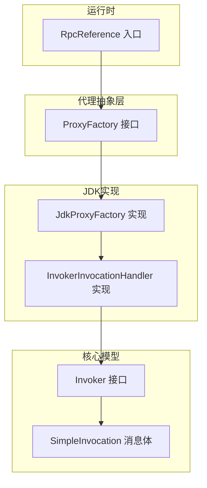
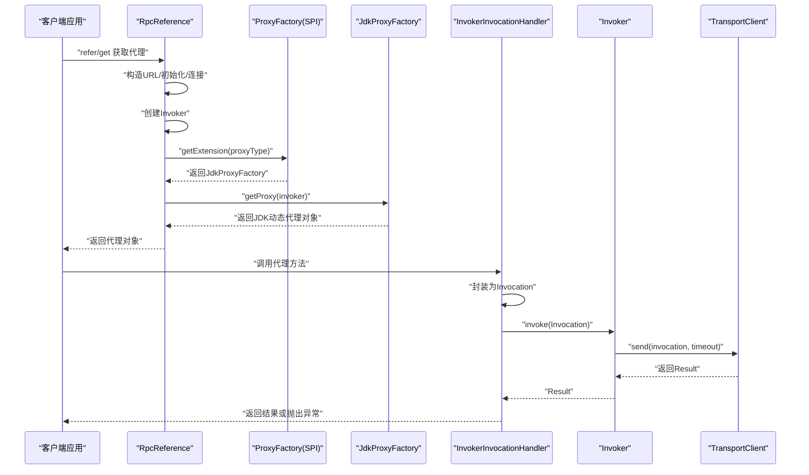
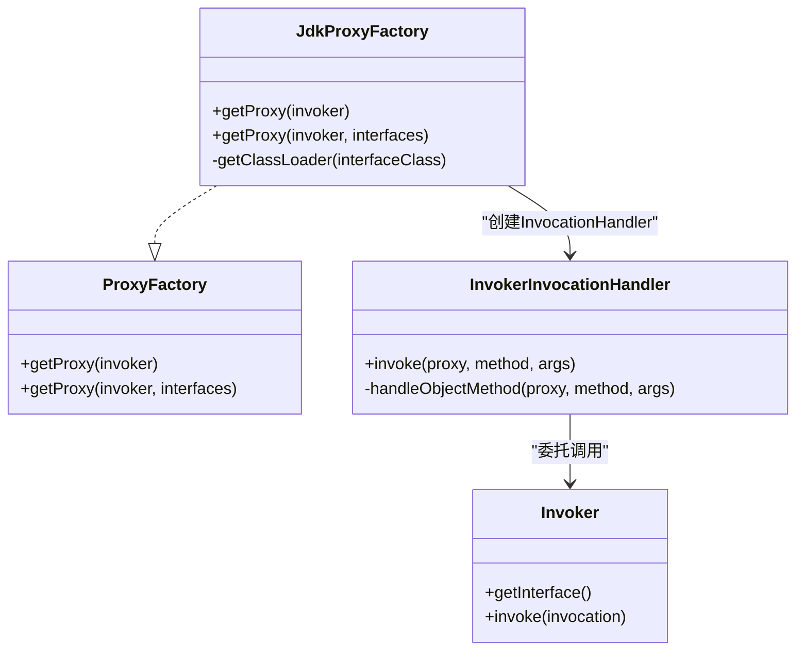
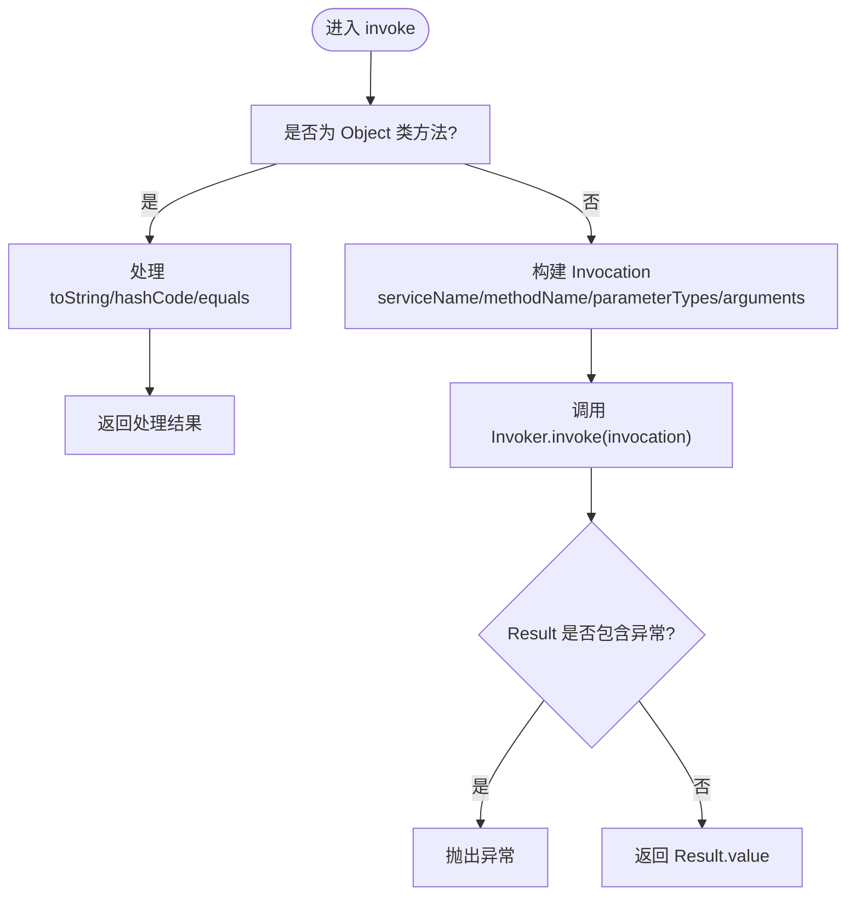
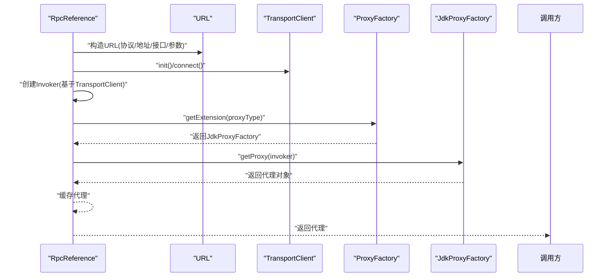
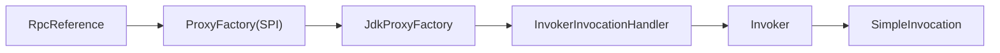

# 动态代理

<cite>
**本文引用的文件**
- [ProxyFactory.java](file://matrix-rpc-proxy/matrix-rpc-proxy-api/src/main/java/io/homeey/matrix/rpc/proxy/api/ProxyFactory.java)
- [JdkProxyFactory.java](file://matrix-rpc-proxy/matrix-rpc-proxy-jdk/src/main/java/io/homeey/matrix/rpc/proxy/jdk/JdkProxyFactory.java)
- [InvokerInvocationHandler.java](file://matrix-rpc-proxy/matrix-rpc-proxy-jdk/src/main/java/io/homeey/matrix/rpc/proxy/jdk/InvokerInvocationHandler.java)
- [RpcReference.java](file://matrix-rpc-runtime/src/main/java/io/homeey/matrix/rpc/runtime/RpcReference.java)
- [Invoker.java](file://matrix-rpc-core/src/main/java/io/homeey/matrix/rpc/core/Invoker.java)
- [SimpleInvocation.java](file://matrix-rpc-core/src/main/java/io/homeey/matrix/rpc/core/SimpleInvocation.java)
- [io.homeey.matrix.rpc.proxy.api.ProxyFactory](file://matrix-rpc-proxy/matrix-rpc-proxy-jdk/src/main/resources/META-INF/matrix/io.homeey.matrix.rpc.proxy.api.ProxyFactory)
- [ConsumerMain.java](file://matrix-rpc-examples/src/main/java/io/homeey/matrix/rpc/example/consumer/ConsumerMain.java)
</cite>

## 目录
1. [引言](#引言)
2. [项目结构](#项目结构)
3. [核心组件](#核心组件)
4. [架构总览](#架构总览)
5. [详细组件分析](#详细组件分析)
6. [依赖关系分析](#依赖关系分析)
7. [性能与限制](#性能与限制)
8. [故障排查指南](#故障排查指南)
9. [结论](#结论)
10. [附录](#附录)

## 引言
本节聚焦于矩阵RPC框架中的动态代理能力，系统性阐述以下主题：
- ProxyFactory接口的设计目标与职责边界
- JdkProxyFactory对JDK动态代理的实现细节
- InvokerInvocationHandler如何将方法调用转换为Invoker.invoke调用
- 结合RpcReference.get流程，说明代理对象如何被生成并用于远程服务调用
- JDK动态代理的原理、优势与限制
- 扩展其他代理方式（如CGLIB）的可能性与建议

## 项目结构
围绕动态代理的相关模块分布如下：
- 接口层：ProxyFactory定义代理工厂的统一抽象
- JDK实现：JdkProxyFactory基于JDK动态代理生成代理对象
- 调用桥接：InvokerInvocationHandler实现InvocationHandler，把反射调用转为RPC Invocation
- 运行时入口：RpcReference负责构建Invoker并通过SPI选择ProxyFactory生成代理
- 核心模型：Invoker接口、SimpleInvocation消息载体

图表来源
- [ProxyFactory.java](file://matrix-rpc-proxy/matrix-rpc-proxy-api/src/main/java/io/homeey/matrix/rpc/proxy/api/ProxyFactory.java#L1-L44)
- [JdkProxyFactory.java](file://matrix-rpc-proxy/matrix-rpc-proxy-jdk/src/main/java/io/homeey/matrix/rpc/proxy/jdk/JdkProxyFactory.java#L1-L60)
- [InvokerInvocationHandler.java](file://matrix-rpc-proxy/matrix-rpc-proxy-jdk/src/main/java/io/homeey/matrix/rpc/proxy/jdk/InvokerInvocationHandler.java#L1-L73)
- [RpcReference.java](file://matrix-rpc-runtime/src/main/java/io/homeey/matrix/rpc/runtime/RpcReference.java#L1-L172)
- [Invoker.java](file://matrix-rpc-core/src/main/java/io/homeey/matrix/rpc/core/Invoker.java#L1-L8)
- [SimpleInvocation.java](file://matrix-rpc-core/src/main/java/io/homeey/matrix/rpc/core/SimpleInvocation.java#L1-L68)

章节来源
- [ProxyFactory.java](file://matrix-rpc-proxy/matrix-rpc-proxy-api/src/main/java/io/homeey/matrix/rpc/proxy/api/ProxyFactory.java#L1-L44)
- [JdkProxyFactory.java](file://matrix-rpc-proxy/matrix-rpc-proxy-jdk/src/main/java/io/homeey/matrix/rpc/proxy/jdk/JdkProxyFactory.java#L1-L60)
- [InvokerInvocationHandler.java](file://matrix-rpc-proxy/matrix-rpc-proxy-jdk/src/main/java/io/homeey/matrix/rpc/proxy/jdk/InvokerInvocationHandler.java#L1-L73)
- [RpcReference.java](file://matrix-rpc-runtime/src/main/java/io/homeey/matrix/rpc/runtime/RpcReference.java#L1-L172)
- [Invoker.java](file://matrix-rpc-core/src/main/java/io/homeey/matrix/rpc/core/Invoker.java#L1-L8)
- [SimpleInvocation.java](file://matrix-rpc-core/src/main/java/io/homeey/matrix/rpc/core/SimpleInvocation.java#L1-L68)

## 核心组件
- ProxyFactory：定义代理工厂的两个重载方法，分别支持单接口与多接口代理对象的创建。该接口通过SPI标注默认实现为“jdk”，并在JDK实现中以资源文件注册具体实现类。
- JdkProxyFactory：基于JDK动态代理生成代理对象，优先使用接口类加载器，回退到线程上下文类加载器，最终回退到自身类加载器，确保在不同环境下都能正确加载。
- InvokerInvocationHandler：实现InvocationHandler，拦截代理对象的所有方法调用，将调用信息封装为Invocation并委托给Invoker执行；同时处理Object类方法（toString/hashCode/equals），并对异常进行透传。
- RpcReference：运行时入口，负责构造URL、初始化并连接TransportClient、创建Invoker、通过SPI选择ProxyFactory并生成代理对象，最终返回给用户使用。
- Invoker：远程调用的抽象，提供getInterface与invoke方法，是代理调用链路的终点。
- SimpleInvocation：承载服务名、方法名、参数类型数组、实参数组以及附件信息的消息载体。

章节来源
- [ProxyFactory.java](file://matrix-rpc-proxy/matrix-rpc-proxy-api/src/main/java/io/homeey/matrix/rpc/proxy/api/ProxyFactory.java#L1-L44)
- [JdkProxyFactory.java](file://matrix-rpc-proxy/matrix-rpc-proxy-jdk/src/main/java/io/homeey/matrix/rpc/proxy/jdk/JdkProxyFactory.java#L1-L60)
- [InvokerInvocationHandler.java](file://matrix-rpc-proxy/matrix-rpc-proxy-jdk/src/main/java/io/homeey/matrix/rpc/proxy/jdk/InvokerInvocationHandler.java#L1-L73)
- [RpcReference.java](file://matrix-rpc-runtime/src/main/java/io/homeey/matrix/rpc/runtime/RpcReference.java#L1-L172)
- [Invoker.java](file://matrix-rpc-core/src/main/java/io/homeey/matrix/rpc/core/Invoker.java#L1-L8)
- [SimpleInvocation.java](file://matrix-rpc-core/src/main/java/io/homeey/matrix/rpc/core/SimpleInvocation.java#L1-L68)

## 架构总览
下面的序列图展示了从用户获取远程服务代理到一次典型远程调用的完整流程。

图表来源
- [RpcReference.java](file://matrix-rpc-runtime/src/main/java/io/homeey/matrix/rpc/runtime/RpcReference.java#L98-L130)
- [JdkProxyFactory.java](file://matrix-rpc-proxy/matrix-rpc-proxy-jdk/src/main/java/io/homeey/matrix/rpc/proxy/jdk/JdkProxyFactory.java#L24-L41)
- [InvokerInvocationHandler.java](file://matrix-rpc-proxy/matrix-rpc-proxy-jdk/src/main/java/io/homeey/matrix/rpc/proxy/jdk/InvokerInvocationHandler.java#L28-L52)
- [Invoker.java](file://matrix-rpc-core/src/main/java/io/homeey/matrix/rpc/core/Invoker.java#L5-L8)
- [SimpleInvocation.java](file://matrix-rpc-core/src/main/java/io/homeey/matrix/rpc/core/SimpleInvocation.java#L8-L32)

## 详细组件分析

### ProxyFactory接口设计
- 设计目标：将Invoker转换为业务接口的代理对象，使用户像调用本地方法一样调用远程服务。
- 方法重载：
  - 单接口代理：根据Invoker.getInterface()推断接口类型
  - 多接口代理：显式指定需要实现的接口数组，便于同时实现业务接口与泛化接口等
- SPI注解：@SPI("jdk")声明默认实现为“jdk”，配合资源文件完成自动发现。

章节来源
- [ProxyFactory.java](file://matrix-rpc-proxy/matrix-rpc-proxy-api/src/main/java/io/homeey/matrix/rpc/proxy/api/ProxyFactory.java#L16-L43)
- [io.homeey.matrix.rpc.proxy.api.ProxyFactory](file://matrix-rpc-proxy/matrix-rpc-proxy-jdk/src/main/resources/META-INF/matrix/io.homeey.matrix.rpc.proxy.api.ProxyFactory#L1-L2)

### JdkProxyFactory实现
- 类加载器选择策略：优先使用接口类加载器，若为空则回退到线程上下文类加载器，最后回退到自身类加载器，保证在不同容器/模块化环境中均可用。
- 代理创建：通过JDK Proxy.newProxyInstance创建代理对象，传入接口数组与自定义InvocationHandler。
- 多接口支持：在单接口重载中复用多接口重载，传入接口数组为单一接口。

图表来源
- [JdkProxyFactory.java](file://matrix-rpc-proxy/matrix-rpc-proxy-jdk/src/main/java/io/homeey/matrix/rpc/proxy/jdk/JdkProxyFactory.java#L21-L60)
- [InvokerInvocationHandler.java](file://matrix-rpc-proxy/matrix-rpc-proxy-jdk/src/main/java/io/homeey/matrix/rpc/proxy/jdk/InvokerInvocationHandler.java#L20-L73)
- [ProxyFactory.java](file://matrix-rpc-proxy/matrix-rpc-proxy-api/src/main/java/io/homeey/matrix/rpc/proxy/api/ProxyFactory.java#L16-L43)
- [Invoker.java](file://matrix-rpc-core/src/main/java/io/homeey/matrix/rpc/core/Invoker.java#L1-L8)

章节来源
- [JdkProxyFactory.java](file://matrix-rpc-proxy/matrix-rpc-proxy-jdk/src/main/java/io/homeey/matrix/rpc/proxy/jdk/JdkProxyFactory.java#L21-L60)

### InvokerInvocationHandler调用桥接
- 对象方法处理：对toString/hashCode/equals进行特殊处理，其余Object方法抛出不支持异常，避免误触发远程调用。
- Invocation构建：从Invoker.getInterface().getName()获取服务名，从Method提取方法名与参数类型数组，从args构建实参数组。
- 远程调用与结果处理：调用Invoker.invoke返回Result，若Result包含异常则抛出，否则返回Result的值。
- 与JDK动态代理的集成：作为Proxy.newProxyInstance的第三个参数，所有代理方法调用都会进入invoke。

图表来源
- [InvokerInvocationHandler.java](file://matrix-rpc-proxy/matrix-rpc-proxy-jdk/src/main/java/io/homeey/matrix/rpc/proxy/jdk/InvokerInvocationHandler.java#L28-L71)
- [SimpleInvocation.java](file://matrix-rpc-core/src/main/java/io/homeey/matrix/rpc/core/SimpleInvocation.java#L15-L32)
- [Invoker.java](file://matrix-rpc-core/src/main/java/io/homeey/matrix/rpc/core/Invoker.java#L5-L8)

章节来源
- [InvokerInvocationHandler.java](file://matrix-rpc-proxy/matrix-rpc-proxy-jdk/src/main/java/io/homeey/matrix/rpc/proxy/jdk/InvokerInvocationHandler.java#L28-L71)
- [SimpleInvocation.java](file://matrix-rpc-core/src/main/java/io/homeey/matrix/rpc/core/SimpleInvocation.java#L15-L32)

### RpcReference.get生成远程代理
- URL构造：根据协议、主机、端口、服务接口名与超时参数构造URL。
- 客户端初始化：通过SPI获取TransportClient并初始化、连接。
- Invoker创建：以接口类型与超时为上下文，创建匿名Invoker实现，其invoke通过TransportClient.send发送Invocation并返回Result。
- 代理生成：通过SPI按proxyType获取ProxyFactory（默认“jdk”），调用getProxy(invoker)生成代理对象。
- 返回代理：将代理缓存到RpcReference实例，后续get直接返回。

图表来源
- [RpcReference.java](file://matrix-rpc-runtime/src/main/java/io/homeey/matrix/rpc/runtime/RpcReference.java#L98-L130)
- [JdkProxyFactory.java](file://matrix-rpc-proxy/matrix-rpc-proxy-jdk/src/main/java/io/homeey/matrix/rpc/proxy/jdk/JdkProxyFactory.java#L24-L41)

章节来源
- [RpcReference.java](file://matrix-rpc-runtime/src/main/java/io/homeey/matrix/rpc/runtime/RpcReference.java#L98-L130)

### 示例用法
- 在示例消费者中，通过一行代码即可获取远程服务代理并直接调用，体现了“像调用本地方法一样调用远程服务”的设计理念。

章节来源
- [ConsumerMain.java](file://matrix-rpc-examples/src/main/java/io/homeey/matrix/rpc/example/consumer/ConsumerMain.java#L12-L20)

## 依赖关系分析
- SPI注册与发现：JDK实现通过资源文件将“jdk”映射到JdkProxyFactory，RpcReference在get时通过ExtensionLoader按proxyType获取对应实现。
- 组件耦合：
  - RpcReference依赖ProxyFactory与TransportClient
  - JdkProxyFactory依赖Invoker与InvocationHandler
  - InvokerInvocationHandler依赖Invoker与Invocation
- 可能的循环依赖：当前结构清晰，未见直接循环依赖；ProxyFactory与JdkProxyFactory通过SPI解耦。

图表来源
- [io.homeey.matrix.rpc.proxy.api.ProxyFactory](file://matrix-rpc-proxy/matrix-rpc-proxy-jdk/src/main/resources/META-INF/matrix/io.homeey.matrix.rpc.proxy.api.ProxyFactory#L1-L2)
- [RpcReference.java](file://matrix-rpc-runtime/src/main/java/io/homeey/matrix/rpc/runtime/RpcReference.java#L118-L124)
- [JdkProxyFactory.java](file://matrix-rpc-proxy/matrix-rpc-proxy-jdk/src/main/java/io/homeey/matrix/rpc/proxy/jdk/JdkProxyFactory.java#L24-L41)
- [InvokerInvocationHandler.java](file://matrix-rpc-proxy/matrix-rpc-proxy-jdk/src/main/java/io/homeey/matrix/rpc/proxy/jdk/InvokerInvocationHandler.java#L28-L52)
- [SimpleInvocation.java](file://matrix-rpc-core/src/main/java/io/homeey/matrix/rpc/core/SimpleInvocation.java#L15-L32)

章节来源
- [io.homeey.matrix.rpc.proxy.api.ProxyFactory](file://matrix-rpc-proxy/matrix-rpc-proxy-jdk/src/main/resources/META-INF/matrix/io.homeey.matrix.rpc.proxy.api.ProxyFactory#L1-L2)
- [RpcReference.java](file://matrix-rpc-runtime/src/main/java/io/homeey/matrix/rpc/runtime/RpcReference.java#L118-L124)

## 性能与限制
- 性能特性
  - JDK动态代理零外部依赖，使用JDK原生Proxy，性能优异，适合大多数RPC场景
  - 代理对象由JVM生成，方法调用通过反射桥接，开销可控
- 适用范围
  - 仅支持接口代理，不支持对类的代理
  - 适用于服务接口均为接口的场景
- 限制与权衡
  - 无法代理非接口类型（如具体类）
  - 无法代理final类或final方法
  - 无法代理静态方法
  - 代理对象的类加载器策略需谨慎，JdkProxyFactory已提供多级回退策略
- 扩展思路
  - 若需代理具体类，可在SPI中新增CGLIB实现，实现ProxyFactory接口并注册映射
  - CGLIB实现可提供类级别的代理能力，但会引入额外依赖与编译期要求

[本节为通用性能讨论，无需列出具体文件来源]

## 故障排查指南
- 代理对象无法生成
  - 检查SPI注册：确认资源文件中存在“jdk=...”映射
  - 检查proxyType参数：RpcReference.proxyType需与SPI注册的键一致
- 远程调用异常
  - InvokerInvocationHandler会将Result中的异常抛出，检查异常栈定位问题
  - 确认TransportClient已正确初始化与连接
- 类加载器问题
  - JdkProxyFactory提供多级回退策略，若仍失败，检查接口类加载器与线程上下文类加载器设置
- 方法签名不匹配
  - SimpleInvocation要求参数类型数组长度与实参数组长度一致，检查调用处参数

章节来源
- [io.homeey.matrix.rpc.proxy.api.ProxyFactory](file://matrix-rpc-proxy/matrix-rpc-proxy-jdk/src/main/resources/META-INF/matrix/io.homeey.matrix.rpc.proxy.api.ProxyFactory#L1-L2)
- [InvokerInvocationHandler.java](file://matrix-rpc-proxy/matrix-rpc-proxy-jdk/src/main/java/io/homeey/matrix/rpc/proxy/jdk/InvokerInvocationHandler.java#L43-L52)
- [JdkProxyFactory.java](file://matrix-rpc-proxy/matrix-rpc-proxy-jdk/src/main/java/io/homeey/matrix/rpc/proxy/jdk/JdkProxyFactory.java#L43-L58)
- [SimpleInvocation.java](file://matrix-rpc-core/src/main/java/io/homeey/matrix/rpc/core/SimpleInvocation.java#L29-L32)

## 结论
- ProxyFactory提供了统一的代理对象创建抽象，JdkProxyFactory基于JDK动态代理实现，具备零依赖、高性能、易用的特点
- InvokerInvocationHandler将方法调用转换为RPC Invocation并委托Invoker执行，形成清晰的调用链路
- RpcReference通过SPI选择ProxyFactory并生成代理，使用户能够以本地调用的方式访问远程服务
- 当前实现满足接口代理场景，若需代理具体类，可通过SPI扩展CGLIB实现

[本节为总结性内容，无需列出具体文件来源]

## 附录
- SPI扩展建议
  - 新增CGLIB实现：实现ProxyFactory接口，注册资源文件映射，通过RpcReference.proxyType切换
  - 注意事项：CGLIB实现需处理类代理的特殊性，包括final类/方法的限制与类加载器策略

[本节为概念性内容，无需列出具体文件来源]