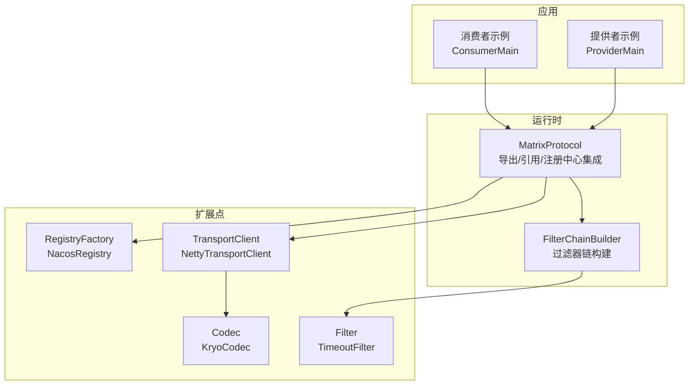
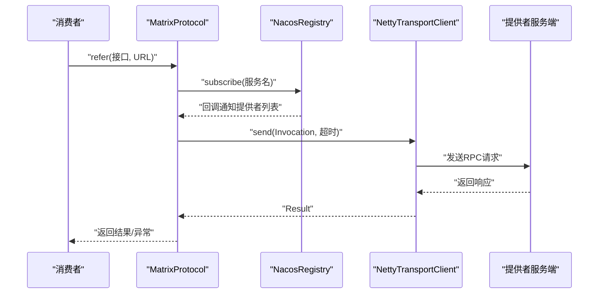
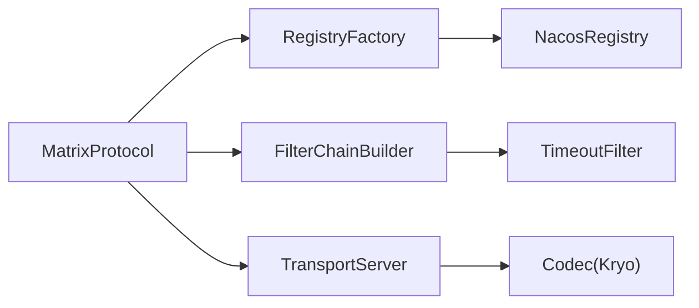
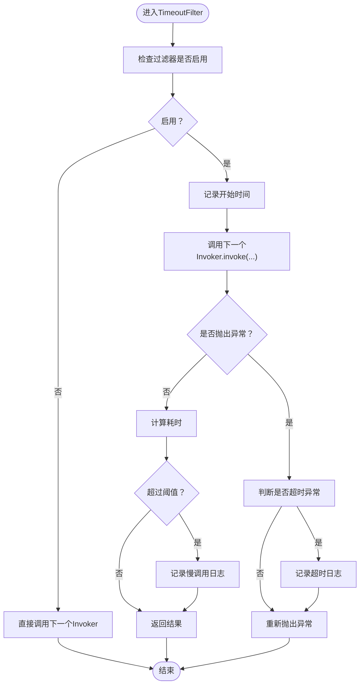

# 常见问题解答

<cite>
**本文引用的文件**
- [README.md](file://README.md)
- [RpcException.java](file://matrix-rpc-common/src/main/java/io/homeey/matrix/rpc/common/RpcException.java)
- [MatrixProtocol.java](file://matrix-rpc-runtime/src/main/java/io/homeey/matrix/rpc/runtime/MatrixProtocol.java)
- [NacosRegistry.java](file://matrix-rpc-registry/matrix-rpc-registry-nacos/src/main/java/io/homeey/matrix/rpc/registry/nacos/NacosRegistry.java)
- [KryoCodec.java](file://matrix-rpc-codec/matrix-rpc-codec-kryo/src/main/java/io/homeey/matrix/rpc/codec/kryo/KryoCodec.java)
- [TimeoutFilter.java](file://matrix-rpc-filter/matrix-rpc-filter-builtin/src/main/java/io/homeey/matrix/rpc/filter/builtin/TimeoutFilter.java)
- [ExtensionLoader.java](file://matrix-rpc-spi/src/main/java/io/homeey/matrix/rpc/spi/ExtensionLoader.java)
- [FilterChainBuilder.java](file://matrix-rpc-runtime/src/main/java/io/homeey/matrix/rpc/runtime/support/FilterChainBuilder.java)
- [io.homeey.matrix.rpc.registry.api.RegistryFactory](file://matrix-rpc-registry/matrix-rpc-registry-nacos/src/main/resources/META-INF/matrix/io.homeey.matrix.rpc.registry.api.RegistryFactory)
- [io.homeey.matrix.rpc.codec.api.Codec](file://matrix-rpc-codec/matrix-rpc-codec-kryo/src/main/resources/META-INF/matrix/io.homeey.matrix.rpc.codec.api.Codec)
- [io.homeey.matrix.rpc.filter.Filter](file://matrix-rpc-filter/matrix-rpc-filter-builtin/src/main/resources/META-INF/matrix/io.homeey.matrix.rpc.filter.Filter)
- [NettyTransportClient.java](file://matrix-rpc-transport/matrix-rpc-transport-netty/src/main/java/io/homeey/matrix/rpc/transport/netty/client/NettyTransportClient.java)
- [ConsumerMain.java](file://matrix-rpc-examples/src/main/java/io/homeey/matrix/rpc/example/consumer/ConsumerMain.java)
- [ProviderMain.java](file://matrix-rpc-examples/src/main/java/io/homeey/matrix/rpc/example/provider/ProviderMain.java)
</cite>

## 目录
1. [简介](#简介)
2. [项目结构](#项目结构)
3. [核心组件](#核心组件)
4. [架构总览](#架构总览)
5. [详细问题与解答](#详细问题与解答)
6. [依赖关系分析](#依赖关系分析)
7. [性能注意事项](#性能注意事项)
8. [故障排查指南](#故障排查指南)
9. [结论](#结论)

## 简介
本FAQ面向使用Matrix RPC的用户，聚焦于典型问题：服务无法注册到Nacos、调用超时、序列化失败、SPI扩展不生效。我们将从症状、原因分析到具体解决方案与调试步骤逐项说明，帮助您快速定位并解决问题。

## 项目结构
Matrix RPC采用模块化设计，围绕SPI机制组织扩展点，核心包括：
- 协议与运行时：MatrixProtocol负责导出/引用、注册中心集成、过滤器链构建
- 注册中心：NacosRegistry实现基于Nacos的服务注册/发现
- 编解码：KryoCodec提供复杂对象的序列化支持
- 传输：NettyTransportClient负责网络IO与请求发送
- 过滤器：内置超时检测等过滤器，通过SPI按组激活
- 示例：ConsumerMain/ProviderMain展示典型用法

图表来源
- [MatrixProtocol.java](file://matrix-rpc-runtime/src/main/java/io/homeey/matrix/rpc/runtime/MatrixProtocol.java#L1-L190)
- [NacosRegistry.java](file://matrix-rpc-registry/matrix-rpc-registry-nacos/src/main/java/io/homeey/matrix/rpc/registry/nacos/NacosRegistry.java#L1-L159)
- [KryoCodec.java](file://matrix-rpc-codec/matrix-rpc-codec-kryo/src/main/java/io/homeey/matrix/rpc/codec/kryo/KryoCodec.java#L1-L66)
- [NettyTransportClient.java](file://matrix-rpc-transport/matrix-rpc-transport-netty/src/main/java/io/homeey/matrix/rpc/transport/netty/client/NettyTransportClient.java#L1-L220)
- [FilterChainBuilder.java](file://matrix-rpc-runtime/src/main/java/io/homeey/matrix/rpc/runtime/support/FilterChainBuilder.java#L1-L53)
- [io.homeey.matrix.rpc.registry.api.RegistryFactory](file://matrix-rpc-registry/matrix-rpc-registry-nacos/src/main/resources/META-INF/matrix/io.homeey.matrix.rpc.registry.api.RegistryFactory#L1-L1)
- [io.homeey.matrix.rpc.codec.api.Codec](file://matrix-rpc-codec/matrix-rpc-codec-kryo/src/main/resources/META-INF/matrix/io.homeey.matrix.rpc.codec.api.Codec#L1-L1)
- [io.homeey.matrix.rpc.filter.Filter](file://matrix-rpc-filter/matrix-rpc-filter-builtin/src/main/resources/META-INF/matrix/io.homeey.matrix.rpc.filter.Filter#L1-L4)

章节来源
- [README.md](file://README.md#L1-L277)

## 核心组件
- 协议与运行时：MatrixProtocol负责服务导出、引用、注册中心订阅与负载均衡选择；默认使用内存注册中心，可通过系统属性切换至Nacos
- 注册中心：NacosRegistry基于Nacos SDK实现注册/反注册/查询/订阅，内部维护服务名与URL映射
- 编解码：KryoCodec通过ThreadLocal持有Kryo实例，支持复杂对象序列化
- 传输：NettyTransportClient基于Netty实现请求发送与响应接收，内置超时控制
- 过滤器：TimeoutFilter统计耗时并记录慢调用/超时，配置开关与阈值通过系统属性控制
- SPI机制：ExtensionLoader从META-INF/matrix与META-INF/services加载扩展，按@Activate分组与order排序

章节来源
- [MatrixProtocol.java](file://matrix-rpc-runtime/src/main/java/io/homeey/matrix/rpc/runtime/MatrixProtocol.java#L1-L190)
- [NacosRegistry.java](file://matrix-rpc-registry/matrix-rpc-registry-nacos/src/main/java/io/homeey/matrix/rpc/registry/nacos/NacosRegistry.java#L1-L159)
- [KryoCodec.java](file://matrix-rpc-codec/matrix-rpc-codec-kryo/src/main/java/io/homeey/matrix/rpc/codec/kryo/KryoCodec.java#L1-L66)
- [NettyTransportClient.java](file://matrix-rpc-transport/matrix-rpc-transport-netty/src/main/java/io/homeey/matrix/rpc/transport/netty/client/NettyTransportClient.java#L1-L220)
- [TimeoutFilter.java](file://matrix-rpc-filter/matrix-rpc-filter-builtin/src/main/java/io/homeey/matrix/rpc/filter/builtin/TimeoutFilter.java#L1-L87)
- [ExtensionLoader.java](file://matrix-rpc-spi/src/main/java/io/homeey/matrix/rpc/spi/ExtensionLoader.java#L1-L231)

## 架构总览
下面的序列图展示了典型调用链路：消费者发起调用，MatrixProtocol根据注册中心提供的提供者列表选择节点，NettyTransportClient发送请求并等待响应，期间经过过滤器链（如超时检测）。

图表来源
- [MatrixProtocol.java](file://matrix-rpc-runtime/src/main/java/io/homeey/matrix/rpc/runtime/MatrixProtocol.java#L88-L128)
- [NacosRegistry.java](file://matrix-rpc-registry/matrix-rpc-registry-nacos/src/main/java/io/homeey/matrix/rpc/registry/nacos/NacosRegistry.java#L78-L103)
- [NettyTransportClient.java](file://matrix-rpc-transport/matrix-rpc-transport-netty/src/main/java/io/homeey/matrix/rpc/transport/netty/client/NettyTransportClient.java#L100-L131)

## 详细问题与解答

### 问题1：服务无法注册到Nacos
- 症状
  - 提供者启动后，消费者侧无法发现提供者；日志显示注册成功但lookup为空
- 可能原因
  - 注册中心地址未正确配置，或默认使用内存注册中心而非Nacos
  - Nacos连接参数错误（主机、端口、命名空间）
  - 服务名构建规则与消费者不一致（group/version）
  - Nacos服务端不可达或鉴权失败
- 解决方案与调试步骤
  1) 明确注册中心协议与地址
     - 在运行时通过系统属性指定注册中心地址，确保协议为nacos
     - 参考路径：[MatrixProtocol构造与注册中心加载](file://matrix-rpc-runtime/src/main/java/io/homeey/matrix/rpc/runtime/MatrixProtocol.java#L36-L50)
  2) 检查NacosRegistry初始化
     - 确认Nacos SDK已正确创建NamingService，且监听线程正常运行
     - 参考路径：[NacosRegistry构造与监听](file://matrix-rpc-registry/matrix-rpc-registry-nacos/src/main/java/io/homeey/matrix/rpc/registry/nacos/NacosRegistry.java#L28-L37)
  3) 核对服务名与元数据
     - 服务名由接口名转换而来，group/version参与拼接；确认消费者与提供者参数一致
     - 参考路径：[服务名构建与元数据设置](file://matrix-rpc-registry/matrix-rpc-registry-nacos/src/main/java/io/homeey/matrix/rpc/registry/nacos/NacosRegistry.java#L135-L159)
  4) 验证注册/反注册流程
     - 查看注册/反注册调用是否抛出异常
     - 参考路径：[register/unregister](file://matrix-rpc-registry/matrix-rpc-registry-nacos/src/main/java/io/homeey/matrix/rpc/registry/nacos/NacosRegistry.java#L39-L65)
  5) 核对SPI扩展加载
     - 确认META-INF/matrix中存在RegistryFactory映射
     - 参考路径：[RegistryFactory映射](file://matrix-rpc-registry/matrix-rpc-registry-nacos/src/main/resources/META-INF/matrix/io.homeey.matrix.rpc.registry.api.RegistryFactory#L1-L1)
  6) 检查消费者订阅
     - 确认subscribe已回调并更新serviceUrls
     - 参考路径：[subscribe/lookup](file://matrix-rpc-runtime/src/main/java/io/homeey/matrix/rpc/runtime/MatrixProtocol.java#L88-L100)

章节来源
- [MatrixProtocol.java](file://matrix-rpc-runtime/src/main/java/io/homeey/matrix/rpc/runtime/MatrixProtocol.java#L36-L50)
- [NacosRegistry.java](file://matrix-rpc-registry/matrix-rpc-registry-nacos/src/main/java/io/homeey/matrix/rpc/registry/nacos/NacosRegistry.java#L28-L65)
- [io.homeey.matrix.rpc.registry.api.RegistryFactory](file://matrix-rpc-registry/matrix-rpc-registry-nacos/src/main/resources/META-INF/matrix/io.homeey.matrix.rpc.registry.api.RegistryFactory#L1-L1)

### 问题2：调用超时
- 症状
  - 消费者端出现超时异常，日志提示慢调用或超时
- 可能原因
  - 传输层超时时间过短
  - 服务端处理耗时较长
  - 网络抖动导致请求未及时返回
  - 过滤器链未正确生效，导致无法记录慢调用
- 解决方案与调试步骤
  1) 检查传输层超时
     - NettyTransportClient在send时使用超时参数；若超时，抛出超时异常
     - 参考路径：[send与超时处理](file://matrix-rpc-transport/matrix-rpc-transport-netty/src/main/java/io/homeey/matrix/rpc/transport/netty/client/NettyTransportClient.java#L100-L131)
  2) 检查运行时默认超时
     - MatrixProtocol在refer时设置默认超时（例如3秒），请结合业务调整
     - 参考路径：[默认超时设置](file://matrix-rpc-runtime/src/main/java/io/homeey/matrix/rpc/runtime/MatrixProtocol.java#L120-L123)
  3) 校验超时过滤器
     - TimeoutFilter按组激活，需确保启用并设置合理阈值
     - 参考路径：[TimeoutFilter配置与逻辑](file://matrix-rpc-filter/matrix-rpc-filter-builtin/src/main/java/io/homeey/matrix/rpc/filter/builtin/TimeoutFilter.java#L1-L87)
  4) 核对过滤器链构建
     - FilterChainBuilder按@Activate顺序构建链，确认TimeoutFilter已加载
     - 参考路径：[FilterChainBuilder](file://matrix-rpc-runtime/src/main/java/io/homeey/matrix/rpc/runtime/support/FilterChainBuilder.java#L1-L53)
  5) 核对SPI扩展加载
     - 确认META-INF/matrix中存在Filter映射
     - 参考路径：[Filter映射](file://matrix-rpc-filter/matrix-rpc-filter-builtin/src/main/resources/META-INF/matrix/io.homeey.matrix.rpc.filter.Filter#L1-L4)

章节来源
- [NettyTransportClient.java](file://matrix-rpc-transport/matrix-rpc-transport-netty/src/main/java/io/homeey/matrix/rpc/transport/netty/client/NettyTransportClient.java#L100-L131)
- [MatrixProtocol.java](file://matrix-rpc-runtime/src/main/java/io/homeey/matrix/rpc/runtime/MatrixProtocol.java#L120-L123)
- [TimeoutFilter.java](file://matrix-rpc-filter/matrix-rpc-filter-builtin/src/main/java/io/homeey/matrix/rpc/filter/builtin/TimeoutFilter.java#L1-L87)
- [FilterChainBuilder.java](file://matrix-rpc-runtime/src/main/java/io/homeey/matrix/rpc/runtime/support/FilterChainBuilder.java#L1-L53)
- [io.homeey.matrix.rpc.filter.Filter](file://matrix-rpc-filter/matrix-rpc-filter-builtin/src/main/resources/META-INF/matrix/io.homeey.matrix.rpc.filter.Filter#L1-L4)

### 问题3：序列化失败
- 症状
  - 调用返回异常，提示序列化/反序列化失败
- 可能原因
  - 参数/返回值包含未注册类或循环引用
  - 编解码器未正确加载或不兼容
  - 传输层编码/解码器与服务端不一致
- 解决方案与调试步骤
  1) 检查编解码器加载
     - KryoCodec通过SPI加载，名称为kryo；确认META-INF/matrix映射存在
     - 参考路径：[Codec映射](file://matrix-rpc-codec/matrix-rpc-codec-kryo/src/main/resources/META-INF/matrix/io.homeey.matrix.rpc.codec.api.Codec#L1-L1)
  2) 核对Kryo配置
     - KryoCodec使用ThreadLocal持有实例，设置为非严格注册并支持引用
     - 参考路径：[KryoCodec配置](file://matrix-rpc-codec/matrix-rpc-codec-kryo/src/main/java/io/homeey/matrix/rpc/codec/kryo/KryoCodec.java#L18-L30)
  3) 核对传输层编解码
     - NettyTransportClient在发送时对参数逐一encode，在接收时decode返回值
     - 参考路径：[请求构建与结果解析](file://matrix-rpc-transport/matrix-rpc-transport-netty/src/main/java/io/homeey/matrix/rpc/transport/netty/client/NettyTransportClient.java#L133-L162)
  4) 检查异常传播
     - 若服务端抛出异常，响应中携带异常字符串，客户端将其封装为异常返回
     - 参考路径：[异常处理](file://matrix-rpc-transport/matrix-rpc-transport-netty/src/main/java/io/homeey/matrix/rpc/transport/netty/client/NettyTransportClient.java#L153-L162)

章节来源
- [KryoCodec.java](file://matrix-rpc-codec/matrix-rpc-codec-kryo/src/main/java/io/homeey/matrix/rpc/codec/kryo/KryoCodec.java#L1-L66)
- [NettyTransportClient.java](file://matrix-rpc-transport/matrix-rpc-transport-netty/src/main/java/io/homeey/matrix/rpc/transport/netty/client/NettyTransportClient.java#L133-L162)
- [io.homeey.matrix.rpc.codec.api.Codec](file://matrix-rpc-codec/matrix-rpc-codec-kryo/src/main/resources/META-INF/matrix/io.homeey.matrix.rpc.codec.api.Codec#L1-L1)

### 问题4：SPI扩展不生效
- 症状
  - 自定义扩展未被加载，或过滤器未按预期执行
- 可能原因
  - META-INF/matrix中缺少扩展映射
  - 扩展类未标注@SPI或@Activate
  - 类路径未包含扩展资源
  - 扩展类构造失败导致加载异常
- 解决方案与调试步骤
  1) 检查扩展映射文件
     - RegistryFactory/Codec/Filter等扩展需在META-INF/matrix中声明映射
     - 参考路径：[RegistryFactory映射](file://matrix-rpc-registry/matrix-rpc-registry-nacos/src/main/resources/META-INF/matrix/io.homeey.matrix.rpc.registry.api.RegistryFactory#L1-L1)
     - 参考路径：[Codec映射](file://matrix-rpc-codec/matrix-rpc-codec-kryo/src/main/resources/META-INF/matrix/io.homeey.matrix.rpc.codec.api.Codec#L1-L1)
     - 参考路径：[Filter映射](file://matrix-rpc-filter/matrix-rpc-filter-builtin/src/main/resources/META-INF/matrix/io.homeey.matrix.rpc.filter.Filter#L1-L4)
  2) 核对@Activate与分组
     - 过滤器需标注@Activate并指定group（如CONSUMER/PROVIDER），否则不会被构建到链上
     - 参考路径：[TimeoutFilter分组与顺序](file://matrix-rpc-filter/matrix-rpc-filter-builtin/src/main/java/io/homeey/matrix/rpc/filter/builtin/TimeoutFilter.java#L25-L26)
  3) 核对ExtensionLoader加载流程
     - ExtensionLoader从META-INF/matrix与META-INF/services加载扩展，实例化后按顺序包装
     - 参考路径：[ExtensionLoader加载与实例化](file://matrix-rpc-spi/src/main/java/io/homeey/matrix/rpc/spi/ExtensionLoader.java#L106-L144)
  4) 校验FilterChainBuilder
     - FilterChainBuilder按@Activate.order排序并构建责任链
     - 参考路径：[FilterChainBuilder排序与构建](file://matrix-rpc-runtime/src/main/java/io/homeey/matrix/rpc/runtime/support/FilterChainBuilder.java#L16-L39)

章节来源
- [ExtensionLoader.java](file://matrix-rpc-spi/src/main/java/io/homeey/matrix/rpc/spi/ExtensionLoader.java#L106-L144)
- [FilterChainBuilder.java](file://matrix-rpc-runtime/src/main/java/io/homeey/matrix/rpc/runtime/support/FilterChainBuilder.java#L16-L39)
- [io.homeey.matrix.rpc.registry.api.RegistryFactory](file://matrix-rpc-registry/matrix-rpc-registry-nacos/src/main/resources/META-INF/matrix/io.homeey.matrix.rpc.registry.api.RegistryFactory#L1-L1)
- [io.homeey.matrix.rpc.codec.api.Codec](file://matrix-rpc-codec/matrix-rpc-codec-kryo/src/main/resources/META-INF/matrix/io.homeey.matrix.rpc.codec.api.Codec#L1-L1)
- [io.homeey.matrix.rpc.filter.Filter](file://matrix-rpc-filter/matrix-rpc-filter-builtin/src/main/resources/META-INF/matrix/io.homeey.matrix.rpc.filter.Filter#L1-L4)

## 依赖关系分析
- 运行时依赖
  - MatrixProtocol依赖RegistryFactory（默认memory，可通过系统属性切换）、TransportServer（默认netty）、FilterChainBuilder
  - 参考路径：[MatrixProtocol依赖与初始化](file://matrix-rpc-runtime/src/main/java/io/homeey/matrix/rpc/runtime/MatrixProtocol.java#L36-L50)
- 注册中心依赖
  - NacosRegistry依赖Nacos SDK，内部维护服务名与URL映射
  - 参考路径：[NacosRegistry依赖与实现](file://matrix-rpc-registry/matrix-rpc-registry-nacos/src/main/java/io/homeey/matrix/rpc/registry/nacos/NacosRegistry.java#L1-L159)
- 编解码依赖
  - KryoCodec依赖Kryo库，NettyTransportClient依赖Codec SPI
  - 参考路径：[KryoCodec实现](file://matrix-rpc-codec/matrix-rpc-codec-kryo/src/main/java/io/homeey/matrix/rpc/codec/kryo/KryoCodec.java#L1-L66)
  - 参考路径：[NettyTransportClient编解码](file://matrix-rpc-transport/matrix-rpc-transport-netty/src/main/java/io/homeey/matrix/rpc/transport/netty/client/NettyTransportClient.java#L133-L162)
- 过滤器依赖
  - TimeoutFilter通过ExtensionLoader按组激活，FilterChainBuilder按顺序构建
  - 参考路径：[TimeoutFilter](file://matrix-rpc-filter/matrix-rpc-filter-builtin/src/main/java/io/homeey/matrix/rpc/filter/builtin/TimeoutFilter.java#L1-L87)
  - 参考路径：[FilterChainBuilder](file://matrix-rpc-runtime/src/main/java/io/homeey/matrix/rpc/runtime/support/FilterChainBuilder.java#L16-L39)

图表来源
- [MatrixProtocol.java](file://matrix-rpc-runtime/src/main/java/io/homeey/matrix/rpc/runtime/MatrixProtocol.java#L36-L50)
- [NacosRegistry.java](file://matrix-rpc-registry/matrix-rpc-registry-nacos/src/main/java/io/homeey/matrix/rpc/registry/nacos/NacosRegistry.java#L1-L159)
- [FilterChainBuilder.java](file://matrix-rpc-runtime/src/main/java/io/homeey/matrix/rpc/runtime/support/FilterChainBuilder.java#L1-L53)
- [TimeoutFilter.java](file://matrix-rpc-filter/matrix-rpc-filter-builtin/src/main/java/io/homeey/matrix/rpc/filter/builtin/TimeoutFilter.java#L1-L87)
- [NettyTransportClient.java](file://matrix-rpc-transport/matrix-rpc-transport-netty/src/main/java/io/homeey/matrix/rpc/transport/netty/client/NettyTransportClient.java#L1-L220)
- [KryoCodec.java](file://matrix-rpc-codec/matrix-rpc-codec-kryo/src/main/java/io/homeey/matrix/rpc/codec/kryo/KryoCodec.java#L1-L66)

## 性能注意事项
- 超时与慢调用
  - 合理设置超时阈值，避免过短导致误判；利用TimeoutFilter记录慢调用有助于定位瓶颈
  - 参考路径：[TimeoutFilter阈值与日志](file://matrix-rpc-filter/matrix-rpc-filter-builtin/src/main/java/io/homeey/matrix/rpc/filter/builtin/TimeoutFilter.java#L19-L24)
- 序列化开销
  - KryoCodec支持复杂对象，注意对象大小与嵌套深度；必要时拆分参数或使用更高效的序列化策略
  - 参考路径：[KryoCodec实现](file://matrix-rpc-codec/matrix-rpc-codec-kryo/src/main/java/io/homeey/matrix/rpc/codec/kryo/KryoCodec.java#L18-L30)
- 连接与并发
  - NettyTransportClient复用连接与事件循环组，避免频繁创建；关注pendingRequests清理与异常处理
  - 参考路径：[NettyTransportClient连接与清理](file://matrix-rpc-transport/matrix-rpc-transport-netty/src/main/java/io/homeey/matrix/rpc/transport/netty/client/NettyTransportClient.java#L89-L100)

## 故障排查指南
- 快速检查清单
  - 注册中心：确认系统属性已设置为nacos，且Nacos服务可达
    - 参考路径：[注册中心加载](file://matrix-rpc-runtime/src/main/java/io/homeey/matrix/rpc/runtime/MatrixProtocol.java#L36-L50)
  - 服务名与参数：group/version一致，接口名转换规则正确
    - 参考路径：[服务名构建](file://matrix-rpc-registry/matrix-rpc-registry-nacos/src/main/java/io/homeey/matrix/rpc/registry/nacos/NacosRegistry.java#L135-L159)
  - 超时：检查传输层与运行时默认超时，必要时增大阈值
    - 参考路径：[传输层超时](file://matrix-rpc-transport/matrix-rpc-transport-netty/src/main/java/io/homeey/matrix/rpc/transport/netty/client/NettyTransportClient.java#L100-L131)
    - 参考路径：[运行时默认超时](file://matrix-rpc-runtime/src/main/java/io/homeey/matrix/rpc/runtime/MatrixProtocol.java#L120-L123)
  - 序列化：确认Kryo映射存在，参数/返回值可被Kryo识别
    - 参考路径：[Codec映射](file://matrix-rpc-codec/matrix-rpc-codec-kryo/src/main/resources/META-INF/matrix/io.homeey.matrix.rpc.codec.api.Codec#L1-L1)
  - 过滤器：确认TimeoutFilter已启用并按顺序生效
    - 参考路径：[Filter映射](file://matrix-rpc-filter/matrix-rpc-filter-builtin/src/main/resources/META-INF/matrix/io.homeey.matrix.rpc.filter.Filter#L1-L4)
- 典型流程图（超时检测）

图表来源
- [TimeoutFilter.java](file://matrix-rpc-filter/matrix-rpc-filter-builtin/src/main/java/io/homeey/matrix/rpc/filter/builtin/TimeoutFilter.java#L25-L87)

## 结论
通过以上问题与解答，您可以系统地排查Matrix RPC使用中的常见问题。建议在生产环境：
- 明确注册中心配置与服务名规则
- 合理设置超时与慢调用阈值
- 确保SPI扩展映射与激活配置正确
- 关注序列化兼容性与性能

如仍无法解决，请参考示例工程验证最小可复现场景，便于进一步定位。