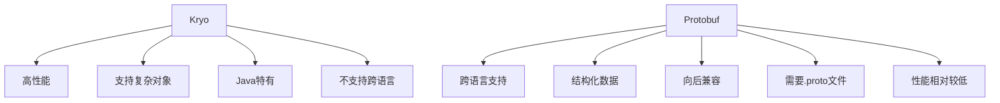
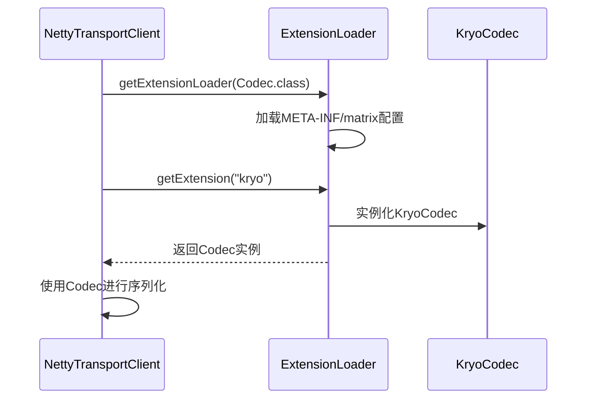
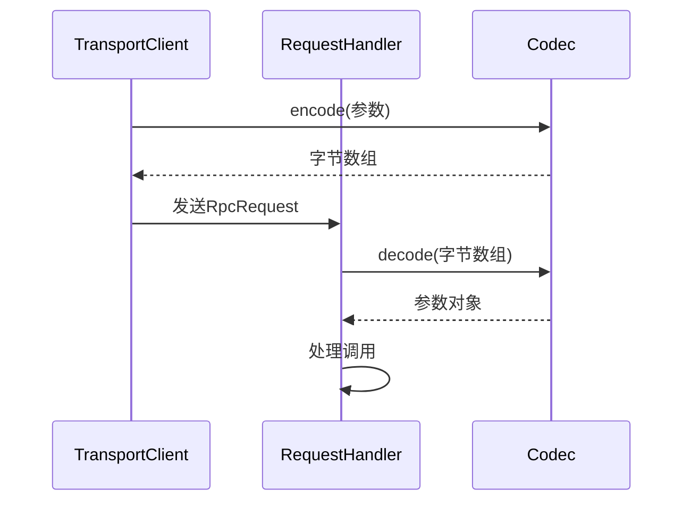

# 序列化

<cite>
**本文档引用的文件**   
- [Codec.java](file://matrix-rpc-codec/matrix-rpc-codec-api/src/main/java/io/homeey/matrix/rpc/codec/api/Codec.java)
- [KryoCodec.java](file://matrix-rpc-codec/matrix-rpc-codec-kryo/src/main/java/io/homeey/matrix/rpc/codec/kryo/KryoCodec.java)
- [ProtobufCodec.java](file://matrix-rpc-codec/matrix-rpc-codec-protobuf/src/main/java/io/homeey/matrix/rpc/codec/protobuf/ProtobufCodec.java)
- [rpc.proto](file://matrix-rpc-codec/matrix-rpc-codec-protobuf/src/main/proto/rpc.proto)
- [ExtensionLoader.java](file://matrix-rpc-spi/src/main/java/io/homeey/matrix/rpc/spi/ExtensionLoader.java)
- [NettyTransportClient.java](file://matrix-rpc-transport/matrix-rpc-transport-netty/src/main/java/io/homeey/matrix/rpc/transport/netty/client/NettyTransportClient.java)
- [NettyTransportServer.java](file://matrix-rpc-transport/matrix-rpc-transport-netty/src/main/java/io/homeey/matrix/rpc/transport/netty/server/NettyTransportServer.java)
</cite>

## 目录
1. [序列化功能概述](#序列化功能概述)
2. [Codec接口详解](#codec接口详解)
3. [KryoCodec实现分析](#kryocodec实现分析)
4. [ProtobufCodec实现分析](#protobufcodec实现分析)
5. [Kryo与Protobuf对比](#kryo与protobuf对比)
6. [rpc.proto文件结构分析](#rpcproto文件结构分析)
7. [SPI机制与序列化器选择](#spi机制与序列化器选择)
8. [序列化在RPC调用中的应用](#序列化在rpc调用中的应用)
9. [序列化方式选择建议](#序列化方式选择建议)

## 序列化功能概述

序列化是Matrix RPC框架中的核心功能之一，负责在RPC调用过程中将Java对象转换为字节流进行网络传输，并在接收端将字节流还原为对象。该功能通过`Codec`接口和SPI机制实现，支持多种序列化方式，主要包括Kryo和Protobuf两种实现。Kryo提供高性能的二进制序列化，适用于Java内部系统间的通信；Protobuf提供跨语言的结构化数据序列化，适用于异构系统间的通信。序列化器在`TransportClient`发送请求和`RequestHandler`处理请求时被调用，确保数据能够正确地在网络中传输和解析。

## Codec接口详解

`Codec`接口定义了序列化和反序列化的基本操作，是所有序列化实现的基础。该接口通过SPI注解标记，支持通过SPI机制进行扩展和加载。接口包含两个核心方法：`encode`用于将对象编码为字节数组，`decode`用于将字节数组解码为指定类型的对象。这种设计使得框架可以灵活地支持不同的序列化方式，同时保持API的一致性。

**Section sources**
- [Codec.java](file://matrix-rpc-codec/matrix-rpc-codec-api/src/main/java/io/homeey/matrix/rpc/codec/api/Codec.java#L1-L30)

## KryoCodec实现分析

`KryoCodec`是基于Kryo库的序列化实现，专注于提供高效的二进制序列化。该实现使用`ThreadLocal`来管理`Kryo`实例，避免了多线程环境下的竞争问题，同时提高了性能。`Kryo`实例配置为不需要注册类，支持循环引用，这使得它可以序列化复杂的对象图。在编码过程中，`KryoCodec`使用`Output`和`ByteArrayOutputStream`将对象写入字节数组；在解码过程中，使用`Input`和`ByteArrayInputStream`从字节数组中读取对象。这种实现方式在Java内部系统间通信时表现出色，具有较高的序列化和反序列化速度。

**Section sources**
- [KryoCodec.java](file://matrix-rpc-codec/matrix-rpc-codec-kryo/src/main/java/io/homeey/matrix/rpc/codec/kryo/KryoCodec.java#L1-L66)

## ProtobufCodec实现分析

`ProtobufCodec`是基于Google Protocol Buffers的序列化实现，专注于提供跨语言的结构化数据序列化。该实现直接利用Protobuf生成的`RpcProto.RpcRequest`和`RpcProto.RpcResponse`类进行消息的编码和解码。对于Protobuf消息本身，直接调用`toByteArray()`和`parseFrom()`方法进行序列化和反序列化；对于普通对象，则委托给默认的序列化器（默认为Kryo）进行处理。这种混合模式既利用了Protobuf在定义消息结构上的优势，又保留了Kryo在处理复杂Java对象上的灵活性。

**Section sources**
- [ProtobufCodec.java](file://matrix-rpc-codec/matrix-rpc-codec-protobuf/src/main/java/io/homeey/matrix/rpc/codec/protobuf/ProtobufCodec.java#L1-L62)

## Kryo与Protobuf对比

Kryo和Protobuf各有优劣，适用于不同的场景。Kryo的优点在于其高性能和对复杂Java对象的良好支持，特别适合Java内部系统间的高性能通信。然而，Kryo的序列化格式是Java特有的，不支持跨语言。Protobuf的优点在于其跨语言支持和良好的向后兼容性，适合异构系统间的通信。此外，Protobuf通过`.proto`文件明确定义了消息结构，提高了代码的可读性和维护性。然而，Protobuf在处理复杂Java对象时需要额外的序列化器支持，且序列化性能通常低于Kryo。

**Diagram sources**
- [KryoCodec.java](file://matrix-rpc-codec/matrix-rpc-codec-kryo/src/main/java/io/homeey/matrix/rpc/codec/kryo/KryoCodec.java)
- [ProtobufCodec.java](file://matrix-rpc-codec/matrix-rpc-codec-protobuf/src/main/java/io/homeey/matrix/rpc/codec/protobuf/ProtobufCodec.java)

## rpc.proto文件结构分析

`rpc.proto`文件定义了RPC消息的结构，使用Protocol Buffers语法。文件中定义了两个消息类型：`RpcRequest`和`RpcResponse`。`RpcRequest`包含请求ID、服务名、方法名、参数类型列表、参数值列表和附加属性映射；`RpcResponse`包含请求ID、结果和异常信息。通过`option java_package`和`option java_outer_classname`指定生成的Java类的包名和外部类名。这种结构化的定义使得消息格式清晰，易于维护，并且支持跨语言使用。

**Section sources**
- [rpc.proto](file://matrix-rpc-codec/matrix-rpc-codec-protobuf/src/main/proto/rpc.proto#L1-L19)

## SPI机制与序列化器选择

SPI（Service Provider Interface）机制是Matrix RPC框架中用于扩展和加载组件的核心机制。`ExtensionLoader`类负责加载和管理扩展实例。在`NettyTransportClient`和`NettyTransportServer`的构造函数中，通过`ExtensionLoader.getExtensionLoader(Codec.class).getExtension("kryo")`获取默认的序列化器实例。`KryoCodec`和`ProtobufCodec`的实现类通过`META-INF/matrix`目录下的配置文件注册到SPI系统中。这种机制使得框架可以灵活地替换和扩展序列化器，而无需修改核心代码。

**Diagram sources**
- [ExtensionLoader.java](file://matrix-rpc-spi/src/main/java/io/homeey/matrix/rpc/spi/ExtensionLoader.java)
- [NettyTransportClient.java](file://matrix-rpc-transport/matrix-rpc-transport-netty/src/main/java/io/homeey/matrix/rpc/transport/netty/client/NettyTransportClient.java)
- [KryoCodec.java](file://matrix-rpc-codec/matrix-rpc-codec-kryo/src/main/java/io/homeey/matrix/rpc/codec/kryo/KryoCodec.java)

## 序列化在RPC调用中的应用

在RPC调用过程中，序列化器在`TransportClient`发送请求和`RequestHandler`处理请求时被调用。在客户端，`NettyTransportClient`的`send`方法中，`buildRequest`方法使用序列化器将调用参数编码为字节数组，并构建`RpcRequest`消息；在服务端，`NettyTransportServer`的`RpcServerHandler`中，`convertToInvocation`方法使用序列化器将字节数组解码为调用参数，并构建`Invocation`对象。这种设计确保了数据能够在网络中正确传输，并在接收端正确解析。

**Diagram sources**
- [NettyTransportClient.java](file://matrix-rpc-transport/matrix-rpc-transport-netty/src/main/java/io/homeey/matrix/rpc/transport/netty/client/NettyTransportClient.java)
- [NettyTransportServer.java](file://matrix-rpc-transport/matrix-rpc-transport-netty/src/main/java/io/homeey/matrix/rpc/transport/netty/server/NettyTransportServer.java)
- [Codec.java](file://matrix-rpc-codec/matrix-rpc-codec-api/src/main/java/io/homeey/matrix/rpc/codec/api/Codec.java)

## 序列化方式选择建议

选择合适的序列化方式应根据具体的应用场景。对于Java内部系统间的高性能通信，推荐使用Kryo，因其具有较高的序列化和反序列化速度。对于异构系统间的通信，特别是需要跨语言支持的场景，推荐使用Protobuf，因其具有良好的跨语言支持和向后兼容性。在某些场景下，可以结合使用两种方式，例如使用Protobuf定义消息结构，使用Kryo序列化复杂对象，以兼顾性能和灵活性。