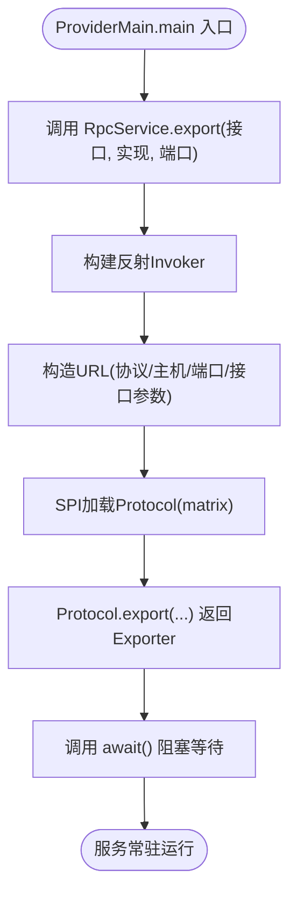

# 快速开始

<cite>
**本文引用的文件**
- [README.md](file://README.md)
- [pom.xml](file://pom.xml)
- [matrix-rpc-examples/pom.xml](file://matrix-rpc-examples/pom.xml)
- [matrix-rpc-runtime/src/main/java/io/homeey/matrix/rpc/runtime/RpcService.java](file://matrix-rpc-runtime/src/main/java/io/homeey/matrix/rpc/runtime/RpcService.java)
- [matrix-rpc-runtime/src/main/java/io/homeey/matrix/rpc/runtime/RpcReference.java](file://matrix-rpc-runtime/src/main/java/io/homeey/matrix/rpc/runtime/RpcReference.java)
- [matrix-rpc-runtime/src/main/java/io/homeey/matrix/rpc/runtime/MatrixProtocol.java](file://matrix-rpc-runtime/src/main/java/io/homeey/matrix/rpc/runtime/MatrixProtocol.java)
- [matrix-rpc-core/src/main/java/io/homeey/matrix/rpc/core/Protocol.java](file://matrix-rpc-core/src/main/java/io/homeey/matrix/rpc/core/Protocol.java)
- [matrix-rpc-examples/src/main/java/io/homeey/matrix/rpc/example/api/EchoService.java](file://matrix-rpc-examples/src/main/java/io/homeey/matrix/rpc/example/api/EchoService.java)
- [matrix-rpc-examples/src/main/java/io/homeey/matrix/rpc/example/api/User.java](file://matrix-rpc-examples/src/main/java/io/homeey/matrix/rpc/example/api/User.java)
- [matrix-rpc-examples/src/main/java/io/homeey/matrix/rpc/example/provider/ProviderMain.java](file://matrix-rpc-examples/src/main/java/io/homeey/matrix/rpc/example/provider/ProviderMain.java)
- [matrix-rpc-examples/src/main/java/io/homeey/matrix/rpc/example/provider/EchoServiceImpl.java](file://matrix-rpc-examples/src/main/java/io/homeey/matrix/rpc/example/provider/EchoServiceImpl.java)
- [matrix-rpc-examples/src/main/java/io/homeey/matrix/rpc/example/consumer/ConsumerMain.java](file://matrix-rpc-examples/src/main/java/io/homeey/matrix/rpc/example/consumer/ConsumerMain.java)
</cite>

## 目录
1. [简介](#简介)
2. [项目结构](#项目结构)
3. [核心组件](#核心组件)
4. [架构总览](#架构总览)
5. [详细组件分析](#详细组件分析)
6. [依赖与环境准备](#依赖与环境准备)
7. [运行示例](#运行示例)
8. [常见问题排查](#常见问题排查)
9. [结论](#结论)

## 简介
本指南面向初学者，帮助你快速上手 Matrix RPC 框架。你将学习：
- 如何准备运行环境（Java 版本与 Maven 依赖）
- 如何通过 ProviderMain 暴露服务，以及通过 ConsumerMain 引用并调用远程服务
- 核心 API RpcService.export 与 RpcReference.refer 的使用方式
- 常见问题的定位与解决思路

## 项目结构
Matrix RPC 采用多模块设计，示例位于 matrix-rpc-examples 中，核心运行时位于 matrix-rpc-runtime。下图展示了示例与核心模块的关系：

图表来源
- [matrix-rpc-examples/src/main/java/io/homeey/matrix/rpc/example/api/EchoService.java](file://matrix-rpc-examples/src/main/java/io/homeey/matrix/rpc/example/api/EchoService.java#L1-L16)
- [matrix-rpc-examples/src/main/java/io/homeey/matrix/rpc/example/provider/ProviderMain.java](file://matrix-rpc-examples/src/main/java/io/homeey/matrix/rpc/example/provider/ProviderMain.java#L1-L11)
- [matrix-rpc-examples/src/main/java/io/homeey/matrix/rpc/example/provider/EchoServiceImpl.java](file://matrix-rpc-examples/src/main/java/io/homeey/matrix/rpc/example/provider/EchoServiceImpl.java#L1-L29)
- [matrix-rpc-examples/src/main/java/io/homeey/matrix/rpc/example/consumer/ConsumerMain.java](file://matrix-rpc-examples/src/main/java/io/homeey/matrix/rpc/example/consumer/ConsumerMain.java#L1-L37)
- [matrix-rpc-runtime/src/main/java/io/homeey/matrix/rpc/runtime/RpcService.java](file://matrix-rpc-runtime/src/main/java/io/homeey/matrix/rpc/runtime/RpcService.java#L1-L255)
- [matrix-rpc-runtime/src/main/java/io/homeey/matrix/rpc/runtime/RpcReference.java](file://matrix-rpc-runtime/src/main/java/io/homeey/matrix/rpc/runtime/RpcReference.java#L1-L172)
- [matrix-rpc-runtime/src/main/java/io/homeey/matrix/rpc/runtime/MatrixProtocol.java](file://matrix-rpc-runtime/src/main/java/io/homeey/matrix/rpc/runtime/MatrixProtocol.java#L1-L190)
- [matrix-rpc-core/src/main/java/io/homeey/matrix/rpc/core/Protocol.java](file://matrix-rpc-core/src/main/java/io/homeey/matrix/rpc/core/Protocol.java#L1-L25)

章节来源
- [README.md](file://README.md#L1-L120)
- [pom.xml](file://pom.xml#L1-L60)
- [matrix-rpc-examples/pom.xml](file://matrix-rpc-examples/pom.xml#L1-L46)

## 核心组件
- RpcService：服务暴露的简化入口，支持链式配置与阻塞等待。
- RpcReference：服务引用的简化入口，支持链式配置与代理创建。
- MatrixProtocol：默认协议实现，负责服务导出、注册中心集成、客户端连接与请求处理。
- Protocol：协议接口，定义 export/refer 两个核心方法。

章节来源
- [matrix-rpc-runtime/src/main/java/io/homeey/matrix/rpc/runtime/RpcService.java](file://matrix-rpc-runtime/src/main/java/io/homeey/matrix/rpc/runtime/RpcService.java#L1-L255)
- [matrix-rpc-runtime/src/main/java/io/homeey/matrix/rpc/runtime/RpcReference.java](file://matrix-rpc-runtime/src/main/java/io/homeey/matrix/rpc/runtime/RpcReference.java#L1-L172)
- [matrix-rpc-runtime/src/main/java/io/homeey/matrix/rpc/runtime/MatrixProtocol.java](file://matrix-rpc-runtime/src/main/java/io/homeey/matrix/rpc/runtime/MatrixProtocol.java#L1-L190)
- [matrix-rpc-core/src/main/java/io/homeey/matrix/rpc/core/Protocol.java](file://matrix-rpc-core/src/main/java/io/homeey/matrix/rpc/core/Protocol.java#L1-L25)

## 架构总览
下面的时序图展示了从消费者发起一次远程调用到服务端执行并返回结果的完整流程：

图表来源
- [matrix-rpc-examples/src/main/java/io/homeey/matrix/rpc/example/consumer/ConsumerMain.java](file://matrix-rpc-examples/src/main/java/io/homeey/matrix/rpc/example/consumer/ConsumerMain.java#L1-L37)
- [matrix-rpc-runtime/src/main/java/io/homeey/matrix/rpc/runtime/RpcReference.java](file://matrix-rpc-runtime/src/main/java/io/homeey/matrix/rpc/runtime/RpcReference.java#L1-L172)
- [matrix-rpc-runtime/src/main/java/io/homeey/matrix/rpc/runtime/MatrixProtocol.java](file://matrix-rpc-runtime/src/main/java/io/homeey/matrix/rpc/runtime/MatrixProtocol.java#L88-L129)
- [matrix-rpc-examples/src/main/java/io/homeey/matrix/rpc/example/provider/ProviderMain.java](file://matrix-rpc-examples/src/main/java/io/homeey/matrix/rpc/example/provider/ProviderMain.java#L1-L11)
- [matrix-rpc-runtime/src/main/java/io/homeey/matrix/rpc/runtime/MatrixProtocol.java](file://matrix-rpc-runtime/src/main/java/io/homeey/matrix/rpc/runtime/MatrixProtocol.java#L52-L86)

## 详细组件分析

### ProviderMain：服务暴露与启动
- 使用 RpcService.export 将 EchoService 接口与其实现绑定到指定端口。
- await() 使服务进程保持运行，直到手动停止。

图表来源
- [matrix-rpc-examples/src/main/java/io/homeey/matrix/rpc/example/provider/ProviderMain.java](file://matrix-rpc-examples/src/main/java/io/homeey/matrix/rpc/example/provider/ProviderMain.java#L1-L11)
- [matrix-rpc-runtime/src/main/java/io/homeey/matrix/rpc/runtime/RpcService.java](file://matrix-rpc-runtime/src/main/java/io/homeey/matrix/rpc/runtime/RpcService.java#L73-L162)
- [matrix-rpc-runtime/src/main/java/io/homeey/matrix/rpc/runtime/RpcService.java](file://matrix-rpc-runtime/src/main/java/io/homeey/matrix/rpc/runtime/RpcService.java#L195-L213)

章节来源
- [matrix-rpc-examples/src/main/java/io/homeey/matrix/rpc/example/provider/ProviderMain.java](file://matrix-rpc-examples/src/main/java/io/homeey/matrix/rpc/example/provider/ProviderMain.java#L1-L11)
- [matrix-rpc-examples/src/main/java/io/homeey/matrix/rpc/example/provider/EchoServiceImpl.java](file://matrix-rpc-examples/src/main/java/io/homeey/matrix/rpc/example/provider/EchoServiceImpl.java#L1-L29)
- [matrix-rpc-runtime/src/main/java/io/homeey/matrix/rpc/runtime/RpcService.java](file://matrix-rpc-runtime/src/main/java/io/homeey/matrix/rpc/runtime/RpcService.java#L1-L255)

### ConsumerMain：服务引用与调用
- 使用 RpcReference.refer 获取远程代理实例。
- 通过代理直接调用接口方法，底层由 TransportClient 发送请求，MatrixProtocol 负责路由与转发。

图表来源
- [matrix-rpc-examples/src/main/java/io/homeey/matrix/rpc/example/consumer/ConsumerMain.java](file://matrix-rpc-examples/src/main/java/io/homeey/matrix/rpc/example/consumer/ConsumerMain.java#L1-L37)
- [matrix-rpc-runtime/src/main/java/io/homeey/matrix/rpc/runtime/RpcReference.java](file://matrix-rpc-runtime/src/main/java/io/homeey/matrix/rpc/runtime/RpcReference.java#L52-L131)
- [matrix-rpc-runtime/src/main/java/io/homeey/matrix/rpc/runtime/MatrixProtocol.java](file://matrix-rpc-runtime/src/main/java/io/homeey/matrix/rpc/runtime/MatrixProtocol.java#L88-L129)

章节来源
- [matrix-rpc-examples/src/main/java/io/homeey/matrix/rpc/example/consumer/ConsumerMain.java](file://matrix-rpc-examples/src/main/java/io/homeey/matrix/rpc/example/consumer/ConsumerMain.java#L1-L37)
- [matrix-rpc-runtime/src/main/java/io/homeey/matrix/rpc/runtime/RpcReference.java](file://matrix-rpc-runtime/src/main/java/io/homeey/matrix/rpc/runtime/RpcReference.java#L1-L172)

### 核心API：RpcService.export 与 RpcReference.refer
- RpcService.export
  - 作用：将本地实现暴露为远程服务，绑定到指定端口。
  - 关键点：内部创建反射 Invoker，构造 URL，通过 SPI 获取 Protocol 执行 export，最终返回可 await 的 Exporter。
  - 参考路径：[RpcService.export](file://matrix-rpc-runtime/src/main/java/io/homeey/matrix/rpc/runtime/RpcService.java#L73-L162)，[RpcService.await](file://matrix-rpc-runtime/src/main/java/io/homeey/matrix/rpc/runtime/RpcService.java#L195-L213)

- RpcReference.refer
  - 作用：创建远程服务代理，消费者可像调用本地方法一样调用远程接口。
  - 关键点：构造 URL，初始化 TransportClient 并建立连接，创建 Invoker，通过 ProxyFactory 生成代理。
  - 参考路径：[RpcReference.refer](file://matrix-rpc-runtime/src/main/java/io/homeey/matrix/rpc/runtime/RpcReference.java#L52-L101)，[RpcReference.get](file://matrix-rpc-runtime/src/main/java/io/homeey/matrix/rpc/runtime/RpcReference.java#L101-L131)

章节来源
- [matrix-rpc-runtime/src/main/java/io/homeey/matrix/rpc/runtime/RpcService.java](file://matrix-rpc-runtime/src/main/java/io/homeey/matrix/rpc/runtime/RpcService.java#L1-L255)
- [matrix-rpc-runtime/src/main/java/io/homeey/matrix/rpc/runtime/RpcReference.java](file://matrix-rpc-runtime/src/main/java/io/homeey/matrix/rpc/runtime/RpcReference.java#L1-L172)

## 依赖与环境准备

### Java 版本要求
- 仓库根 pom 中的编译属性显示使用 Java 21：
  - 源码与目标版本：21
  - 编译 release：21
- 示例模块也声明了 Java 21：
  - 示例模块的编译属性同样指向 21

章节来源
- [pom.xml](file://pom.xml#L28-L36)
- [matrix-rpc-examples/pom.xml](file://matrix-rpc-examples/pom.xml#L15-L19)

### Maven 依赖配置
- 示例工程已包含运行所需依赖：
  - matrix-rpc-core
  - matrix-rpc-runtime
  - matrix-rpc-transport-netty
  - matrix-rpc-registy-memory
  - matrix-rpc-proxy-jdk
  - matrix-rpc-filter-builtin
- 若你在自己的项目中引入，请确保版本与仓库一致或使用 bom 管理。

章节来源
- [matrix-rpc-examples/pom.xml](file://matrix-rpc-examples/pom.xml#L20-L46)

## 运行示例

### 步骤一：启动服务提供者
- 运行 ProviderMain，它会：
  - 暴露 EchoService 接口
  - 绑定到 20880 端口
  - 阻塞等待，保持服务常驻

参考路径
- [ProviderMain](file://matrix-rpc-examples/src/main/java/io/homeey/matrix/rpc/example/provider/ProviderMain.java#L1-L11)
- [EchoServiceImpl](file://matrix-rpc-examples/src/main/java/io/homeey/matrix/rpc/example/provider/EchoServiceImpl.java#L1-L29)

### 步骤二：启动服务消费者
- 运行 ConsumerMain，它会：
  - 通过 RpcReference.refer 获取远程代理
  - 调用 echo/getUser/saveUser 等方法
  - 输出结果

参考路径
- [ConsumerMain](file://matrix-rpc-examples/src/main/java/io/homeey/matrix/rpc/example/consumer/ConsumerMain.java#L1-L37)
- [EchoService 接口](file://matrix-rpc-examples/src/main/java/io/homeey/matrix/rpc/example/api/EchoService.java#L1-L16)
- [User 对象](file://matrix-rpc-examples/src/main/java/io/homeey/matrix/rpc/example/api/User.java#L1-L68)

### 步骤三：验证结果
- 控制台应输出类似以下内容：
  - 服务暴露提示与端口信息
  - 三次测试调用的结果（字符串回显、复杂对象返回、复杂对象参数与返回）

参考路径
- [ProviderMain.await 输出](file://matrix-rpc-runtime/src/main/java/io/homeey/matrix/rpc/runtime/RpcService.java#L195-L213)
- [ConsumerMain 测试逻辑](file://matrix-rpc-examples/src/main/java/io/homeey/matrix/rpc/example/consumer/ConsumerMain.java#L12-L36)

## 常见问题排查

- 无法找到服务提供者
  - 现象：消费者调用时报错提示无可用提供者
  - 排查要点：
    - 确认 ProviderMain 已启动且未报错退出
    - 确认端口 20880 未被占用
    - 确认网络连通性（localhost）
  - 参考实现位置：
    - [MatrixProtocol.refer 中的服务订阅与查找](file://matrix-rpc-runtime/src/main/java/io/homeey/matrix/rpc/runtime/MatrixProtocol.java#L88-L129)

- 调用超时
  - 现象：消费者侧抛出超时异常
  - 排查要点：
    - 消费者侧可调整超时参数（RpcReference.timeout）
    - 提供者处理耗时较长时，适当增大超时
  - 参考实现位置：
    - [RpcReference.timeout 配置](file://matrix-rpc-runtime/src/main/java/io/homeey/matrix/rpc/runtime/RpcReference.java#L74-L88)
    - [MatrixProtocol.refer 中的默认超时](file://matrix-rpc-runtime/src/main/java/io/homeey/matrix/rpc/runtime/MatrixProtocol.java#L118-L123)

- Java 版本不匹配
  - 现象：编译失败或运行时报错
  - 排查要点：
    - 确保你的 IDE/Maven 使用 Java 21
    - 清理并重新构建项目
  - 参考配置位置：
    - [根 pom 的 Java 21 属性](file://pom.xml#L28-L36)
    - [示例 pom 的 Java 21 属性](file://matrix-rpc-examples/pom.xml#L15-L19)

- 依赖缺失
  - 现象：找不到类或包
  - 排查要点：
    - 确认已添加示例工程的依赖清单
    - 若自建工程，请引入 core/runtime/transport/proxy/filter 等模块
  - 参考依赖位置：
    - [示例工程依赖清单](file://matrix-rpc-examples/pom.xml#L20-L46)

## 结论
通过本指南，你已经了解了 Matrix RPC 的基本架构与运行方式，掌握了 RpcService.export 与 RpcReference.refer 的使用方法，并能成功运行 ProviderMain 与 ConsumerMain 示例。建议在实践中进一步探索：
- 使用不同协议与编解码器
- 集成注册中心（如 Nacos）
- 自定义 Filter 以实现鉴权、限流、监控等功能