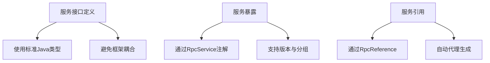
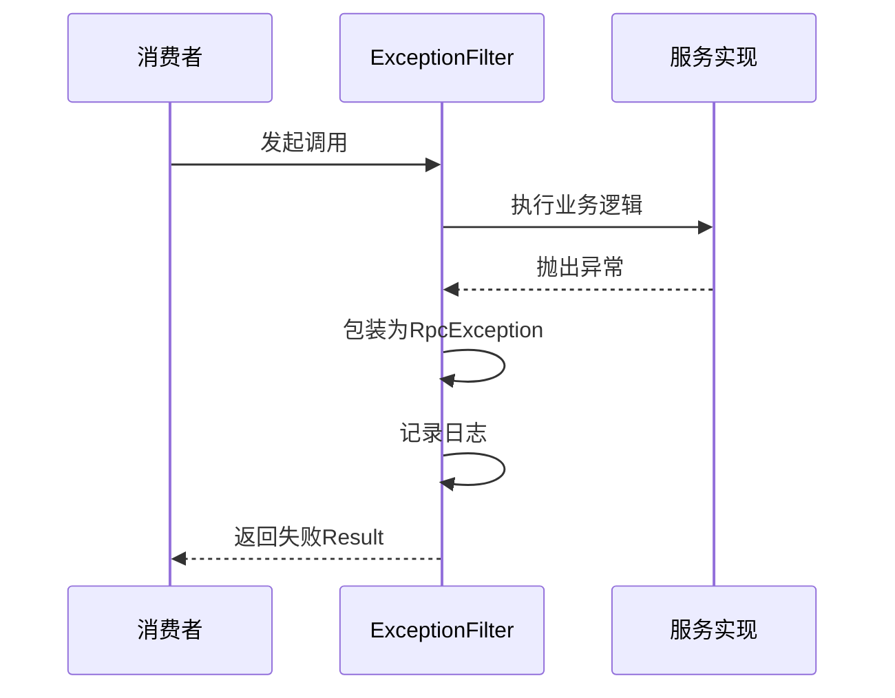
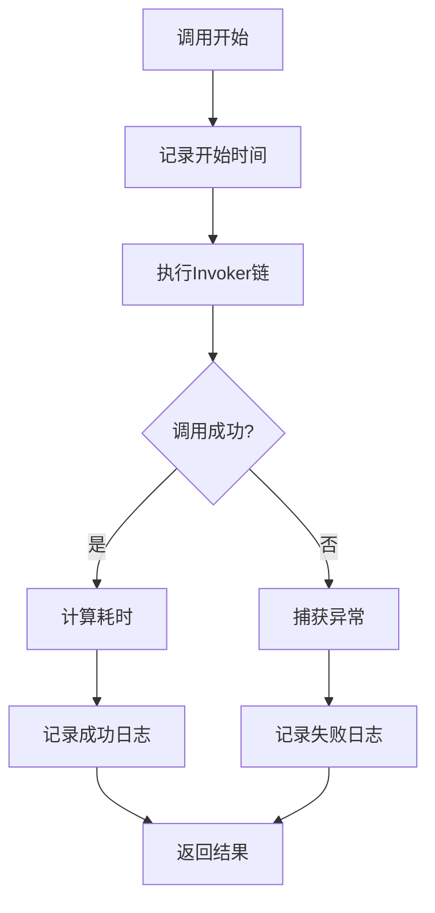

# 最佳实践

<cite>
**本文档中引用的文件**  
- [RpcException.java](file://matrix-rpc-common/src/main/java/io/homeey/matrix/rpc/common/RpcException.java)
- [ExceptionFilter.java](file://matrix-rpc-filter/matrix-rpc-filter-builtin/src/main/java/io/homeey/matrix/rpc/filter/builtin/ExceptionFilter.java)
- [AccessLogFilter.java](file://matrix-rpc-filter/matrix-rpc-filter-builtin/src/main/java/io/homeey/matrix/rpc/filter/builtin/AccessLogFilter.java)
- [TimeoutFilter.java](file://matrix-rpc-filter/matrix-rpc-filter-builtin/src/main/java/io/homeey/matrix/rpc/filter/builtin/TimeoutFilter.java)
- [FilterChainBuilder.java](file://matrix-rpc-runtime/src/main/java/io/homeey/matrix/rpc/runtime/support/FilterChainBuilder.java)
- [MatrixProtocol.java](file://matrix-rpc-runtime/src/main/java/io/homeey/matrix/rpc/runtime/MatrixProtocol.java)
- [RpcService.java](file://matrix-rpc-runtime/src/main/java/io/homeey/matrix/rpc/runtime/RpcService.java)
- [RpcReference.java](file://matrix-rpc-runtime/src/main/java/io/homeey/matrix/rpc/runtime/RpcReference.java)
- [Codec.java](file://matrix-rpc-codec/matrix-rpc-codec-api/src/main/java/io/homeey/matrix/rpc/codec/api/Codec.java)
- [LoadBalance.java](file://matrix-rpc-cluster/matrix-rpc-cluster-api/src/main/java/io/homeey/matrix/rpc/cluster/api/LoadBalance.java)
- [TransportClient.java](file://matrix-rpc-transport/matrix-rpc-transport-api/src/main/java/io/homeey/matrix/rpc/transport/api/TransportClient.java)
- [Registry.java](file://matrix-rpc-registry/matrix-rpc-register-api/src/main/java/io/homeey/matrix/rpc/registry/api/Registry.java)
</cite>

## 目录
1. [简介](#简介)
2. [服务设计规范](#服务设计规范)
3. [错误处理策略](#错误处理策略)
4. [监控与日志最佳实践](#监控与日志最佳实践)
5. [部署与运维建议](#部署与运维建议)
6. [总结](#总结)

## 简介

Matrix RPC 是一个轻量级、高性能、云原生的远程过程调用（RPC）框架，旨在为开发者提供简洁、可扩展且易于集成的服务通信能力。本最佳实践文档基于框架的核心设计原则和行业标准，为用户提供全面的指导，涵盖服务设计、异常处理、监控日志、部署运维等关键方面，帮助构建健壮、可维护的分布式系统。

**文档来源**  
- [README.md](file://README.md)

## 服务设计规范

### 接口定义

Matrix RPC 遵循清晰的接口契约设计，服务接口应定义为 Java 接口，并通过 `@RpcService` 注解暴露。接口方法应使用标准 Java 类型或可序列化的 POJO，避免使用框架特定类型作为参数或返回值。

服务版本管理和分组通过 URL 参数实现，支持多版本共存与灰度发布。例如，通过 `version="2.0.0"` 和 `group="test"` 参数进行精细化控制。



**图示来源**  
- [RpcService.java](file://matrix-rpc-runtime/src/main/java/io/homeey/matrix/rpc/runtime/RpcService.java)
- [RpcReference.java](file://matrix-rpc-runtime/src/main/java/io/homeey/matrix/rpc/runtime/RpcReference.java)

### 异常处理

所有 RPC 调用的异常应统一通过 `Result` 对象封装，确保调用方能够一致地处理成功与失败场景。业务异常应继承自 `RuntimeException` 或被包装为 `RpcException`，避免检查异常穿透到远程调用层。

**章节来源**  
- [RpcException.java](file://matrix-rpc-common/src/main/java/io/homeey/matrix/rpc/common/RpcException.java)
- [Result.java](file://matrix-rpc-common/src/main/java/io/homeey/matrix/rpc/common/Result.java)

### 版本管理

框架通过 URL 中的 `version` 和 `group` 参数实现服务的版本控制与逻辑分组。建议在服务升级时采用渐进式发布策略，先部署新版本服务并设置独立分组，通过流量控制逐步切换，确保系统稳定性。

**章节来源**  
- [MatrixProtocol.java](file://matrix-rpc-runtime/src/main/java/io/homeey/matrix/rpc/runtime/MatrixProtocol.java#L165-L169)

## 错误处理策略

### RpcException 处理机制

`RpcException` 是 Matrix RPC 中统一的远程调用异常类型，所有非业务运行时异常在传输过程中都会被包装为此类型。在服务提供方（Provider），框架通过 `ExceptionFilter` 自动捕获并处理异常。

```java
// 示例：异常处理流程
try {
    Result result = invoker.invoke(invocation);
    if (result.hasException()) {
        return new Result(wrapException(invocation, result.getException()));
    }
    return result;
} catch (Throwable t) {
    return new Result(wrapException(invocation, t));
}
```

该机制确保服务端不会因未捕获异常而崩溃，同时将错误信息以标准化方式返回给调用方。

### ExceptionFilter 工作原理

`ExceptionFilter` 是一个内置的过滤器，通过 SPI 机制在 Provider 端激活（`group = "PROVIDER"`）。其主要职责包括：
- 捕获服务实现抛出的异常
- 将检查异常包装为 `RpcException`
- 记录异常日志
- 返回包含异常信息的 `Result` 对象

该过滤器可通过系统属性 `-Dmatrix.filter.exception.enabled=false` 关闭。



**图示来源**  
- [ExceptionFilter.java](file://matrix-rpc-filter/matrix-rpc-filter-builtin/src/main/java/io/homeey/matrix/rpc/filter/builtin/ExceptionFilter.java)
- [MatrixProtocol.java](file://matrix-rpc-runtime/src/main/java/io/homeey/matrix/rpc/runtime/MatrixProtocol.java#L62)

**章节来源**  
- [ExceptionFilter.java](file://matrix-rpc-filter/matrix-rpc-filter-builtin/src/main/java/io/homeey/matrix/rpc/filter/builtin/ExceptionFilter.java)

## 监控与日志最佳实践

### 过滤器链集成监控

Matrix RPC 采用责任链模式（Filter Chain）实现横切关注点，所有监控、日志、超时等功能均通过 `Filter` 接口实现。`FilterChainBuilder` 负责根据 `@Activate` 注解的 `order` 值对过滤器进行排序并构建调用链。

```java
// 构建过滤器链
Invoker<T> last = invoker;
for (int i = filters.size() - 1; i >= 0; i--) {
    Filter filter = filters.get(i);
    last = new FilterInvoker<>(last, filter);
}
```

此设计保证了功能的可插拔性和执行顺序的可控性。

### 访问日志记录

`AccessLogFilter` 用于记录每次 RPC 调用的详细信息，包括服务名、方法名、参数类型、耗时和结果状态。日志格式统一，便于后续分析与监控系统集成。

日志示例：
```
[AccessLog] 2026-01-01 12:00:00.000 | SUCCESS | EchoService.echo(String) | 15ms | SUCCESS
```

该过滤器默认开启，可通过 `-Dmatrix.filter.accesslog.enabled=false` 关闭。



**图示来源**  
- [AccessLogFilter.java](file://matrix-rpc-filter/matrix-rpc-filter-builtin/src/main/java/io/homeey/matrix/rpc/filter/builtin/AccessLogFilter.java)
- [FilterChainBuilder.java](file://matrix-rpc-runtime/src/main/java/io/homeey/matrix/rpc/runtime/support/FilterChainBuilder.java)

**章节来源**  
- [AccessLogFilter.java](file://matrix-rpc-filter/matrix-rpc-filter-builtin/src/main/java/io/homeey/matrix/rpc/filter/builtin/AccessLogFilter.java)

### 超时与慢调用监控

`TimeoutFilter` 在 Consumer 端运行，用于检测慢调用和超时情况。虽然实际的超时控制在 `TransportClient` 层实现，但此过滤器提供了宝贵的可观测性数据，包括：
- 记录超过阈值的慢调用（默认1秒）
- 捕获并记录超时异常
- 统计调用性能分布

配置参数：
- `-Dmatrix.filter.timeout.enabled=true`：启用开关
- `-Dmatrix.filter.timeout.threshold=1000`：慢调用阈值（毫秒）

**章节来源**  
- [TimeoutFilter.java](file://matrix-rpc-filter/matrix-rpc-filter-builtin/src/main/java/io/homeey/matrix/rpc/filter/builtin/TimeoutFilter.java)
- [TransportClient.java](file://matrix-rpc-transport/matrix-rpc-transport-api/src/main/java/io/homeey/matrix/rpc/transport/api/TransportClient.java#L32)

## 部署与运维建议

### 资源规划

- **内存**：建议为每个服务实例分配至少 512MB 堆内存，根据服务复杂度和并发量适当增加。
- **CPU**：Netty 的 I/O 线程模型对多核 CPU 利用率高，建议部署在至少 2 核的机器上。
- **网络**：确保服务间网络延迟低且稳定，避免跨地域调用。

### 健康检查

实现 `/health` 端点，检查以下状态：
- 与注册中心（如 Nacos）的连接状态
- 本地服务是否已成功暴露
- 关键依赖（数据库、缓存）的连通性

可通过 `RpcService.isExported()` 方法检查服务暴露状态。

**章节来源**  
- [RpcService.java](file://matrix-rpc-runtime/src/main/java/io/homeey/matrix/rpc/runtime/RpcService.java#L237-L239)
- [Registry.java](file://matrix-rpc-registry/matrix-rpc-register-api/src/main/java/io/homeey/matrix/rpc/registry/api/Registry.java)

### 故障排查

#### 常见问题与解决方案

| 问题现象 | 可能原因 | 解决方案 |
|--------|--------|--------|
| 调用超时 | 网络不通、服务未启动、线程阻塞 | 检查网络连通性，确认服务端口监听，分析线程堆栈 |
| 服务找不到 | 注册中心无实例、分组/版本不匹配 | 检查注册中心数据，确认 URL 参数正确 |
| 序列化失败 | 类型不匹配、缺少无参构造函数 | 确保 POJO 可序列化，使用兼容的 `Codec` 实现 |
| 高延迟 | 慢调用、GC 频繁、负载过高 | 启用 `AccessLogFilter`，分析日志，优化代码或扩容 |

#### 调试工具

- 启用详细日志：添加 `-Dmatrix.filter.accesslog.enabled=true -Dmatrix.filter.timeout.enabled=true`
- 使用 `jstack` 分析线程阻塞
- 通过 `jmap` 生成堆转储分析内存使用

**章节来源**  
- [MatrixProtocol.java](file://matrix-rpc-runtime/src/main/java/io/homeey/matrix/rpc/runtime/MatrixProtocol.java#L107-L108)
- [Codec.java](file://matrix-rpc-codec/matrix-rpc-codec-api/src/main/java/io/homeey/matrix/rpc/codec/api/Codec.java)

## 总结

本文档系统性地阐述了基于 Matrix RPC 框架的最佳实践，覆盖了服务设计、错误处理、监控日志和部署运维等核心方面。通过遵循这些规范，开发者可以构建出高性能、高可用且易于维护的分布式服务。框架的 SPI 扩展机制和过滤器链设计为功能增强提供了强大支持，建议在实际项目中充分利用这些特性来满足特定业务需求。