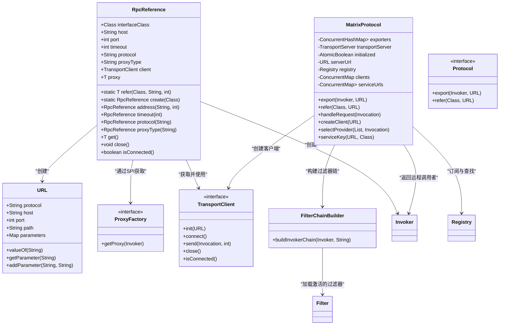
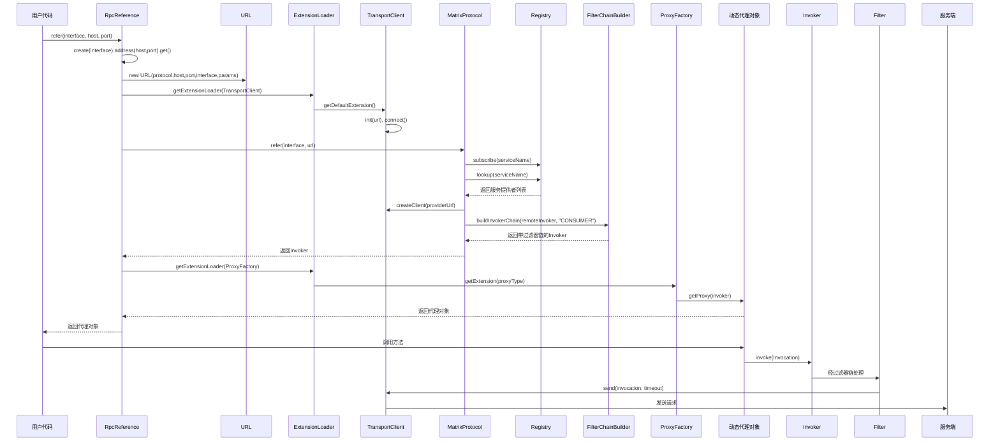

# 服务引用

<cite>
**本文档中引用的文件**  
- [RpcReference.java](file://matrix-rpc-runtime/src/main/java/io/homeey/matrix/rpc/runtime/RpcReference.java)
- [MatrixProtocol.java](file://matrix-rpc-runtime/src/main/java/io/homeey/matrix/rpc/runtime/MatrixProtocol.java)
- [Protocol.java](file://matrix-rpc-core/src/main/java/io/homeey/matrix/rpc/core/Protocol.java)
- [URL.java](file://matrix-rpc-common/src/main/java/io/homeey/matrix/rpc/common/URL.java)
- [ProxyFactory.java](file://matrix-rpc-proxy/matrix-rpc-proxy-api/src/main/java/io/homeey/matrix/rpc/proxy/api/ProxyFactory.java)
- [TransportClient.java](file://matrix-rpc-transport/matrix-rpc-transport-api/src/main/java/io/homeey/matrix/rpc/transport/api/TransportClient.java)
- [FilterChainBuilder.java](file://matrix-rpc-runtime/src/main/java/io/homeey/matrix/rpc/runtime/support/FilterChainBuilder.java)
- [JdkProxyFactory.java](file://matrix-rpc-proxy/matrix-rpc-proxy-jdk/src/main/java/io/homeey/matrix/rpc/proxy/jdk/JdkProxyFactory.java)
- [NettyTransportClient.java](file://matrix-rpc-transport/matrix-rpc-transport-netty/src/main/java/io/homeey/matrix/rpc/transport/netty/client/NettyTransportClient.java)
</cite>

## 目录
1. [引言](#引言)
2. [核心组件分析](#核心组件分析)
3. [服务引用流程详解](#服务引用流程详解)
4. [RpcReference 类分析](#rpcreference-类分析)
5. [MatrixProtocol.refer 方法分析](#matrixprotocolrefer-方法分析)
6. [集成关系与扩展机制](#集成关系与扩展机制)
7. [配置选项与参数说明](#配置选项与参数说明)
8. [消费者端过滤器链构建](#消费者端过滤器链构建)
9. [总结](#总结)

## 引言
Matrix RPC 框架提供了简洁而强大的服务引用机制，允许客户端通过简单的 API 调用获取远程服务代理。本文档深入分析 `RpcReference` 类作为服务引用入口的设计与实现，详细解释其如何通过 Builder 模式和静态方法提供灵活的配置方式，并剖析底层 `MatrixProtocol.refer` 方法在服务发现、负载均衡、连接管理及过滤器链构建中的关键作用。

## 核心组件分析

**图示来源**  
- [RpcReference.java](file://matrix-rpc-runtime/src/main/java/io/homeey/matrix/rpc/runtime/RpcReference.java#L33-L172)
- [MatrixProtocol.java](file://matrix-rpc-runtime/src/main/java/io/homeey/matrix/rpc/runtime/MatrixProtocol.java#L27-L190)
- [Protocol.java](file://matrix-rpc-core/src/main/java/io/homeey/matrix/rpc/core/Protocol.java#L7-L25)
- [URL.java](file://matrix-rpc-common/src/main/java/io/homeey/matrix/rpc/common/URL.java#L12-L164)
- [ProxyFactory.java](file://matrix-rpc-proxy/matrix-rpc-proxy-api/src/main/java/io/homeey/matrix/rpc/proxy/api/ProxyFactory.java)
- [TransportClient.java](file://matrix-rpc-transport/matrix-rpc-transport-api/src/main/java/io/homeey/matrix/rpc/transport/api/TransportClient.java)
- [FilterChainBuilder.java](file://matrix-rpc-runtime/src/main/java/io/homeey/matrix/rpc/runtime/support/FilterChainBuilder.java#L14-L53)

## 服务引用流程详解

**图示来源**  
- [RpcReference.java](file://matrix-rpc-runtime/src/main/java/io/homeey/matrix/rpc/runtime/RpcReference.java#L101-L127)
- [MatrixProtocol.java](file://matrix-rpc-runtime/src/main/java/io/homeey/matrix/rpc/runtime/MatrixProtocol.java#L89-L128)
- [FilterChainBuilder.java](file://matrix-rpc-runtime/src/main/java/io/homeey/matrix/rpc/runtime/support/FilterChainBuilder.java#L23-L39)

## RpcReference 类分析

`RpcReference` 类是 Matrix RPC 框架中服务引用的简化入口，提供了两种使用方式：静态方法调用和 Builder 模式配置。

静态方法 `refer(Class<T> interfaceClass, String host, int port)` 提供了一行代码获取远程服务代理的能力，适用于快速原型开发和简单场景。该方法内部调用 `create(interfaceClass).address(host, port).get()` 实现。

Builder 模式通过 `create(Class<T> interfaceClass)` 方法返回 `RpcReference` 实例，支持链式调用配置各种参数，包括：
- `address(String host, int port)`：设置服务端地址
- `timeout(int timeout)`：设置调用超时时间（毫秒）
- `protocol(String protocol)`：设置协议类型（默认为 "matrix"）
- `proxyType(String proxyType)`：设置代理类型（默认为 "jdk"）

核心方法 `get()` 负责完成服务引用的完整流程：
1. 创建 `URL` 对象，封装服务地址、协议、接口名和参数
2. 通过 SPI 获取默认的 `TransportClient` 实现并建立连接
3. 创建远程调用的 `Invoker`
4. 通过 SPI 获取指定类型的 `ProxyFactory` 并生成动态代理对象

**本节来源**  
- [RpcReference.java](file://matrix-rpc-runtime/src/main/java/io/homeey/matrix/rpc/runtime/RpcReference.java#L33-L172)

## MatrixProtocol.refer 方法分析

`MatrixProtocol.refer` 方法是服务引用的核心实现，负责从注册中心获取服务提供者并创建可调用的 `Invoker`。

该方法的主要流程包括：

1. **订阅服务变化**：通过 `registry.subscribe()` 订阅指定服务的提供者列表变化，当服务提供者上线或下线时，注册中心会通知消费者更新本地缓存。

2. **首次查找服务**：调用 `registry.lookup()` 获取当前可用的服务提供者列表，并缓存到 `serviceUrls` 映射中。

3. **创建远程 Invoker**：构建一个匿名 `Invoker` 实现，其 `invoke` 方法包含以下逻辑：
   - 从缓存中获取当前可用的服务提供者列表
   - 使用负载均衡策略（当前为随机选择）选出一个提供者
   - 通过 `clients` 缓存获取或创建对应的 `TransportClient`
   - 调用客户端的 `send` 方法发送请求并返回结果

4. **构建消费者端过滤器链**：使用 `FilterChainBuilder.buildInvokerChain()` 方法为远程 `Invoker` 包装一层过滤器责任链，支持日志、超时、异常处理等横切关注点。

此方法返回的是经过过滤器链包装的 `Invoker`，确保每次调用都能经过预设的处理流程。

**本节来源**  
- [MatrixProtocol.java](file://matrix-rpc-runtime/src/main/java/io/homeey/matrix/rpc/runtime/MatrixProtocol.java#L89-L128)

## 集成关系与扩展机制

Matrix RPC 框架通过 SPI（Service Provider Interface）机制实现了高度可扩展的架构设计，`RpcReference` 与 `MatrixProtocol` 分别集成了多个核心组件。

### 与 TransportClient 的集成
`RpcReference` 通过 `ExtensionLoader.getExtensionLoader(TransportClient.class).getDefaultExtension()` 获取传输层客户端实现。框架默认使用 Netty 作为网络通信基础，`NettyTransportClient` 负责建立与服务端的长连接，并提供异步发送请求的能力。客户端连接被缓存在 `RpcReference` 实例中，复用连接以提高性能。

### 与 ProxyFactory 的集成
动态代理的创建由 `ProxyFactory` 接口完成。`RpcReference` 根据配置的 `proxyType`（如 "jdk"）通过 SPI 获取对应的代理工厂实现。例如，`JdkProxyFactory` 使用 JDK 动态代理生成代理对象，将接口方法调用委托给 `Invoker` 处理。代理对象实现了服务接口，对用户透明地处理远程调用细节。

### 扩展机制
框架广泛使用 `@SPI` 和 `@Activate` 注解实现插件化设计：
- `@SPI("default")` 标记接口为可扩展点，指定默认实现
- `@Activate(order = n)` 控制过滤器等扩展点的执行顺序
- `ExtensionLoader` 是 SPI 的核心加载器，负责发现、加载和缓存扩展实现

这种设计使得用户可以轻松替换或扩展协议、传输、代理、序列化、注册中心和过滤器等组件。

**本节来源**  
- [RpcReference.java](file://matrix-rpc-runtime/src/main/java/io/homeey/matrix/rpc/runtime/RpcReference.java#L113-L124)
- [MatrixProtocol.java](file://matrix-rpc-runtime/src/main/java/io/homeey/matrix/rpc/runtime/MatrixProtocol.java#L39-L47)
- [JdkProxyFactory.java](file://matrix-rpc-proxy/matrix-rpc-proxy-jdk/src/main/java/io/homeey/matrix/rpc/proxy/jdk/JdkProxyFactory.java)
- [NettyTransportClient.java](file://matrix-rpc-transport/matrix-rpc-transport-netty/src/main/java/io/homeey/matrix/rpc/transport/netty/client/NettyTransportClient.java)
- [FilterChainBuilder.java](file://matrix-rpc-runtime/src/main/java/io/homeey/matrix/rpc/runtime/support/FilterChainBuilder.java#L24-L25)

## 配置选项与参数说明

`RpcReference` 提供了丰富的配置选项，可通过 Builder 模式进行设置：

| 配置项 | 方法 | 默认值 | 说明 |
|--------|------|--------|------|
| 服务接口 | 构造参数 | 无 | 指定要引用的远程服务接口类型 |
| 主机地址 | `address(host, port)` | localhost | 服务提供者的主机名或IP地址 |
| 端口号 | `address(host, port)` | 20880 | 服务提供者的端口号 |
| 调用超时 | `timeout(timeout)` | 3000 | 远程调用的超时时间（毫秒） |
| 协议类型 | `protocol(protocol)` | matrix | 使用的通信协议名称 |
| 代理类型 | `proxyType(type)` | jdk | 动态代理的实现方式（如 jdk） |

这些配置最终被封装在 `URL` 对象中，作为服务引用的统一配置载体。`URL` 类采用不可变设计，保证线程安全，并提供了便捷的参数访问方法。

**本节来源**  
- [RpcReference.java](file://matrix-rpc-runtime/src/main/java/io/homeey/matrix/rpc/runtime/RpcReference.java#L36-L40)
- [URL.java](file://matrix-rpc-common/src/main/java/io/homeey/matrix/rpc/common/URL.java#L12-L164)

## 消费者端过滤器链构建

消费者端的过滤器链由 `FilterChainBuilder.buildInvokerChain()` 方法构建，采用责任链模式将多个过滤器串联起来。

构建过程如下：
1. 通过 `ExtensionLoader.getActivateExtensions(Filter.class, "CONSUMER")` 获取所有激活的消费者端过滤器
2. 按照 `@Activate` 注解中的 `order` 值对过滤器进行排序
3. 从后往前依次包装 `Invoker`，形成嵌套的责任链结构

例如，若配置了 `AccessLogFilter`（order=100）和 `TimeoutFilter`（order=200），则调用链为：
`原始Invoker ← TimeoutFilter ← AccessLogFilter`

每个过滤器可以执行前置处理、调用下一个节点、后置处理或异常处理，实现了关注点分离。内置过滤器包括访问日志、超时控制和异常处理等，用户也可自定义过滤器并注册到 SPI 中。

**本节来源**  
- [FilterChainBuilder.java](file://matrix-rpc-runtime/src/main/java/io/homeey/matrix/rpc/runtime/support/FilterChainBuilder.java#L23-L39)
- [MatrixProtocol.java](file://matrix-rpc-runtime/src/main/java/io/homeey/matrix/rpc/runtime/MatrixProtocol.java#L127)

## 总结

Matrix RPC 框架的服务引用机制设计简洁而功能完整。`RpcReference` 作为高层入口，通过静态方法和 Builder 模式提供了友好的 API；`MatrixProtocol.refer` 作为底层实现，完成了服务发现、连接管理、负载均衡和过滤器链构建等核心功能。通过 SPI 扩展机制，框架实现了传输、代理、协议等组件的可插拔，具有良好的可维护性和扩展性。整个服务引用过程对用户透明，开发者只需关注业务接口的调用，无需关心底层通信细节。