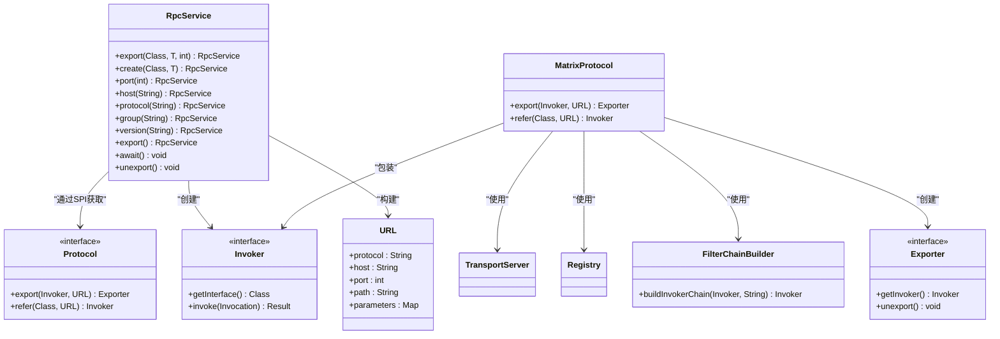
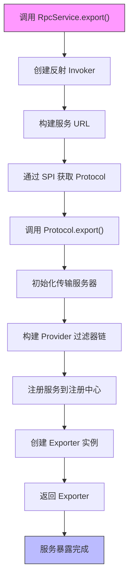
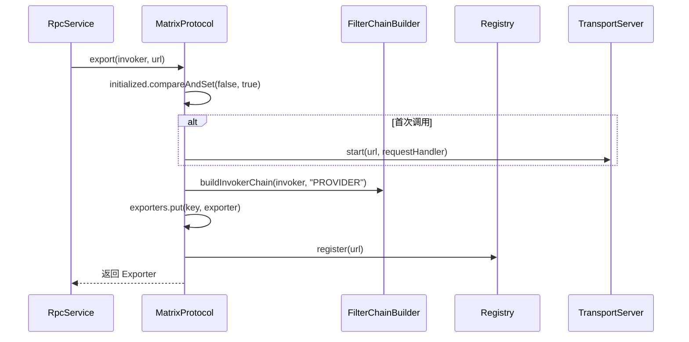
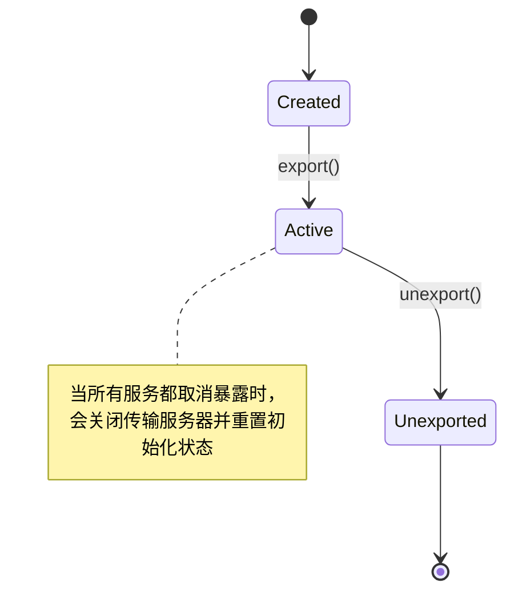

# 服务暴露

<cite>
**本文档中引用的文件**  
- [RpcService.java](file://matrix-rpc-runtime/src/main/java/io/homeey/matrix/rpc/runtime/RpcService.java)
- [MatrixProtocol.java](file://matrix-rpc-runtime/src/main/java/io/homeey/matrix/rpc/runtime/MatrixProtocol.java)
- [Protocol.java](file://matrix-rpc-core/src/main/java/io/homeey/matrix/rpc/core/Protocol.java)
- [Invoker.java](file://matrix-rpc-core/src/main/java/io/homeey/matrix/rpc/core/Invoker.java)
- [Exporter.java](file://matrix-rpc-core/src/main/java/io/homeey/matrix/rpc/core/Exporter.java)
- [URL.java](file://matrix-rpc-common/src/main/java/io/homeey/matrix/rpc/common/URL.java)
- [FilterChainBuilder.java](file://matrix-rpc-runtime/src/main/java/io/homeey/matrix/rpc/runtime/support/FilterChainBuilder.java)
- [AbstractProtocol.java](file://matrix-rpc-runtime/src/main/java/io/homeey/matrix/rpc/runtime/AbstractProtocol.java)
- [AbstractExporter.java](file://matrix-rpc-runtime/src/main/java/io/homeey/matrix/rpc/runtime/AbstractExporter.java)
- [AbstractInvoker.java](file://matrix-rpc-runtime/src/main/java/io/homeey/matrix/rpc/runtime/AbstractInvoker.java)
</cite>

## 目录
1. [简介](#简介)
2. [核心组件](#核心组件)
3. [服务暴露流程](#服务暴露流程)
4. [RpcService 类详解](#rpcservice-类详解)
5. [MatrixProtocol.export 方法分析](#matrixprotocolexport-方法分析)
6. [配置选项与参数](#配置选项与参数)
7. [集成关系](#集成关系)
8. [生命周期管理](#生命周期管理)

## 简介
Matrix RPC 框架提供了一种简洁而强大的服务暴露机制，通过 `RpcService` 类作为服务暴露的统一入口，支持静态方法调用和 Builder 模式配置。本文档将深入分析服务暴露的核心实现原理，包括 `RpcService.export` 方法如何创建反射 `Invoker`、构建 `URL` 并通过 SPI 获取 `Protocol` 进行导出，以及 `MatrixProtocol.export` 方法如何初始化传输服务器、构建 Provider 端过滤器链、注册服务到注册中心并管理 `Exporter` 的生命周期。

## 核心组件

**核心服务暴露组件关系图**



**图示来源**  
- [RpcService.java](file://matrix-rpc-runtime/src/main/java/io/homeey/matrix/rpc/runtime/RpcService.java#L34-L254)
- [MatrixProtocol.java](file://matrix-rpc-runtime/src/main/java/io/homeey/matrix/rpc/runtime/MatrixProtocol.java#L27-L190)
- [Protocol.java](file://matrix-rpc-core/src/main/java/io/homeey/matrix/rpc/core/Protocol.java#L7-L25)
- [Invoker.java](file://matrix-rpc-core/src/main/java/io/homeey/matrix/rpc/core/Invoker.java#L5-L8)
- [Exporter.java](file://matrix-rpc-core/src/main/java/io/homeey/matrix/rpc/core/Exporter.java#L8-L21)
- [URL.java](file://matrix-rpc-common/src/main/java/io/homeey/matrix/rpc/common/URL.java#L12-L164)
- [FilterChainBuilder.java](file://matrix-rpc-runtime/src/main/java/io/homeey/matrix/rpc/runtime/support/FilterChainBuilder.java#L14-L53)

## 服务暴露流程

**服务暴露完整流程图**



**图示来源**  
- [RpcService.java](file://matrix-rpc-runtime/src/main/java/io/homeey/matrix/rpc/runtime/RpcService.java#L135-L158)
- [MatrixProtocol.java](file://matrix-rpc-runtime/src/main/java/io/homeey/matrix/rpc/runtime/MatrixProtocol.java#L53-L85)

## RpcService 类详解

`RpcService` 类是 Matrix RPC 框架中服务暴露的简化入口，提供了两种主要的使用方式：静态方法调用和 Builder 模式配置。

### 静态方法调用
```java
RpcService.export(EchoService.class, new EchoServiceImpl(), 20880).await();
```

### Builder 模式配置
```java
RpcService.create(EchoService.class, new EchoServiceImpl())
    .port(20880)
    .version("2.0.0")
    .export()
    .await();
```

`RpcService` 的核心功能包括：
- **服务接口验证**：确保接口是有效的 Java 接口，且实现实例正确实现了该接口
- **配置管理**：支持主机、端口、协议、分组、版本等关键参数的配置
- **服务暴露**：通过 `export()` 方法触发服务暴露流程
- **生命周期管理**：提供 `unexport()` 和 `close()` 方法取消服务暴露
- **阻塞等待**：`await()` 方法可用于在 main 方法末尾阻塞等待服务运行

**本节来源**  
- [RpcService.java](file://matrix-rpc-runtime/src/main/java/io/homeey/matrix/rpc/runtime/RpcService.java#L34-L254)

## MatrixProtocol.export 方法分析

`MatrixProtocol.export` 方法是服务暴露的核心实现，负责处理服务暴露的各个关键步骤。

### 方法执行流程
1. **服务器初始化**：在首次调用时启动传输服务器，仅初始化一次
2. **过滤器链构建**：为 `Invoker` 包装 Provider 端过滤器链
3. **服务注册**：将服务信息存储在本地 `exporters` 映射中
4. **注册中心注册**：将服务 URL 注册到注册中心
5. **Exporter 创建**：返回包含取消暴露逻辑的 `Exporter` 实例

### 关键实现细节

**服务暴露序列图**



**图示来源**  
- [MatrixProtocol.java](file://matrix-rpc-runtime/src/main/java/io/homeey/matrix/rpc/runtime/MatrixProtocol.java#L53-L85)

## 配置选项与参数

### RpcService 配置选项
| 配置项 | 方法 | 默认值 | 说明 |
|-------|------|--------|------|
| 主机 | host(String) | 0.0.0.0 | 服务绑定的主机地址 |
| 端口 | port(int) | 20880 | 服务监听端口 |
| 协议 | protocol(String) | matrix | 传输协议类型 |
| 分组 | group(String) | "" | 服务分组标识 |
| 版本 | version(String) | 1.0.0 | 服务版本号 |

### URL 参数
`URL` 对象承载了服务的所有配置信息，其格式为：
```
protocol://host:port/path?key1=value1&key2=value2
```

其中：
- **protocol**：协议类型（如 matrix）
- **host**：主机地址
- **port**：端口号
- **path**：服务接口全限定名
- **parameters**：附加参数（如 group、version）

**本节来源**  
- [RpcService.java](file://matrix-rpc-runtime/src/main/java/io/homeey/matrix/rpc/runtime/RpcService.java#L39-L43)
- [URL.java](file://matrix-rpc-common/src/main/java/io/homeey/matrix/rpc/common/URL.java#L12-L164)

## 集成关系

`RpcService` 与 `Invoker` 和 `Protocol` 的集成关系是 Matrix RPC 框架的核心设计。

### 与 Invoker 的集成
`RpcService` 通过 `createReflectiveInvoker()` 方法创建基于反射的通用 `Invoker`，该 `Invoker` 能够：
- 通过反射机制调用目标方法
- 处理方法参数和返回值
- 捕获并包装异常

### 与 Protocol 的集成
`RpcService` 通过 SPI 机制获取 `Protocol` 实例：
```java
Protocol protocolInstance = ExtensionLoader.getExtensionLoader(Protocol.class)
    .getExtension(protocol);
exporter = protocolInstance.export(invoker, url);
```

这种设计实现了：
- **协议可扩展性**：通过 SPI 可以轻松添加新的协议实现
- **解耦设计**：`RpcService` 无需知道具体协议实现细节
- **配置驱动**：协议类型由配置决定，而非硬编码

**本节来源**  
- [RpcService.java](file://matrix-rpc-runtime/src/main/java/io/homeey/matrix/rpc/runtime/RpcService.java#L142-L155)
- [MatrixProtocol.java](file://matrix-rpc-runtime/src/main/java/io/homeey/matrix/rpc/runtime/MatrixProtocol.java#L27-L190)

## 生命周期管理

服务暴露的生命周期管理通过 `Exporter` 接口实现，确保资源的正确释放。

### Exporter 生命周期


### 取消暴露逻辑
当调用 `unexport()` 时：
1. 从 `exporters` 映射中移除服务
2. 如果没有其他服务在暴露，则关闭传输服务器
3. 重置初始化状态，允许后续重新暴露服务

**本节来源**  
- [MatrixProtocol.java](file://matrix-rpc-runtime/src/main/java/io/homeey/matrix/rpc/runtime/MatrixProtocol.java#L74-L85)
- [RpcService.java](file://matrix-rpc-runtime/src/main/java/io/homeey/matrix/rpc/runtime/RpcService.java#L218-L223)