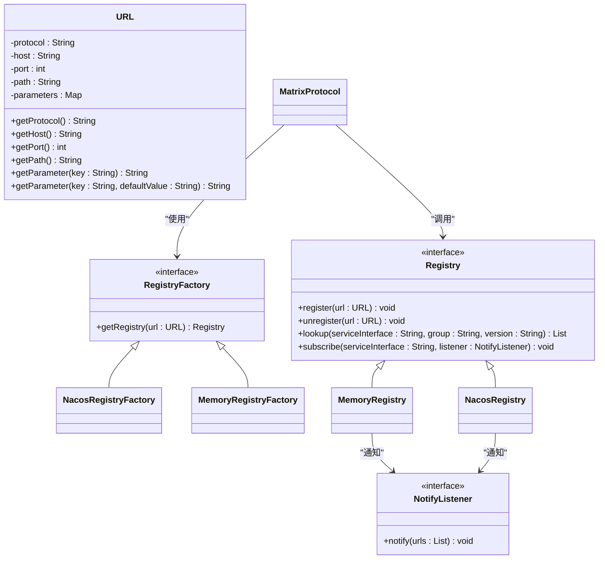
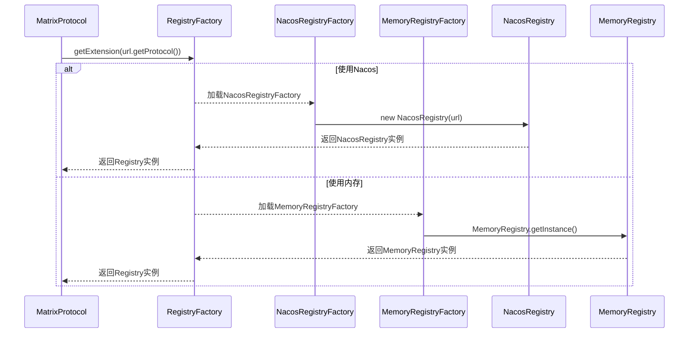
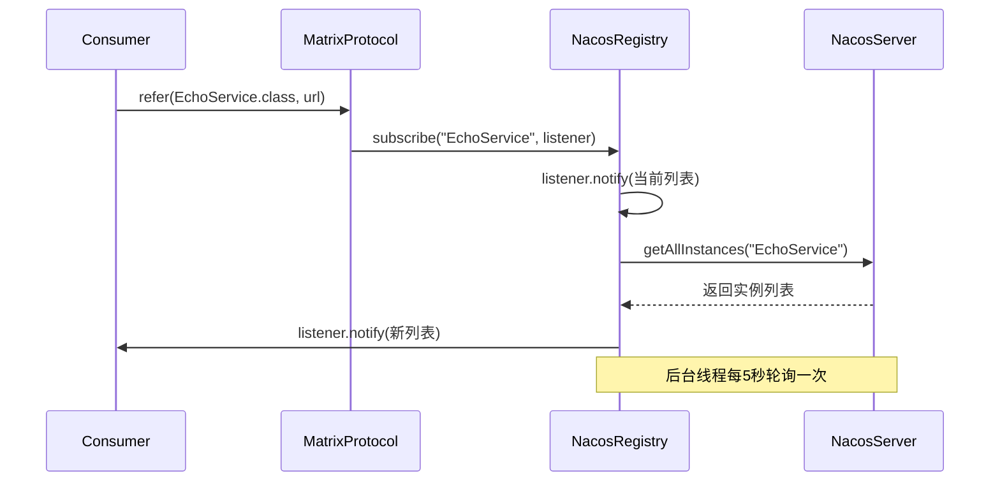
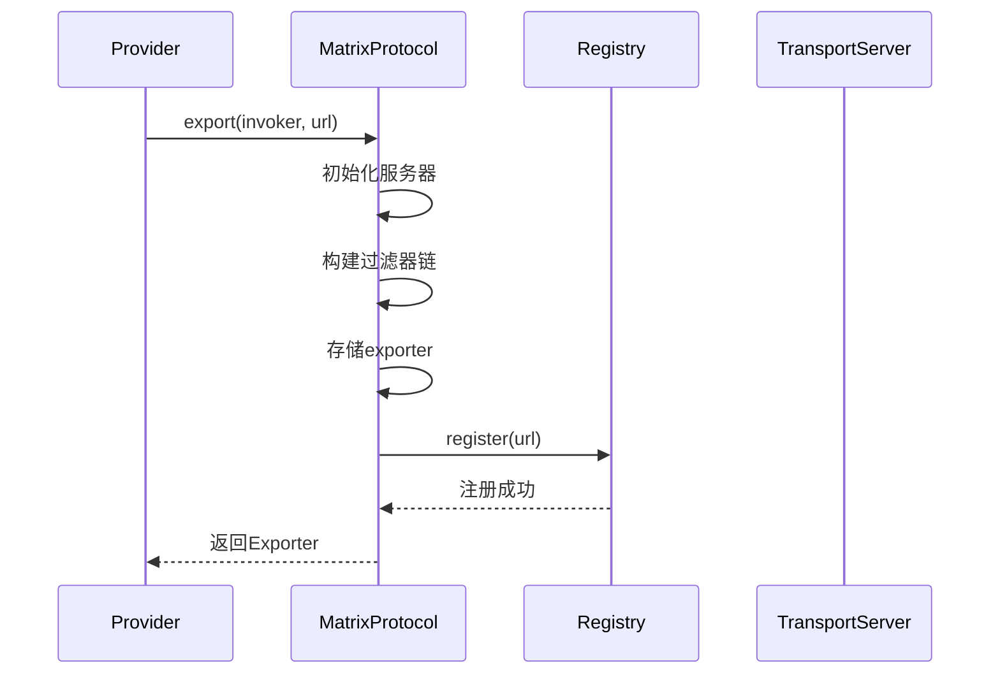
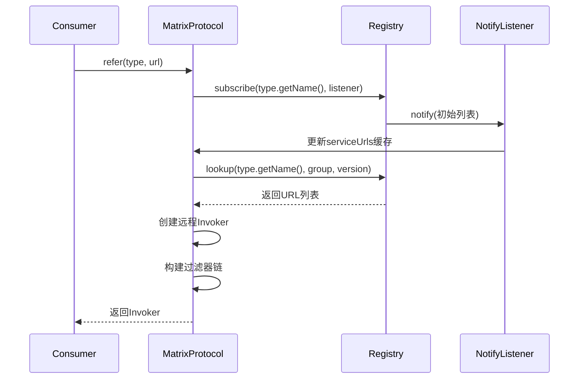

# 服务注册与发现

<cite>
**本文档中引用的文件**
- [Registry.java](file://matrix-rpc-registry/matrix-rpc-register-api/src/main/java/io/homeey/matrix/rpc/registry/api/Registry.java)
- [RegistryFactory.java](file://matrix-rpc-registry/matrix-rpc-register-api/src/main/java/io/homeey/matrix/rpc/registry/api/RegistryFactory.java)
- [NacosRegistry.java](file://matrix-rpc-registry/matrix-rpc-registry-nacos/src/main/java/io/homeey/matrix/rpc/registry/nacos/NacosRegistry.java)
- [NacosRegistryFactory.java](file://matrix-rpc-registry/matrix-rpc-registry-nacos/src/main/java/io/homeey/matrix/rpc/registry/nacos/NacosRegistryFactory.java)
- [MemoryRegistry.java](file://matrix-rpc-registry/matrix-rpc-registy-memory/src/main/java/io/homeey/matrix/rpc/registry/MemoryRegistry.java)
- [MemoryRegistryFactory.java](file://matrix-rpc-registry/matrix-rpc-registy-memory/src/main/java/io/homeey/matrix/rpc/registry/MemoryRegistryFactory.java)
- [MatrixProtocol.java](file://matrix-rpc-runtime/src/main/java/io/homeey/matrix/rpc/runtime/MatrixProtocol.java)
- [URL.java](file://matrix-rpc-common/src/main/java/io/homeey/matrix/rpc/common/URL.java)
- [NotifyListener.java](file://matrix-rpc-registry/matrix-rpc-register-api/src/main/java/io/homeey/matrix/rpc/registry/api/NotifyListener.java)
- [ServiceInstance.java](file://matrix-rpc-registry/matrix-rpc-register-api/src/main/java/io/homeey/matrix/rpc/registry/api/ServiceInstance.java)
- [ExtensionLoader.java](file://matrix-rpc-spi/src/main/java/io/homeey/matrix/rpc/spi/ExtensionLoader.java)
- [ConsumerMain.java](file://matrix-rpc-examples/src/main/java/io/homeey/matrix/rpc/example/consumer/ConsumerMain.java)
- [ProviderMain.java](file://matrix-rpc-examples/src/main/java/io/homeey/matrix/rpc/example/provider/ProviderMain.java)
</cite>

## 目录
1. [简介](#简介)
2. [核心接口与工厂模式](#核心接口与工厂模式)
3. [Nacos注册中心实现](#nacos注册中心实现)
4. [内存注册中心实现](#内存注册中心实现)
5. [服务暴露与引用流程](#服务暴露与引用流程)
6. [配置说明](#配置说明)
7. [集群环境中的重要性](#集群环境中的重要性)
8. [总结](#总结)

## 简介
Matrix RPC 框架提供了灵活的服务注册与发现机制，支持多种注册中心实现。该机制是分布式系统的核心组件，允许服务提供者动态注册其地址，服务消费者能够实时发现可用的服务实例。本文档深入解析 `Registry` 接口、`RegistryFactory` 工厂、`NacosRegistry` 和 `MemoryRegistry` 的具体实现，并阐述其在 `MatrixProtocol` 中的集成方式。

## 核心接口与工厂模式

`Registry` 接口定义了服务注册与发现的核心契约，包含 `register`、`unregister`、`lookup` 和 `subscribe` 四个关键方法。`RegistryFactory` 则通过 SPI（Service Provider Interface）机制，根据配置动态创建具体的 `Registry` 实例。



**图示来源**
- [Registry.java](file://matrix-rpc-registry/matrix-rpc-register-api/src/main/java/io/homeey/matrix/rpc/registry/api/Registry.java#L7-L39)
- [RegistryFactory.java](file://matrix-rpc-registry/matrix-rpc-register-api/src/main/java/io/homeey/matrix/rpc/registry/api/RegistryFactory.java#L14-L22)
- [NotifyListener.java](file://matrix-rpc-registry/matrix-rpc-register-api/src/main/java/io/homeey/matrix/rpc/registry/api/NotifyListener.java#L7-L10)
- [URL.java](file://matrix-rpc-common/src/main/java/io/homeey/matrix/rpc/common/URL.java#L12-L164)

**本节来源**
- [Registry.java](file://matrix-rpc-registry/matrix-rpc-register-api/src/main/java/io/homeey/matrix/rpc/registry/api/Registry.java#L7-L39)
- [RegistryFactory.java](file://matrix-rpc-registry/matrix-rpc-register-api/src/main/java/io/homeey/matrix/rpc/registry/api/RegistryFactory.java#L14-L22)

### Registry 接口详解

`Registry` 接口是服务注册与发现功能的抽象核心，所有具体的注册中心实现都必须遵循此契约。

- **`register(URL url)`**: 此方法用于将服务提供者的地址信息注册到注册中心。`URL` 对象封装了服务的协议、主机、端口、路径（服务接口名）以及分组、版本等元数据。当服务启动时，会调用此方法进行注册。
- **`unregister(URL url)`**: 与 `register` 相对，此方法用于在服务关闭时从注册中心注销自身，防止消费者调用到已下线的服务实例。
- **`lookup(String serviceInterface, String group, String version)`**: 此方法是服务发现的核心。服务消费者通过指定服务接口名、分组和版本号，从注册中心查询当前所有可用的服务提供者列表（`List<URL>`）。该列表将用于后续的远程调用。
- **`subscribe(String serviceInterface, NotifyListener listener)`**: 此方法实现了服务的动态感知。消费者订阅某个服务后，一旦该服务的提供者列表发生变化（如新增或下线），注册中心会通过 `NotifyListener` 的 `notify` 方法主动推送最新的服务列表，确保消费者能及时更新其本地缓存。

### RegistryFactory 工厂详解

`RegistryFactory` 是一个 SPI 接口，其作用是根据传入的 `URL` 参数创建并返回一个具体的 `Registry` 实例。其核心方法 `getRegistry(URL url)` 接收一个代表注册中心地址的 `URL`。

`URL` 的协议部分（`protocol`）决定了使用哪个工厂实现。例如，`nacos://127.0.0.1:8848` 会触发 `NacosRegistryFactory`，而 `memory://localhost` 会触发 `MemoryRegistryFactory`。这种设计实现了高度的可扩展性，可以轻松添加新的注册中心支持。



**图示来源**
- [RegistryFactory.java](file://matrix-rpc-registry/matrix-rpc-register-api/src/main/java/io/homeey/matrix/rpc/registry/api/RegistryFactory.java#L21-L22)
- [NacosRegistryFactory.java](file://matrix-rpc-registry/matrix-rpc-registry-nacos/src/main/java/io/homeey/matrix/rpc/registry/nacos/NacosRegistryFactory.java#L18-L20)
- [MemoryRegistryFactory.java](file://matrix-rpc-registry/matrix-rpc-registy-memory/src/main/java/io/homeey/matrix/rpc/registry/MemoryRegistryFactory.java#L17-L19)
- [ExtensionLoader.java](file://matrix-rpc-spi/src/main/java/io/homeey/matrix/rpc/spi/ExtensionLoader.java#L32-L38)

## Nacos注册中心实现

`NacosRegistry` 是 `Registry` 接口的生产级实现，它集成了阿里巴巴的 Nacos 作为后端注册中心。它利用 Nacos 的服务发现和配置管理能力，为 Matrix RPC 提供了高可用、动态的服务注册与发现功能。

### 核心实现

`NacosRegistry` 的构造函数会根据传入的 `URL` 创建一个 `NamingService` 客户端实例，并启动一个后台线程 `listenServiceChanges` 来轮询服务变更。

- **`register` 方法**: 将 `URL` 对象转换为 Nacos 的 `Instance` 对象，其中 `URL` 的元数据（如接口名、分组、版本、协议）被设置到 `Instance` 的 `metadata` 中。然后调用 `namingService.registerInstance()` 将实例注册到 Nacos。
- **`unregister` 方法**: 执行与注册相反的操作，调用 `namingService.deregisterInstance()` 从 Nacos 注销服务实例。
- **`lookup` 方法**: 调用 `namingService.getAllInstances()` 从 Nacos 获取指定服务名的所有健康实例，然后将这些 `Instance` 对象转换回 `URL` 列表。
- **`subscribe` 方法**: 将监听器存储在内存映射中，并立即触发一次 `lookup` 来获取当前服务列表进行通知。后台的 `listenServiceChanges` 线程会定期（每5秒）检查所有被订阅的服务，一旦发现实例列表变化，就通过 `NotifyListener` 通知所有订阅者。



**图示来源**
- [NacosRegistry.java](file://matrix-rpc-registry/matrix-rpc-registry-nacos/src/main/java/io/homeey/matrix/rpc/registry/nacos/NacosRegistry.java#L22-L159)
- [NacosRegistryFactory.java](file://matrix-rpc-registry/matrix-rpc-registry-nacos/src/main/java/io/homeey/matrix/rpc/registry/nacos/NacosRegistryFactory.java#L18-L20)

**本节来源**
- [NacosRegistry.java](file://matrix-rpc-registry/matrix-rpc-registry-nacos/src/main/java/io/homeey/matrix/rpc/registry/nacos/NacosRegistry.java#L22-L159)

## 内存注册中心实现

`MemoryRegistry` 是 `Registry` 接口的一个轻量级实现，它将所有服务信息存储在 JVM 的内存中。它主要用于本地开发、单元测试或演示场景，因为它不具备跨进程、跨机器的服务发现能力。

### 核心实现

`MemoryRegistry` 采用单例模式（`INSTANCE`），确保在同一 JVM 内所有组件共享同一份注册信息。

- **`register` 方法**: 以服务接口名（`url.getPath()`）为键，将 `URL` 添加到 `services` 映射中。注册成功后，会立即调用 `notifyListeners` 通知所有订阅了该服务的监听器。
- **`unregister` 方法**: 从 `services` 映射中移除对应的 `URL`，并通知订阅者。
- **`lookup` 方法**: 直接从 `services` 映射中根据服务接口名获取 `URL` 列表。
- **`subscribe` 方法**: 将 `NotifyListener` 添加到 `listeners` 映射中，并立即用当前已注册的服务列表进行一次通知，确保消费者能立即获取到可用服务。

```mermaid
flowchart TD
A[register(url)] --> B{services.computeIfAbsent<br/>serviceKey -> new ArrayList}
B --> C[添加URL]
C --> D[notifyListeners(serviceKey)]
E[unregister(url)] --> F{获取services.get<br/>(serviceKey)}
F --> G{URL存在?}
G --> |是| H[移除URL]
H --> I[notifyListeners(serviceKey)]
G --> |否| J[无操作]
K[lookup(interface)] --> L{services.get<br/>(interface)}
L --> M{列表为空?}
M --> |否| N[返回新列表副本]
M --> |是| O[返回空列表]
P[subscribe(interface, listener)] --> Q{listeners.computeIfAbsent<br/>interface -> new ArrayList}
Q --> R[添加listener]
R --> S{services.get(interface)存在?}
S --> |是| T[listener.notify(列表)]
S --> |否| U[无操作]
```

**图示来源**
- [MemoryRegistry.java](file://matrix-rpc-registry/matrix-rpc-registy-memory/src/main/java/io/homeey/matrix/rpc/registry/MemoryRegistry.java#L17-L90)
- [MemoryRegistryFactory.java](file://matrix-rpc-registry/matrix-rpc-registy-memory/src/main/java/io/homeey/matrix/rpc/registry/MemoryRegistryFactory.java#L17-L19)

**本节来源**
- [MemoryRegistry.java](file://matrix-rpc-registry/matrix-rpc-registy-memory/src/main/java/io/homeey/matrix/rpc/registry/MemoryRegistry.java#L17-L90)

## 服务暴露与引用流程

`MatrixProtocol` 是服务注册与发现机制的集成点，它在服务暴露（export）和引用（refer）的过程中调用 `Registry`。

### 服务暴露流程

当服务提供者调用 `MatrixProtocol.export()` 时，会触发以下流程：
1.  **初始化**: 首次调用时，启动传输层服务器（如Netty）。
2.  **包装过滤器**: 为 `Invoker` 构建提供者端的过滤器链。
3.  **本地导出**: 将 `Invoker` 存储在本地的 `exporters` 映射中。
4.  **注册到注册中心**: 调用 `registry.register(url)`，将服务的 `URL` 信息注册到配置的注册中心（如Nacos或内存）。



**图示来源**
- [MatrixProtocol.java](file://matrix-rpc-runtime/src/main/java/io/homeey/matrix/rpc/runtime/MatrixProtocol.java#L53-L85)

### 服务引用流程

当服务消费者调用 `MatrixProtocol.refer()` 时，会触发以下流程：
1.  **订阅服务**: 调用 `registry.subscribe()`，传入服务接口名和一个匿名 `NotifyListener`。该监听器会更新 `MatrixProtocol` 内部的 `serviceUrls` 缓存。
2.  **首次查找**: 立即调用 `registry.lookup()` 获取当前可用的服务提供者列表，并存入 `serviceUrls` 缓存。
3.  **创建Invoker**: 创建一个 `AbstractInvoker` 实例，其 `invoke` 方法会在调用时从 `serviceUrls` 缓存中获取服务列表。
4.  **包装过滤器**: 为 `Invoker` 构建消费者端的过滤器链。
5.  **返回代理**: 将包装好的 `Invoker` 返回，供后续的远程调用使用。



**图示来源**
- [MatrixProtocol.java](file://matrix-rpc-runtime/src/main/java/io/homeey/matrix/rpc/runtime/MatrixProtocol.java#L89-L128)
- [ConsumerMain.java](file://matrix-rpc-examples/src/main/java/io/homeey/matrix/rpc/example/consumer/ConsumerMain.java#L14-L37)
- [ProviderMain.java](file://matrix-rpc-examples/src/main/java/io/homeey/matrix/rpc/example/provider/ProviderMain.java#L9-L11)

**本节来源**
- [MatrixProtocol.java](file://matrix-rpc-runtime/src/main/java/io/homeey/matrix/rpc/runtime/MatrixProtocol.java#L53-L128)

## 配置说明

框架通过 `System.getProperty("matrix.registry.address")` 来读取注册中心的地址配置。其默认值为 `memory://localhost`，这意味着在未显式配置的情况下，系统将使用内存注册中心。

- **使用内存注册中心**: 无需任何外部依赖，适用于单机测试。配置示例：`-Dmatrix.registry.address=memory://localhost`
- **使用Nacos注册中心**: 需要一个运行中的 Nacos 服务器。配置示例：`-Dmatrix.registry.address=nacos://127.0.0.1:8848`

该配置在 `MatrixProtocol` 的构造函数中被读取和解析，然后通过 `ExtensionLoader` 加载对应的 `RegistryFactory` 来创建 `Registry` 实例。

**本节来源**
- [MatrixProtocol.java](file://matrix-rpc-runtime/src/main/java/io/homeey/matrix/rpc/runtime/MatrixProtocol.java#L43-L47)

## 集群环境中的重要性

在集群环境中，服务注册与发现机制至关重要，主要体现在以下几个方面：

1.  **动态性**: 服务实例可以随时上线（扩容）或下线（缩容、故障），注册中心能实时感知这些变化，并通过订阅机制通知所有消费者，保证了服务调用的准确性。
2.  **解耦**: 服务消费者无需硬编码服务提供者的地址，只需关注服务接口。这极大地降低了服务间的耦合度，使得系统更易于维护和扩展。
3.  **高可用**: 通过从注册中心获取多个可用的服务实例，消费者可以结合负载均衡策略（如随机、轮询）来分发请求，避免单点故障，提高了整个系统的可用性和性能。
4.  **弹性伸缩**: 配合自动化的运维工具，可以实现服务的自动注册和发现，是构建弹性、自愈的微服务架构的基础。

## 总结

Matrix RPC 的服务注册与发现模块设计精巧，通过 `Registry` 接口和 `RegistryFactory` 工厂模式，实现了对不同注册中心的灵活支持。`NacosRegistry` 提供了生产级的分布式能力，而 `MemoryRegistry` 则为开发和测试提供了便利。`MatrixProtocol` 作为集成层，无缝地将服务暴露与引用流程与注册中心绑定，使得开发者可以专注于业务逻辑，而无需关心底层的服务发现细节。通过系统属性 `matrix.registry.address`，可以轻松切换不同的注册中心实现，满足从开发到生产不同环境的需求。