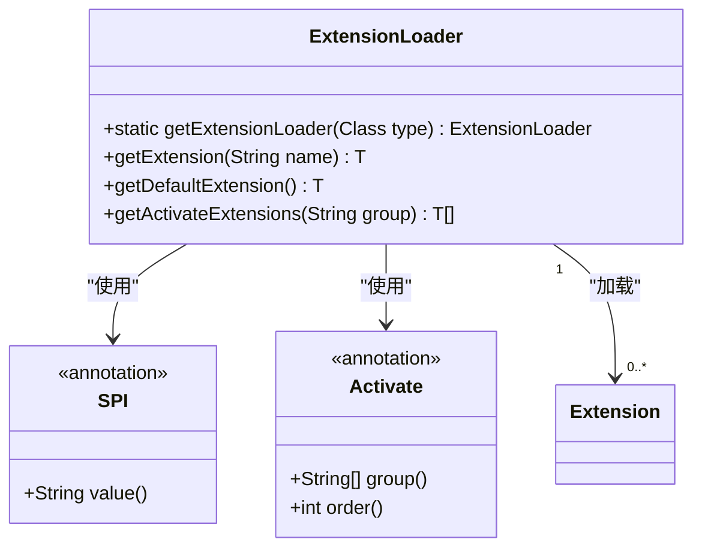
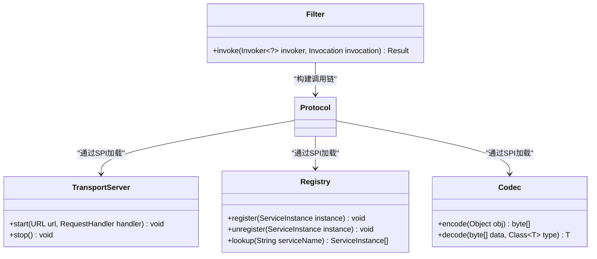
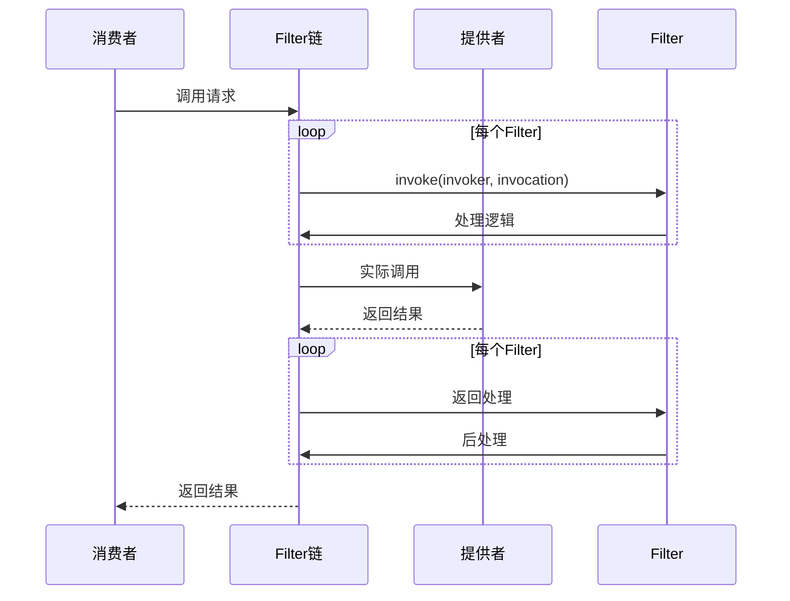
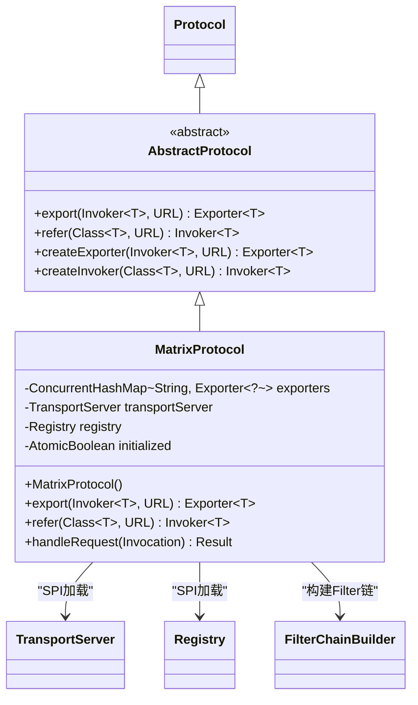

# 架构设计

<cite>
**本文档中引用的文件**  
- [README.md](file://README.md)
- [Protocol.java](file://matrix-rpc-core/src/main/java/io/homeey/matrix/rpc/core/Protocol.java)
- [Invoker.java](file://matrix-rpc-core/src/main/java/io/homeey/matrix/rpc/core/Invoker.java)
- [MatrixProtocol.java](file://matrix-rpc-runtime/src/main/java/io/homeey/matrix/rpc/runtime/MatrixProtocol.java)
- [ExtensionLoader.java](file://matrix-rpc-spi/src/main/java/io/homeey/matrix/rpc/spi/ExtensionLoader.java)
- [FilterChainBuilder.java](file://matrix-rpc-runtime/src/main/java/io/homeey/matrix/rpc/runtime/support/FilterChainBuilder.java)
- [TransportServer.java](file://matrix-rpc-transport/matrix-rpc-transport-api/src/main/java/io/homeey/matrix/rpc/transport/api/TransportServer.java)
- [Registry.java](file://matrix-rpc-registry/matrix-rpc-register-api/src/main/java/io/homeey/matrix/rpc/registry/api/Registry.java)
- [Codec.java](file://matrix-rpc-codec/matrix-rpc-codec-api/src/main/java/io/homeey/matrix/rpc/codec/api/Codec.java)
- [Filter.java](file://matrix-rpc-filter/matrix-rpc-filter-api/src/main/java/io/homeey/matrix/rpc/filter/Filter.java)
</cite>

## 目录
1. [简介](#简介)
2. [整体架构](#整体架构)
3. [微内核与SPI机制](#微内核与spi机制)
4. [核心组件分析](#核心组件分析)
5. [调用链与Filter机制](#调用链与filter机制)
6. [MatrixProtocol实现详解](#matrixprotocol实现详解)
7. [服务暴露与引用生命周期](#服务暴露与引用生命周期)
8. [设计决策与权衡](#设计决策与权衡)

## 简介

Matrix RPC是一个轻量级、高性能、云原生的RPC框架，采用微内核架构设计，通过SPI机制实现高度可扩展性。该框架将协议编排与底层通信能力分离，支持多种传输协议、序列化方式、注册中心和集群策略，适用于现代分布式系统。

**Section sources**
- [README.md](file://README.md#L1-L277)

## 整体架构

Matrix RPC采用分层架构设计，从上至下分为应用层、核心层、传输层和注册层。核心层作为微内核，协调Invoker、Protocol、Filter、Codec等组件，通过SPI机制动态加载扩展。

```mermaid
graph TB
subgraph "应用层"
A["Application / Spring Boot"]
end
subgraph "核心层"
B["matrix-rpc-core"]
B1[Invoker]
B2[Protocol]
B3[Filter]
B4[Codec]
B5[LoadBalance]
B6[Registry]
end
subgraph "传输层"
C["matrix-rpc-transport-*"]
C1[Netty]
C2[HTTP2]
C3[gRPC]
end
subgraph "注册层"
D["matrix-rpc-registry-*"]
D1[Nacos]
D2[Consul]
D3[K8s]
end
A --> B
B --> C
B --> D
B1 < --> B2
B3 < --> B2
B4 < --> B2
B5 < --> B2
B6 < --> B2
```

**Diagram sources**
- [README.md](file://README.md#L19-L58)

**Section sources**
- [README.md](file://README.md#L19-L58)

## 微内核与SPI机制

Matrix RPC的核心是微内核架构，其“中枢神经”是自研的SPI（Service Provider Interface）机制，不依赖Java原生ServiceLoader，支持优先级、条件激活和Wrapper包装。



**Diagram sources**
- [ExtensionLoader.java](file://matrix-rpc-spi/src/main/java/io/homeey/matrix/rpc/spi/ExtensionLoader.java#L12-L231)
- [SPI.java](file://matrix-rpc-spi/src/main/java/io/homeey/matrix/rpc/spi/SPI.java)
- [Activate.java](file://matrix-rpc-spi/src/main/java/io/homeey/matrix/rpc/spi/Activate.java)

**Section sources**
- [ExtensionLoader.java](file://matrix-rpc-spi/src/main/java/io/homeey/matrix/rpc/spi/ExtensionLoader.java#L12-L231)

## 核心组件分析

### Invoker接口

`Invoker`是RPC世界中的“函数指针”，抽象了服务调用语义，定义了接口类型和调用方法。

```java
public interface Invoker<T> {
    Class<T> getInterface();
    Result invoke(Invocation invocation);
}
```

**Section sources**
- [Invoker.java](file://matrix-rpc-core/src/main/java/io/homeey/matrix/rpc/core/Invoker.java#L5-L8)

### Protocol接口

`Protocol`是协议编排者，负责将`Invoker`暴露为远程服务或引用远程服务，是核心调度组件。

```java
@SPI("matrix")
public interface Protocol {
    <T> Exporter<T> export(Invoker<T> invoker, URL url);
    <T> Invoker<T> refer(Class<T> type, URL url);
}
```

**Section sources**
- [Protocol.java](file://matrix-rpc-core/src/main/java/io/homeey/matrix/rpc/core/Protocol.java#L7-L25)

### 其他核心接口



**Diagram sources**
- [TransportServer.java](file://matrix-rpc-transport/matrix-rpc-transport-api/src/main/java/io/homeey/matrix/rpc/transport/api/TransportServer.java)
- [Registry.java](file://matrix-rpc-registry/matrix-rpc-register-api/src/main/java/io/homeey/matrix/rpc/registry/api/Registry.java)
- [Codec.java](file://matrix-rpc-codec/matrix-rpc-codec-api/src/main/java/io/homeey/matrix/rpc/codec/api/Codec.java)
- [Filter.java](file://matrix-rpc-filter/matrix-rpc-filter-api/src/main/java/io/homeey/matrix/rpc/filter/Filter.java)

**Section sources**
- [TransportServer.java](file://matrix-rpc-transport/matrix-rpc-transport-api/src/main/java/io/homeey/matrix/rpc/transport/api/TransportServer.java)
- [Registry.java](file://matrix-rpc-registry/matrix-rpc-register-api/src/main/java/io/homeey/matrix/rpc/registry/api/Registry.java)
- [Codec.java](file://matrix-rpc-codec/matrix-rpc-codec-api/src/main/java/io/homeey/matrix/rpc/codec/api/Codec.java)
- [Filter.java](file://matrix-rpc-filter/matrix-rpc-filter-api/src/main/java/io/homeey/matrix/rpc/filter/Filter.java)

## 调用链与Filter机制

所有横切关注点（如超时、限流、熔断、Trace、Metrics）都通过`Filter`实现，形成责任链模式。



**Diagram sources**
- [FilterChainBuilder.java](file://matrix-rpc-runtime/src/main/java/io/homeey/matrix/rpc/runtime/support/FilterChainBuilder.java#L14-L53)
- [Filter.java](file://matrix-rpc-filter/matrix-rpc-filter-api/src/main/java/io/homeey/matrix/rpc/filter/Filter.java)

**Section sources**
- [FilterChainBuilder.java](file://matrix-rpc-runtime/src/main/java/io/homeey/matrix/rpc/runtime/support/FilterChainBuilder.java#L14-L53)

## MatrixProtocol实现详解

`MatrixProtocol`是核心协议实现，通过SPI加载`TransportServer`和`Registry`，管理服务暴露和引用的生命周期。



**Diagram sources**
- [MatrixProtocol.java](file://matrix-rpc-runtime/src/main/java/io/homeey/matrix/rpc/runtime/MatrixProtocol.java#L27-L190)
- [AbstractProtocol.java](file://matrix-rpc-runtime/src/main/java/io/homeey/matrix/rpc/runtime/AbstractProtocol.java#L8-L23)

**Section sources**
- [MatrixProtocol.java](file://matrix-rpc-runtime/src/main/java/io/homeey/matrix/rpc/runtime/MatrixProtocol.java#L27-L190)

## 服务暴露与引用生命周期

### 服务暴露流程

```mermaid
flowchart TD
A[export(invoker, url)] --> B{initialized?}
B -- 否 --> C[初始化服务器]
C --> D[启动TransportServer]
D --> E[设置请求处理器]
B -- 是 --> F[跳过初始化]
F --> G[构建Provider端Filter链]
G --> H[注册到exporters]
H --> I[注册到Registry]
I --> J[返回Exporter]
```

**Diagram sources**
- [MatrixProtocol.java](file://matrix-rpc-runtime/src/main/java/io/homeey/matrix/rpc/runtime/MatrixProtocol.java#L53-L85)

### 服务引用流程

```mermaid
flowchart TD
A[refer(type, url)] --> B[订阅服务变化]
B --> C[首次获取服务列表]
C --> D[创建远程Invoker]
D --> E[获取/创建TransportClient]
E --> F[发送请求]
F --> G[构建Consumer端Filter链]
G --> H[返回Invoker]
```

**Diagram sources**
- [MatrixProtocol.java](file://matrix-rpc-runtime/src/main/java/io/homeey/matrix/rpc/runtime/MatrixProtocol.java#L89-L128)

**Section sources**
- [MatrixProtocol.java](file://matrix-rpc-runtime/src/main/java/io/homeey/matrix/rpc/runtime/MatrixProtocol.java#L53-L128)

## 设计决策与权衡

### 协议与通信分离

Matrix RPC明确区分`Protocol`（协议编排）和`Transport`（纯通信能力），这种设计决策带来以下优势：

- **解耦**：协议层不关心底层传输细节
- **可替换性**：可自由切换Netty、HTTP2、gRPC等传输方式
- **可测试性**：各层可独立测试

### 微内核优势

- **扩展性**：通过SPI机制动态加载组件
- **灵活性**：支持条件激活和优先级排序
- **可维护性**：核心逻辑集中，扩展点清晰

### 权衡与约束

- **性能**：责任链模式引入少量调用开销
- **复杂性**：SPI机制增加了学习成本
- **依赖管理**：需谨慎处理Wrapper包装顺序

**Section sources**
- [README.md](file://README.md#L103-L277)
- [MatrixProtocol.java](file://matrix-rpc-runtime/src/main/java/io/homeey/matrix/rpc/runtime/MatrixProtocol.java#L27-L190)
- [ExtensionLoader.java](file://matrix-rpc-spi/src/main/java/io/homeey/matrix/rpc/spi/ExtensionLoader.java#L12-L231)