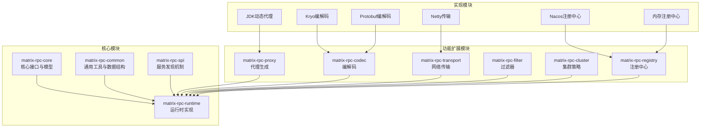
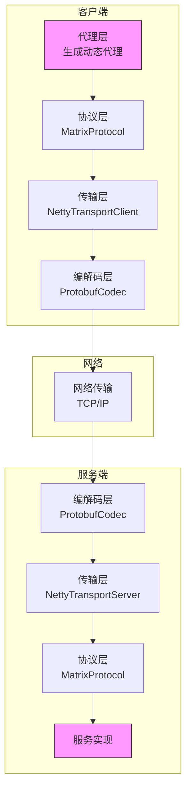
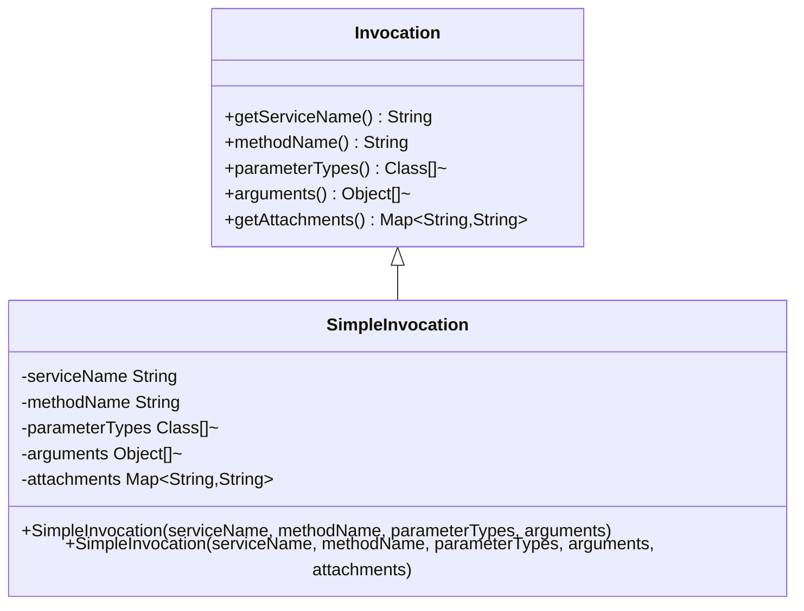
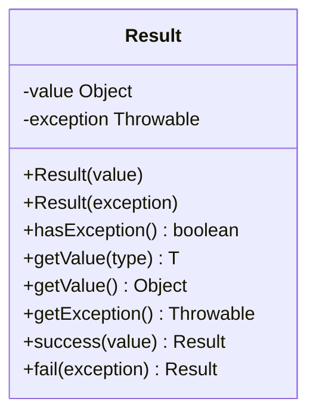
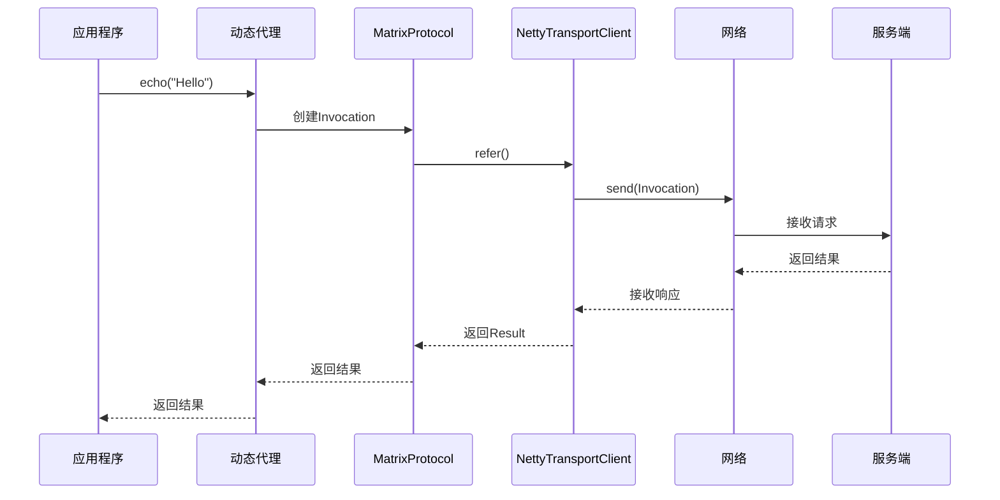
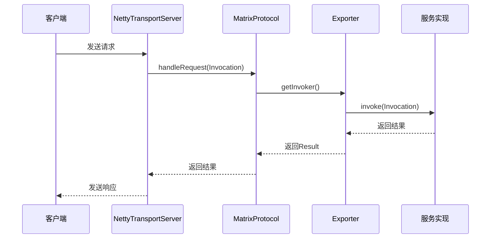
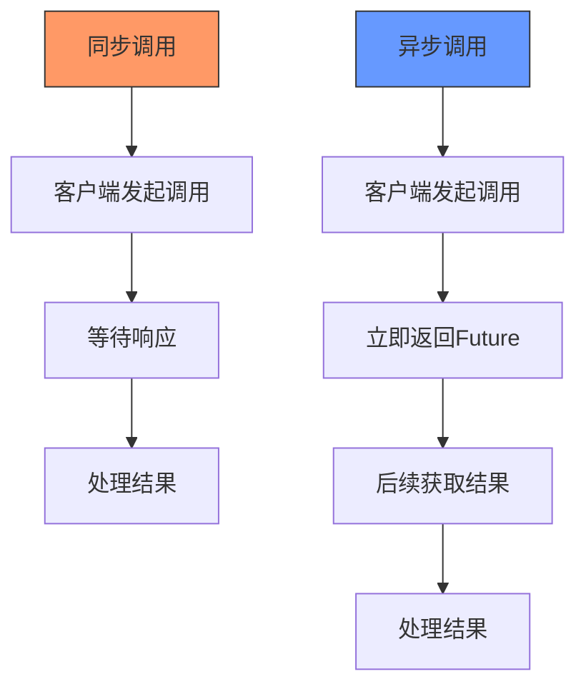
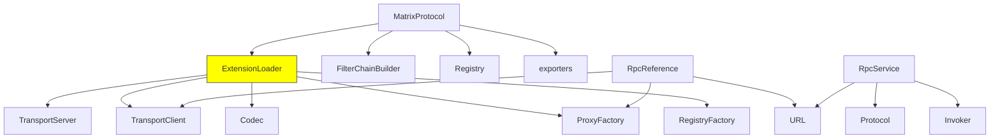

# RPC基本原理

<cite>
**本文档中引用的文件**  
- [Invocation.java](file://matrix-rpc-core/src/main/java/io/homeey/matrix/rpc/core/Invocation.java)
- [SimpleInvocation.java](file://matrix-rpc-core/src/main/java/io/homeey/matrix/rpc/core/SimpleInvocation.java)
- [Result.java](file://matrix-rpc-common/src/main/java/io/homeey/matrix/rpc/common/Result.java)
- [MatrixProtocol.java](file://matrix-rpc-runtime/src/main/java/io/homeey/matrix/rpc/runtime/MatrixProtocol.java)
- [RpcReference.java](file://matrix-rpc-runtime/src/main/java/io/homeey/matrix/rpc/runtime/RpcReference.java)
- [RpcService.java](file://matrix-rpc-runtime/src/main/java/io/homeey/matrix/rpc/runtime/RpcService.java)
- [TransportClient.java](file://matrix-rpc-transport/matrix-rpc-transport-api/src/main/java/io/homeey/matrix/rpc/transport/api/TransportClient.java)
- [TransportServer.java](file://matrix-rpc-transport/matrix-rpc-transport-api/src/main/java/io/homeey/matrix/rpc/transport/api/TransportServer.java)
- [Codec.java](file://matrix-rpc-codec/matrix-rpc-codec-api/src/main/java/io/homeey/matrix/rpc/codec/api/Codec.java)
- [ProxyFactory.java](file://matrix-rpc-proxy/matrix-rpc-proxy-api/src/main/java/io/homeey/matrix/rpc/proxy/api/ProxyFactory.java)
- [InvokerInvocationHandler.java](file://matrix-rpc-proxy/matrix-rpc-proxy-jdk/src/main/java/io/homeey/matrix/rpc/proxy/jdk/InvokerInvocationHandler.java)
- [NettyTransportClient.java](file://matrix-rpc-transport/matrix-rpc-transport-netty/src/main/java/io/homeey/matrix/rpc/transport/netty/client/NettyTransportClient.java)
- [NettyTransportServer.java](file://matrix-rpc-transport/matrix-rpc-transport-netty/src/main/java/io/homeey/matrix/rpc/transport/netty/server/NettyTransportServer.java)
</cite>

## 目录
1. [引言](#引言)
2. [项目结构](#项目结构)
3. [核心组件](#核心组件)
4. [架构概述](#架构概述)
5. [详细组件分析](#详细组件分析)
6. [依赖分析](#依赖分析)
7. [性能考虑](#性能考虑)
8. [故障排除指南](#故障排除指南)
9. [结论](#结论)

## 引言
本文深入讲解RPC（远程过程调用）的基本原理，并结合Matrix RPC框架的实现进行说明。我们将解释客户端如何通过代理发起远程调用，请求如何被序列化并通过网络传输，服务端如何接收请求、反序列化并执行本地方法，以及结果如何返回。通过`Invocation`对象说明调用上下文的封装方式，包括服务名、方法名、参数类型和参数值；通过`Result`对象说明响应结构的设计，包括成功结果与异常处理机制。同时阐述同步调用与异步调用模型的区别，并结合框架设计指出性能优化点，为初学者提供类比理解方式，同时为高级开发者提供可扩展性设计思路。

## 项目结构
Matrix RPC框架采用模块化设计，各功能组件独立封装，便于扩展和维护。整体结构清晰，遵循微内核+插件的设计理念，通过SPI机制实现组件的动态加载。

**图示来源**  
- [matrix-rpc-core](file://matrix-rpc-core)
- [matrix-rpc-common](file://matrix-rpc-common)
- [matrix-rpc-runtime](file://matrix-rpc-runtime)
- [matrix-rpc-spi](file://matrix-rpc-spi)
- [matrix-rpc-proxy](file://matrix-rpc-proxy)
- [matrix-rpc-codec](file://matrix-rpc-codec)
- [matrix-rpc-transport](file://matrix-rpc-transport)
- [matrix-rpc-filter](file://matrix-rpc-filter)
- [matrix-rpc-cluster](file://matrix-rpc-cluster)
- [matrix-rpc-registry](file://matrix-rpc-registry)

**本节来源**  
- [项目结构信息](file://README.md)

## 核心组件
Matrix RPC框架的核心组件包括：`Invocation`用于封装调用上下文，`Result`用于表示调用结果，`Protocol`定义协议行为，`Invoker`表示可执行的服务引用，`Exporter`管理服务导出，`ProxyFactory`生成动态代理，`Transport`负责网络通信，`Codec`处理数据编解码。

**本节来源**  
- [Invocation.java](file://matrix-rpc-core/src/main/java/io/homeey/matrix/rpc/core/Invocation.java)
- [Result.java](file://matrix-rpc-common/src/main/java/io/homeey/matrix/rpc/common/Result.java)
- [MatrixProtocol.java](file://matrix-rpc-runtime/src/main/java/io/homeey/matrix/rpc/runtime/MatrixProtocol.java)
- [RpcReference.java](file://matrix-rpc-runtime/src/main/java/io/homeey/matrix/rpc/runtime/RpcReference.java)
- [RpcService.java](file://matrix-rpc-runtime/src/main/java/io/homeey/matrix/rpc/runtime/RpcService.java)

## 架构概述
Matrix RPC框架采用分层架构设计，从上至下分为代理层、协议层、传输层和编解码层。各层职责分明，通过SPI机制实现插件化扩展。

**图示来源**  
- [MatrixProtocol.java](file://matrix-rpc-runtime/src/main/java/io/homeey/matrix/rpc/runtime/MatrixProtocol.java)
- [RpcReference.java](file://matrix-rpc-runtime/src/main/java/io/homeey/matrix/rpc/runtime/RpcReference.java)
- [RpcService.java](file://matrix-rpc-runtime/src/main/java/io/homeey/matrix/rpc/runtime/RpcService.java)
- [NettyTransportClient.java](file://matrix-rpc-transport/matrix-rpc-transport-netty/src/main/java/io/homeey/matrix/rpc/transport/netty/client/NettyTransportClient.java)
- [NettyTransportServer.java](file://matrix-rpc-transport/matrix-rpc-transport-netty/src/main/java/io/homeey/matrix/rpc/transport/netty/server/NettyTransportServer.java)
- [ProtobufCodec.java](file://matrix-rpc-codec/matrix-rpc-codec-protobuf/src/main/java/io/homeey/matrix/rpc/codec/protobuf/ProtobufCodec.java)

## 详细组件分析

### 调用上下文封装：Invocation
`Invocation`接口定义了远程调用所需的所有上下文信息，包括服务名、方法名、参数类型、参数值和附加属性。`SimpleInvocation`是其具体实现，确保调用信息的完整性和一致性。

**图示来源**  
- [Invocation.java](file://matrix-rpc-core/src/main/java/io/homeey/matrix/rpc/core/Invocation.java#L5-L41)
- [SimpleInvocation.java](file://matrix-rpc-core/src/main/java/io/homeey/matrix/rpc/core/SimpleInvocation.java#L8-L68)

**本节来源**  
- [Invocation.java](file://matrix-rpc-core/src/main/java/io/homeey/matrix/rpc/core/Invocation.java)
- [SimpleInvocation.java](file://matrix-rpc-core/src/main/java/io/homeey/matrix/rpc/core/SimpleInvocation.java)

### 响应结构设计：Result
`Result`类采用不可变设计，封装了远程调用的结果。通过区分成功值和异常对象，实现了统一的结果处理机制。提供了静态工厂方法`success`和`fail`，简化了结果创建。

**图示来源**  
- [Result.java](file://matrix-rpc-common/src/main/java/io/homeey/matrix/rpc/common/Result.java#L8-L53)

**本节来源**  
- [Result.java](file://matrix-rpc-common/src/main/java/io/homeey/matrix/rpc/common/Result.java)

### 客户端调用流程
客户端通过动态代理拦截方法调用，封装为`Invocation`对象，经由协议层、传输层发送到服务端。整个过程对用户透明，如同调用本地方法。

**图示来源**  
- [RpcReference.java](file://matrix-rpc-runtime/src/main/java/io/homeey/matrix/rpc/runtime/RpcReference.java#L101-L127)
- [MatrixProtocol.java](file://matrix-rpc-runtime/src/main/java/io/homeey/matrix/rpc/runtime/MatrixProtocol.java#L102-L123)
- [NettyTransportClient.java](file://matrix-rpc-transport/matrix-rpc-transport-netty/src/main/java/io/homeey/matrix/rpc/transport/netty/client/NettyTransportClient.java)

**本节来源**  
- [RpcReference.java](file://matrix-rpc-runtime/src/main/java/io/homeey/matrix/rpc/runtime/RpcReference.java)
- [MatrixProtocol.java](file://matrix-rpc-runtime/src/main/java/io/homeey/matrix/rpc/runtime/MatrixProtocol.java)
- [NettyTransportClient.java](file://matrix-rpc-transport/matrix-rpc-transport-netty/src/main/java/io/homeey/matrix/rpc/transport/netty/client/NettyTransportClient.java)

### 服务端处理流程
服务端接收请求后，通过`MatrixProtocol`查找对应的`Exporter`，执行本地方法调用，并将结果封装为`Result`返回。整个过程包含服务发现、负载均衡和过滤器链等机制。

**图示来源**  
- [MatrixProtocol.java](file://matrix-rpc-runtime/src/main/java/io/homeey/matrix/rpc/runtime/MatrixProtocol.java#L131-L146)
- [NettyTransportServer.java](file://matrix-rpc-transport/matrix-rpc-transport-netty/src/main/java/io/homeey/matrix/rpc/transport/netty/server/NettyTransportServer.java)
- [RpcService.java](file://matrix-rpc-runtime/src/main/java/io/homeey/matrix/rpc/runtime/RpcService.java#L177-L191)

**本节来源**  
- [MatrixProtocol.java](file://matrix-rpc-runtime/src/main/java/io/homeey/matrix/rpc/runtime/MatrixProtocol.java)
- [NettyTransportServer.java](file://matrix-rpc-transport/matrix-rpc-transport-netty/src/main/java/io/homeey/matrix/rpc/transport/netty/server/NettyTransportServer.java)
- [RpcService.java](file://matrix-rpc-runtime/src/main/java/io/homeey/matrix/rpc/runtime/RpcService.java)

### 同步与异步调用模型
Matrix RPC框架主要实现同步调用模型，通过`TransportClient.send()`方法阻塞等待响应。异步调用可通过扩展`Transport`接口实现，返回`Future<Result>`类型。

**本节来源**  
- [MatrixProtocol.java](file://matrix-rpc-runtime/src/main/java/io/homeey/matrix/rpc/runtime/MatrixProtocol.java)
- [TransportClient.java](file://matrix-rpc-transport/matrix-rpc-transport-api/src/main/java/io/homeey/matrix/rpc/transport/api/TransportClient.java)

## 依赖分析
Matrix RPC框架采用SPI机制实现组件解耦，各模块通过接口编程，具体实现通过配置加载。这种设计提高了框架的灵活性和可扩展性。

**图示来源**  
- [MatrixProtocol.java](file://matrix-rpc-runtime/src/main/java/io/homeey/matrix/rpc/runtime/MatrixProtocol.java#L37-L50)
- [RpcReference.java](file://matrix-rpc-runtime/src/main/java/io/homeey/matrix/rpc/runtime/RpcReference.java#L113-L124)
- [RpcService.java](file://matrix-rpc-runtime/src/main/java/io/homeey/matrix/rpc/runtime/RpcService.java#L153-L155)
- [SPI.java](file://matrix-rpc-spi/src/main/java/io/homeey/matrix/rpc/spi/SPI.java)

**本节来源**  
- [MatrixProtocol.java](file://matrix-rpc-runtime/src/main/java/io/homeey/matrix/rpc/runtime/MatrixProtocol.java)
- [RpcReference.java](file://matrix-rpc-runtime/src/main/java/io/homeey/matrix/rpc/runtime/RpcReference.java)
- [RpcService.java](file://matrix-rpc-runtime/src/main/java/io/homeey/matrix/rpc/runtime/RpcService.java)
- [SPI.java](file://matrix-rpc-spi/src/main/java/io/homeey/matrix/rpc/spi/SPI.java)

## 性能考虑
Matrix RPC框架在性能方面进行了多项优化：使用Netty作为传输层，提供高性能网络通信；通过对象池减少GC压力；采用Protobuf等高效编解码器；支持过滤器链的异步执行；提供连接复用机制。

**本节来源**  
- [NettyTransportClient.java](file://matrix-rpc-transport/matrix-rpc-transport-netty/src/main/java/io/homeey/matrix/rpc/transport/netty/client/NettyTransportClient.java)
- [ProtobufCodec.java](file://matrix-rpc-codec/matrix-rpc-codec-protobuf/src/main/java/io/homeey/matrix/rpc/codec/protobuf/ProtobufCodec.java)
- [MatrixProtocol.java](file://matrix-rpc-runtime/src/main/java/io/homeey/matrix/rpc/runtime/MatrixProtocol.java)

## 故障排除指南
常见问题包括：服务无法注册、调用超时、序列化失败等。排查时应检查网络连接、注册中心状态、编解码配置、服务版本匹配等。框架提供了`AccessLogFilter`和`TimeoutFilter`等工具辅助诊断。

**本节来源**  
- [ExceptionFilter.java](file://matrix-rpc-filter/matrix-rpc-filter-builtin/src/main/java/io/homeey/matrix/rpc/filter/builtin/ExceptionFilter.java)
- [TimeoutFilter.java](file://matrix-rpc-filter/matrix-rpc-filter-builtin/src/main/java/io/homeey/matrix/rpc/filter/builtin/TimeoutFilter.java)
- [AccessLogFilter.java](file://matrix-rpc-filter/matrix-rpc-filter-builtin/src/main/java/io/homeey/matrix/rpc/filter/builtin/AccessLogFilter.java)

## 结论
Matrix RPC框架通过清晰的分层设计和SPI扩展机制，实现了高性能、高可用的远程过程调用。其核心思想是将复杂的网络通信细节封装在框架内部，为用户提供简单直观的API。对于初学者，可以将其类比为"远程方法调用就像本地方法调用一样简单"；对于高级开发者，框架的模块化设计和扩展点提供了丰富的定制可能性。未来可进一步优化异步支持、流式传输和更智能的负载均衡策略。