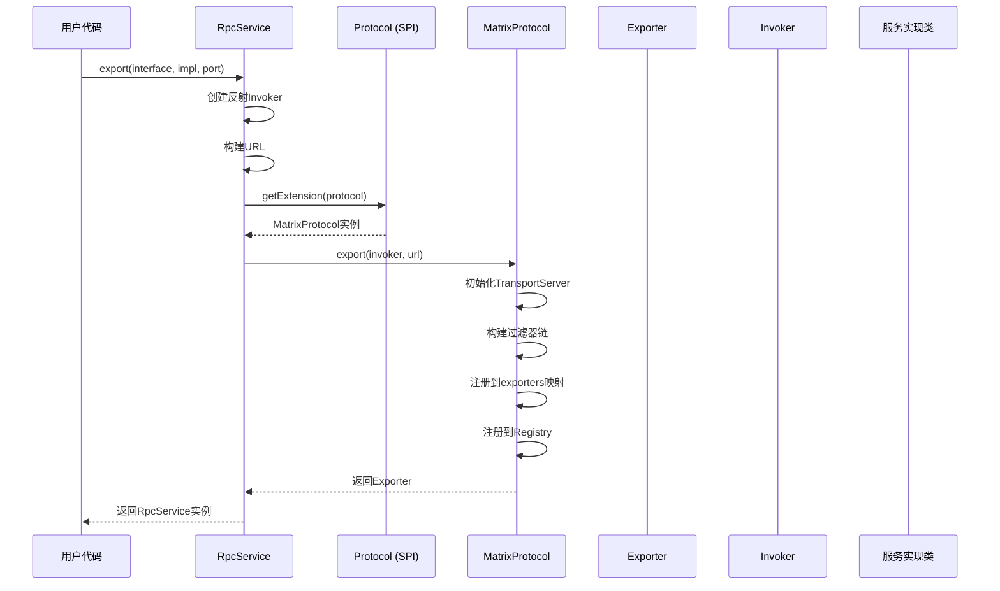
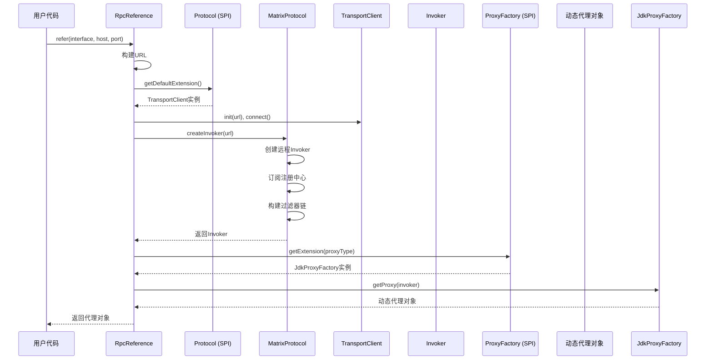
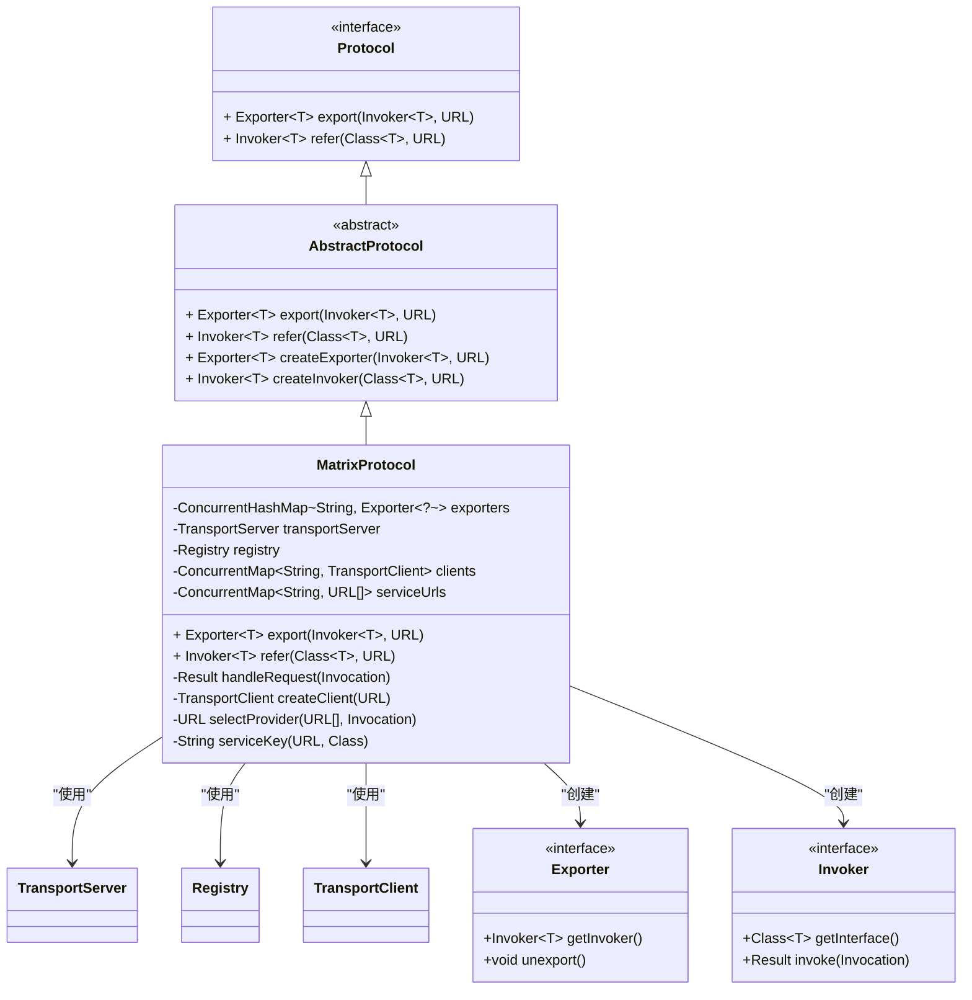
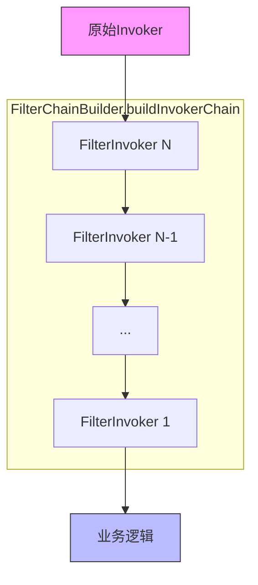
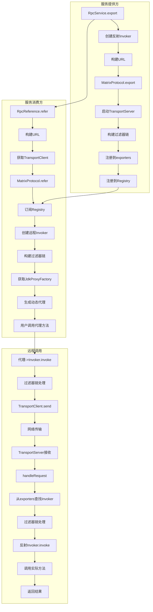

# 服务暴露与引用

<cite>
**本文档中引用的文件**
- [RpcService.java](file://matrix-rpc-runtime/src/main/java/io/homeey/matrix/rpc/runtime/RpcService.java)
- [RpcReference.java](file://matrix-rpc-runtime/src/main/java/io/homeey/matrix/rpc/runtime/RpcReference.java)
- [Protocol.java](file://matrix-rpc-core/src/main/java/io/homeey/matrix/rpc/core/Protocol.java)
- [MatrixProtocol.java](file://matrix-rpc-runtime/src/main/java/io/homeey/matrix/rpc/runtime/MatrixProtocol.java)
- [FilterChainBuilder.java](file://matrix-rpc-runtime/src/main/java/io/homeey/matrix/rpc/runtime/support/FilterChainBuilder.java)
- [AbstractProtocol.java](file://matrix-rpc-runtime/src/main/java/io/homeey/matrix/rpc/runtime/AbstractProtocol.java)
- [Exporter.java](file://matrix-rpc-core/src/main/java/io/homeey/matrix/rpc/core/Exporter.java)
- [ProviderMain.java](file://matrix-rpc-examples/src/main/java/io/homeey/matrix/rpc/example/provider/ProviderMain.java)
- [ConsumerMain.java](file://matrix-rpc-examples/src/main/java/io/homeey/matrix/rpc/example/consumer/ConsumerMain.java)
</cite>

## 目录
1. [简介](#简介)
2. [服务暴露机制](#服务暴露机制)
3. [服务引用机制](#服务引用机制)
4. [协议核心实现](#协议核心实现)
5. [过滤器链构建](#过滤器链构建)
6. [URL配置与参数传递](#url配置与参数传递)
7. [代理工厂与动态代理](#代理工厂与动态代理)
8. [完整调用流程图解](#完整调用流程图解)
9. [使用示例与配置说明](#使用示例与配置说明)
10. [总结](#总结)

## 简介
Matrix RPC框架通过`RpcService`和`RpcReference`两个核心入口类，提供了简洁的服务暴露与引用机制。服务提供方通过`RpcService`将本地Java对象暴露为远程可调用服务，而服务消费方则通过`RpcReference`创建远程服务的本地代理实例。整个过程基于SPI扩展机制，实现了协议、传输、代理、注册等组件的解耦与可插拔。

**本文档中引用的文件**
- [RpcService.java](file://matrix-rpc-runtime/src/main/java/io/homeey/matrix/rpc/runtime/RpcService.java)
- [RpcReference.java](file://matrix-rpc-runtime/src/main/java/io/homeey/matrix/rpc/runtime/RpcReference.java)

## 服务暴露机制

`RpcService`作为服务暴露的统一入口，采用构建器模式提供灵活的配置方式。其核心流程包括：创建反射调用器（Invoker）、构建服务URL、通过SPI获取协议实例并导出服务。

服务暴露过程首先验证接口与实现的合法性，然后创建一个基于反射的通用`Invoker`，该`Invoker`在收到调用请求时，通过Java反射机制调用目标对象的实际方法。接着，根据配置的主机、端口、协议、分组、版本等信息构建`URL`对象。最后，通过`ExtensionLoader`从SPI机制中获取指定协议的实现（如`MatrixProtocol`），并调用其`export`方法完成服务导出。



**图示来源**
- [RpcService.java](file://matrix-rpc-runtime/src/main/java/io/homeey/matrix/rpc/runtime/RpcService.java#L135-L155)
- [MatrixProtocol.java](file://matrix-rpc-runtime/src/main/java/io/homeey/matrix/rpc/runtime/MatrixProtocol.java#L53-L71)

**本节来源**
- [RpcService.java](file://matrix-rpc-runtime/src/main/java/io/homeey/matrix/rpc/runtime/RpcService.java#L135-L155)
- [MatrixProtocol.java](file://matrix-rpc-runtime/src/main/java/io/homeey/matrix/rpc/runtime/MatrixProtocol.java#L53-L85)

## 服务引用机制

`RpcReference`作为服务引用的统一入口，负责创建远程服务的本地代理。其核心流程包括：构建服务URL、通过SPI获取传输客户端（TransportClient）、创建远程调用`Invoker`、通过SPI获取代理工厂（ProxyFactory）并生成代理实例。

服务引用过程首先根据服务接口、主机、端口等信息构建`URL`。然后，通过SPI获取默认的`TransportClient`实现（如NettyTransportClient），并初始化连接。接着，创建一个远程调用`Invoker`，该`Invoker`的`invoke`方法会将调用请求通过`TransportClient`发送到远程服务器。最后，通过SPI获取指定类型的代理工厂（如JdkProxyFactory），并由其生成实现了服务接口的动态代理对象。



**图示来源**
- [RpcReference.java](file://matrix-rpc-runtime/src/main/java/io/homeey/matrix/rpc/runtime/RpcReference.java#L101-L124)
- [MatrixProtocol.java](file://matrix-rpc-runtime/src/main/java/io/homeey/matrix/rpc/runtime/MatrixProtocol.java#L89-L128)

**本节来源**
- [RpcReference.java](file://matrix-rpc-runtime/src/main/java/io/homeey/matrix/rpc/runtime/RpcReference.java#L101-L124)
- [MatrixProtocol.java](file://matrix-rpc-runtime/src/main/java/io/homeey/matrix/rpc/runtime/MatrixProtocol.java#L89-L128)

## 协议核心实现

`Protocol`接口是服务暴露与引用的核心契约，定义了`export`和`refer`两个抽象方法。`MatrixProtocol`作为其具体实现，继承自`AbstractProtocol`，并完成了服务导出与引用的全部逻辑。

在服务导出时，`MatrixProtocol`首先确保`TransportServer`（如NettyTransportServer）只被初始化一次，然后为`Invoker`构建服务端过滤器链，将服务信息存入本地`exporters`缓存，并向注册中心（如NacosRegistry或MemoryRegistry）注册服务URL。

在服务引用时，`MatrixProtocol`首先向注册中心订阅服务提供者列表的变化，然后立即查询当前可用的服务提供者。它创建一个远程`Invoker`，该`Invoker`在`invoke`方法中实现负载均衡（当前为随机选择），获取或创建对应的`TransportClient`，并将调用请求发送出去。



**图示来源**
- [Protocol.java](file://matrix-rpc-core/src/main/java/io/homeey/matrix/rpc/core/Protocol.java)
- [AbstractProtocol.java](file://matrix-rpc-runtime/src/main/java/io/homeey/matrix/rpc/runtime/AbstractProtocol.java)
- [MatrixProtocol.java](file://matrix-rpc-runtime/src/main/java/io/homeey/matrix/rpc/runtime/MatrixProtocol.java)

**本节来源**
- [Protocol.java](file://matrix-rpc-core/src/main/java/io/homeey/matrix/rpc/core/Protocol.java)
- [AbstractProtocol.java](file://matrix-rpc-runtime/src/main/java/io/homeey/matrix/rpc/runtime/AbstractProtocol.java)
- [MatrixProtocol.java](file://matrix-rpc-runtime/src/main/java/io/homeey/matrix/rpc/runtime/MatrixProtocol.java)

## 过滤器链构建

Matrix RPC通过`FilterChainBuilder`构建过滤器责任链，实现了AOP式的功能扩展。无论是服务提供方还是消费方的`Invoker`，都会被包装上一系列的过滤器。

`FilterChainBuilder.buildInvokerChain`方法通过SPI的`getActivateExtensions`获取所有激活的`Filter`扩展点，并根据`@Activate`注解中的`order`值进行排序。然后，它从后往前遍历过滤器列表，将每个`Filter`包装成一个`FilterInvoker`，形成一个嵌套的责任链。当调用`invoke`方法时，请求会依次经过每个过滤器的处理，最后到达原始的`Invoker`。



**图示来源**
- [FilterChainBuilder.java](file://matrix-rpc-runtime/src/main/java/io/homeey/matrix/rpc/runtime/support/FilterChainBuilder.java#L23-L38)

**本节来源**
- [FilterChainBuilder.java](file://matrix-rpc-runtime/src/main/java/io/homeey/matrix/rpc/runtime/support/FilterChainBuilder.java#L23-L38)
- [MatrixProtocol.java](file://matrix-rpc-runtime/src/main/java/io/homeey/matrix/rpc/runtime/MatrixProtocol.java#L62-L63)
- [MatrixProtocol.java](file://matrix-rpc-runtime/src/main/java/io/homeey/matrix/rpc/runtime/MatrixProtocol.java#L126-L127)

## URL配置与参数传递

`URL`对象是Matrix RPC中配置信息的核心载体，贯穿于服务暴露与引用的全过程。它包含了协议、主机、端口、路径（服务接口名）以及查询参数（如version、group、timeout等）。

在服务暴露时，`RpcService`将配置的`group`、`version`等参数放入`URL`的参数映射中。在服务引用时，`timeout`等参数同样被放入`URL`。`MatrixProtocol`在处理`refer`请求时，会从`URL`中提取`timeout`参数用于网络调用。

注册中心的地址也通过`URL`表示，框架通过系统属性`matrix.registry.address`来指定注册中心类型和地址，默认使用`memory://localhost`表示内存注册中心。

**本节来源**
- [RpcService.java](file://matrix-rpc-runtime/src/main/java/io/homeey/matrix/rpc/runtime/RpcService.java#L145-L150)
- [RpcReference.java](file://matrix-rpc-runtime/src/main/java/io/homeey/matrix/rpc/runtime/RpcReference.java#L108-L110)
- [MatrixProtocol.java](file://matrix-rpc-runtime/src/main/java/io/homeey/matrix/rpc/runtime/MatrixProtocol.java#L43-L47)

## 代理工厂与动态代理

虽然`ProxyFactory`和`JdkProxyFactory`的具体实现文件未能成功读取，但根据SPI配置和代码调用可以推断其设计。

`ProxyFactory`是一个SPI接口，`JdkProxyFactory`是其基于JDK动态代理的具体实现。当`RpcReference`调用`get()`方法时，会通过`ExtensionLoader`获取`JdkProxyFactory`实例，并调用其`getProxy(invoker)`方法。

`JdkProxyFactory`会创建一个实现了服务接口的动态代理对象，其`InvocationHandler`（如`InvokerInvocationHandler`）的`invoke`方法会将所有方法调用委托给传入的`Invoker`。这样，用户代码对代理对象的调用，最终都会转化为对`Invoker.invoke()`的调用，从而触发远程通信。

**本节来源**
- [RpcReference.java](file://matrix-rpc-runtime/src/main/java/io/homeey/matrix/rpc/runtime/RpcReference.java#L122-L124)
- [matrix-rpc-proxy-jdk](file://matrix-rpc-proxy/matrix-rpc-proxy-jdk) (SPI配置)

## 完整调用流程图解



**图示来源**
- [RpcService.java](file://matrix-rpc-runtime/src/main/java/io/homeey/matrix/rpc/runtime/RpcService.java)
- [RpcReference.java](file://matrix-rpc-runtime/src/main/java/io/homeey/matrix/rpc/runtime/RpcReference.java)
- [MatrixProtocol.java](file://matrix-rpc-runtime/src/main/java/io/homeey/matrix/rpc/runtime/MatrixProtocol.java)

## 使用示例与配置说明

Matrix RPC提供了极简的API，服务暴露与引用均可通过一行代码完成。

**服务提供方示例：**
```java
// 一行代码暴露服务
RpcService.export(EchoService.class, new EchoServiceImpl(), 20880).await();
```

**服务消费方示例：**
```java
// 一行代码获取远程代理
EchoService service = RpcReference.refer(EchoService.class, "localhost", 20880);
String result = service.echo("Hello");
```

**常见配置项：**

| 配置项 | 作用 | 默认值 | 设置方法 |
| :--- | :--- | :--- | :--- |
| `host` | 服务绑定主机 | 0.0.0.0 | `RpcService.host()` |
| `port` | 服务监听端口 | 20880 | `RpcService.port()` |
| `protocol` | 通信协议 | matrix | `RpcService.protocol()` |
| `group` | 服务分组 | "" | `RpcService.group()` |
| `version` | 服务版本 | 1.0.0 | `RpcService.version()` |
| `timeout` | 调用超时（毫秒） | 3000 | `RpcReference.timeout()` |
| `proxyType` | 代理类型 | jdk | `RpcReference.proxyType()` |

**本节来源**
- [ProviderMain.java](file://matrix-rpc-examples/src/main/java/io/homeey/matrix/rpc/example/provider/ProviderMain.java#L9)
- [ConsumerMain.java](file://matrix-rpc-examples/src/main/java/io/homeey/matrix/rpc/example/consumer/ConsumerMain.java#L14)

## 总结
Matrix RPC通过`RpcService`和`RpcReference`提供了简洁的服务暴露与引用API。其核心`MatrixProtocol`实现了`Protocol`接口，利用SPI机制整合了传输、注册、代理、过滤等模块。通过`URL`统一配置，`Invoker`抽象调用，`Exporter`管理生命周期，以及`FilterChain`实现功能扩展，构建了一个清晰、灵活、可扩展的RPC框架。