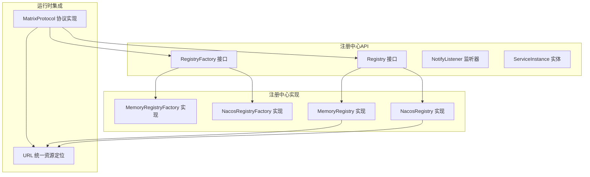
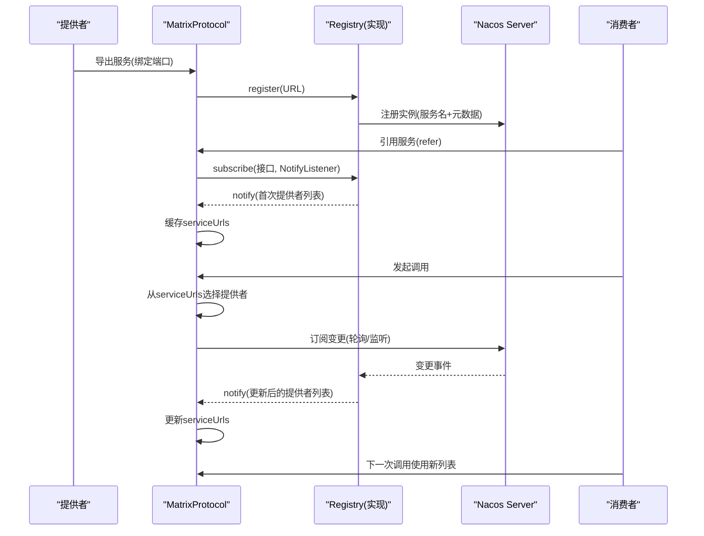
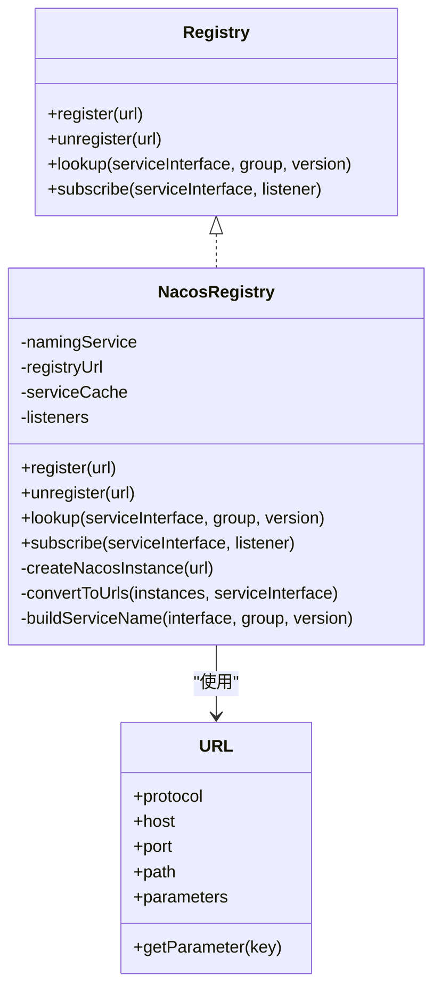
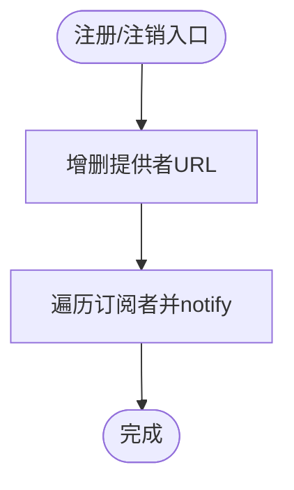
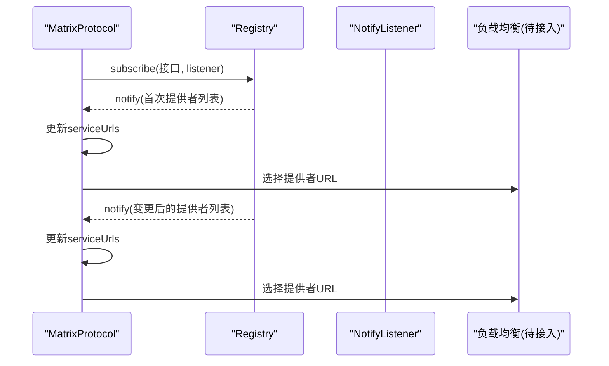
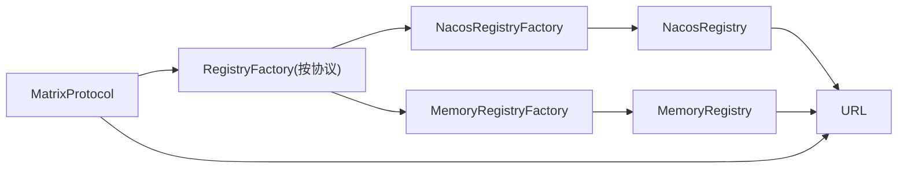

# 服务注册与发现

<cite>
**本文引用的文件**
- [Registry.java](file://matrix-rpc-registry/matrix-rpc-register-api/src/main/java/io/homeey/matrix/rpc/registry/api/Registry.java)
- [RegistryFactory.java](file://matrix-rpc-registry/matrix-rpc-register-api/src/main/java/io/homeey/matrix/rpc/registry/api/RegistryFactory.java)
- [NotifyListener.java](file://matrix-rpc-registry/matrix-rpc-register-api/src/main/java/io/homeey/matrix/rpc/registry/api/NotifyListener.java)
- [ServiceInstance.java](file://matrix-rpc-registry/matrix-rpc-register-api/src/main/java/io/homeey/matrix/rpc/registry/api/ServiceInstance.java)
- [NacosRegistry.java](file://matrix-rpc-registry/matrix-rpc-registry-nacos/src/main/java/io/homeey/matrix/rpc/registry/nacos/NacosRegistry.java)
- [NacosRegistryFactory.java](file://matrix-rpc-registry/matrix-rpc-registry-nacos/src/main/java/io/homeey/matrix/rpc/registry/nacos/NacosRegistryFactory.java)
- [MemoryRegistry.java](file://matrix-rpc-registry/matrix-rpc-registy-memory/src/main/java/io/homeey/matrix/rpc/registry/MemoryRegistry.java)
- [MemoryRegistryFactory.java](file://matrix-rpc-registry/matrix-rpc-registy-memory/src/main/java/io/homeey/matrix/rpc/registry/MemoryRegistryFactory.java)
- [URL.java](file://matrix-rpc-common/src/main/java/io/homeey/matrix/rpc/common/URL.java)
- [MatrixProtocol.java](file://matrix-rpc-runtime/src/main/java/io/homeey/matrix/rpc/runtime/MatrixProtocol.java)
- [README.md](file://README.md)
</cite>

## 目录
1. [简介](#简介)
2. [项目结构](#项目结构)
3. [核心组件](#核心组件)
4. [架构总览](#架构总览)
5. [详细组件分析](#详细组件分析)
6. [依赖关系分析](#依赖关系分析)
7. [性能考量](#性能考量)
8. [故障排查指南](#故障排查指南)
9. [结论](#结论)
10. [附录](#附录)

## 简介
本章节面向Matrix RPC的服务注册与发现机制，系统性阐述以下主题：
- Registry接口定义的服务注册、注销、发现与订阅通知等核心能力
- RegistryFactory如何依据URL协议动态创建不同类型的注册中心实例
- Nacos注册中心实现（NacosRegistry）的工作流程：与Nacos Server的连接管理、服务实例注册格式、健康状态与变更通知处理
- 内存注册中心（MemoryRegistry）在测试环境中的作用
- URL中注册中心地址、命名空间、分组等参数的含义与使用
- 服务消费者如何通过订阅机制实时感知提供者列表变化，并与负载均衡模块协同工作

## 项目结构
围绕注册与发现，核心模块与文件如下：
- 接口与抽象：Registry、RegistryFactory、NotifyListener、ServiceInstance
- 实现：NacosRegistry、NacosRegistryFactory、MemoryRegistry、MemoryRegistryFactory
- 通用模型：URL
- 运行时集成：MatrixProtocol（协议编排，负责注册、订阅、发现、负载均衡）

图表来源
- [Registry.java](file://matrix-rpc-registry/matrix-rpc-register-api/src/main/java/io/homeey/matrix/rpc/registry/api/Registry.java#L1-L39)
- [RegistryFactory.java](file://matrix-rpc-registry/matrix-rpc-register-api/src/main/java/io/homeey/matrix/rpc/registry/api/RegistryFactory.java#L1-L22)
- [NotifyListener.java](file://matrix-rpc-registry/matrix-rpc-register-api/src/main/java/io/homeey/matrix/rpc/registry/api/NotifyListener.java#L1-L11)
- [ServiceInstance.java](file://matrix-rpc-registry/matrix-rpc-register-api/src/main/java/io/homeey/matrix/rpc/registry/api/ServiceInstance.java#L1-L40)
- [NacosRegistry.java](file://matrix-rpc-registry/matrix-rpc-registry-nacos/src/main/java/io/homeey/matrix/rpc/registry/nacos/NacosRegistry.java#L1-L159)
- [NacosRegistryFactory.java](file://matrix-rpc-registry/matrix-rpc-registry-nacos/src/main/java/io/homeey/matrix/rpc/registry/nacos/NacosRegistryFactory.java#L1-L21)
- [MemoryRegistry.java](file://matrix-rpc-registry/matrix-rpc-registy-memory/src/main/java/io/homeey/matrix/rpc/registry/MemoryRegistry.java#L1-L90)
- [MemoryRegistryFactory.java](file://matrix-rpc-registry/matrix-rpc-registy-memory/src/main/java/io/homeey/matrix/rpc/registry/MemoryRegistryFactory.java#L1-L21)
- [URL.java](file://matrix-rpc-common/src/main/java/io/homeey/matrix/rpc/common/URL.java#L1-L164)
- [MatrixProtocol.java](file://matrix-rpc-runtime/src/main/java/io/homeey/matrix/rpc/runtime/MatrixProtocol.java#L1-L190)

章节来源
- [README.md](file://README.md#L18-L60)

## 核心组件
- Registry接口：定义服务注册、注销、发现与订阅通知等能力，是注册中心的统一抽象。
- RegistryFactory接口：基于URL协议动态创建具体注册中心实例，默认SPI实现为nacos。
- NotifyListener接口：订阅回调，接收服务提供者URL列表变更通知。
- ServiceInstance实体：服务实例的抽象载体（字段包含服务名、主机、端口、元数据），用于注册中心的统一表示。
- URL模型：承载协议、主机、端口、路径、参数等，是注册中心地址、分组、版本等参数的载体。

章节来源
- [Registry.java](file://matrix-rpc-registry/matrix-rpc-register-api/src/main/java/io/homeey/matrix/rpc/registry/api/Registry.java#L1-L39)
- [RegistryFactory.java](file://matrix-rpc-registry/matrix-rpc-register-api/src/main/java/io/homeey/matrix/rpc/registry/api/RegistryFactory.java#L1-L22)
- [NotifyListener.java](file://matrix-rpc-registry/matrix-rpc-register-api/src/main/java/io/homeey/matrix/rpc/registry/api/NotifyListener.java#L1-L11)
- [ServiceInstance.java](file://matrix-rpc-registry/matrix-rpc-register-api/src/main/java/io/homeey/matrix/rpc/registry/api/ServiceInstance.java#L1-L40)
- [URL.java](file://matrix-rpc-common/src/main/java/io/homeey/matrix/rpc/common/URL.java#L1-L164)

## 架构总览
下图展示从应用侧到注册中心再到服务提供者的整体交互路径，以及消费者订阅与负载均衡的协作关系。

图表来源
- [MatrixProtocol.java](file://matrix-rpc-runtime/src/main/java/io/homeey/matrix/rpc/runtime/MatrixProtocol.java#L88-L128)
- [NacosRegistry.java](file://matrix-rpc-registry/matrix-rpc-registry-nacos/src/main/java/io/homeey/matrix/rpc/registry/nacos/NacosRegistry.java#L39-L103)
- [MemoryRegistry.java](file://matrix-rpc-registry/matrix-rpc-registy-memory/src/main/java/io/homeey/matrix/rpc/registry/MemoryRegistry.java#L36-L88)

## 详细组件分析

### Registry接口与工厂
- Registry接口定义了register/unregister/lookup/subscribe四个核心方法，分别对应服务注册、注销、发现与订阅通知。
- RegistryFactory通过SPI按URL协议创建具体注册中心实例，默认实现为nacos；在运行时可通过系统属性覆盖注册中心地址，从而切换实现。

章节来源
- [Registry.java](file://matrix-rpc-registry/matrix-rpc-register-api/src/main/java/io/homeey/matrix/rpc/registry/api/Registry.java#L1-L39)
- [RegistryFactory.java](file://matrix-rpc-registry/matrix-rpc-register-api/src/main/java/io/homeey/matrix/rpc/registry/api/RegistryFactory.java#L1-L22)
- [MatrixProtocol.java](file://matrix-rpc-runtime/src/main/java/io/homeey/matrix/rpc/runtime/MatrixProtocol.java#L37-L50)

### Nacos注册中心实现（NacosRegistry）
- 连接管理：构造时通过URL解析主机与端口，创建NamingService；内部维护服务缓存与订阅监听器映射。
- 服务注册：将URL转换为Nacos Instance，设置IP、端口、权重、启用状态与元数据（包含接口、分组、版本、协议），并向Nacos注册。
- 服务注销：反向转换Instance并调用反注册。
- 服务发现：根据接口、分组、版本构建服务名，调用Nacos查询实例列表并转换为URL列表。
- 订阅与通知：subscribe时立即推送当前列表给监听器；后台线程定时轮询（固定周期）拉取最新实例，转换为URL后触发notify。
- 元数据与命名空间：元数据中包含接口、分组、版本、协议；服务名采用前缀与接口、分组、版本拼接规则，便于区分与检索。

图表来源
- [NacosRegistry.java](file://matrix-rpc-registry/matrix-rpc-registry-nacos/src/main/java/io/homeey/matrix/rpc/registry/nacos/NacosRegistry.java#L1-L159)
- [URL.java](file://matrix-rpc-common/src/main/java/io/homeey/matrix/rpc/common/URL.java#L1-L164)
- [Registry.java](file://matrix-rpc-registry/matrix-rpc-register-api/src/main/java/io/homeey/matrix/rpc/registry/api/Registry.java#L1-L39)

章节来源
- [NacosRegistry.java](file://matrix-rpc-registry/matrix-rpc-registry-nacos/src/main/java/io/homeey/matrix/rpc/registry/nacos/NacosRegistry.java#L22-L103)
- [NacosRegistry.java](file://matrix-rpc-registry/matrix-rpc-registry-nacos/src/main/java/io/homeey/matrix/rpc/registry/nacos/NacosRegistry.java#L105-L159)

### 内存注册中心（MemoryRegistry）
- 单例模式：确保提供者与消费者共享同一份注册表。
- 数据结构：以服务接口名为键，维护提供者URL列表；以服务接口名为键，维护订阅者列表。
- 注册/注销：增删提供者URL后，立即通知该接口的所有订阅者。
- 发现：直接返回当前缓存的提供者列表。
- 订阅：记录订阅者并在有变更时推送当前列表。

图表来源
- [MemoryRegistry.java](file://matrix-rpc-registry/matrix-rpc-registy-memory/src/main/java/io/homeey/matrix/rpc/registry/MemoryRegistry.java#L36-L88)

章节来源
- [MemoryRegistry.java](file://matrix-rpc-registry/matrix-rpc-registy-memory/src/main/java/io/homeey/matrix/rpc/registry/MemoryRegistry.java#L1-L90)

### URL参数与命名空间
- 注册中心地址：通过系统属性指定，如memory://localhost或nacos://host:port，MatrixProtocol据此加载对应RegistryFactory实现。
- 分组与版本：消费者在refer时从URL读取group与version参数，用于服务发现与订阅；提供者在注册时将这些参数写入Nacos元数据。
- 元数据：Nacos实现将接口、分组、版本、协议写入Instance元数据，便于后续转换回URL与路由决策。

章节来源
- [MatrixProtocol.java](file://matrix-rpc-runtime/src/main/java/io/homeey/matrix/rpc/runtime/MatrixProtocol.java#L37-L50)
- [MatrixProtocol.java](file://matrix-rpc-runtime/src/main/java/io/homeey/matrix/rpc/runtime/MatrixProtocol.java#L88-L100)
- [NacosRegistry.java](file://matrix-rpc-registry/matrix-rpc-registry-nacos/src/main/java/io/homeey/matrix/rpc/registry/nacos/NacosRegistry.java#L105-L133)
- [URL.java](file://matrix-rpc-common/src/main/java/io/homeey/matrix/rpc/common/URL.java#L1-L164)

### 消费者订阅与负载均衡协同
- 订阅流程：消费者refer时，MatrixProtocol对服务接口进行subscribe，并在收到notify回调时更新本地缓存的serviceUrls。
- 初次发现：subscribe后立即lookup，确保首次可用的提供者列表进入缓存。
- 调用选择：每次发起调用时，从serviceUrls中选择一个提供者URL；当前实现为简化随机策略，后续可接入负载均衡模块。
- 实时感知：Nacos实现通过后台线程定时轮询，及时推送变更；Memory实现则在注册/注销时即时通知。

图表来源
- [MatrixProtocol.java](file://matrix-rpc-runtime/src/main/java/io/homeey/matrix/rpc/runtime/MatrixProtocol.java#L88-L100)
- [NacosRegistry.java](file://matrix-rpc-registry/matrix-rpc-registry-nacos/src/main/java/io/homeey/matrix/rpc/registry/nacos/NacosRegistry.java#L78-L103)
- [MemoryRegistry.java](file://matrix-rpc-registry/matrix-rpc-registy-memory/src/main/java/io/homeey/matrix/rpc/registry/MemoryRegistry.java#L68-L88)

## 依赖关系分析
- 运行时集成：MatrixProtocol在初始化时解析注册中心地址，加载对应RegistryFactory并创建Registry实例；随后在export/refer过程中调用注册、订阅、发现与通知。
- 工厂与实现：NacosRegistryFactory与MemoryRegistryFactory均实现RegistryFactory，分别返回NacosRegistry与MemoryRegistry实例。
- URL驱动：Registry接口方法均以URL为输入/输出载体，URL的参数（group、version）贯穿注册与发现过程。

图表来源
- [MatrixProtocol.java](file://matrix-rpc-runtime/src/main/java/io/homeey/matrix/rpc/runtime/MatrixProtocol.java#L37-L50)
- [NacosRegistryFactory.java](file://matrix-rpc-registry/matrix-rpc-registry-nacos/src/main/java/io/homeey/matrix/rpc/registry/nacos/NacosRegistryFactory.java#L1-L21)
- [MemoryRegistryFactory.java](file://matrix-rpc-registry/matrix-rpc-registy-memory/src/main/java/io/homeey/matrix/rpc/registry/MemoryRegistryFactory.java#L1-L21)
- [NacosRegistry.java](file://matrix-rpc-registry/matrix-rpc-registry-nacos/src/main/java/io/homeey/matrix/rpc/registry/nacos/NacosRegistry.java#L1-L159)
- [MemoryRegistry.java](file://matrix-rpc-registry/matrix-rpc-registy-memory/src/main/java/io/homeey/matrix/rpc/registry/MemoryRegistry.java#L1-L90)
- [URL.java](file://matrix-rpc-common/src/main/java/io/homeey/matrix/rpc/common/URL.java#L1-L164)

章节来源
- [MatrixProtocol.java](file://matrix-rpc-runtime/src/main/java/io/homeey/matrix/rpc/runtime/MatrixProtocol.java#L37-L50)
- [RegistryFactory.java](file://matrix-rpc-registry/matrix-rpc-register-api/src/main/java/io/homeey/matrix/rpc/registry/api/RegistryFactory.java#L1-L22)

## 性能考量
- Nacos轮询周期：NacosRegistry后台线程以固定周期轮询实例列表，周期越短越及时但开销越大；可根据实际场景调整。
- 缓存与并发：NacosRegistry内部使用并发Map缓存服务列表与监听器，MemoryRegistry使用并发容器保障多线程安全。
- 元数据体积：Nacos元数据包含接口、分组、版本、协议等，建议控制元数据规模，避免过大影响网络与存储。
- 负载均衡：当前实现为简化随机策略，建议在Phase 2.2引入负载均衡模块，结合权重、延迟、错误率等指标提升稳定性与吞吐。

## 故障排查指南
- 注册中心不可用
  - 确认注册中心地址与协议是否正确（系统属性或URL协议）。
  - 检查Nacos连接参数（主机、端口）是否可达。
- 订阅无回调
  - 检查消费者是否成功subscribe并接收首次notify。
  - 对于Nacos实现，确认轮询线程未异常退出且服务名构建规则一致。
- 提供者列表为空
  - 检查提供者是否成功register，分组与版本参数是否与消费者一致。
  - 确认服务名拼接规则（前缀、分隔符、大小写）与Nacos侧一致。
- 负载均衡未生效
  - 当前实现为随机策略，需在后续阶段接入负载均衡模块。

章节来源
- [MatrixProtocol.java](file://matrix-rpc-runtime/src/main/java/io/homeey/matrix/rpc/runtime/MatrixProtocol.java#L88-L128)
- [NacosRegistry.java](file://matrix-rpc-registry/matrix-rpc-registry-nacos/src/main/java/io/homeey/matrix/rpc/registry/nacos/NacosRegistry.java#L78-L103)
- [MemoryRegistry.java](file://matrix-rpc-registry/matrix-rpc-registy-memory/src/main/java/io/homeey/matrix/rpc/registry/MemoryRegistry.java#L68-L88)

## 结论
- Registry与RegistryFactory提供了清晰的注册中心抽象与动态创建机制，支持多实现共存。
- NacosRegistry实现了与Nacos Server的完整对接，涵盖注册、注销、发现与订阅通知，具备基本的健康状态与变更感知能力。
- MemoryRegistry为测试环境提供便捷的本地注册中心，满足快速验证与演示需求。
- MatrixProtocol将注册、订阅、发现与负载均衡串联起来，形成从应用到提供者的闭环，为后续接入更完善的负载均衡与路由策略奠定基础。

## 附录
- 使用要点
  - 提供者：通过MatrixProtocol.export完成服务导出与注册。
  - 消费者：通过MatrixProtocol.refer完成订阅与首次发现，并在回调中更新可用提供者列表。
  - 参数：group与version在注册与发现中均需保持一致；注册中心地址由系统属性决定。

章节来源
- [MatrixProtocol.java](file://matrix-rpc-runtime/src/main/java/io/homeey/matrix/rpc/runtime/MatrixProtocol.java#L52-L128)
- [NacosRegistry.java](file://matrix-rpc-registry/matrix-rpc-registry-nacos/src/main/java/io/homeey/matrix/rpc/registry/nacos/NacosRegistry.java#L39-L103)
- [MemoryRegistry.java](file://matrix-rpc-registry/matrix-rpc-registy-memory/src/main/java/io/homeey/matrix/rpc/registry/MemoryRegistry.java#L36-L88)