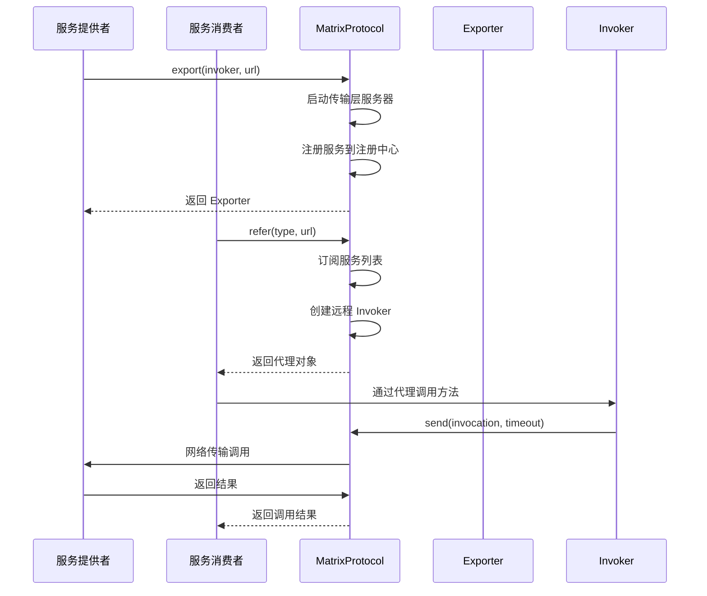
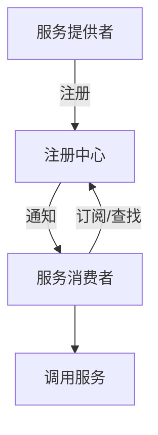
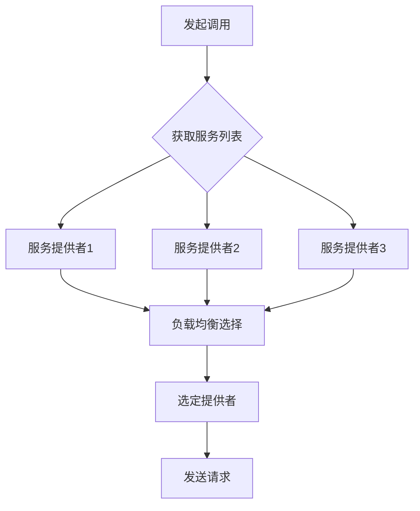
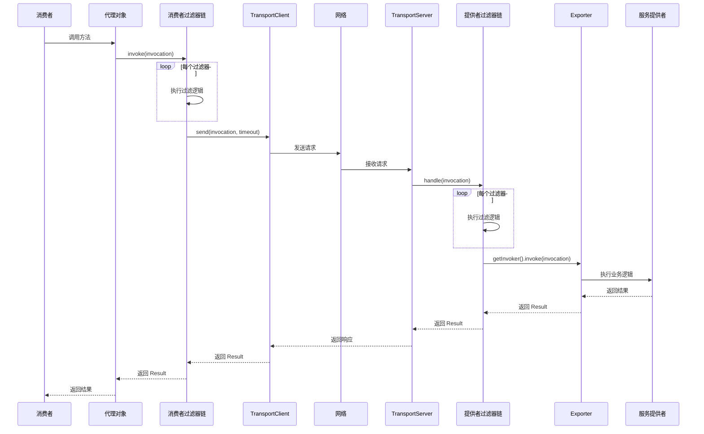

# 核心概念

<cite>
**本文档中引用的文件**  
- [URL.java](file://matrix-rpc-common/src/main/java/io/homeey/matrix/rpc/common/URL.java)
- [Result.java](file://matrix-rpc-common/src/main/java/io/homeey/matrix/rpc/common/Result.java)
- [Invocation.java](file://matrix-rpc-core/src/main/java/io/homeey/matrix/rpc/core/Invocation.java)
- [SimpleInvocation.java](file://matrix-rpc-core/src/main/java/io/homeey/matrix/rpc/core/SimpleInvocation.java)
- [Invoker.java](file://matrix-rpc-core/src/main/java/io/homeey/matrix/rpc/core/Invoker.java)
- [Exporter.java](file://matrix-rpc-core/src/main/java/io/homeey/matrix/rpc/core/Exporter.java)
- [Protocol.java](file://matrix-rpc-core/src/main/java/io/homeey/matrix/rpc/core/Protocol.java)
- [MatrixProtocol.java](file://matrix-rpc-runtime/src/main/java/io/homeey/matrix/rpc/runtime/MatrixProtocol.java)
- [RpcReference.java](file://matrix-rpc-runtime/src/main/java/io/homeey/matrix/rpc/runtime/RpcReference.java)
- [RpcService.java](file://matrix-rpc-runtime/src/main/java/io/homeey/matrix/rpc/runtime/RpcService.java)
- [Filter.java](file://matrix-rpc-filter/matrix-rpc-filter-api/src/main/java/io/homeey/matrix/rpc/filter/Filter.java)
- [EchoService.java](file://matrix-rpc-examples/src/main/java/io/homeey/matrix/rpc/example/api/EchoService.java)
- [ConsumerMain.java](file://matrix-rpc-examples/src/main/java/io/homeey/matrix/rpc/example/consumer/ConsumerMain.java)
- [ProviderMain.java](file://matrix-rpc-examples/src/main/java/io/homeey/matrix/rpc/example/provider/ProviderMain.java)
</cite>

## 目录
1. [引言](#引言)
2. [服务暴露与引用](#服务暴露与引用)
3. [服务注册与发现](#服务注册与发现)
4. [负载均衡](#负载均衡)
5. [过滤器链](#过滤器链)
6. [URL：配置总线](#url配置总线)
7. [Invocation：调用信息封装](#invocation调用信息封装)
8. [Result：调用结果承载](#result调用结果承载)
9. [核心组件协同工作流程](#核心组件协同工作流程)
10. [总结](#总结)

## 引言

Matrix RPC 是一个轻量级、高性能的远程过程调用（RPC）框架，旨在简化分布式服务之间的通信。其设计遵循“约定优于配置”的原则，通过高度模块化和可扩展的架构，支持服务暴露、引用、注册、发现、负载均衡和过滤器链等核心功能。

本文档深入探讨 Matrix RPC 的核心概念，重点介绍 `URL` 作为配置总线的角色、`Invocation` 对象如何封装调用信息、`Result` 对象如何承载调用结果或异常，以及这些核心概念如何协同工作，构成框架的基础。文档内容兼顾初学者的易理解性和高级用户的深度技术分析。

**本节不分析具体源文件，因此不提供来源**

## 服务暴露与引用

在 Matrix RPC 中，“服务暴露”（Export）和“服务引用”（Refer）是两个最基础的操作，分别对应服务提供者（Provider）和消费者（Consumer）的角色。

- **服务暴露**：服务提供者将其实现的接口通过网络暴露出去，使其可以被远程调用。这通常通过 `RpcService.export()` 方法完成。
- **服务引用**：服务消费者获取一个远程服务的本地代理对象，通过该代理像调用本地方法一样发起远程调用。这通常通过 `RpcReference.refer()` 方法完成。

这两个操作的核心是 `Protocol` 接口，它定义了 `export` 和 `refer` 两个方法。`MatrixProtocol` 是 `Protocol` 的具体实现，负责处理服务的导出和引用逻辑。

**Diagram sources**
- [Protocol.java](file://matrix-rpc-core/src/main/java/io/homeey/matrix/rpc/core/Protocol.java)
- [MatrixProtocol.java](file://matrix-rpc-runtime/src/main/java/io/homeey/matrix/rpc/runtime/MatrixProtocol.java)
- [RpcService.java](file://matrix-rpc-runtime/src/main/java/io/homeey/matrix/rpc/runtime/RpcService.java)
- [RpcReference.java](file://matrix-rpc-runtime/src/main/java/io/homeey/matrix/rpc/runtime/RpcReference.java)

**Section sources**
- [Protocol.java](file://matrix-rpc-core/src/main/java/io/homeey/matrix/rpc/core/Protocol.java#L15-L25)
- [MatrixProtocol.java](file://matrix-rpc-runtime/src/main/java/io/homeey/matrix/rpc/runtime/MatrixProtocol.java#L53-L86)
- [MatrixProtocol.java](file://matrix-rpc-runtime/src/main/java/io/homeey/matrix/rpc/runtime/MatrixProtocol.java#L89-L128)
- [RpcService.java](file://matrix-rpc-runtime/src/main/java/io/homeey/matrix/rpc/runtime/RpcService.java#L135-L162)
- [RpcReference.java](file://matrix-rpc-runtime/src/main/java/io/homeey/matrix/rpc/runtime/RpcReference.java#L101-L130)

## 服务注册与发现

服务注册与发现是实现动态服务调用的关键机制。Matrix RPC 通过 `Registry` 和 `RegistryFactory` 接口支持多种注册中心（如 Nacos、内存注册中心等）。

- **服务注册**：当服务被暴露时，`MatrixProtocol` 会调用 `Registry.register(url)` 方法，将服务的 URL 信息注册到注册中心。
- **服务发现**：当消费者引用服务时，`MatrixProtocol` 会调用 `Registry.subscribe()` 订阅服务列表，并通过 `Registry.lookup()` 获取当前可用的服务提供者列表。

这种机制使得服务消费者无需硬编码服务提供者的地址，实现了服务的动态发现和故障转移。

**Diagram sources**
- [Registry.java](file://matrix-rpc-registry/matrix-rpc-register-api/src/main/java/io/homeey/matrix/rpc/registry/api/Registry.java)
- [MatrixProtocol.java](file://matrix-rpc-runtime/src/main/java/io/homeey/matrix/rpc/runtime/MatrixProtocol.java#L70-L71)
- [MatrixProtocol.java](file://matrix-rpc-runtime/src/main/java/io/homeey/matrix/rpc/runtime/MatrixProtocol.java#L92-L95)

**Section sources**
- [MatrixProtocol.java](file://matrix-rpc-runtime/src/main/java/io/homeey/matrix/rpc/runtime/MatrixProtocol.java#L69-L71)
- [MatrixProtocol.java](file://matrix-rpc-runtime/src/main/java/io/homeey/matrix/rpc/runtime/MatrixProtocol.java#L90-L99)

## 负载均衡

当一个服务有多个提供者时，负载均衡策略决定了如何选择其中一个提供者来处理请求。Matrix RPC 的负载均衡发生在消费者端。

在 `MatrixProtocol.refer()` 方法中，创建的 `Invoker` 在 `invoke()` 时，会调用 `selectProvider()` 方法，从服务列表中选择一个提供者。目前的实现是简单的随机选择，但框架设计允许通过扩展 `LoadBalance` 接口来实现更复杂的策略（如轮询、最少活跃调用等）。

**Diagram sources**
- [MatrixProtocol.java](file://matrix-rpc-runtime/src/main/java/io/homeey/matrix/rpc/runtime/MatrixProtocol.java#L159-L162)
- [LoadBalance.java](file://matrix-rpc-cluster/matrix-rpc-cluster-api/src/main/java/io/homeey/matrix/rpc/cluster/api/LoadBalance.java)

**Section sources**
- [MatrixProtocol.java](file://matrix-rpc-runtime/src/main/java/io/homeey/matrix/rpc/runtime/MatrixProtocol.java#L106-L113)

## 过滤器链

过滤器链（Filter Chain）是 Matrix RPC 实现横切关注点（如日志记录、异常处理、超时控制）的核心机制。它采用责任链模式，在调用前后对请求和响应进行拦截和处理。

- **提供者端过滤器**：在服务被调用前和返回后执行，如 `ExceptionFilter` 捕获异常，`AccessLogFilter` 记录访问日志。
- **消费者端过滤器**：在发起调用前和收到响应后执行，如 `TimeoutFilter` 控制调用超时。

`FilterChainBuilder` 负责根据配置构建过滤器链，并将 `Invoker` 包装在过滤器链中。每个 `Filter` 都实现了 `invoke` 方法，在其中可以执行前置逻辑、调用下一个 `Invoker`，并执行后置逻辑。

**Diagram sources**
- [Filter.java](file://matrix-rpc-filter/matrix-rpc-filter-api/src/main/java/io/homeey/matrix/rpc/filter/Filter.java)
- [FilterChainBuilder.java](file://matrix-rpc-runtime/src/main/java/io/homeey/matrix/rpc/runtime/support/FilterChainBuilder.java)
- [MatrixProtocol.java](file://matrix-rpc-runtime/src/main/java/io/homeey/matrix/rpc/runtime/MatrixProtocol.java#L62-L63)
- [MatrixProtocol.java](file://matrix-rpc-runtime/src/main/java/io/homeey/matrix/rpc/runtime/MatrixProtocol.java#L126-L127)

**Section sources**
- [Filter.java](file://matrix-rpc-filter/matrix-rpc-filter-api/src/main/java/io/homeey/matrix/rpc/filter/Filter.java#L1-L10)
- [FilterChainBuilder.java](file://matrix-rpc-runtime/src/main/java/io/homeey/matrix/rpc/runtime/support/FilterChainBuilder.java)
- [MatrixProtocol.java](file://matrix-rpc-runtime/src/main/java/io/homeey/matrix/rpc/runtime/MatrixProtocol.java#L62)
- [MatrixProtocol.java](file://matrix-rpc-runtime/src/main/java/io/homeey/matrix/rpc/runtime/MatrixProtocol.java#L126)

## URL：配置总线

`URL` 类是 Matrix RPC 的配置总线，它承载了服务调用所需的所有配置信息。其设计灵感来源于互联网的统一资源定位符（URL），格式为：`protocol://host:port/path?key1=value1&key2=value2`。

- **protocol**：协议类型，如 `matrix`。
- **host**：主机地址。
- **port**：端口号。
- **path**：服务路径，通常为接口的全限定名。
- **parameters**：参数集合，包含超时时间、分组、版本号等配置。

`URL` 对象贯穿于服务暴露、引用、注册、发现等各个环节，是框架内部传递配置信息的标准载体。例如，在 `RpcService.export()` 中，会根据配置构建 `URL` 对象，并将其传递给 `Protocol`。

**Section sources**
- [URL.java](file://matrix-rpc-common/src/main/java/io/homeey/matrix/rpc/common/URL.java#L12-L164)
- [RpcService.java](file://matrix-rpc-runtime/src/main/java/io/homeey/matrix/rpc/runtime/RpcService.java#L144-L150)
- [RpcReference.java](file://matrix-rpc-runtime/src/main/java/io/homeey/matrix/rpc/runtime/RpcReference.java#L108-L110)

## Invocation：调用信息封装

`Invocation` 接口是远程方法调用信息的封装。它包含了执行一次远程调用所需的所有元数据。

- **serviceName**：服务名称（接口名）。
- **methodName**：方法名称。
- **parameterTypes**：参数类型数组。
- **arguments**：参数值数组。
- **attachments**：附件信息，用于传递上下文数据（如分组、版本号）。

`SimpleInvocation` 是 `Invocation` 的一个具体实现。当消费者通过代理对象调用方法时，`InvokerInvocationHandler` 会将方法调用信息封装成一个 `Invocation` 对象，然后通过网络发送给服务提供者。

**Section sources**
- [Invocation.java](file://matrix-rpc-core/src/main/java/io/homeey/matrix/rpc/core/Invocation.java#L5-L41)
- [SimpleInvocation.java](file://matrix-rpc-core/src/main/java/io/homeey/matrix/rpc/core/SimpleInvocation.java#L8-L68)
- [InvokerInvocationHandler.java](file://matrix-rpc-proxy/matrix-rpc-proxy-jdk/src/main/java/io/homeey/matrix/rpc/proxy/jdk/InvokerInvocationHandler.java)

## Result：调用结果承载

`Result` 类用于承载远程调用的结果。它是一个不可变的最终类，设计简洁而高效。

- **value**：成功时返回的值。
- **exception**：失败时存储的异常对象。

`Result` 对象通过 `hasException()` 方法判断调用是否成功，并通过 `getValue()` 或 `getException()` 获取相应的结果。它在服务提供者端由 `Invoker` 创建（如 `createReflectiveInvoker` 中通过反射调用后封装结果），在消费者端由 `TransportClient` 解析响应后构建。

**Section sources**
- [Result.java](file://matrix-rpc-common/src/main/java/io/homeey/matrix/rpc/common/Result.java#L8-L53)
- [RpcService.java](file://matrix-rpc-runtime/src/main/java/io/homeey/matrix/rpc/runtime/RpcService.java#L179-L189)
- [NettyTransportClient.java](file://matrix-rpc-transport/matrix-rpc-transport-netty/src/main/java/io/homeey/matrix/rpc/transport/netty/client/NettyTransportClient.java)

## 核心组件协同工作流程

以下是 Matrix RPC 核心组件协同工作的完整流程图：

**Diagram sources**
- [RpcReference.java](file://matrix-rpc-runtime/src/main/java/io/homeey/matrix/rpc/runtime/RpcReference.java#L144-L145)
- [MatrixProtocol.java](file://matrix-rpc-runtime/src/main/java/io/homeey/matrix/rpc/runtime/MatrixProtocol.java#L131-L145)
- [MatrixProtocol.java](file://matrix-rpc-runtime/src/main/java/io/homeey/matrix/rpc/runtime/MatrixProtocol.java#L104-L122)
- [RpcService.java](file://matrix-rpc-runtime/src/main/java/io/homeey/matrix/rpc/runtime/RpcService.java#L178-L190)

**Section sources**
- [RpcReference.java](file://matrix-rpc-runtime/src/main/java/io/homeey/matrix/rpc/runtime/RpcReference.java)
- [MatrixProtocol.java](file://matrix-rpc-runtime/src/main/java/io/homeey/matrix/rpc/runtime/MatrixProtocol.java)
- [RpcService.java](file://matrix-rpc-runtime/src/main/java/io/homeey/matrix/rpc/runtime/RpcService.java)

## 总结

Matrix RPC 通过一系列精心设计的核心概念，构建了一个高效、灵活且易于使用的 RPC 框架。

- `URL` 作为配置总线，统一了配置信息的传递。
- `Invocation` 和 `Result` 分别封装了调用信息和调用结果，实现了调用过程的标准化。
- `Protocol`、`Invoker` 和 `Exporter` 定义了服务暴露与引用的核心契约。
- 服务注册与发现、负载均衡和过滤器链等机制，共同支撑了框架的分布式能力。

这些组件通过 SPI（Service Provider Interface）机制实现高度可扩展性，开发者可以轻松地替换或扩展协议、传输、序列化、注册中心等组件。整个框架的设计体现了高内聚、低耦合的原则，为构建健壮的分布式系统提供了坚实的基础。

**本节不分析具体源文件，因此不提供来源**