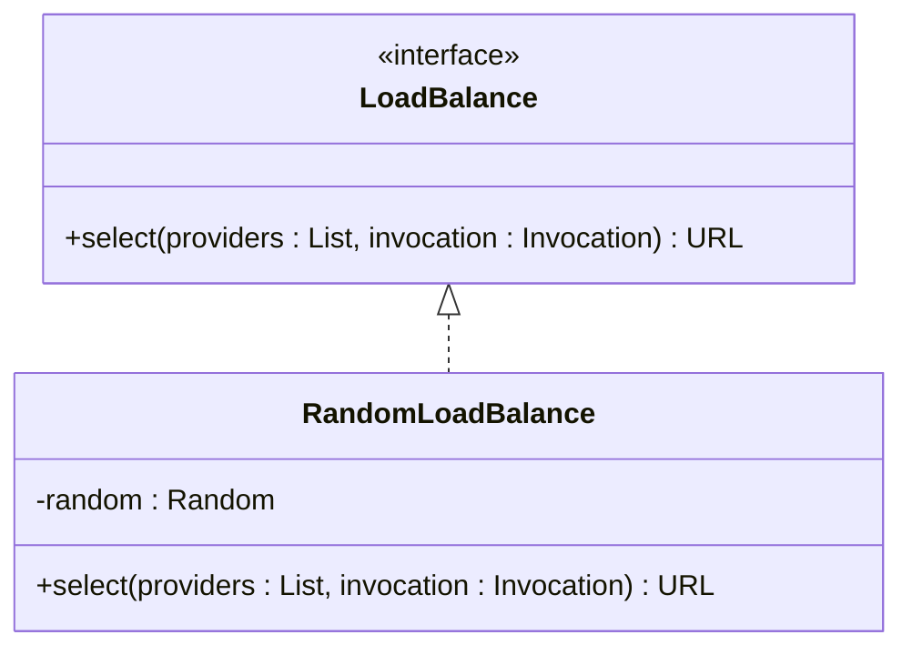
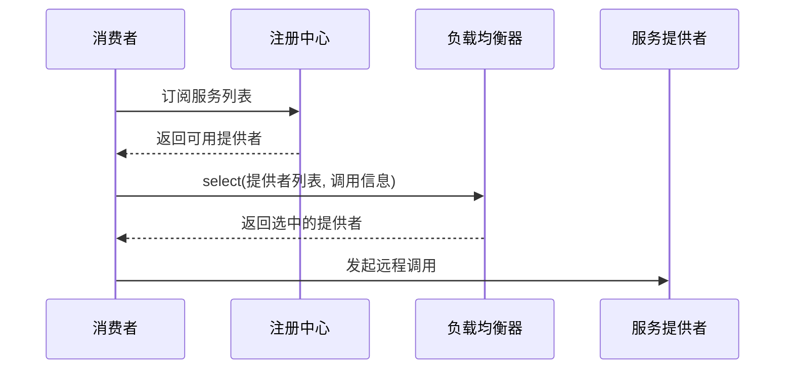

# 负载均衡

<cite>
**本文档中引用的文件**   
- [LoadBalance.java](file://matrix-rpc-cluster/matrix-rpc-cluster-api/src/main/java/io/homeey/matrix/rpc/cluster/api/LoadBalance.java)
- [RandomLoadBalance.java](file://matrix-rpc-cluster/matrix-rpc-cluster-loadbalance/src/main/java/io/homeey/matrix/rpc/cluster/loadbalance/RandomLoadBalance.java)
- [ExtensionLoader.java](file://matrix-rpc-spi/src/main/java/io/homeey/matrix/rpc/spi/ExtensionLoader.java)
- [URL.java](file://matrix-rpc-common/src/main/java/io/homeey/matrix/rpc/common/URL.java)
- [MatrixProtocol.java](file://matrix-rpc-runtime/src/main/java/io/homeey/matrix/rpc/runtime/MatrixProtocol.java)
- [io.homeey.matrix.rpc.cluster.api.LoadBalance](file://matrix-rpc-cluster/matrix-rpc-cluster-loadbalance/src/main/resources/META-INF/matrix/io.homeey.matrix.rpc.cluster.api.LoadBalance)
</cite>

## 目录
1. [引言](#引言)
2. [负载均衡接口设计](#负载均衡接口设计)
3. [随机负载均衡实现](#随机负载均衡实现)
4. [调用链中的位置](#调用链中的位置)
5. [SPI扩展机制](#spi扩展机制)
6. [策略配置方式](#策略配置方式)
7. [不同策略的适用场景](#不同策略的适用场景)
8. [性能影响分析](#性能影响分析)

## 引言
Matrix RPC框架提供了灵活的负载均衡机制，用于在集群环境下合理分配服务调用请求。该机制通过定义统一的`LoadBalance`接口，结合SPI扩展机制，实现了可插拔的负载均衡策略。本文将系统性地讲解其设计原理与实现细节。

## 负载均衡接口设计

`LoadBalance`接口是Matrix RPC中负载均衡机制的核心抽象，定义了从服务提供者列表中选择目标节点的基本契约。该接口位于`matrix-rpc-cluster-api`模块中，采用SPI机制进行扩展管理。

接口的核心方法`select`接收两个参数：服务提供者的URL列表和当前调用的上下文信息（`Invocation`），返回选中的服务提供者URL。这种设计使得负载均衡器可以根据调用的具体方法、参数等上下文信息做出更智能的选择决策。

**Section sources**
- [LoadBalance.java](file://matrix-rpc-cluster/matrix-rpc-cluster-api/src/main/java/io/homeey/matrix/rpc/cluster/api/LoadBalance.java#L1-L18)

## 随机负载均衡实现

`RandomLoadBalance`是Matrix RPC提供的默认负载均衡实现，位于`matrix-rpc-cluster-loadbalance`模块中。其实现逻辑简洁高效，遵循了典型的随机选择策略：

1. 当服务提供者列表为空时，抛出异常提示无可用服务
2. 当只有一个服务提供者时，直接返回该实例（无需选择）
3. 当存在多个服务提供者时，使用`java.util.Random`生成随机索引，从列表中选取目标节点

该实现通过`@Activate`注解标记，表明其为自动激活的扩展实现，可在消费者端自动加载。随机策略的优点是实现简单、开销小，且在服务提供者性能相近时能实现较为均匀的负载分布。



**Diagram sources **
- [LoadBalance.java](file://matrix-rpc-cluster/matrix-rpc-cluster-api/src/main/java/io/homeey/matrix/rpc/cluster/api/LoadBalance.java#L1-L18)
- [RandomLoadBalance.java](file://matrix-rpc-cluster/matrix-rpc-cluster-loadbalance/src/main/java/io/homeey/matrix/rpc/cluster/loadbalance/RandomLoadBalance.java#L1-L25)

**Section sources**
- [RandomLoadBalance.java](file://matrix-rpc-cluster/matrix-rpc-cluster-loadbalance/src/main/java/io/homeey/matrix/rpc/cluster/loadbalance/RandomLoadBalance.java#L1-L25)

## 调用链中的位置

负载均衡器在Matrix RPC的调用链中扮演着关键角色，其执行时机位于服务发现之后、远程调用之前。具体流程如下：

1. 服务消费者通过注册中心获取当前可用的服务提供者列表
2. 在发起远程调用前，调用`LoadBalance`的`select`方法选择具体的目标节点
3. 使用选中的服务提供者URL建立连接并发送请求

在`MatrixProtocol`的`refer`方法中，创建的`Invoker`在`invoke`调用时会先获取服务提供者列表，然后通过`selectProvider`（当前为简化实现）选择目标节点，最后通过`TransportClient`发送请求。这一设计确保了负载均衡逻辑与协议传输、网络通信等关注点的分离。



**Diagram sources **
- [MatrixProtocol.java](file://matrix-rpc-runtime/src/main/java/io/homeey/matrix/rpc/runtime/MatrixProtocol.java#L90-L128)

**Section sources**
- [MatrixProtocol.java](file://matrix-rpc-runtime/src/main/java/io/homeey/matrix/rpc/runtime/MatrixProtocol.java#L90-L128)

## SPI扩展机制

Matrix RPC通过自研的SPI（Service Provider Interface）机制实现了负载均衡策略的可扩展性。核心组件是`ExtensionLoader`，它负责：

1. 扫描`META-INF/matrix/`和`META-INF/services/`目录下的扩展配置文件
2. 根据接口类型加载对应的实现类映射
3. 按需实例化并缓存扩展对象

对于`LoadBalance`接口，框架会在`META-INF/matrix/io.homeey.matrix.rpc.cluster.api.LoadBalance`文件中定义扩展名与实现类的映射关系。例如，`random=io.homeey.matrix.rpc.cluster.loadbalance.RandomLoadBalance`表示"random"策略对应`RandomLoadBalance`类。

`ExtensionLoader`还支持默认扩展、自适应扩展等高级特性，并通过`@SPI`注解标记接口，`@Activate`注解控制扩展的自动激活行为。这种设计使得开发者可以轻松添加新的负载均衡算法而无需修改框架核心代码。

```mermaid
flowchart TD
A["加载扩展配置文件\nMETA-INF/matrix/"] --> B{解析配置}
B --> C["random=RandomLoadBalance"]
B --> D["roundrobin=RoundRobinLoadBalance"]
B --> E["leastactive=LeastActiveLoadBalance"]
C --> F[getExtension("random")]
D --> G[getExtension("roundrobin")]
E --> H[getExtension("leastactive")]
F --> I[创建RandomLoadBalance实例]
G --> J[创建RoundRobinLoadBalance实例]
H --> K[创建LeastActiveLoadBalance实例]
```

**Diagram sources **
- [ExtensionLoader.java](file://matrix-rpc-spi/src/main/java/io/homeey/matrix/rpc/spi/ExtensionLoader.java#L1-L231)
- [io.homeey.matrix.rpc.cluster.api.LoadBalance](file://matrix-rpc-cluster/matrix-rpc-cluster-loadbalance/src/main/resources/META-INF/matrix/io.homeey.matrix.rpc.cluster.api.LoadBalance#L1)

**Section sources**
- [ExtensionLoader.java](file://matrix-rpc-spi/src/main/java/io/homeey/matrix/rpc/spi/ExtensionLoader.java#L1-L231)
- [io.homeey.matrix.rpc.cluster.api.LoadBalance](file://matrix-rpc-cluster/matrix-rpc-cluster-loadbalance/src/main/resources/META-INF/matrix/io.homeey.matrix.rpc.cluster.api.LoadBalance#L1)

## 策略配置方式

在Matrix RPC中，可以通过URL参数指定具体的负载均衡策略。服务消费者在引用服务时，可以在URL中添加`loadbalance`参数来选择策略，例如：

```
dubbo://localhost:20880/com.example.Service?loadbalance=random
```

框架在创建`Invoker`时会从URL中读取`loadbalance`参数值，然后通过`ExtensionLoader`获取对应的`LoadBalance`实例。如果未指定该参数，则使用`LoadBalance`接口上`@SPI`注解定义的默认策略。

这种基于URL参数的配置方式具有以下优势：
- 配置灵活，可针对不同服务使用不同策略
- 与服务发现机制无缝集成，配置信息可随服务元数据一起存储
- 支持动态更新，服务提供者变更时可重新应用配置

**Section sources**
- [URL.java](file://matrix-rpc-common/src/main/java/io/homeey/matrix/rpc/common/URL.java#L1-L164)
- [MatrixProtocol.java](file://matrix-rpc-runtime/src/main/java/io/homeey/matrix/rpc/runtime/MatrixProtocol.java#L90-L128)

## 不同策略的适用场景

虽然当前代码库中仅实现了`RandomLoadBalance`，但基于SPI架构可以轻松扩展其他策略，不同策略适用于不同的业务场景：

- **随机策略（Random）**：适用于服务提供者性能相近、网络环境稳定的场景。实现简单，开销最小，是默认推荐策略。
- **轮询策略（RoundRobin）**：适用于需要严格均匀分配请求的场景，能保证长时间内每个节点处理的请求数基本相同。
- **最少活跃调用策略（LeastActive）**：适用于处理时间差异较大的场景，优先选择当前处理请求数最少的节点，有助于实现更真实的负载均衡。
- **一致性哈希策略（ConsistentHash）**：适用于需要会话保持的场景，相同参数的请求总是路由到同一节点，有利于缓存亲和性。

选择合适的策略需要综合考虑服务特性、节点性能、网络状况和业务需求等因素。

## 性能影响分析

负载均衡策略的选择对系统性能有重要影响：

- **计算开销**：随机策略的计算复杂度为O(1)，性能最优；而最少活跃调用等策略需要维护状态信息，计算开销相对较大。
- **网络延迟**：合理的负载均衡能避免单点过载，减少因节点繁忙导致的超时重试，从而降低整体延迟。
- **资源利用率**：良好的负载均衡策略能提高集群整体资源利用率，避免部分节点闲置而其他节点过载。
- **扩展性**：基于SPI的插件化设计保证了负载均衡机制的扩展性，新策略的引入不会影响现有系统稳定性。

在高并发场景下，建议选择计算开销小的策略（如随机或轮询），并确保服务提供者节点性能尽量均衡，以获得最佳的整体性能表现。