# 路由机制

<cite>
**本文档引用的文件**  
- [Router.java](file://matrix-rpc-cluster/matrix-rpc-cluster-api/src/main/java/io/homeey/matrix/rpc/cluster/api/Router.java)
- [RouteRule.java](file://matrix-rpc-cluster/matrix-rpc-cluster-api/src/main/java/io/homeey/matrix/rpc/cluster/api/RouteRule.java)
- [TagRouter.java](file://matrix-rpc-cluster/matrix-rpc-cluster-router/src/main/java/io/homeey/matrix/rpc/cluster/router/TagRouter.java)
- [ConditionRouter.java](file://matrix-rpc-cluster/matrix-rpc-cluster-router/src/main/java/io/homeey/matrix/rpc/cluster/router/ConditionRouter.java)
- [DynamicRouter.java](file://matrix-rpc-cluster/matrix-rpc-cluster-router/src/main/java/io/homeey/matrix/rpc/cluster/router/DynamicRouter.java)
- [ConfigCenter.java](file://matrix-rpc-cluster/matrix-rpc-cluster-api/src/main/java/io/homeey/matrix/rpc/cluster/api/ConfigCenter.java)
- [MemoryConfigCenter.java](file://matrix-rpc-cluster/matrix-rpc-cluster-router/src/main/java/io/homeey/matrix/rpc/cluster/router/MemoryConfigCenter.java)
- [ExtensionLoader.java](file://matrix-rpc-spi/src/main/java/io/homeey/matrix/rpc/spi/ExtensionLoader.java)
- [MatrixProtocol.java](file://matrix-rpc-runtime/src/main/java/io/homeey/matrix/rpc/runtime/MatrixProtocol.java)
- [URL.java](file://matrix-rpc-core/src/main/java/io/homeey/matrix/rpc/core/URL.java)
- [Invocation.java](file://matrix-rpc-core/src/main/java/io/homeey/matrix/rpc/core/Invocation.java)
</cite>

## 目录
1. [简介](#简介)
2. [核心组件](#核心组件)
3. [路由规则](#路由规则)
4. [路由实现](#路由实现)
5. [动态路由](#动态路由)
6. [SPI扩展机制](#spi扩展机制)
7. [架构流程](#架构流程)
8. [配置与使用](#配置与使用)
9. [总结](#总结)

## 简介
Matrix-RPC框架的路由机制旨在实现服务调用过程中的智能流量分发。该机制支持基于标签、条件和动态配置的多种路由策略，为灰度发布、A/B测试、流量隔离等场景提供技术支持。路由系统设计遵循职责单一原则，通过SPI扩展机制实现高度可定制化。

## 核心组件

Matrix-RPC的路由机制由多个核心接口和实现类构成，形成完整的路由体系。

**组件关系图**
```mermaid
classDiagram
class Router {
<<interface>>
+int getPriority()
+URL[] route(URL[], Invocation)
+boolean isEnabled()
}
class ConfigCenter {
<<interface>>
+void init(String)
+RouteRule[] getRouteRules(String)
+void addListener(String, Consumer~RouteRule[]~)
+void removeListener(String)
+void publishRouteRules(String, RouteRule[])
+void close()
}
class RouteRule {
-String name
-int priority
-boolean enabled
-Condition[] conditions
-Action action
-String description
-long createTime
-long updateTime
+getters/setters
}
class RouteRule$Condition {
-String key
-Operator operator
-String value
+getters/setters
}
class RouteRule$Action {
-ActionType type
-String target
-boolean force
+getters/setters
}
class RouteRule$Operator {
<<enumeration>>
EQUAL
NOT_EQUAL
CONTAINS
REGEX
GREATER_THAN
LESS_THAN
}
class RouteRule$ActionType {
<<enumeration>>
FILTER
EXCLUDE
WEIGHT
}
class TagRouter {
+int getPriority()
+URL[] route(URL[], Invocation)
+boolean isEnabled()
}
class ConditionRouter {
+int getPriority()
+URL[] route(URL[], Invocation)
+boolean isEnabled()
+void setRules(RouteRule[])
+void addRule(RouteRule)
+void removeRule(String)
}
class DynamicRouter {
+int getPriority()
+URL[] route(URL[], Invocation)
+boolean isEnabled()
+void subscribeRules(String)
+void setEnabled(boolean)
}
Router <|-- TagRouter
Router <|-- ConditionRouter
Router <|-- DynamicRouter
DynamicRouter --> ConditionRouter : "委托"
DynamicRouter --> ConfigCenter : "依赖"
ConditionRouter --> RouteRule : "使用"
```

**组件来源**
- [Router.java](file://matrix-rpc-cluster/matrix-rpc-cluster-api/src/main/java/io/homeey/matrix/rpc/cluster/api/Router.java)
- [RouteRule.java](file://matrix-rpc-cluster/matrix-rpc-cluster-api/src/main/java/io/homeey/matrix/rpc/cluster/api/RouteRule.java)
- [TagRouter.java](file://matrix-rpc-cluster/matrix-rpc-cluster-router/src/main/java/io/homeey/matrix/rpc/cluster/router/TagRouter.java)
- [ConditionRouter.java](file://matrix-rpc-cluster/matrix-rpc-cluster-router/src/main/java/io/homeey/matrix/rpc/cluster/router/ConditionRouter.java)
- [DynamicRouter.java](file://matrix-rpc-cluster/matrix-rpc-cluster-router/src/main/java/io/homeey/matrix/rpc/cluster/router/DynamicRouter.java)
- [ConfigCenter.java](file://matrix-rpc-cluster/matrix-rpc-cluster-api/src/main/java/io/homeey/matrix/rpc/cluster/api/ConfigCenter.java)

## 路由规则

路由规则是Matrix-RPC路由机制的核心数据结构，定义了服务流量的分发逻辑。

**规则结构**
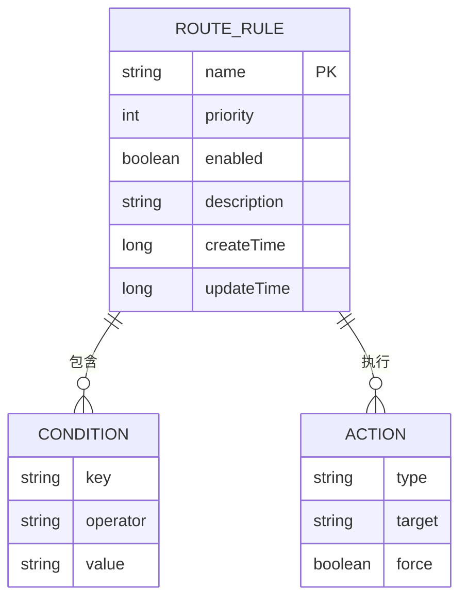

**规则示例**
```yaml
- name: gray-routing
  priority: 10
  enabled: true
  conditions:
    - key: tag
      operator: EQUAL
      value: gray
  action:
    type: FILTER
    target: tag=gray

- name: method-routing
  priority: 20
  enabled: true
  conditions:
    - key: method
      operator: EQUAL
      value: getUserInfo
  action:
    type: FILTER
    target: host=192.168.1.100
```

**规则字段说明**

| 字段 | 类型 | 描述 | 示例 |
|------|------|------|------|
| **name** | 字符串 | 规则名称（唯一标识） | "gray-routing" |
| **priority** | 整数 | 优先级（数字越小优先级越高） | 10 |
| **enabled** | 布尔值 | 是否启用 | true |
| **conditions** | 条件列表 | 匹配条件列表（AND关系） | [{key: "tag", operator: "EQUAL", value: "gray"}] |
| **action** | 动作 | 路由动作 | {type: "FILTER", target: "tag=gray"} |
| **description** | 字符串 | 规则描述 | "灰度发布规则" |
| **createTime** | 长整型 | 创建时间 | 1736543210000 |
| **updateTime** | 长整型 | 更新时间 | 1736543210000 |

**条件操作符**

| 操作符 | 描述 | 示例 |
|--------|------|------|
| **EQUAL** | 等于 | tag=gray |
| **NOT_EQUAL** | 不等于 | tag!=prod |
| **CONTAINS** | 包含 | tag.contains("gray") |
| **REGEX** | 正则匹配 | host=~192\.168\.\d+\.\d+ |
| **GREATER_THAN** | 大于 | weight>100 |
| **LESS_THAN** | 小于 | weight<200 |

**动作类型**

| 类型 | 描述 | 示例 |
|------|------|------|
| **FILTER** | 过滤（保留匹配的实例） | 保留tag=gray的实例 |
| **EXCLUDE** | 排除（移除匹配的实例） | 移除tag=dev的实例 |
| **WEIGHT** | 权重调整 | 调整实例权重为200 |

**组件来源**
- [RouteRule.java](file://matrix-rpc-cluster/matrix-rpc-cluster-api/src/main/java/io/homeey/matrix/rpc/cluster/api/RouteRule.java)

## 路由实现

Matrix-RPC提供了多种路由实现，满足不同场景的需求。

### 标签路由 (TagRouter)

标签路由是最简单的路由策略，通过服务实例的标签进行流量分发。

**执行流程**
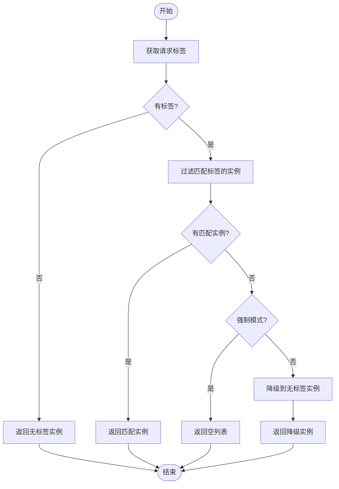

**使用示例**
```java
// Provider端设置标签
RpcService.export(EchoService.class, new EchoServiceImpl(), 20880)
    .tag("gray")  // 设置为灰度实例
    .await();

// Consumer端指定标签
RpcReference.create(EchoService.class)
    .address("localhost", 20880)
    .tag("gray")  // 只调用灰度实例
    .get();
```

### 条件路由 (ConditionRouter)

条件路由支持基于请求参数、方法名等条件的复杂路由逻辑。

**执行流程**
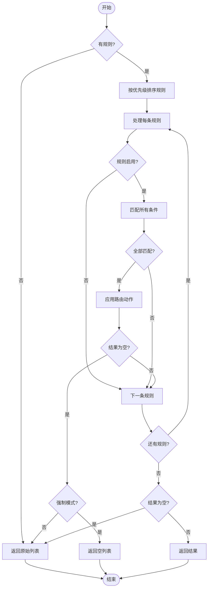

**条件支持**
- **method**: 方法名
- **param.\***: 方法参数
- **tag**: 请求标签
- **host**: 服务端主机

**组件来源**
- [TagRouter.java](file://matrix-rpc-cluster/matrix-rpc-cluster-router/src/main/java/io/homeey/matrix/rpc/cluster/router/TagRouter.java)
- [ConditionRouter.java](file://matrix-rpc-cluster/matrix-rpc-cluster-router/src/main/java/io/homeey/matrix/rpc/cluster/router/ConditionRouter.java)

## 动态路由

动态路由通过配置中心实现路由规则的热更新，无需重启服务即可修改路由策略。

### 配置中心接口

**ConfigCenter接口**
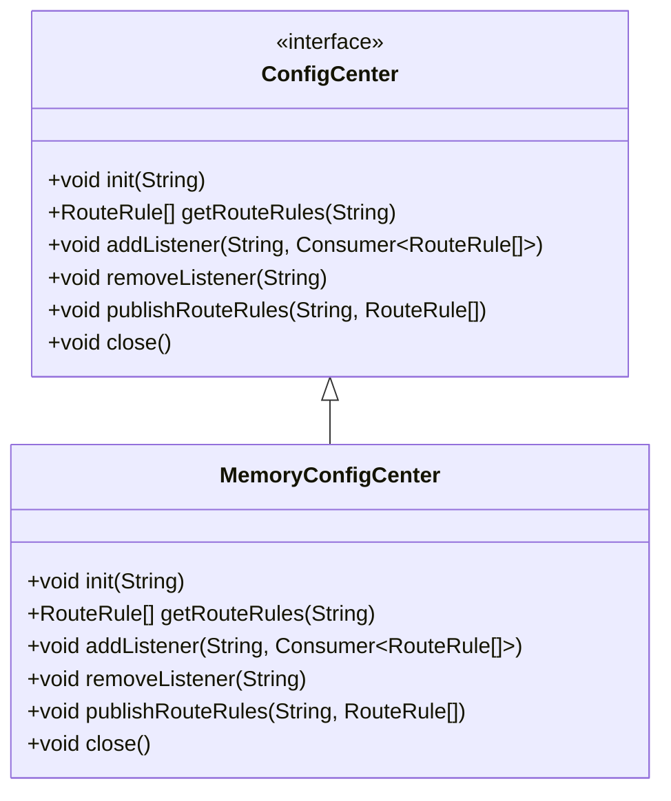

### 动态路由实现

**DynamicRouter架构**
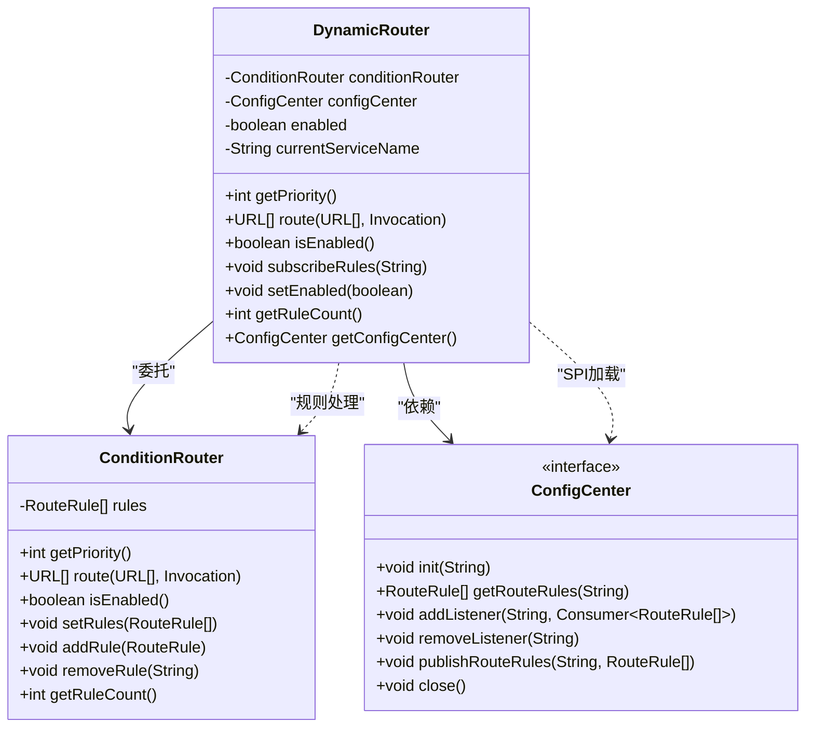

**初始化流程**
```mermaid
sequenceDiagram
participant DynamicRouter
participant ExtensionLoader
participant ConfigCenter
participant MemoryConfigCenter
DynamicRouter->>DynamicRouter : 构造函数
DynamicRouter->>DynamicRouter : initConfigCenter()
DynamicRouter->>System : 获取matrix.config.center属性
System-->>DynamicRouter : "memory : //localhost"
DynamicRouter->>ExtensionLoader : getExtensionLoader(ConfigCenter.class)
ExtensionLoader->>ExtensionLoader : getExtension("memory")
ExtensionLoader-->>DynamicRouter : MemoryConfigCenter实例
DynamicRouter->>MemoryConfigCenter : init("memory : //localhost")
MemoryConfigCenter-->>DynamicRouter : 初始化完成
DynamicRouter-->> : 动态路由器就绪
```

**规则订阅流程**
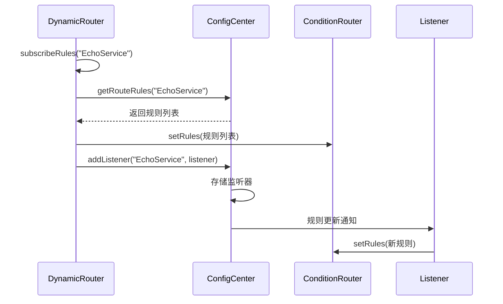

**组件来源**
- [DynamicRouter.java](file://matrix-rpc-cluster/matrix-rpc-cluster-router/src/main/java/io/homeey/matrix/rpc/cluster/router/DynamicRouter.java)
- [ConfigCenter.java](file://matrix-rpc-cluster/matrix-rpc-cluster-api/src/main/java/io/homeey/matrix/rpc/cluster/api/ConfigCenter.java)
- [MemoryConfigCenter.java](file://matrix-rpc-cluster/matrix-rpc-cluster-router/src/main/java/io/homeey/matrix/rpc/cluster/router/MemoryConfigCenter.java)

## SPI扩展机制

Matrix-RPC使用SPI（Service Provider Interface）机制实现组件的可扩展性。

### SPI核心组件

**ExtensionLoader类**
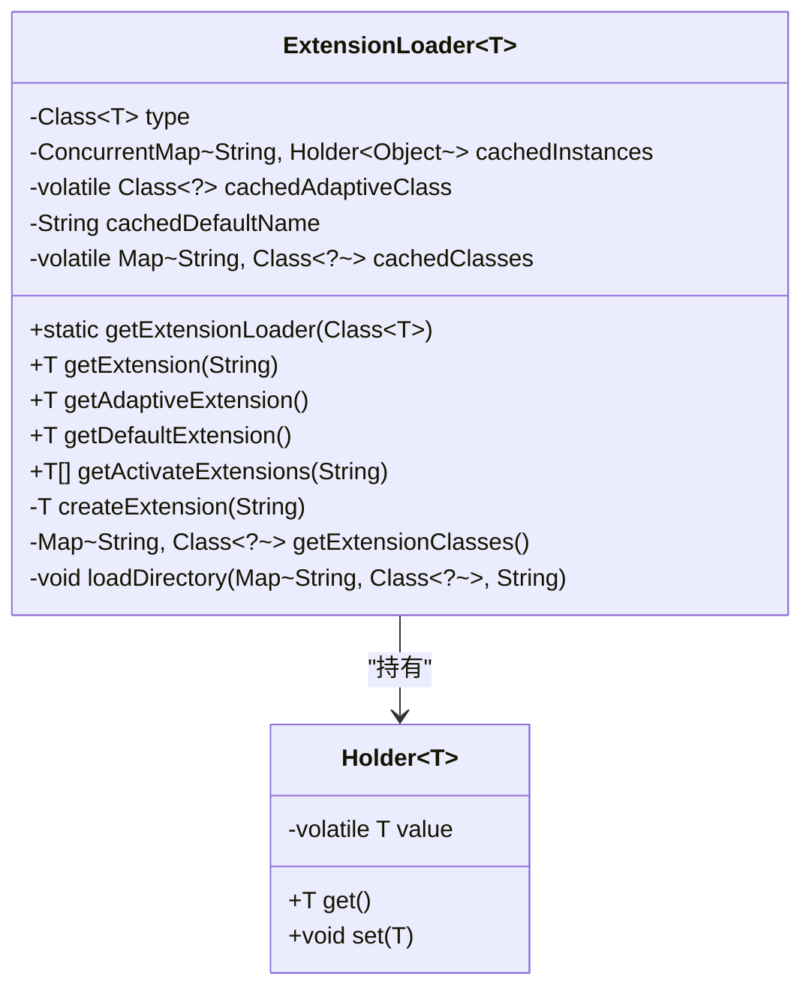

### 路由器加载流程

**SPI加载过程**
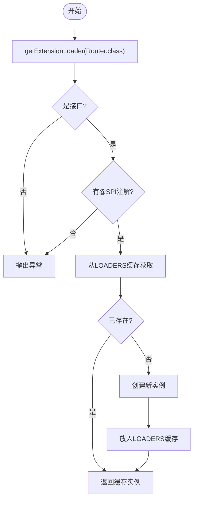

### 扩展配置文件

**路由器SPI配置**
```
# 文件: META-INF/matrix/io.homeey.matrix.rpc.cluster.api.Router
tag=io.homeey.matrix.rpc.cluster.router.TagRouter
condition=io.homeey.matrix.rpc.cluster.router.ConditionRouter
dynamic=io.homeey.matrix.rpc.cluster.router.DynamicRouter
```

**配置中心SPI配置**
```
# 文件: META-INF/matrix/io.homeey.matrix.rpc.cluster.api.ConfigCenter
memory=io.homeey.matrix.rpc.cluster.router.MemoryConfigCenter
```

**激活机制**
```java
@Activate(order = 10)
public class TagRouter implements Router { /* ... */ }

@Activate(order = 20)
public class ConditionRouter implements Router { /* ... */ }

@Activate(order = 15)
public class DynamicRouter implements Router { /* ... */ }
```

**组件来源**
- [ExtensionLoader.java](file://matrix-rpc-spi/src/main/java/io/homeey/matrix/rpc/spi/ExtensionLoader.java)
- [Router.java](file://matrix-rpc-cluster/matrix-rpc-cluster-api/src/main/java/io/homeey/matrix/rpc/cluster/api/Router.java)
- [DynamicRouter.java](file://matrix-rpc-cluster/matrix-rpc-cluster-router/src/main/java/io/homeey/matrix/rpc/cluster/router/DynamicRouter.java)
- [TagRouter.java](file://matrix-rpc-cluster/matrix-rpc-cluster-router/src/main/java/io/homeey/matrix/rpc/cluster/router/TagRouter.java)

## 架构流程

### 路由调用流程

**整体调用流程**
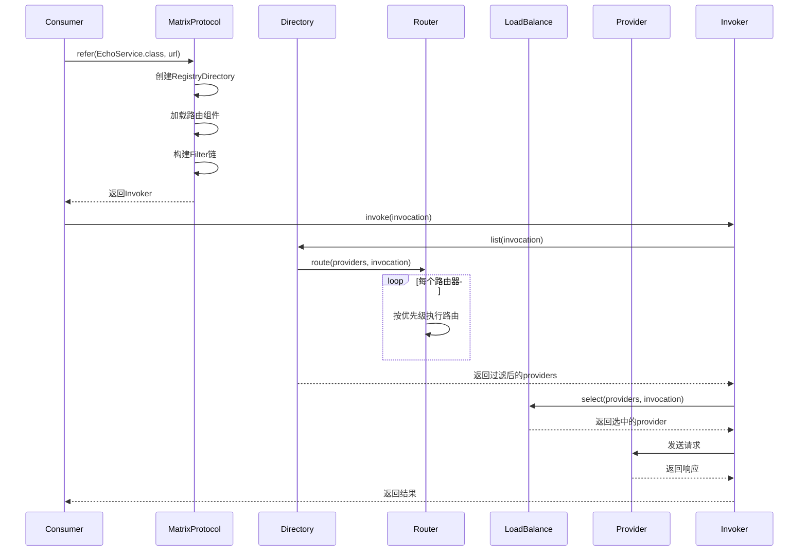

### 路由器优先级

**路由器执行顺序**
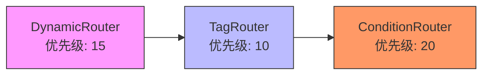

**优先级说明**
- **DynamicRouter**: 15
- **TagRouter**: 10 (最高优先级)
- **ConditionRouter**: 20

### URL与Invocation

**URL结构**
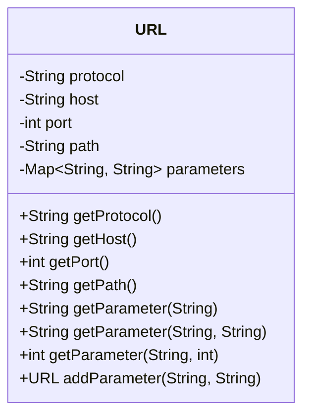

**Invocation结构**
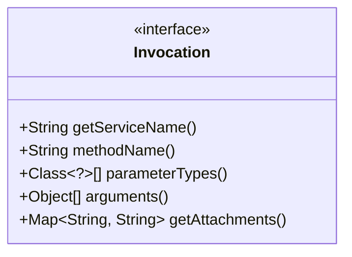

**组件来源**
- [MatrixProtocol.java](file://matrix-rpc-runtime/src/main/java/io/homeey/matrix/rpc/runtime/MatrixProtocol.java)
- [URL.java](file://matrix-rpc-core/src/main/java/io/homeey/matrix/rpc/core/URL.java)
- [Invocation.java](file://matrix-rpc-core/src/main/java/io/homeey/matrix/rpc/core/Invocation.java)

## 配置与使用

### 配置方式

**系统属性配置**
```java
// 配置配置中心
System.setProperty("matrix.config.center", "memory://localhost");

// 配置注册中心
System.setProperty("matrix.registry.address", "memory://localhost");
```

**URL参数配置**
```java
URL url = URL.valueOf("matrix://localhost:20880/io.homeey.example.EchoService" +
    "?loadbalance=random" +
    "&cluster=failover" +
    "&tag=gray" +
    "&timeout=3000");
```

### 使用示例

**服务提供者**
```java
// 启动服务并设置标签
RpcService.export(EchoService.class, new EchoServiceImpl(), 20880)
    .tag("gray")           // 设置灰度标签
    .group("example")      // 设置分组
    .version("1.0.0")      // 设置版本
    .await();              // 等待服务启动
```

**服务消费者**
```java
// 创建服务引用并指定路由参数
EchoService echoService = RpcReference.create(EchoService.class)
    .address("localhost", 20880)
    .tag("gray")           // 只调用灰度实例
    .attachment("user-id", "123")  // 添加请求附件
    .timeout(5000)         // 设置超时时间
    .get();                // 获取服务代理
```

**动态规则管理**
```java
// 创建内存配置中心
MemoryConfigCenter configCenter = new MemoryConfigCenter();
configCenter.init("memory://localhost");

// 创建路由规则
RouteRule rule = new RouteRule();
rule.setName("gray-routing");
rule.setPriority(10);
rule.setEnabled(true);

// 设置条件
List<RouteRule.Condition> conditions = new ArrayList<>();
RouteRule.Condition condition = new RouteRule.Condition();
condition.setKey("tag");
condition.setOperator(RouteRule.Operator.EQUAL);
condition.setValue("gray");
conditions.add(condition);
rule.setConditions(conditions);

// 设置动作
RouteRule.Action action = new RouteRule.Action();
action.setType(RouteRule.ActionType.FILTER);
action.setTarget("tag=gray");
action.setForce(false);
rule.setAction(action);

// 发布规则
configCenter.publishRouteRules("io.homeey.example.EchoService", 
    Collections.singletonList(rule));
```

## 总结

Matrix-RPC的路由机制具有以下特点：

1. **模块化设计**: 路由功能被分解为多个独立的组件，每个组件职责单一
2. **扩展性强**: 基于SPI机制，可以轻松添加新的路由策略
3. **灵活性高**: 支持静态配置和动态更新两种模式
4. **优先级控制**: 通过优先级机制确保路由规则的执行顺序
5. **降级机制**: 当没有匹配的实例时，支持降级到无标签实例
6. **强制模式**: 支持强制路由，不进行降级处理

该路由机制为微服务架构中的流量管理提供了强大的支持，能够满足灰度发布、A/B测试、多活部署等多种复杂场景的需求。