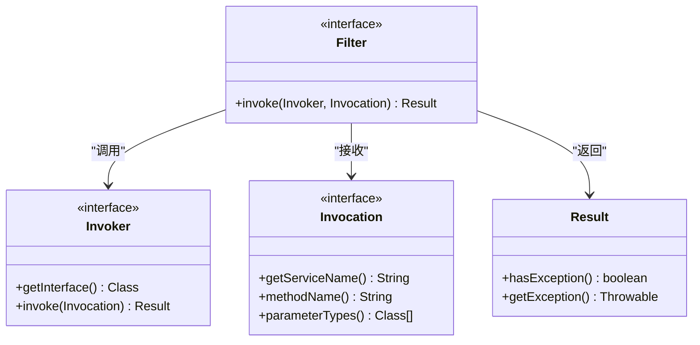
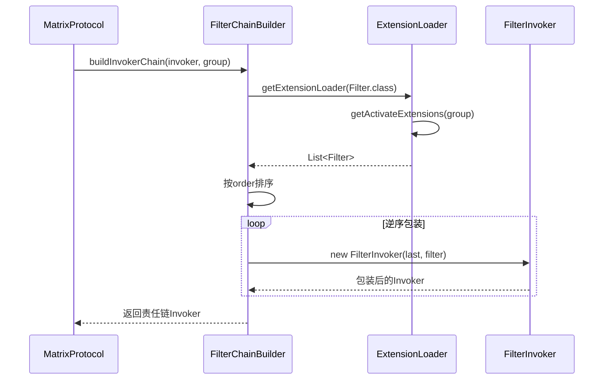
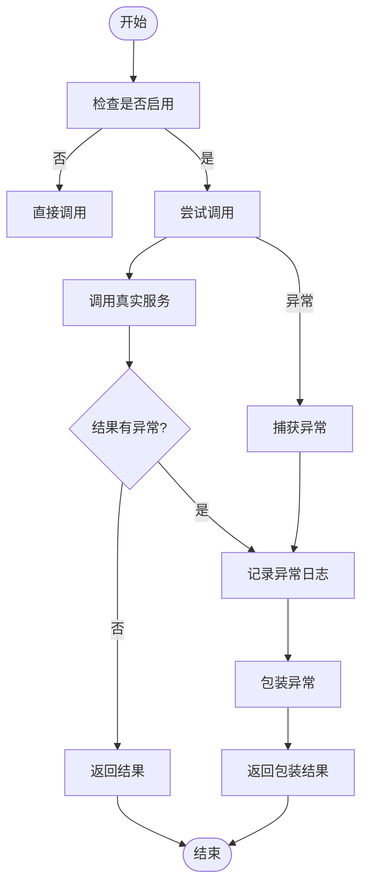
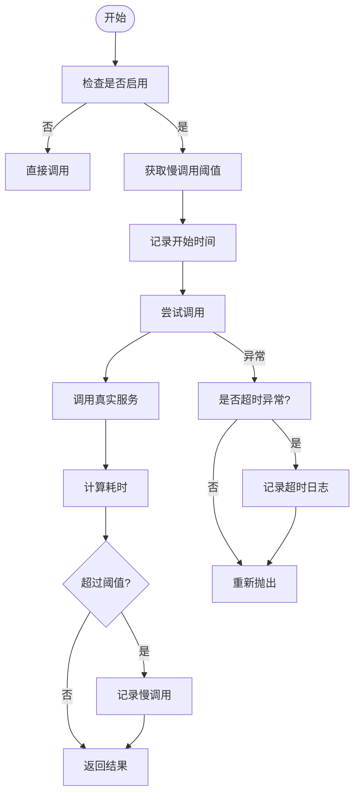
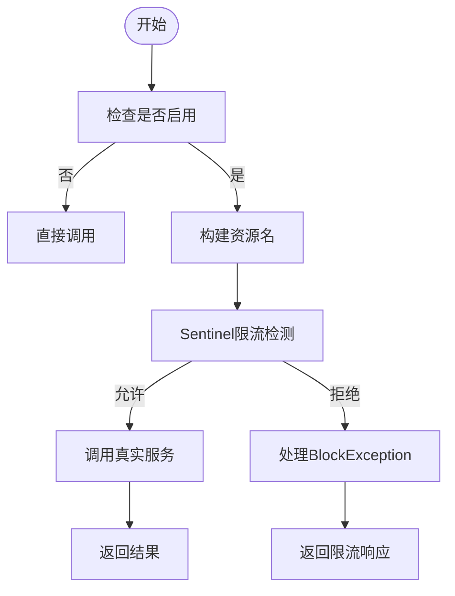
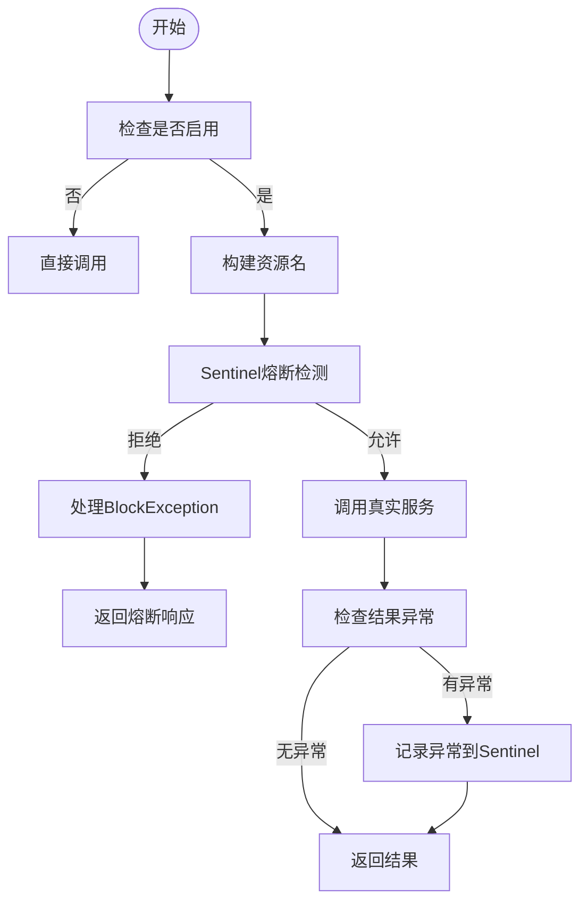
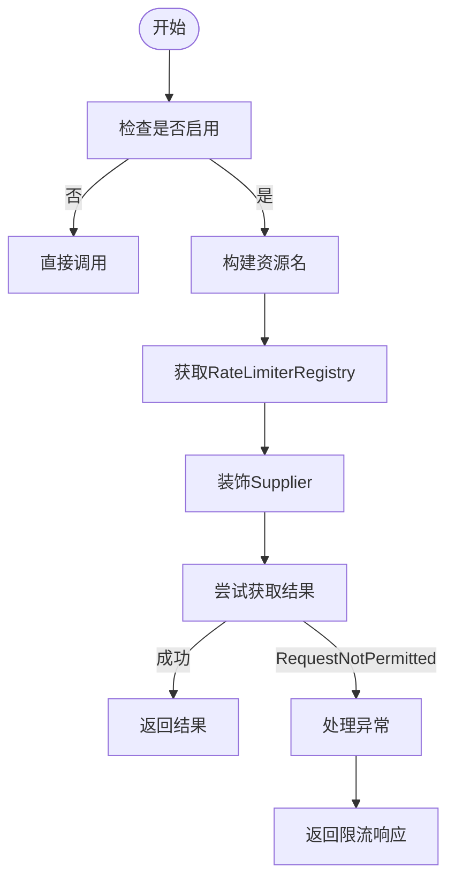
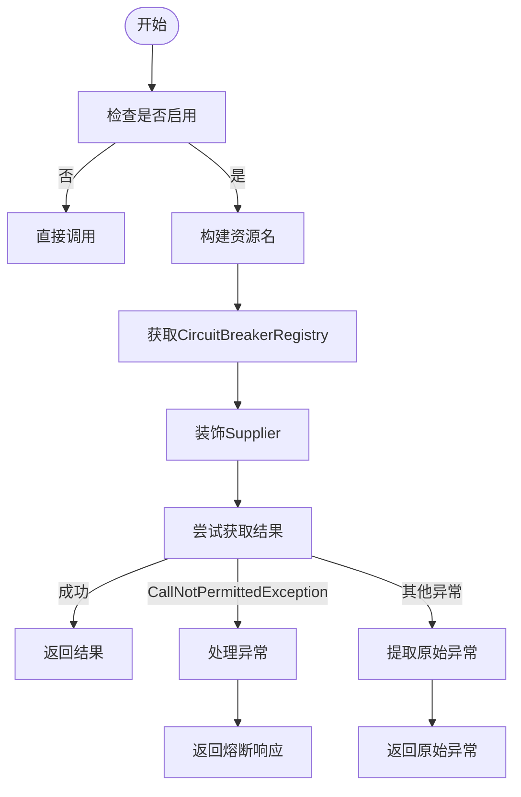
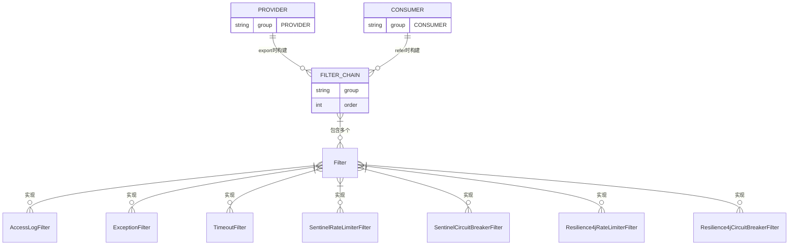
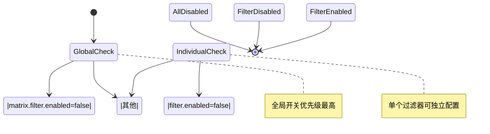

# 过滤器链

<cite>
**本文档中引用的文件**  
- [Filter.java](file://matrix-rpc-filter/matrix-rpc-filter-api/src/main/java/io/homeey/matrix/rpc/filter/Filter.java)
- [FilterChainBuilder.java](file://matrix-rpc-runtime/src/main/java/io/homeey/matrix/rpc/runtime/support/FilterChainBuilder.java)
- [AccessLogFilter.java](file://matrix-rpc-filter/matrix-rpc-filter-builtin/src/main/java/io/homeey/matrix/rpc/filter/builtin/AccessLogFilter.java)
- [ExceptionFilter.java](file://matrix-rpc-filter/matrix-rpc-filter-builtin/src/main/java/io/homeey/matrix/rpc/filter/builtin/ExceptionFilter.java)
- [TimeoutFilter.java](file://matrix-rpc-filter/matrix-rpc-filter-builtin/src/main/java/io/homeey/matrix/rpc/filter/builtin/TimeoutFilter.java)
- [Activate.java](file://matrix-rpc-spi/src/main/java/io/homeey/matrix/rpc/spi/Activate.java)
- [FilterConfig.java](file://matrix-rpc-filter/matrix-rpc-filter-builtin/src/main/java/io/homeey/matrix/rpc/filter/builtin/FilterConfig.java)
- [MatrixProtocol.java](file://matrix-rpc-runtime/src/main/java/io/homeey/matrix/rpc/runtime/MatrixProtocol.java)
- [ExtensionLoader.java](file://matrix-rpc-spi/src/main/java/io/homeey/matrix/rpc/spi/ExtensionLoader.java)
- [io.homeey.matrix.rpc.filter.Filter](file://matrix-rpc-filter/matrix-rpc-filter-builtin/src/main/resources/META-INF/matrix/io.homeey.matrix.rpc.filter.Filter)
- [SentinelCircuitBreakerFilter.java](file://matrix-rpc-filter/matrix-rpc-filter-sentinel/src/main/java/io/homeey/matrix/rpc/filter/sentinel/SentinelCircuitBreakerFilter.java)
- [SentinelRateLimiterFilter.java](file://matrix-rpc-filter/matrix-rpc-filter-sentinel/src/main/java/io/homeey/matrix/rpc/filter/sentinel/SentinelRateLimiterFilter.java)
- [Resilience4jCircuitBreakerFilter.java](file://matrix-rpc-filter/matrix-rpc-filter-resilience4j/src/main/java/io/homeey/matrix/rpc/filter/resilience4j/Resilience4jCircuitBreakerFilter.java)
- [Resilience4jRateLimiterFilter.java](file://matrix-rpc-filter/matrix-rpc-filter-resilience4j/src/main/java/io/homeey/matrix/rpc/filter/resilience4j/Resilience4jRateLimiterFilter.java)
- [SentinelFilterConfig.java](file://matrix-rpc-filter/matrix-rpc-filter-sentinel/src/main/java/io/homeey/matrix/rpc/filter/sentinel/SentinelFilterConfig.java)
- [Resilience4jFilterConfig.java](file://matrix-rpc-filter/matrix-rpc-filter-resilience4j/src/main/java/io/homeey/matrix/rpc/filter/resilience4j/Resilience4jFilterConfig.java)
</cite>

## 目录
1. [简介](#简介)
2. [过滤器接口设计](#过滤器接口设计)
3. [过滤器链构建机制](#过滤器链构建机制)
4. [内置过滤器分析](#内置过滤器分析)
5. [执行时机与作用域](#执行时机与作用域)
6. [自定义过滤器开发](#自定义过滤器开发)
7. [配置管理](#配置管理)
8. [总结](#总结)

## 简介

Matrix RPC框架通过过滤器链（Filter Chain）机制实现了横切关注点的模块化处理。该机制基于SPI（Service Provider Interface）设计，允许在不修改核心逻辑的前提下，灵活地扩展监控、鉴权、限流等功能。过滤器链采用责任链模式，在服务调用前后执行预处理和后处理逻辑，为系统提供了强大的可扩展性和可观测性支持。本次更新新增了Sentinel和Resilience4j集成的熔断限流过滤器，进一步增强了框架的容错能力。

## 过滤器接口设计

`Filter` 接口是Matrix RPC过滤器体系的核心契约，定义了统一的拦截方法签名。所有过滤器必须实现此接口以参与调用链的执行。



**过滤器来源**  
- [Filter.java](file://matrix-rpc-filter/matrix-rpc-filter-api/src/main/java/io/homeey/matrix/rpc/filter/Filter.java#L1-L24)

## 过滤器链构建机制

`FilterChainBuilder` 类负责基于SPI机制自动装配所有激活的过滤器，并按照 `@Activate` 注解的 `order` 值进行排序，最终形成责任链结构。



**过滤器链构建来源**  
- [FilterChainBuilder.java](file://matrix-rpc-runtime/src/main/java/io/homeey/matrix/rpc/runtime/support/FilterChainBuilder.java#L1-L53)
- [MatrixProtocol.java](file://matrix-rpc-runtime/src/main/java/io/homeey/matrix/rpc/runtime/MatrixProtocol.java#L62-L63)
- [MatrixProtocol.java](file://matrix-rpc-runtime/src/main/java/io/homeey/matrix/rpc/runtime/MatrixProtocol.java#L127-L128)

## 内置过滤器分析

### AccessLogFilter：访问日志记录

`AccessLogFilter` 在服务提供方记录每次RPC调用的访问日志，包括服务名、方法名、参数类型、调用耗时和结果状态。


**访问日志过滤器来源**  
- [AccessLogFilter.java](file://matrix-rpc-filter/matrix-rpc-filter-builtin/src/main/java/io/homeey/matrix/rpc/filter/builtin/AccessLogFilter.java#L1-L72)
- [FilterConfig.java](file://matrix-rpc-filter/matrix-rpc-filter-builtin/src/main/java/io/homeey/matrix/rpc/filter/builtin/FilterConfig.java#L30-L41)

### ExceptionFilter：统一异常处理

`ExceptionFilter` 在服务提供方捕获并处理服务实现抛出的异常，将检查异常包装为 `RpcException`，并保护服务端不会因异常而崩溃。



**异常处理过滤器来源**  
- [ExceptionFilter.java](file://matrix-rpc-filter/matrix-rpc-filter-builtin/src/main/java/io/homeey/matrix/rpc/filter/builtin/ExceptionFilter.java#L1-L82)
- [FilterConfig.java](file://matrix-rpc-filter/matrix-rpc-filter-builtin/src/main/java/io/homeey/matrix/rpc/filter/builtin/FilterConfig.java#L30-L41)

### TimeoutFilter：调用超时控制

`TimeoutFilter` 在服务消费方检测RPC调用是否超时，主要用于记录慢调用、统计超时比例和提供可观测性。



**超时控制过滤器来源**  
- [TimeoutFilter.java](file://matrix-rpc-filter/matrix-rpc-filter-builtin/src/main/java/io/homeey/matrix/rpc/filter/builtin/TimeoutFilter.java#L1-L87)
- [FilterConfig.java](file://matrix-rpc-filter/matrix-rpc-filter-builtin/src/main/java/io/homeey/matrix/rpc/filter/builtin/FilterConfig.java#L51-L84)

### SentinelRateLimiterFilter：Sentinel限流器

`SentinelRateLimiterFilter` 使用Sentinel框架实现服务调用的QPS限流控制，防止系统过载。该过滤器在消费方和提供方均可激活，执行顺序优先于熔断器（order=40）。



**Sentinel限流器来源**  
- [SentinelRateLimiterFilter.java](file://matrix-rpc-filter/matrix-rpc-filter-sentinel/src/main/java/io/homeey/matrix/rpc/filter/sentinel/SentinelRateLimiterFilter.java#L1-L69)
- [SentinelFilterConfig.java](file://matrix-rpc-filter/matrix-rpc-filter-sentinel/src/main/java/io/homeey/matrix/rpc/filter/sentinel/SentinelFilterConfig.java#L1-L35)

### SentinelCircuitBreakerFilter：Sentinel熔断器

`SentinelCircuitBreakerFilter` 使用Sentinel框架实现服务健康度检测和熔断保护，避免雪崩效应。该过滤器在消费方和提供方均可激活，执行顺序在限流器之后（order=50）。



**Sentinel熔断器来源**  
- [SentinelCircuitBreakerFilter.java](file://matrix-rpc-filter/matrix-rpc-filter-sentinel/src/main/java/io/homeey/matrix/rpc/filter/sentinel/SentinelCircuitBreakerFilter.java#L1-L85)
- [SentinelFilterConfig.java](file://matrix-rpc-filter/matrix-rpc-filter-sentinel/src/main/java/io/homeey/matrix/rpc/filter/sentinel/SentinelFilterConfig.java#L1-L35)

### Resilience4jRateLimiterFilter：Resilience4j限流器

`Resilience4jRateLimiterFilter` 使用Resilience4j框架实现服务调用的限流控制，通过装饰器模式集成。该过滤器在消费方和提供方均可激活，执行顺序优先于熔断器（order=40）。



**Resilience4j限流器来源**  
- [Resilience4jRateLimiterFilter.java](file://matrix-rpc-filter/matrix-rpc-filter-resilience4j/src/main/java/io/homeey/matrix/rpc/filter/resilience4j/Resilience4jRateLimiterFilter.java#L1-L76)
- [Resilience4jFilterConfig.java](file://matrix-rpc-filter/matrix-rpc-filter-resilience4j/src/main/java/io/homeey/matrix/rpc/filter/resilience4j/Resilience4jFilterConfig.java#L1-L35)

### Resilience4jCircuitBreakerFilter：Resilience4j熔断器

`Resilience4jCircuitBreakerFilter` 使用Resilience4j框架实现服务熔断保护，通过装饰器模式集成。该过滤器在消费方和提供方均可激活，执行顺序在限流器之后（order=50）。



**Resilience4j熔断器来源**  
- [Resilience4jCircuitBreakerFilter.java](file://matrix-rpc-filter/matrix-rpc-filter-resilience4j/src/main/java/io/homeey/matrix/rpc/filter/resilience4j/Resilience4jCircuitBreakerFilter.java#L1-L94)
- [Resilience4jFilterConfig.java](file://matrix-rpc-filter/matrix-rpc-filter-resilience4j/src/main/java/io/homeey/matrix/rpc/filter/resilience4j/Resilience4jFilterConfig.java#L1-L35)

## 执行时机与作用域

过滤器在服务提供方和服务消费方的执行时机存在差异：

- **服务提供方（PROVIDER）**：在 `MatrixProtocol.export()` 方法中构建过滤器链，当接收到远程调用请求时执行。
- **服务消费方（CONSUMER）**：在 `MatrixProtocol.refer()` 方法中构建过滤器链，当发起远程调用时执行。



**执行时机来源**  
- [MatrixProtocol.java](file://matrix-rpc-runtime/src/main/java/io/homeey/matrix/rpc/runtime/MatrixProtocol.java#L62-L63)
- [MatrixProtocol.java](file://matrix-rpc-runtime/src/main/java/io/homeey/matrix/rpc/runtime/MatrixProtocol.java#L127-L128)
- [Activate.java](file://matrix-rpc-spi/src/main/java/io/homeey/matrix/rpc/spi/Activate.java#L17-L18)

## 自定义过滤器开发

开发自定义过滤器需要实现 `Filter` 接口，并通过 `@Activate` 注解声明其激活条件和执行顺序。

```mermaid
classDiagram
class CustomFilter {
+invoke(Invoker, Invocation) Result
}
class Filter {
<<interface>>
+invoke(Invoker, Invocation) Result
}
class Activate {
<<annotation>>
+group() String[]
+order() int
}
CustomFilter --> Filter : "实现"
CustomFilter ..> Activate : "使用"
note right of CustomFilter
必须在 META-INF/matrix/
io.homeey.matrix.rpc.filter.Filter
中配置名称映射
end note
```

**自定义过滤器来源**  
- [Filter.java](file://matrix-rpc-filter/matrix-rpc-filter-api/src/main/java/io/homeey/matrix/rpc/filter/Filter.java#L13-L14)
- [Activate.java](file://matrix-rpc-spi/src/main/java/io/homeey/matrix/rpc/spi/Activate.java#L13-L28)
- [io.homeey.matrix.rpc.filter.Filter](file://matrix-rpc-filter/matrix-rpc-filter-builtin/src/main/resources/META-INF/matrix/io.homeey.matrix.rpc.filter.Filter#L1-L4)

## 配置管理

`FilterConfig` 类提供了统一的配置管理机制，支持通过系统属性控制过滤器的开关和参数。新增的 `SentinelFilterConfig` 和 `Resilience4jFilterConfig` 继承了此配置模式。



**配置管理来源**  
- [FilterConfig.java](file://matrix-rpc-filter/matrix-rpc-filter-builtin/src/main/java/io/homeey/matrix/rpc/filter/builtin/FilterConfig.java#L1-L86)
- [AccessLogFilter.java](file://matrix-rpc-filter/matrix-rpc-filter-builtin/src/main/java/io/homeey/matrix/rpc/filter/builtin/AccessLogFilter.java#L25-L26)
- [ExceptionFilter.java](file://matrix-rpc-filter/matrix-rpc-filter-builtin/src/main/java/io/homeey/matrix/rpc/filter/builtin/ExceptionFilter.java#L20-L21)
- [TimeoutFilter.java](file://matrix-rpc-filter/matrix-rpc-filter-builtin/src/main/java/io/homeey/matrix/rpc/filter/builtin/TimeoutFilter.java#L21-L23)
- [SentinelCircuitBreakerFilter.java](file://matrix-rpc-filter/matrix-rpc-filter-sentinel/src/main/java/io/homeey/matrix/rpc/filter/sentinel/SentinelCircuitBreakerFilter.java#L22-L23)
- [Resilience4jCircuitBreakerFilter.java](file://matrix-rpc-filter/matrix-rpc-filter-resilience4j/src/main/java/io/homeey/matrix/rpc/filter/resilience4j/Resilience4jCircuitBreakerFilter.java#L21-L22)

## 总结

Matrix RPC的过滤器链设计通过SPI机制实现了高度可扩展的横切关注点处理。`Filter` 接口定义了统一的拦截契约，`FilterChainBuilder` 负责自动装配和排序，内置的 `AccessLogFilter`、`ExceptionFilter` 和 `TimeoutFilter` 分别实现了访问日志、异常处理和超时控制等关键功能。新增的 `SentinelRateLimiterFilter`、`SentinelCircuitBreakerFilter`、`Resilience4jRateLimiterFilter` 和 `Resilience4jCircuitBreakerFilter` 进一步增强了框架的容错能力，支持与主流熔断限流框架的集成。过滤器在服务提供方和消费方的不同执行时机，使得框架能够灵活地支持各种监控、鉴权、限流等场景。通过实现 `Filter` 接口并配置 `@Activate` 注解，开发者可以轻松扩展自定义功能，体现了框架良好的开放性和可维护性。