# 集群容错

<cite>
**本文档引用文件**  
- [Cluster.java](file://matrix-rpc-cluster/matrix-rpc-cluster-api/src/main/java/io/homeey/matrix/rpc/cluster/api/Cluster.java)
- [LoadBalance.java](file://matrix-rpc-cluster/matrix-rpc-cluster-api/src/main/java/io/homeey/matrix/rpc/cluster/api/LoadBalance.java)
- [Directory.java](file://matrix-rpc-cluster/matrix-rpc-cluster-api/src/main/java/io/homeey/matrix/rpc/cluster/api/Directory.java)
- [Router.java](file://matrix-rpc-cluster/matrix-rpc-cluster-api/src/main/java/io/homeey/matrix/rpc/cluster/api/Router.java)
- [RouteRule.java](file://matrix-rpc-cluster/matrix-rpc-cluster-api/src/main/java/io/homeey/matrix/rpc/cluster/api/RouteRule.java)
- [ConfigCenter.java](file://matrix-rpc-cluster/matrix-rpc-cluster-api/src/main/java/io/homeey/matrix/rpc/cluster/api/ConfigCenter.java)
- [ClusterInvoker.java](file://matrix-rpc-cluster/matrix-rpc-cluster-failover/src/main/java/io/homeey/matrix/rpc/cluster/failover/ClusterInvoker.java)
- [FailoverCluster.java](file://matrix-rpc-cluster/matrix-rpc-cluster-failover/src/main/java/io/homeey/matrix/rpc/cluster/failover/FailoverCluster.java)
- [FailoverClusterInvoker.java](file://matrix-rpc-cluster/matrix-rpc-cluster-failover/src/main/java/io/homeey/matrix/rpc/cluster/failover/FailoverClusterInvoker.java)
- [FailfastCluster.java](file://matrix-rpc-cluster/matrix-rpc-cluster-failover/src/main/java/io/homeey/matrix/rpc/cluster/failover/FailfastCluster.java)
- [FailfastClusterInvoker.java](file://matrix-rpc-cluster/matrix-rpc-cluster-failover/src/main/java/io/homeey/matrix/rpc/cluster/failover/FailfastClusterInvoker.java)
- [FailsafeCluster.java](file://matrix-rpc-cluster/matrix-rpc-cluster-failover/src/main/java/io/homeey/matrix/rpc/cluster/failover/FailsafeCluster.java)
- [FailsafeClusterInvoker.java](file://matrix-rpc-cluster/matrix-rpc-cluster-failover/src/main/java/io/homeey/matrix/rpc/cluster/failover/FailsafeClusterInvoker.java)
- [RandomLoadBalance.java](file://matrix-rpc-cluster/matrix-rpc-cluster-loadbalance/src/main/java/io/homeey/matrix/rpc/cluster/loadbalance/RandomLoadBalance.java)
- [RoundRobinLoadBalance.java](file://matrix-rpc-cluster/matrix-rpc-cluster-loadbalance/src/main/java/io/homeey/matrix/rpc/cluster/loadbalance/RoundRobinLoadBalance.java)
- [WeightedRandomLoadBalance.java](file://matrix-rpc-cluster/matrix-rpc-cluster-loadbalance/src/main/java/io/homeey/matrix/rpc/cluster/loadbalance/WeightedRandomLoadBalance.java)
- [WeightedRoundRobinLoadBalance.java](file://matrix-rpc-cluster/matrix-rpc-cluster-loadbalance/src/main/java/io/homeey/matrix/rpc/cluster/loadbalance/WeightedRoundRobinLoadBalance.java)
- [ConsistentHashLoadBalance.java](file://matrix-rpc-cluster/matrix-rpc-cluster-loadbalance/src/main/java/io/homeey/matrix/rpc/cluster/loadbalance/ConsistentHashLoadBalance.java)
- [ConditionRouter.java](file://matrix-rpc-cluster/matrix-rpc-cluster-router/src/main/java/io/homeey/matrix/rpc/cluster/router/ConditionRouter.java)
- [TagRouter.java](file://matrix-rpc-cluster/matrix-rpc-cluster-router/src/main/java/io/homeey/matrix/rpc/cluster/router/TagRouter.java)
- [MemoryConfigCenter.java](file://matrix-rpc-cluster/matrix-rpc-cluster-router/src/main/java/io/homeey/matrix/rpc/cluster/router/MemoryConfigCenter.java)
- [DynamicRouter.java](file://matrix-rpc-cluster/matrix-rpc-cluster-router/src/main/java/io/homeey/matrix/rpc/cluster/router/DynamicRouter.java)
</cite>

## 目录
1. [简介](#简介)
2. [集群容错架构](#集群容错架构)
3. [核心组件分析](#核心组件分析)
4. [容错策略实现](#容错策略实现)
5. [负载均衡机制](#负载均衡机制)
6. [路由与过滤机制](#路由与过滤机制)
7. [配置中心集成](#配置中心集成)
8. [调用流程分析](#调用流程分析)
9. [扩展机制](#扩展机制)
10. [最佳实践](#最佳实践)

## 简介

Matrix RPC 框架的集群容错模块提供了完整的服务调用容错能力，包括失败重试、快速失败、失败安全等多种策略，结合负载均衡和路由机制，确保分布式环境下服务调用的高可用性和稳定性。

**本节不涉及具体源码文件分析，因此无来源标注**

## 集群容错架构

Matrix RPC 的集群容错架构采用分层设计，各组件协同工作：

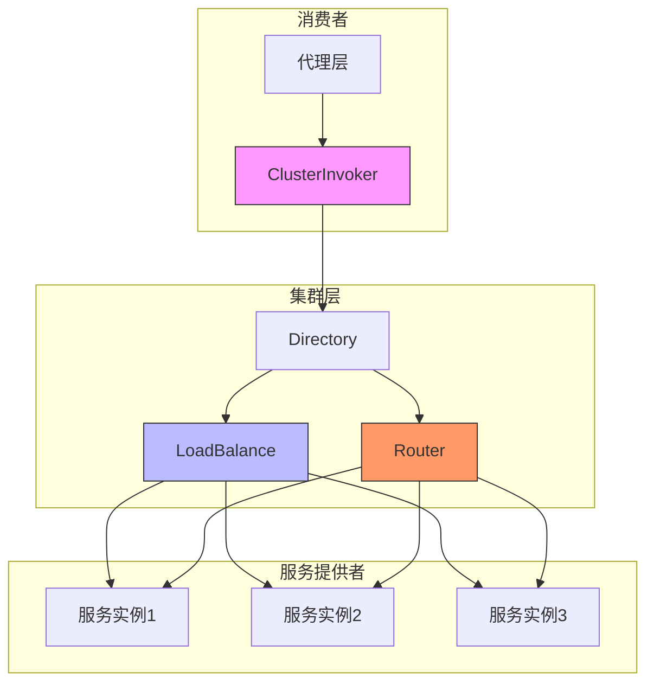

**图示来源**  
- [Cluster.java](file://matrix-rpc-cluster/matrix-rpc-cluster-api/src/main/java/io/homeey/matrix/rpc/cluster/api/Cluster.java)
- [Directory.java](file://matrix-rpc-cluster/matrix-rpc-cluster-api/src/main/java/io/homeey/matrix/rpc/cluster/api/Directory.java)
- [LoadBalance.java](file://matrix-rpc-cluster/matrix-rpc-cluster-api/src/main/java/io/homeey/matrix/rpc/cluster/api/LoadBalance.java)
- [Router.java](file://matrix-rpc-cluster/matrix-rpc-cluster-api/src/main/java/io/homeey/matrix/rpc/cluster/api/Router.java)

## 核心组件分析

### Cluster 接口

`Cluster` 接口是容错策略的核心SPI，负责将服务目录和负载均衡器组合成具有容错能力的 `ClusterInvoker`。框架默认支持多种容错策略。

**组件来源**  
- [Cluster.java](file://matrix-rpc-cluster/matrix-rpc-cluster-api/src/main/java/io/homeey/matrix/rpc/cluster/api/Cluster.java)

### Directory 服务目录

`Directory` 作为服务提供者列表的管理器，是集群层与服务实例之间的桥梁。它支持通过路由规则动态过滤可用的服务实例。

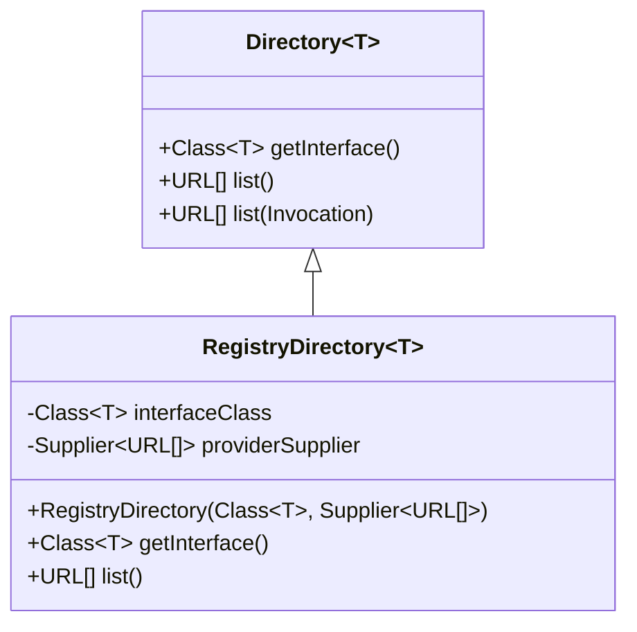

**图示来源**  
- [Directory.java](file://matrix-rpc-cluster/matrix-rpc-cluster-api/src/main/java/io/homeey/matrix/rpc/cluster/api/Directory.java)
- [RegistryDirectory.java](file://matrix-rpc-cluster/matrix-rpc-cluster-api/src/main/java/io/homeey/matrix/rpc/cluster/api/RegistryDirectory.java)

## 容错策略实现

### Failover 失败重试

Failover 策略在调用失败后自动切换到其他节点重试，适用于幂等性查询操作。支持配置重试次数。

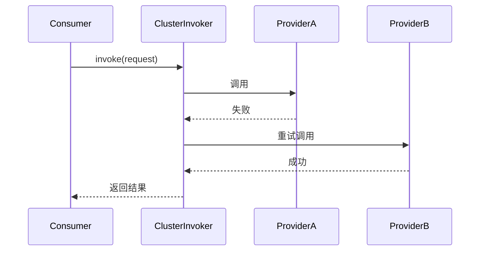

**组件来源**  
- [FailoverCluster.java](file://matrix-rpc-cluster/matrix-rpc-cluster-failover/src/main/java/io/homeey/matrix/rpc/cluster/failover/FailoverCluster.java)
- [FailoverClusterInvoker.java](file://matrix-rpc-cluster/matrix-rpc-cluster-failover/src/main/java/io/homeey/matrix/rpc/cluster/failover/FailoverClusterInvoker.java)

### Failfast 快速失败

Failfast 策略在调用失败后立即抛出异常，不进行重试，适用于非幂等写操作或对实时性要求高的场景。

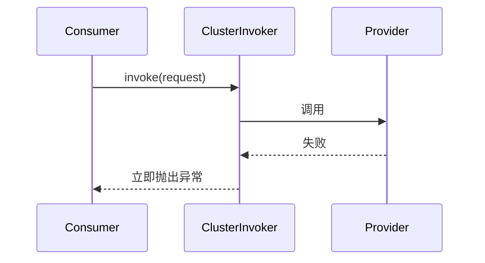

**组件来源**  
- [FailfastCluster.java](file://matrix-rpc-cluster/matrix-rpc-cluster-failover/src/main/java/io/homeey/matrix/rpc/cluster/failover/FailfastCluster.java)
- [FailfastClusterInvoker.java](file://matrix-rpc-cluster/matrix-rpc-cluster-failover/src/main/java/io/homeey/matrix/rpc/cluster/failover/FailfastClusterInvoker.java)

### Failsafe 失败安全

Failsafe 策略在调用失败后忽略异常，返回空结果，适用于对结果不敏感的场景，如日志上报、监控数据收集等。

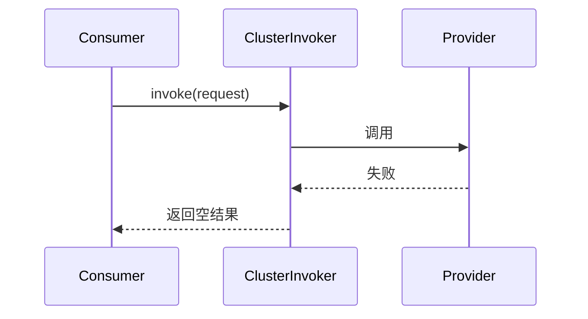

**组件来源**  
- [FailsafeCluster.java](file://matrix-rpc-cluster/matrix-rpc-cluster-failover/src/main/java/io/homeey/matrix/rpc/cluster/failover/FailsafeCluster.java)
- [FailsafeClusterInvoker.java](file://matrix-rpc-cluster/matrix-rpc-cluster-failover/src/main/java/io/homeey/matrix/rpc/cluster/failover/FailsafeClusterInvoker.java)

## 负载均衡机制

### 基础负载均衡策略

Matrix RPC 提供了多种负载均衡策略，通过 `LoadBalance` SPI 接口实现。

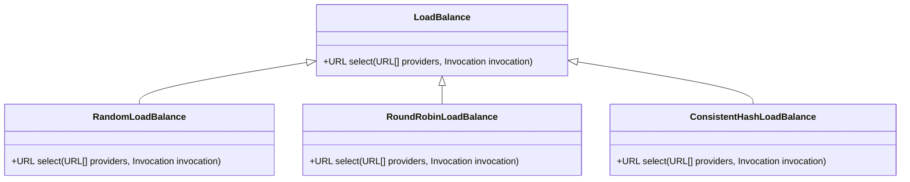

**图示来源**  
- [LoadBalance.java](file://matrix-rpc-cluster/matrix-rpc-cluster-api/src/main/java/io/homeey/matrix/rpc/cluster/api/LoadBalance.java)
- [RandomLoadBalance.java](file://matrix-rpc-cluster/matrix-rpc-cluster-loadbalance/src/main/java/io/homeey/matrix/rpc/cluster/loadbalance/RandomLoadBalance.java)
- [RoundRobinLoadBalance.java](file://matrix-rpc-cluster/matrix-rpc-cluster-loadbalance/src/main/java/io/homeey/matrix/rpc/cluster/loadbalance/RoundRobinLoadBalance.java)
- [ConsistentHashLoadBalance.java](file://matrix-rpc-cluster/matrix-rpc-cluster-loadbalance/src/main/java/io/homeey/matrix/rpc/cluster/loadbalance/ConsistentHashLoadBalance.java)

### 加权负载均衡

支持基于权重的负载均衡策略，可根据服务实例的性能分配不同权重。

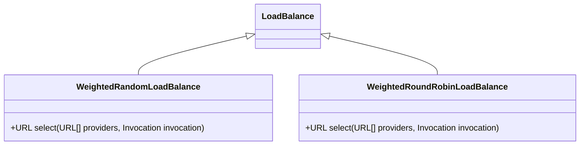

**组件来源**  
- [WeightedRandomLoadBalance.java](file://matrix-rpc-cluster/matrix-rpc-cluster-loadbalance/src/main/java/io/homeey/matrix/rpc/cluster/loadbalance/WeightedRandomLoadBalance.java)
- [WeightedRoundRobinLoadBalance.java](file://matrix-rpc-cluster/matrix-rpc-cluster-loadbalance/src/main/java/io/homeey/matrix/rpc/cluster/loadbalance/WeightedRoundRobinLoadBalance.java)

## 路由与过滤机制

### 路由接口设计

`Router` 接口负责根据规则过滤服务提供者，支持标签路由、条件路由等场景。

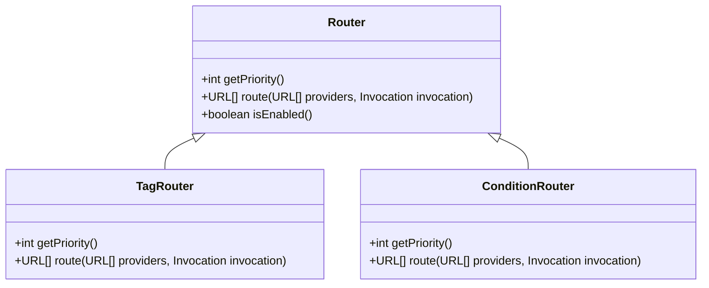

**图示来源**  
- [Router.java](file://matrix-rpc-cluster/matrix-rpc-cluster-api/src/main/java/io/homeey/matrix/rpc/cluster/api/Router.java)
- [TagRouter.java](file://matrix-rpc-cluster/matrix-rpc-cluster-router/src/main/java/io/homeey/matrix/rpc/cluster/router/TagRouter.java)
- [ConditionRouter.java](file://matrix-rpc-cluster/matrix-rpc-cluster-router/src/main/java/io/homeey/matrix/rpc/cluster/router/ConditionRouter.java)

### 路由规则结构

`RouteRule` 类定义了路由规则的数据结构，支持多种路由条件和动作。

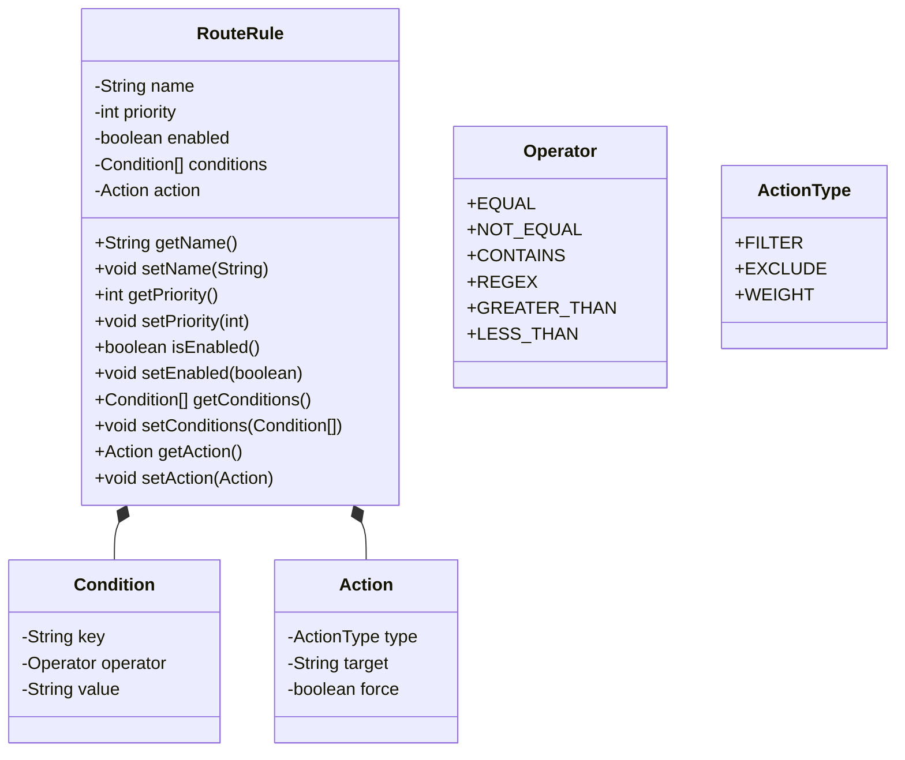

**组件来源**  
- [RouteRule.java](file://matrix-rpc-cluster/matrix-rpc-cluster-api/src/main/java/io/homeey/matrix/rpc/cluster/api/RouteRule.java)

## 配置中心集成

### 配置中心接口

`ConfigCenter` 接口用于动态获取和监听路由规则配置，支持多种配置中心实现。

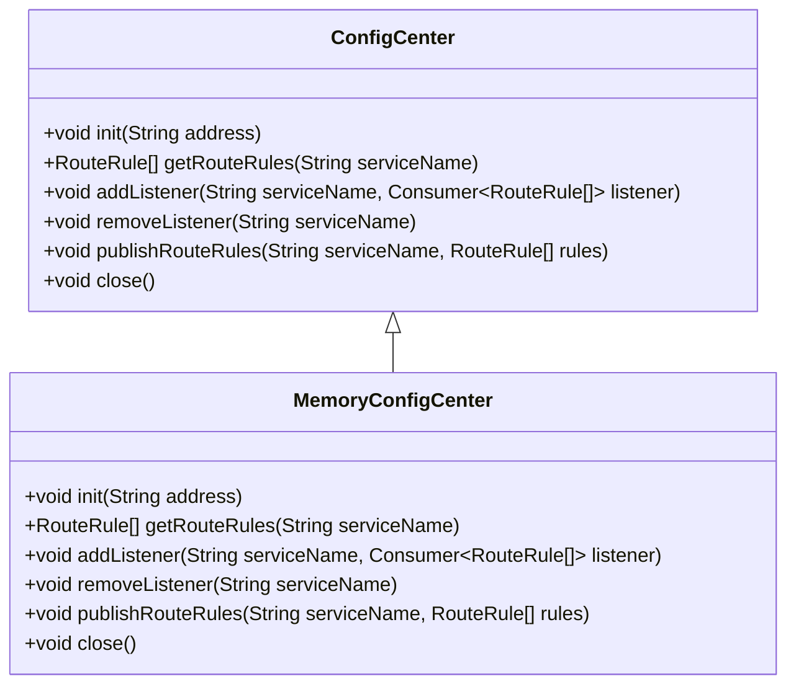

**组件来源**  
- [ConfigCenter.java](file://matrix-rpc-cluster/matrix-rpc-cluster-api/src/main/java/io/homeey/matrix/rpc/cluster/api/ConfigCenter.java)
- [MemoryConfigCenter.java](file://matrix-rpc-cluster/matrix-rpc-cluster-router/src/main/java/io/homeey/matrix/rpc/cluster/router/MemoryConfigCenter.java)

## 调用流程分析

### 完整调用链路

展示了从消费者到服务提供者的完整调用流程，包含路由、负载均衡和容错处理。

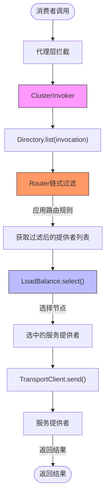

**组件来源**  
- [ClusterInvoker.java](file://matrix-rpc-cluster/matrix-rpc-cluster-failover/src/main/java/io/homeey/matrix/rpc/cluster/failover/ClusterInvoker.java)
- [Directory.java](file://matrix-rpc-cluster/matrix-rpc-cluster-api/src/main/java/io/homeey/matrix/rpc/cluster/api/Directory.java)
- [Router.java](file://matrix-rpc-cluster/matrix-rpc-cluster-api/src/main/java/io/homeey/matrix/rpc/cluster/api/Router.java)
- [LoadBalance.java](file://matrix-rpc-cluster/matrix-rpc-cluster-api/src/main/java/io/homeey/matrix/rpc/cluster/api/LoadBalance.java)

## 扩展机制

### SPI 扩展点

Matrix RPC 通过 SPI 机制提供灵活的扩展能力，各核心组件均可通过配置进行替换。

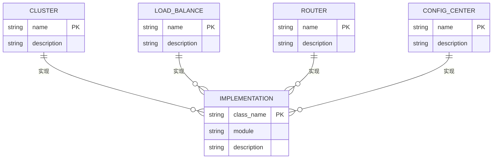

**组件来源**  
- [Cluster.java](file://matrix-rpc-cluster/matrix-rpc-cluster-api/src/main/java/io/homeey/matrix/rpc/cluster/api/Cluster.java)
- [LoadBalance.java](file://matrix-rpc-cluster/matrix-rpc-cluster-api/src/main/java/io/homeey/matrix/rpc/cluster/api/LoadBalance.java)
- [Router.java](file://matrix-rpc-cluster/matrix-rpc-cluster-api/src/main/java/io/homeey/matrix/rpc/cluster/api/Router.java)
- [ConfigCenter.java](file://matrix-rpc-cluster/matrix-rpc-cluster-api/src/main/java/io/homeey/matrix/rpc/cluster/api/ConfigCenter.java)

## 最佳实践

### 容错策略选择

根据业务场景选择合适的容错策略：

| 场景 | 推荐策略 | 说明 |
|------|----------|------|
| 查询操作 | Failover | 允许重试，提高成功率 |
| 写操作 | Failfast | 避免重复提交，保证数据一致性 |
| 日志上报 | Failsafe | 失败不影响主流程 |

### 负载均衡配置

根据服务特点选择合适的负载均衡策略：

| 服务类型 | 推荐策略 | 说明 |
|---------|----------|------|
| 无状态服务 | RoundRobin | 请求均匀分布 |
| 性能差异大 | WeightedRandom | 按权重分配流量 |
| 缓存敏感 | ConsistentHash | 减少缓存失效 |

**本节为通用建议，不涉及具体源码文件分析，因此无来源标注**