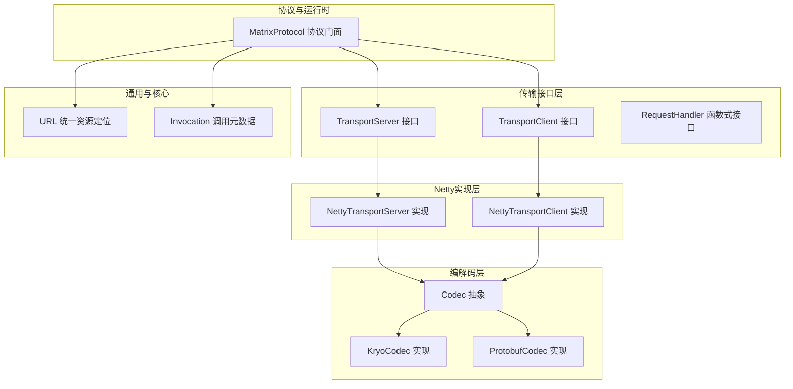
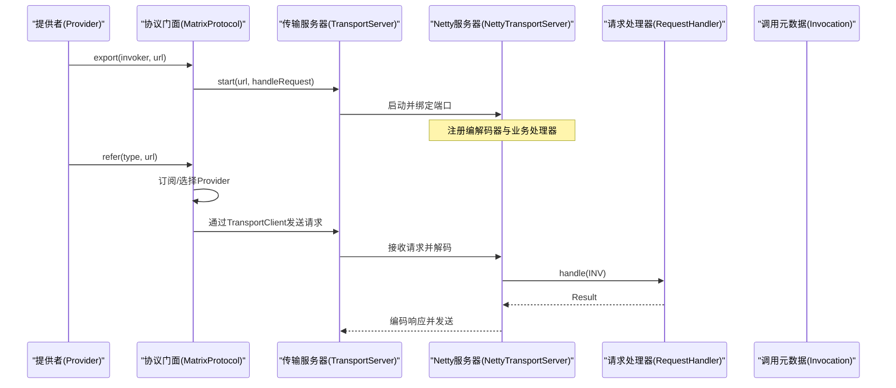
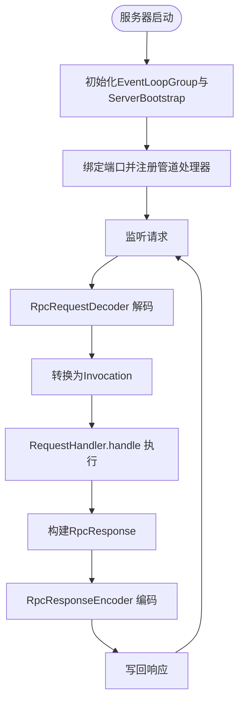
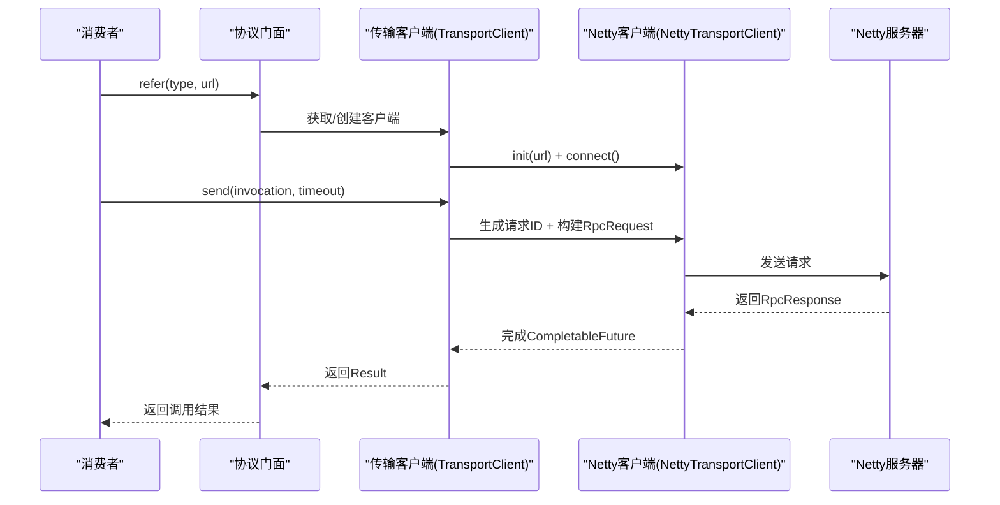
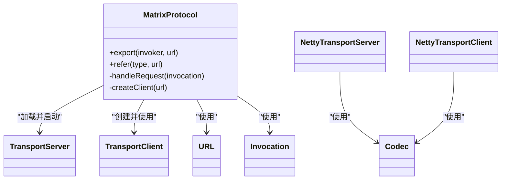
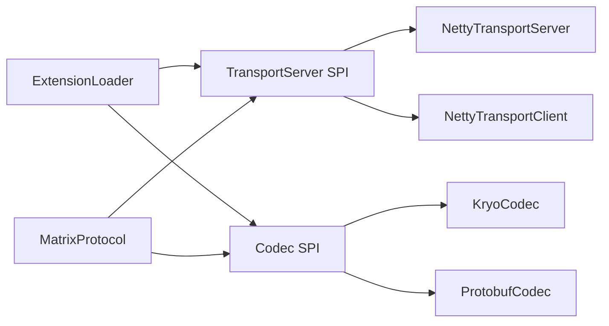

# 网络传输

<cite>
**本文引用的文件**
- [TransportServer.java](file://matrix-rpc-transport/matrix-rpc-transport-api/src/main/java/io/homeey/matrix/rpc/transport/api/TransportServer.java)
- [TransportClient.java](file://matrix-rpc-transport/matrix-rpc-transport-api/src/main/java/io/homeey/matrix/rpc/transport/api/TransportClient.java)
- [RequestHandler.java](file://matrix-rpc-transport/matrix-rpc-transport-api/src/main/java/io/homeey/matrix/rpc/transport/api/RequestHandler.java)
- [NettyTransportServer.java](file://matrix-rpc-transport/matrix-rpc-transport-netty/src/main/java/io/homeey/matrix/rpc/transport/netty/server/NettyTransportServer.java)
- [NettyTransportClient.java](file://matrix-rpc-transport/matrix-rpc-transport-netty/src/main/java/io/homeey/matrix/rpc/transport/netty/client/NettyTransportClient.java)
- [MatrixProtocol.java](file://matrix-rpc-runtime/src/main/java/io/homeey/matrix/rpc/runtime/MatrixProtocol.java)
- [URL.java](file://matrix-rpc-common/src/main/java/io/homeey/matrix/rpc/common/URL.java)
- [Invocation.java](file://matrix-rpc-core/src/main/java/io/homeey/matrix/rpc/core/Invocation.java)
- [Codec.java](file://matrix-rpc-codec/matrix-rpc-codec-api/src/main/java/io/homeey/matrix/rpc/codec/api/Codec.java)
- [KryoCodec.java](file://matrix-rpc-codec/matrix-rpc-codec-kryo/src/main/java/io/homeey/matrix/rpc/codec/kryo/KryoCodec.java)
- [ProtobufCodec.java](file://matrix-rpc-codec/matrix-rpc-codec-protobuf/src/main/java/io/homeey/matrix/rpc/codec/protobuf/ProtobufCodec.java)
- [ConsumerMain.java](file://matrix-rpc-examples/src/main/java/io/homeey/matrix/rpc/example/consumer/ConsumerMain.java)
- [ProviderMain.java](file://matrix-rpc-examples/src/main/java/io/homeey/matrix/rpc/example/provider/ProviderMain.java)
- [ExtensionLoader.java](file://matrix-rpc-spi/src/main/java/io/homeey/matrix/rpc/spi/ExtensionLoader.java)
</cite>

## 目录
1. [简介](#简介)
2. [项目结构](#项目结构)
3. [核心组件](#核心组件)
4. [架构总览](#架构总览)
5. [详细组件分析](#详细组件分析)
6. [依赖关系分析](#依赖关系分析)
7. [性能考量](#性能考量)
8. [故障排查指南](#故障排查指南)
9. [结论](#结论)
10. [附录](#附录)

## 简介
本章节聚焦于矩阵RPC的网络传输能力，系统性阐述TransportServer与TransportClient接口的设计理念与职责边界：它们仅负责纯网络IO，不理解RPC语义；具体语义由上层协议层（MatrixProtocol）与编解码层（Codec）共同完成。随后深入解析NettyTransportServer如何基于Netty启动服务器、绑定端口、处理请求，以及NettyTransportClient如何建立连接、发送请求并管理请求-响应生命周期。最后结合MatrixProtocol的实现，说明传输层如何与核心协议层集成，并讨论Netty在异步非阻塞通信方面的优势及配置要点。

## 项目结构
传输相关代码主要分布在以下模块：
- transport-api：定义TransportServer、TransportClient与RequestHandler三大接口，约定纯网络IO契约
- transport-netty：基于Netty实现上述接口，提供高性能异步网络栈
- runtime：MatrixProtocol作为协议门面，负责将传输层与RPC语义对接
- codec：编解码抽象与多种实现（Kryo、Protobuf），支撑复杂对象序列化
- common：统一的URL模型，承载地址、协议、参数等配置信息
- core：Invocation抽象，承载一次RPC调用的元数据（服务名、方法名、参数类型与值、附件）

图表来源
- [TransportServer.java](file://matrix-rpc-transport/matrix-rpc-transport-api/src/main/java/io/homeey/matrix/rpc/transport/api/TransportServer.java#L1-L23)
- [TransportClient.java](file://matrix-rpc-transport/matrix-rpc-transport-api/src/main/java/io/homeey/matrix/rpc/transport/api/TransportClient.java#L1-L48)
- [RequestHandler.java](file://matrix-rpc-transport/matrix-rpc-transport-api/src/main/java/io/homeey/matrix/rpc/transport/api/RequestHandler.java#L1-L20)
- [NettyTransportServer.java](file://matrix-rpc-transport/matrix-rpc-transport-netty/src/main/java/io/homeey/matrix/rpc/transport/netty/server/NettyTransportServer.java#L1-L264)
- [NettyTransportClient.java](file://matrix-rpc-transport/matrix-rpc-transport-netty/src/main/java/io/homeey/matrix/rpc/transport/netty/client/NettyTransportClient.java#L1-L220)
- [MatrixProtocol.java](file://matrix-rpc-runtime/src/main/java/io/homeey/matrix/rpc/runtime/MatrixProtocol.java#L1-L190)
- [Codec.java](file://matrix-rpc-codec/matrix-rpc-codec-api/src/main/java/io/homeey/matrix/rpc/codec/api/Codec.java#L1-L30)
- [KryoCodec.java](file://matrix-rpc-codec/matrix-rpc-codec-kryo/src/main/java/io/homeey/matrix/rpc/codec/kryo/KryoCodec.java#L1-L66)
- [ProtobufCodec.java](file://matrix-rpc-codec/matrix-rpc-codec-protobuf/src/main/java/io/homeey/matrix/rpc/codec/protobuf/ProtobufCodec.java#L1-L38)
- [URL.java](file://matrix-rpc-common/src/main/java/io/homeey/matrix/rpc/common/URL.java#L1-L164)
- [Invocation.java](file://matrix-rpc-core/src/main/java/io/homeey/matrix/rpc/core/Invocation.java#L1-L41)

章节来源
- [TransportServer.java](file://matrix-rpc-transport/matrix-rpc-transport-api/src/main/java/io/homeey/matrix/rpc/transport/api/TransportServer.java#L1-L23)
- [TransportClient.java](file://matrix-rpc-transport/matrix-rpc-transport-api/src/main/java/io/homeey/matrix/rpc/transport/api/TransportClient.java#L1-L48)
- [RequestHandler.java](file://matrix-rpc-transport/matrix-rpc-transport-api/src/main/java/io/homeey/matrix/rpc/transport/api/RequestHandler.java#L1-L20)
- [NettyTransportServer.java](file://matrix-rpc-transport/matrix-rpc-transport-netty/src/main/java/io/homeey/matrix/rpc/transport/netty/server/NettyTransportServer.java#L1-L264)
- [NettyTransportClient.java](file://matrix-rpc-transport/matrix-rpc-transport-netty/src/main/java/io/homeey/matrix/rpc/transport/netty/client/NettyTransportClient.java#L1-L220)
- [MatrixProtocol.java](file://matrix-rpc-runtime/src/main/java/io/homeey/matrix/rpc/runtime/MatrixProtocol.java#L1-L190)
- [URL.java](file://matrix-rpc-common/src/main/java/io/homeey/matrix/rpc/common/URL.java#L1-L164)
- [Invocation.java](file://matrix-rpc-core/src/main/java/io/homeey/matrix/rpc/core/Invocation.java#L1-L41)
- [Codec.java](file://matrix-rpc-codec/matrix-rpc-codec-api/src/main/java/io/homeey/matrix/rpc/codec/api/Codec.java#L1-L30)
- [KryoCodec.java](file://matrix-rpc-codec/matrix-rpc-codec-kryo/src/main/java/io/homeey/matrix/rpc/codec/kryo/KryoCodec.java#L1-L66)
- [ProtobufCodec.java](file://matrix-rpc-codec/matrix-rpc-codec-protobuf/src/main/java/io/homeey/matrix/rpc/codec/protobuf/ProtobufCodec.java#L1-L38)

## 核心组件
- TransportServer：负责启动传输服务器，接收URL与RequestHandler，绑定端口并处理请求
- TransportClient：负责初始化、连接、发送请求并返回Result，同时维护连接状态
- RequestHandler：函数式接口，接收Invocation并返回Result，由上层协议层注入
- NettyTransportServer：基于Netty实现，包含编解码器与业务处理器，负责请求解码、调用转发、响应编码与发送
- NettyTransportClient：基于Netty实现，包含编解码器与业务处理器，负责请求编码、发送、等待响应并超时控制
- MatrixProtocol：协议门面，负责加载传输实现、注册服务、订阅服务、负载均衡选择、构建远程Invoker并委派给TransportClient发送请求
- Codec：编解码抽象，支持复杂对象序列化；Kryo与Protobuf为默认实现
- URL：统一资源定位，承载协议、主机、端口、路径与参数
- Invocation：一次RPC调用的元数据载体

章节来源
- [TransportServer.java](file://matrix-rpc-transport/matrix-rpc-transport-api/src/main/java/io/homeey/matrix/rpc/transport/api/TransportServer.java#L1-L23)
- [TransportClient.java](file://matrix-rpc-transport/matrix-rpc-transport-api/src/main/java/io/homeey/matrix/rpc/transport/api/TransportClient.java#L1-L48)
- [RequestHandler.java](file://matrix-rpc-transport/matrix-rpc-transport-api/src/main/java/io/homeey/matrix/rpc/transport/api/RequestHandler.java#L1-L20)
- [NettyTransportServer.java](file://matrix-rpc-transport/matrix-rpc-transport-netty/src/main/java/io/homeey/matrix/rpc/transport/netty/server/NettyTransportServer.java#L1-L264)
- [NettyTransportClient.java](file://matrix-rpc-transport/matrix-rpc-transport-netty/src/main/java/io/homeey/matrix/rpc/transport/netty/client/NettyTransportClient.java#L1-L220)
- [MatrixProtocol.java](file://matrix-rpc-runtime/src/main/java/io/homeey/matrix/rpc/runtime/MatrixProtocol.java#L1-L190)
- [Codec.java](file://matrix-rpc-codec/matrix-rpc-codec-api/src/main/java/io/homeey/matrix/rpc/codec/api/Codec.java#L1-L30)
- [KryoCodec.java](file://matrix-rpc-codec/matrix-rpc-codec-kryo/src/main/java/io/homeey/matrix/rpc/codec/kryo/KryoCodec.java#L1-L66)
- [ProtobufCodec.java](file://matrix-rpc-codec/matrix-rpc-codec-protobuf/src/main/java/io/homeey/matrix/rpc/codec/protobuf/ProtobufCodec.java#L1-L38)
- [URL.java](file://matrix-rpc-common/src/main/java/io/homeey/matrix/rpc/common/URL.java#L1-L164)
- [Invocation.java](file://matrix-rpc-core/src/main/java/io/homeey/matrix/rpc/core/Invocation.java#L1-L41)

## 架构总览
传输层与协议层的交互流程如下：
- Provider侧：MatrixProtocol.export时首次启动TransportServer，设置RequestHandler；收到请求后将Protobuf消息转换为Invocation，交由过滤链与Invoker执行，再将结果封装为Protobuf响应返回
- Consumer侧：MatrixProtocol.refer时订阅服务列表，选择Provider后获取或创建TransportClient，调用client.send发送Invocation，等待响应并返回Result

图表来源
- [MatrixProtocol.java](file://matrix-rpc-runtime/src/main/java/io/homeey/matrix/rpc/runtime/MatrixProtocol.java#L52-L128)
- [TransportServer.java](file://matrix-rpc-transport/matrix-rpc-transport-api/src/main/java/io/homeey/matrix/rpc/transport/api/TransportServer.java#L1-L23)
- [NettyTransportServer.java](file://matrix-rpc-transport/matrix-rpc-transport-netty/src/main/java/io/homeey/matrix/rpc/transport/netty/server/NettyTransportServer.java#L44-L101)
- [RequestHandler.java](file://matrix-rpc-transport/matrix-rpc-transport-api/src/main/java/io/homeey/matrix/rpc/transport/api/RequestHandler.java#L1-L20)

## 详细组件分析

### TransportServer 与 TransportClient 接口设计
- TransportServer
  - 职责：启动服务器、接收URL与RequestHandler
  - 设计要点：通过SPI标注默认实现为“netty”，确保可替换性；start方法仅负责网络启动与回调注入，不关心RPC语义
- TransportClient
  - 职责：初始化、连接、发送请求、检查连接状态、关闭
  - 设计要点：send方法接受Invocation与超时，返回Result；连接状态isConnected便于上层复用与重连策略

章节来源
- [TransportServer.java](file://matrix-rpc-transport/matrix-rpc-transport-api/src/main/java/io/homeey/matrix/rpc/transport/api/TransportServer.java#L1-L23)
- [TransportClient.java](file://matrix-rpc-transport/matrix-rpc-transport-api/src/main/java/io/homeey/matrix/rpc/transport/api/TransportClient.java#L1-L48)
- [RequestHandler.java](file://matrix-rpc-transport/matrix-rpc-transport-api/src/main/java/io/homeey/matrix/rpc/transport/api/RequestHandler.java#L1-L20)

### NettyTransportServer：服务器启动与请求处理
- 启动流程
  - 使用NioEventLoopGroup创建主从线程池，ServerBootstrap绑定端口并注册编解码器与业务处理器
  - 通过ExtensionLoader按SPI加载默认Codec（默认Kryo），用于Invocation与Result的序列化
- 请求处理
  - RpcRequestDecoder：基于长度前缀的帧拆分，解析Protobuf请求
  - RpcServerHandler：将Protobuf请求转换为Invocation，调用RequestHandler处理，构建RpcResponse并写回
  - RpcResponseEncoder：将响应编码为长度前缀+字节流
- 关闭流程
  - 优雅关闭Channel与EventLoopGroup，释放资源

图表来源
- [NettyTransportServer.java](file://matrix-rpc-transport/matrix-rpc-transport-netty/src/main/java/io/homeey/matrix/rpc/transport/netty/server/NettyTransportServer.java#L44-L101)
- [NettyTransportServer.java](file://matrix-rpc-transport/matrix-rpc-transport-netty/src/main/java/io/homeey/matrix/rpc/transport/netty/server/NettyTransportServer.java#L101-L167)
- [NettyTransportServer.java](file://matrix-rpc-transport/matrix-rpc-transport-netty/src/main/java/io/homeey/matrix/rpc/transport/netty/server/NettyTransportServer.java#L168-L261)

章节来源
- [NettyTransportServer.java](file://matrix-rpc-transport/matrix-rpc-transport-netty/src/main/java/io/homeey/matrix/rpc/transport/netty/server/NettyTransportServer.java#L1-L264)

### NettyTransportClient：连接、发送与响应处理
- 连接与初始化
  - 通过Bootstrap配置TCP_NODELAY、CONNECT_TIMEOUT_MILLIS等参数，注册编解码器与业务处理器
  - 提供init与connect方法，支持SPI加载与直接实例化两种方式
- 请求发送与响应等待
  - 生成唯一请求ID，使用CompletableFuture等待响应，支持超时控制
  - RpcRequestEncoder将Invocation编码为Protobuf请求；RpcResponseDecoder解析响应
  - RpcClientHandler根据请求ID匹配Future并完成，异常时通知所有挂起请求
- 关闭与清理
  - 关闭Channel与EventLoopGroup，清理挂起请求并抛出异常

图表来源
- [MatrixProtocol.java](file://matrix-rpc-runtime/src/main/java/io/homeey/matrix/rpc/runtime/MatrixProtocol.java#L88-L128)
- [NettyTransportClient.java](file://matrix-rpc-transport/matrix-rpc-transport-netty/src/main/java/io/homeey/matrix/rpc/transport/netty/client/NettyTransportClient.java#L56-L106)
- [NettyTransportClient.java](file://matrix-rpc-transport/matrix-rpc-transport-netty/src/main/java/io/homeey/matrix/rpc/transport/netty/client/NettyTransportClient.java#L100-L162)
- [NettyTransportClient.java](file://matrix-rpc-transport/matrix-rpc-transport-netty/src/main/java/io/homeey/matrix/rpc/transport/netty/client/NettyTransportClient.java#L166-L219)

章节来源
- [NettyTransportClient.java](file://matrix-rpc-transport/matrix-rpc-transport-netty/src/main/java/io/homeey/matrix/rpc/transport/netty/client/NettyTransportClient.java#L1-L220)

### 传输层与协议层集成：MatrixProtocol
- Provider侧
  - export时首次启动TransportServer，传入handleRequest作为RequestHandler
  - handleRequest根据服务键查找Exporter并委派Invoker执行，返回Result
- Consumer侧
  - refer时订阅服务变更，选择Provider后获取/创建TransportClient
  - 通过client.send发送Invocation，内部完成超时与异常处理，返回Result
- URL与Invocation
  - URL承载协议、主机、端口与参数，Invocation承载服务名、方法名、参数类型与值、附件
- Codec集成
  - 通过ExtensionLoader按SPI加载Codec，默认Kryo；NettyTransportServer/Client均使用Codec进行参数与返回值的序列化/反序列化

图表来源
- [MatrixProtocol.java](file://matrix-rpc-runtime/src/main/java/io/homeey/matrix/rpc/runtime/MatrixProtocol.java#L1-L190)
- [TransportServer.java](file://matrix-rpc-transport/matrix-rpc-transport-api/src/main/java/io/homeey/matrix/rpc/transport/api/TransportServer.java#L1-L23)
- [TransportClient.java](file://matrix-rpc-transport/matrix-rpc-transport-api/src/main/java/io/homeey/matrix/rpc/transport/api/TransportClient.java#L1-L48)
- [URL.java](file://matrix-rpc-common/src/main/java/io/homeey/matrix/rpc/common/URL.java#L1-L164)
- [Invocation.java](file://matrix-rpc-core/src/main/java/io/homeey/matrix/rpc/core/Invocation.java#L1-L41)
- [Codec.java](file://matrix-rpc-codec/matrix-rpc-codec-api/src/main/java/io/homeey/matrix/rpc/codec/api/Codec.java#L1-L30)
- [NettyTransportServer.java](file://matrix-rpc-transport/matrix-rpc-transport-netty/src/main/java/io/homeey/matrix/rpc/transport/netty/server/NettyTransportServer.java#L1-L264)
- [NettyTransportClient.java](file://matrix-rpc-transport/matrix-rpc-transport-netty/src/main/java/io/homeey/matrix/rpc/transport/netty/client/NettyTransportClient.java#L1-L220)

章节来源
- [MatrixProtocol.java](file://matrix-rpc-runtime/src/main/java/io/homeey/matrix/rpc/runtime/MatrixProtocol.java#L1-L190)
- [URL.java](file://matrix-rpc-common/src/main/java/io/homeey/matrix/rpc/common/URL.java#L1-L164)
- [Invocation.java](file://matrix-rpc-core/src/main/java/io/homeey/matrix/rpc/core/Invocation.java#L1-L41)
- [Codec.java](file://matrix-rpc-codec/matrix-rpc-codec-api/src/main/java/io/homeey/matrix/rpc/codec/api/Codec.java#L1-L30)
- [ExtensionLoader.java](file://matrix-rpc-spi/src/main/java/io/homeey/matrix/rpc/spi/ExtensionLoader.java#L1-L200)

## 依赖关系分析
- SPI扩展加载
  - ExtensionLoader负责从META-INF/matrix与META-INF/services加载扩展名与实现类，支持默认扩展与按组激活
  - TransportServer/TransportClient/Codec均通过SPI加载具体实现
- 编解码器
  - 默认Codec为Kryo；ProtobufCodec在处理RpcProto消息时直接使用其toByteArray()/parseFrom
- 示例程序
  - ConsumerMain与ProviderMain展示了典型的RPC调用与服务暴露流程

图表来源
- [ExtensionLoader.java](file://matrix-rpc-spi/src/main/java/io/homeey/matrix/rpc/spi/ExtensionLoader.java#L1-L200)
- [NettyTransportServer.java](file://matrix-rpc-transport/matrix-rpc-transport-netty/src/main/java/io/homeey/matrix/rpc/transport/netty/server/NettyTransportServer.java#L1-L264)
- [NettyTransportClient.java](file://matrix-rpc-transport/matrix-rpc-transport-netty/src/main/java/io/homeey/matrix/rpc/transport/netty/client/NettyTransportClient.java#L1-L220)
- [KryoCodec.java](file://matrix-rpc-codec/matrix-rpc-codec-kryo/src/main/java/io/homeey/matrix/rpc/codec/kryo/KryoCodec.java#L1-L66)
- [ProtobufCodec.java](file://matrix-rpc-codec/matrix-rpc-codec-protobuf/src/main/java/io/homeey/matrix/rpc/codec/protobuf/ProtobufCodec.java#L1-L38)
- [MatrixProtocol.java](file://matrix-rpc-runtime/src/main/java/io/homeey/matrix/rpc/runtime/MatrixProtocol.java#L1-L190)

章节来源
- [ExtensionLoader.java](file://matrix-rpc-spi/src/main/java/io/homeey/matrix/rpc/spi/ExtensionLoader.java#L1-L200)
- [ConsumerMain.java](file://matrix-rpc-examples/src/main/java/io/homeey/matrix/rpc/example/consumer/ConsumerMain.java#L1-L37)
- [ProviderMain.java](file://matrix-rpc-examples/src/main/java/io/homeey/matrix/rpc/example/provider/ProviderMain.java#L1-L11)

## 性能考量
- Netty的优势
  - 异步非阻塞事件驱动模型，单线程处理多路复用，显著降低上下文切换与内存拷贝
  - 灵活的ChannelPipeline，编解码器与业务处理器可按需组合，便于扩展
- 连接与I/O优化
  - TCP_NODELAY减少Nagle延迟，提升小包吞吐
  - SO_BACKLOG、SO_KEEPALIVE等参数影响连接队列与保活行为
  - 事件循环线程数建议根据CPU核数与工作负载调整
- 序列化与编解码
  - Kryo适合复杂对象的高性能序列化，支持循环引用与未注册类
  - Protobuf在跨语言场景更优，RpcProto消息直接使用toByteArray()/parseFrom
- 超时与并发
  - 客户端侧使用CompletableFuture与超时控制，避免请求堆积
  - 服务端侧建议限制并发与队列长度，防止雪崩

[本节为通用性能指导，无需特定文件引用]

## 故障排查指南
- 连接失败
  - 检查URL是否正确（协议、主机、端口、参数）
  - 查看connect()是否抛出异常，确认服务端已启动且端口可用
- 请求超时
  - 检查客户端timeout配置与服务端处理耗时
  - 观察pendingRequests是否异常增长，确认异常捕获与Future完成逻辑
- 编解码异常
  - 确认参数类型与附件是否正确传递
  - 检查Codec实现与版本兼容性
- 服务不可用
  - 检查注册中心与服务发现是否正常
  - 确认MatrixProtocol.refer是否成功订阅并获取Provider列表

章节来源
- [NettyTransportClient.java](file://matrix-rpc-transport/matrix-rpc-transport-netty/src/main/java/io/homeey/matrix/rpc/transport/netty/client/NettyTransportClient.java#L77-L106)
- [NettyTransportServer.java](file://matrix-rpc-transport/matrix-rpc-transport-netty/src/main/java/io/homeey/matrix/rpc/transport/netty/server/NettyTransportServer.java#L44-L79)
- [MatrixProtocol.java](file://matrix-rpc-runtime/src/main/java/io/homeey/matrix/rpc/runtime/MatrixProtocol.java#L88-L128)

## 结论
传输层通过TransportServer/TransportClient接口实现了与RPC语义的清晰分离，仅承担纯网络IO职责。NettyTransportServer/Client基于Netty提供了高性能、异步非阻塞的网络栈，配合MatrixProtocol与Codec，完成了从请求解码、调用转发、结果编码到响应发送的完整闭环。通过SPI扩展机制，用户可灵活替换传输与编解码实现，满足不同场景下的性能与兼容性需求。

[本节为总结性内容，无需特定文件引用]

## 附录
- 配置项与参数
  - 服务器端
    - 端口：来自URL的port
    - 线程池：Boss/Worker线程数（默认1个Boss，按实现默认数量Worker）
    - TCP选项：SO_BACKLOG、SO_KEEPALIVE、TCP_NODELAY
  - 客户端
    - TCP_NODELAY、CONNECT_TIMEOUT_MILLIS
    - 超时：send(invocation, timeoutMillis)
  - 编解码
    - 默认Codec：Kryo（可通过SPI切换）
    - Protobuf消息：RpcProto直接序列化/反序列化
- 使用示例
  - ProviderMain：暴露服务
  - ConsumerMain：消费服务

章节来源
- [NettyTransportServer.java](file://matrix-rpc-transport/matrix-rpc-transport-netty/src/main/java/io/homeey/matrix/rpc/transport/netty/server/NettyTransportServer.java#L44-L79)
- [NettyTransportClient.java](file://matrix-rpc-transport/matrix-rpc-transport-netty/src/main/java/io/homeey/matrix/rpc/transport/netty/client/NettyTransportClient.java#L56-L87)
- [ConsumerMain.java](file://matrix-rpc-examples/src/main/java/io/homeey/matrix/rpc/example/consumer/ConsumerMain.java#L1-L37)
- [ProviderMain.java](file://matrix-rpc-examples/src/main/java/io/homeey/matrix/rpc/example/provider/ProviderMain.java#L1-L11)