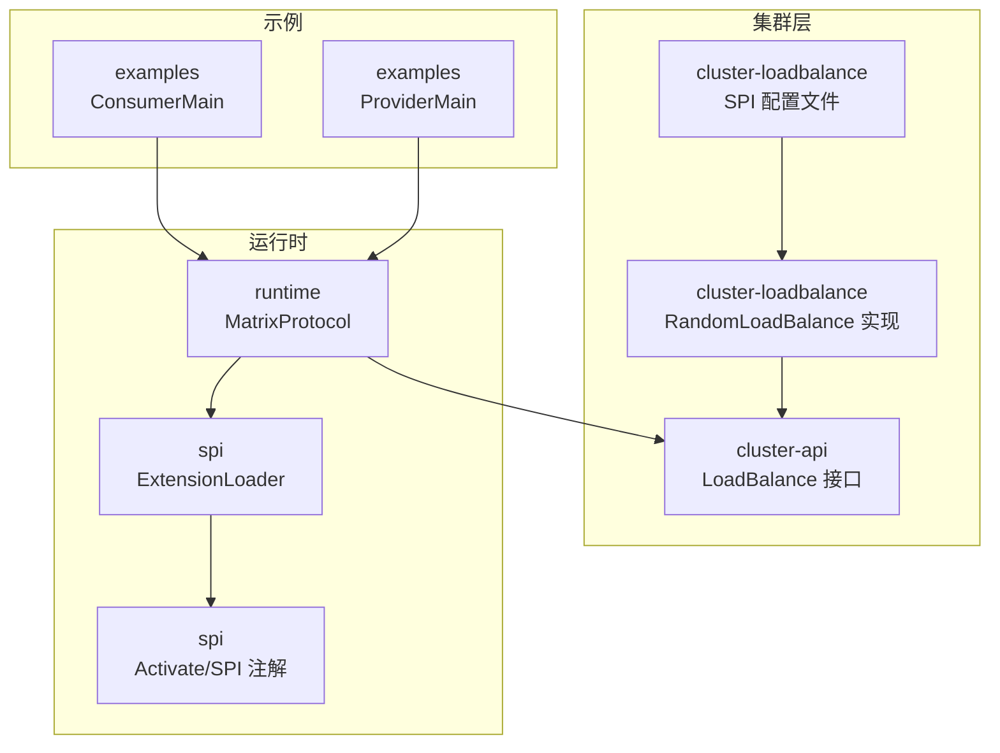
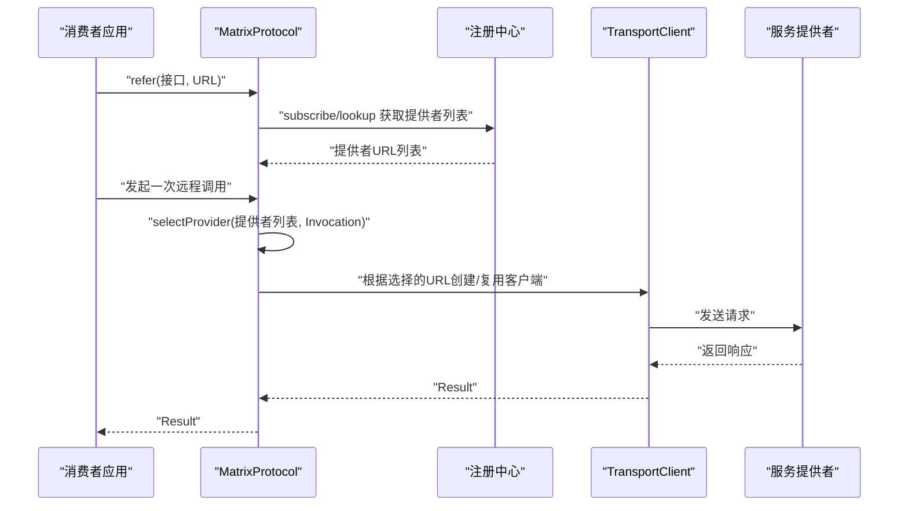
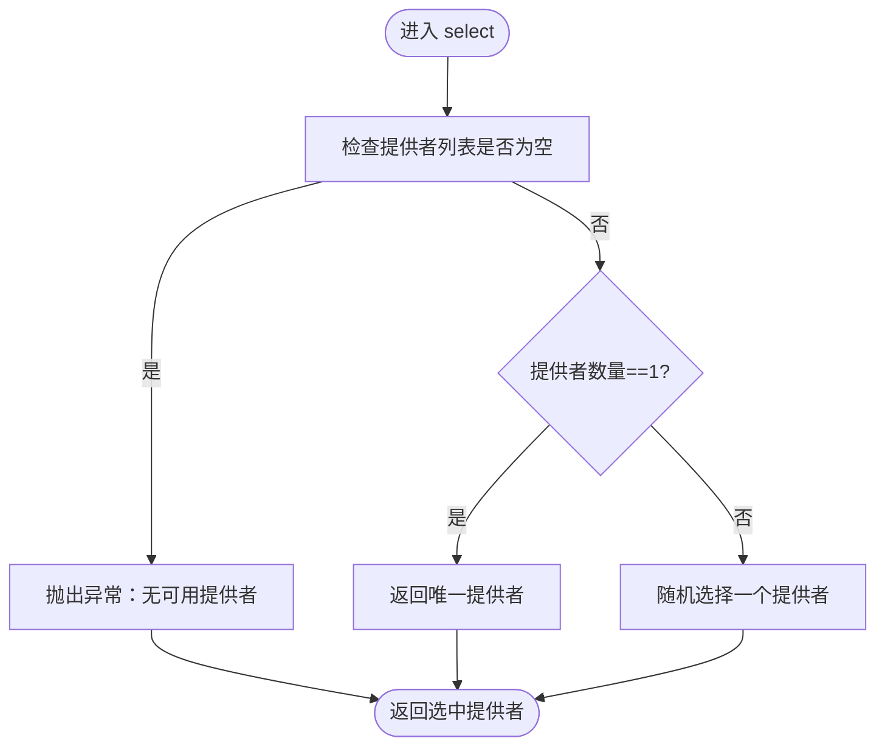
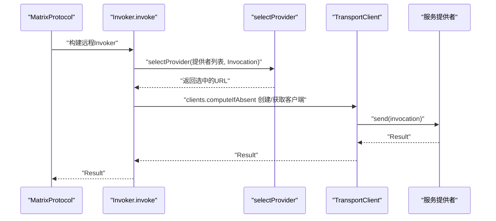
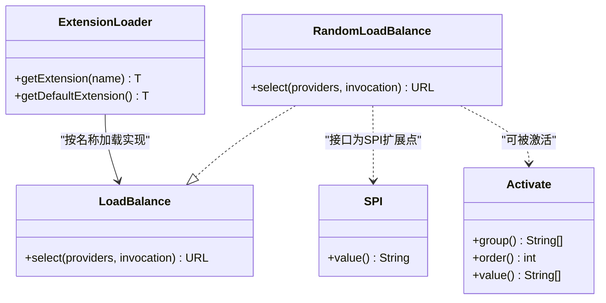
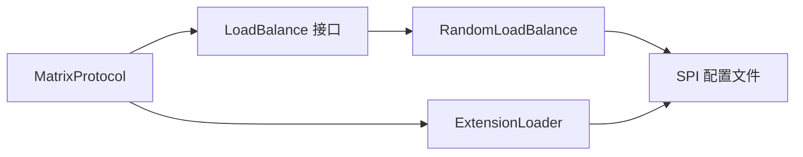

# 负载均衡

<cite>
**本文引用的文件**
- [LoadBalance.java](file://matrix-rpc-cluster/matrix-rpc-cluster-api/src/main/java/io/homeey/matrix/rpc/cluster/api/LoadBalance.java)
- [RandomLoadBalance.java](file://matrix-rpc-cluster/matrix-rpc-cluster-loadbalance/src/main/java/io/homeey/matrix/rpc/cluster/loadbalance/RandomLoadBalance.java)
- [io.homeey.matrix.rpc.cluster.api.LoadBalance](file://matrix-rpc-cluster/matrix-rpc-cluster-loadbalance/src/main/resources/META-INF/matrix/io.homeey.matrix.rpc.cluster.api.LoadBalance)
- [MatrixProtocol.java](file://matrix-rpc-runtime/src/main/java/io/homeey/matrix/rpc/runtime/MatrixProtocol.java)
- [ExtensionLoader.java](file://matrix-rpc-spi/src/main/java/io/homeey/matrix/rpc/spi/ExtensionLoader.java)
- [SPI.java](file://matrix-rpc-spi/src/main/java/io/homeey/matrix/rpc/spi/SPI.java)
- [Activate.java](file://matrix-rpc-spi/src/main/java/io/homeey/matrix/rpc/spi/Activate.java)
- [ConsumerMain.java](file://matrix-rpc-examples/src/main/java/io/homeey/matrix/rpc/example/consumer/ConsumerMain.java)
- [ProviderMain.java](file://matrix-rpc-examples/src/main/java/io/homeey/matrix/rpc/example/provider/ProviderMain.java)
</cite>

## 目录
1. [简介](#简介)
2. [项目结构](#项目结构)
3. [核心组件](#核心组件)
4. [架构总览](#架构总览)
5. [详细组件分析](#详细组件分析)
6. [依赖分析](#依赖分析)
7. [性能考虑](#性能考虑)
8. [故障排查指南](#故障排查指南)
9. [结论](#结论)
10. [附录](#附录)

## 简介
本节聚焦于矩阵RPC框架中的“负载均衡”能力，系统性阐述以下内容：
- LoadBalance接口的设计与职责边界
- RandomLoadBalance的实现细节与行为特征
- MatrixProtocol中selectProvider方法在调用链中的位置与调用关系
- 在集群环境中负载均衡的作用与重要性
- 基于SPI机制扩展其他策略（轮询、一致性哈希）的方法论
- 实际调用链路图示与关键路径定位

## 项目结构
围绕负载均衡功能，涉及的关键模块与文件如下：
- cluster-api：定义负载均衡SPI接口
- cluster-loadbalance：内置随机策略实现及SPI配置
- runtime：运行时协议实现，负责在消费者侧发起远程调用并执行负载均衡
- spi：SPI框架，提供扩展点加载与激活机制
- examples：示例程序，演示消费者如何引用远程服务

图表来源
- [LoadBalance.java](file://matrix-rpc-cluster/matrix-rpc-cluster-api/src/main/java/io/homeey/matrix/rpc/cluster/api/LoadBalance.java#L1-L18)
- [RandomLoadBalance.java](file://matrix-rpc-cluster/matrix-rpc-cluster-loadbalance/src/main/java/io/homeey/matrix/rpc/cluster/loadbalance/RandomLoadBalance.java#L1-L25)
- [io.homeey.matrix.rpc.cluster.api.LoadBalance](file://matrix-rpc-cluster/matrix-rpc-cluster-loadbalance/src/main/resources/META-INF/matrix/io.homeey.matrix.rpc.cluster.api.LoadBalance#L1-L1)
- [MatrixProtocol.java](file://matrix-rpc-runtime/src/main/java/io/homeey/matrix/rpc/runtime/MatrixProtocol.java#L89-L128)
- [ExtensionLoader.java](file://matrix-rpc-spi/src/main/java/io/homeey/matrix/rpc/spi/ExtensionLoader.java#L1-L177)
- [SPI.java](file://matrix-rpc-spi/src/main/java/io/homeey/matrix/rpc/spi/SPI.java#L1-L15)
- [Activate.java](file://matrix-rpc-spi/src/main/java/io/homeey/matrix/rpc/spi/Activate.java#L1-L29)
- [ConsumerMain.java](file://matrix-rpc-examples/src/main/java/io/homeey/matrix/rpc/example/consumer/ConsumerMain.java#L1-L37)
- [ProviderMain.java](file://matrix-rpc-examples/src/main/java/io/homeey/matrix/rpc/example/provider/ProviderMain.java#L1-L11)

章节来源
- [LoadBalance.java](file://matrix-rpc-cluster/matrix-rpc-cluster-api/src/main/java/io/homeey/matrix/rpc/cluster/api/LoadBalance.java#L1-L18)
- [RandomLoadBalance.java](file://matrix-rpc-cluster/matrix-rpc-cluster-loadbalance/src/main/java/io/homeey/matrix/rpc/cluster/loadbalance/RandomLoadBalance.java#L1-L25)
- [io.homeey.matrix.rpc.cluster.api.LoadBalance](file://matrix-rpc-cluster/matrix-rpc-cluster-loadbalance/src/main/resources/META-INF/matrix/io.homeey.matrix.rpc.cluster.api.LoadBalance#L1-L1)
- [MatrixProtocol.java](file://matrix-rpc-runtime/src/main/java/io/homeey/matrix/rpc/runtime/MatrixProtocol.java#L89-L128)
- [ExtensionLoader.java](file://matrix-rpc-spi/src/main/java/io/homeey/matrix/rpc/spi/ExtensionLoader.java#L1-L177)
- [SPI.java](file://matrix-rpc-spi/src/main/java/io/homeey/matrix/rpc/spi/SPI.java#L1-L15)
- [Activate.java](file://matrix-rpc-spi/src/main/java/io/homeey/matrix/rpc/spi/Activate.java#L1-L29)
- [ConsumerMain.java](file://matrix-rpc-examples/src/main/java/io/homeey/matrix/rpc/example/consumer/ConsumerMain.java#L1-L37)
- [ProviderMain.java](file://matrix-rpc-examples/src/main/java/io/homeey/matrix/rpc/example/provider/ProviderMain.java#L1-L11)

## 核心组件
- LoadBalance接口：定义从多个服务提供者URL中选择一个用于本次调用的策略接口，支持通过SPI扩展不同策略。
- RandomLoadBalance：当前内置的随机策略实现，具备简单、低开销、天然均衡的特点。
- MatrixProtocol：在消费者侧refer阶段维护服务提供者列表，并在每次远程调用时通过selectProvider完成选择；当前版本采用简化随机选择逻辑。
- ExtensionLoader：SPI加载器，负责从META-INF/matrix目录读取扩展配置，按名称加载具体实现，默认策略由接口上的SPI注解声明。
- Activate/SPI注解：标注扩展的激活条件与优先级，以及接口是否为SPI扩展点。

章节来源
- [LoadBalance.java](file://matrix-rpc-cluster/matrix-rpc-cluster-api/src/main/java/io/homeey/matrix/rpc/cluster/api/LoadBalance.java#L1-L18)
- [RandomLoadBalance.java](file://matrix-rpc-cluster/matrix-rpc-cluster-loadbalance/src/main/java/io/homeey/matrix/rpc/cluster/loadbalance/RandomLoadBalance.java#L1-L25)
- [MatrixProtocol.java](file://matrix-rpc-runtime/src/main/java/io/homeey/matrix/rpc/runtime/MatrixProtocol.java#L89-L128)
- [ExtensionLoader.java](file://matrix-rpc-spi/src/main/java/io/homeey/matrix/rpc/spi/ExtensionLoader.java#L1-L177)
- [SPI.java](file://matrix-rpc-spi/src/main/java/io/homeey/matrix/rpc/spi/SPI.java#L1-L15)
- [Activate.java](file://matrix-rpc-spi/src/main/java/io/homeey/matrix/rpc/spi/Activate.java#L1-L29)

## 架构总览
负载均衡在调用链中的位置与交互如下：
- 消费者通过MatrixProtocol.refer获取远程Invoker
- 每次调用时，MatrixProtocol根据当前已订阅的服务提供者列表，调用selectProvider进行选择
- 当前版本的selectProvider采用简化随机策略
- 可通过SPI机制替换为更复杂的负载均衡策略（如轮询、一致性哈希）

图表来源
- [MatrixProtocol.java](file://matrix-rpc-runtime/src/main/java/io/homeey/matrix/rpc/runtime/MatrixProtocol.java#L89-L128)

## 详细组件分析

### LoadBalance接口设计
- 设计要点
  - 输入：提供者URL列表与本次调用上下文（Invocation）
  - 输出：选中的提供者URL
  - 通过SPI注解标识该接口为扩展点，支持多实现并按名称加载
- 适用场景
  - 集群环境下，同一服务可能有多个提供者，需要在调用前决定目标节点
  - 可结合Invocation中的方法名、参数等信息实现更细粒度的选择策略（例如基于方法名的一致性哈希）

章节来源
- [LoadBalance.java](file://matrix-rpc-cluster/matrix-rpc-cluster-api/src/main/java/io/homeey/matrix/rpc/cluster/api/LoadBalance.java#L1-L18)
- [SPI.java](file://matrix-rpc-spi/src/main/java/io/homeey/matrix/rpc/spi/SPI.java#L1-L15)

### RandomLoadBalance实现
- 行为特征
  - 输入校验：空列表直接抛出异常
  - 单节点：直接返回唯一提供者
  - 多节点：随机索引选择
- 复杂度
  - 时间复杂度：O(1)
  - 空间复杂度：O(1)
- 优缺点
  - 优点：实现简单、无状态、天然均衡
  - 缺点：未考虑权重、健康状态、延迟等因素

图表来源
- [RandomLoadBalance.java](file://matrix-rpc-cluster/matrix-rpc-cluster-loadbalance/src/main/java/io/homeey/matrix/rpc/cluster/loadbalance/RandomLoadBalance.java#L1-L25)

章节来源
- [RandomLoadBalance.java](file://matrix-rpc-cluster/matrix-rpc-cluster-loadbalance/src/main/java/io/homeey/matrix/rpc/cluster/loadbalance/RandomLoadBalance.java#L1-L25)

### MatrixProtocol中的selectProvider调用链
- 关键路径
  - refer阶段：订阅服务变更，首次拉取提供者列表并缓存
  - invoke阶段：每次远程调用前，从缓存中取出提供者列表
  - 选择阶段：调用selectProvider进行节点选择
  - 客户端阶段：根据选择结果创建或复用TransportClient并发送请求
- 当前实现
  - selectProvider采用简化随机策略（Math.random）
  - 未来可替换为通过ExtensionLoader加载LoadBalance扩展点

图表来源
- [MatrixProtocol.java](file://matrix-rpc-runtime/src/main/java/io/homeey/matrix/rpc/runtime/MatrixProtocol.java#L89-L128)

章节来源
- [MatrixProtocol.java](file://matrix-rpc-runtime/src/main/java/io/homeey/matrix/rpc/runtime/MatrixProtocol.java#L89-L128)

### 基于SPI扩展其他策略（轮询、一致性哈希）
- 扩展步骤
  - 新建实现类并实现LoadBalance接口
  - 在META-INF/matrix目录下新增配置文件，键为策略名称，值为实现类全限定名
  - 如需在消费者侧生效，确保消费者侧通过ExtensionLoader按名称加载对应实现
- 典型策略建议
  - 轮询：按顺序遍历提供者列表，支持权重
  - 一致性哈希：对方法签名或参数做哈希，保证同key落到同一节点
  - 最少连接：选择当前活跃连接数最少的节点
  - 延迟感知：结合RTT或超时统计选择延迟较低的节点
- 与当前实现的关系
  - RandomLoadBalance通过SPI配置文件注册为“random”
  - 可以新增“round_robin”、“consistent_hash”等键，指向各自实现类

图表来源
- [LoadBalance.java](file://matrix-rpc-cluster/matrix-rpc-cluster-api/src/main/java/io/homeey/matrix/rpc/cluster/api/LoadBalance.java#L1-L18)
- [RandomLoadBalance.java](file://matrix-rpc-cluster/matrix-rpc-cluster-loadbalance/src/main/java/io/homeey/matrix/rpc/cluster/loadbalance/RandomLoadBalance.java#L1-L25)
- [SPI.java](file://matrix-rpc-spi/src/main/java/io/homeey/matrix/rpc/spi/SPI.java#L1-L15)
- [Activate.java](file://matrix-rpc-spi/src/main/java/io/homeey/matrix/rpc/spi/Activate.java#L1-L29)
- [ExtensionLoader.java](file://matrix-rpc-spi/src/main/java/io/homeey/matrix/rpc/spi/ExtensionLoader.java#L1-L177)

章节来源
- [io.homeey.matrix.rpc.cluster.api.LoadBalance](file://matrix-rpc-cluster/matrix-rpc-cluster-loadbalance/src/main/resources/META-INF/matrix/io.homeey.matrix.rpc.cluster.api.LoadBalance#L1-L1)
- [ExtensionLoader.java](file://matrix-rpc-spi/src/main/java/io/homeey/matrix/rpc/spi/ExtensionLoader.java#L1-L177)
- [SPI.java](file://matrix-rpc-spi/src/main/java/io/homeey/matrix/rpc/spi/SPI.java#L1-L15)
- [Activate.java](file://matrix-rpc-spi/src/main/java/io/homeey/matrix/rpc/spi/Activate.java#L1-L29)

## 依赖分析
- 组件耦合
  - MatrixProtocol依赖注册中心提供的提供者列表，并在调用前进行选择
  - LoadBalance作为SPI扩展点，通过ExtensionLoader按名称加载
  - RandomLoadBalance通过SPI配置文件注册为“random”，并在消费者侧可被激活
- 外部依赖
  - 注册中心：提供者发现与订阅
  - 传输层：基于TransportClient发送请求
- 潜在循环依赖
  - 当前结构为单向依赖，不存在循环依赖风险

图表来源
- [MatrixProtocol.java](file://matrix-rpc-runtime/src/main/java/io/homeey/matrix/rpc/runtime/MatrixProtocol.java#L89-L128)
- [LoadBalance.java](file://matrix-rpc-cluster/matrix-rpc-cluster-api/src/main/java/io/homeey/matrix/rpc/cluster/api/LoadBalance.java#L1-L18)
- [RandomLoadBalance.java](file://matrix-rpc-cluster/matrix-rpc-cluster-loadbalance/src/main/java/io/homeey/matrix/rpc/cluster/loadbalance/RandomLoadBalance.java#L1-L25)
- [io.homeey.matrix.rpc.cluster.api.LoadBalance](file://matrix-rpc-cluster/matrix-rpc-cluster-loadbalance/src/main/resources/META-INF/matrix/io.homeey.matrix.rpc.cluster.api.LoadBalance#L1-L1)
- [ExtensionLoader.java](file://matrix-rpc-spi/src/main/java/io/homeey/matrix/rpc/spi/ExtensionLoader.java#L1-L177)

章节来源
- [MatrixProtocol.java](file://matrix-rpc-runtime/src/main/java/io/homeey/matrix/rpc/runtime/MatrixProtocol.java#L89-L128)
- [ExtensionLoader.java](file://matrix-rpc-spi/src/main/java/io/homeey/matrix/rpc/spi/ExtensionLoader.java#L1-L177)

## 性能考虑
- 随机策略
  - 时间复杂度O(1)，空间复杂度O(1)，开销极低
  - 对于均匀分布的请求，具备天然的负载均衡效果
- 可扩展策略
  - 轮询：O(1)，支持权重，适合稳定集群
  - 一致性哈希：O(1)，适合热点数据，减少迁移
  - 最少连接/延迟感知：需要额外统计与查询，时间复杂度略增
- 运行时优化建议
  - 将提供者列表缓存在MatrixProtocol中，避免频繁拉取
  - 客户端连接池复用，降低握手成本
  - 在高并发场景下，选择策略应尽量无锁或轻量

## 故障排查指南
- “无可用提供者”异常
  - 现象：调用时提示无可用提供者
  - 原因：注册中心未返回任何提供者URL
  - 处理：确认服务是否已正确注册、网络连通性、订阅是否成功
- 随机策略导致热点
  - 现象：某些提供者压力过大
  - 原因：随机策略未考虑权重与健康状态
  - 处理：切换至轮询或一致性哈希策略，并配置权重
- SPI加载失败
  - 现象：找不到扩展实现或默认策略
  - 原因：配置文件缺失或名称不匹配
  - 处理：检查META-INF/matrix下的配置文件键名与实现类全限定名

章节来源
- [MatrixProtocol.java](file://matrix-rpc-runtime/src/main/java/io/homeey/matrix/rpc/runtime/MatrixProtocol.java#L101-L123)
- [RandomLoadBalance.java](file://matrix-rpc-cluster/matrix-rpc-cluster-loadbalance/src/main/java/io/homeey/matrix/rpc/cluster/loadbalance/RandomLoadBalance.java#L1-L25)
- [io.homeey.matrix.rpc.cluster.api.LoadBalance](file://matrix-rpc-cluster/matrix-rpc-cluster-loadbalance/src/main/resources/META-INF/matrix/io.homeey.matrix.rpc.cluster.api.LoadBalance#L1-L1)

## 结论
- LoadBalance接口提供了清晰的扩展点，RandomLoadBalance作为开箱即用的默认策略，满足快速落地需求
- MatrixProtocol在调用链中恰当地将负载均衡置于“选择阶段”，既保证了灵活性，又保持了调用流程的简洁
- 通过SPI机制，可以平滑扩展轮询、一致性哈希等策略，以适配更复杂的集群场景
- 建议在生产环境中结合业务特征选择合适的策略，并配合健康检查与限流熔断，提升整体稳定性

## 附录
- 示例程序入口
  - 消费者：通过RpcReference.refer获取远程服务代理
  - 提供者：通过RpcService.export暴露服务
- 关键调用路径参考
  - refer阶段：服务订阅与首次提供者列表获取
  - invoke阶段：每次调用前的selectProvider选择
  - 客户端阶段：TransportClient发送请求

章节来源
- [ConsumerMain.java](file://matrix-rpc-examples/src/main/java/io/homeey/matrix/rpc/example/consumer/ConsumerMain.java#L1-L37)
- [ProviderMain.java](file://matrix-rpc-examples/src/main/java/io/homeey/matrix/rpc/example/provider/ProviderMain.java#L1-L11)
- [MatrixProtocol.java](file://matrix-rpc-runtime/src/main/java/io/homeey/matrix/rpc/runtime/MatrixProtocol.java#L89-L128)