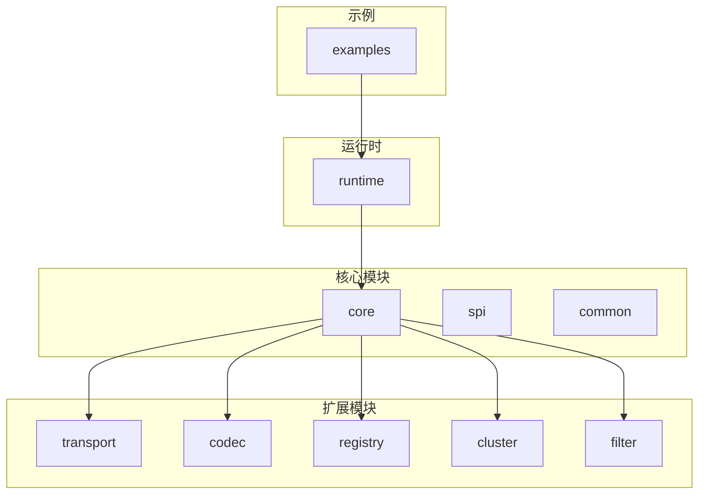

# 贡献指南

<cite>
**本文档中引用的文件**  
- [README.md](file://README.md)
- [pom.xml](file://pom.xml)
- [.gitignore](file://.gitignore)
- [ConsumerMain.java](file://matrix-rpc-examples/src/main/java/io/homeey/matrix/rpc/example/consumer/ConsumerMain.java)
- [ProviderMain.java](file://matrix-rpc-examples/src/main/java/io/homeey/matrix/rpc/example/provider/ProviderMain.java)
- [RpcException.java](file://matrix-rpc-common/src/main/java/io/homeey/matrix/rpc/common/RpcException.java)
- [matrix-rpc-codec-protobuf/pom.xml](file://matrix-rpc-codec/matrix-rpc-codec-protobuf/pom.xml)
</cite>

## 目录
1. [简介](#简介)
2. [代码贡献流程](#代码贡献流程)
3. [测试要求](#测试要求)
4. [代码风格与提交规范](#代码风格与提交规范)
5. [构建与测试命令](#构建与测试命令)
6. [项目结构概览](#项目结构概览)
7. [核心模块说明](#核心模块说明)
8. [常见问题](#常见问题)

## 简介
Matrix RPC 是一个轻量级、高性能、云原生的分布式 RPC 框架，旨在为开发者提供简洁高效的远程服务调用能力。本贡献指南旨在帮助开发者快速了解如何为项目贡献代码，降低参与门槛，促进社区协作。

**Section sources**
- [README.md](file://README.md#L1-L277)

## 代码贡献流程
为 Matrix RPC 项目贡献代码，请遵循以下标准流程：

1. **Fork 仓库**：在 GitHub 上 Fork `matrix-rpc` 仓库到您的个人账户。
2. **克隆代码**：将您 Fork 的仓库克隆到本地。
   ```bash
   git clone https://github.com/your-username/matrix-rpc.git
   ```
3. **创建特性分支**：基于 `main` 分支创建新的特性分支，命名应清晰描述功能。
   ```bash
   git checkout -b feature/your-feature-name
   ```
4. **编写代码与测试**：实现功能并编写相应的单元测试和集成测试。
5. **提交更改**：遵循提交信息规范进行提交。
   ```bash
   git add .
   git commit -m "feat: add new load balance algorithm"
   ```
6. **推送分支**：将本地分支推送到您的远程仓库。
   ```bash
   git push origin feature/your-feature-name
   ```
7. **创建 Pull Request**：在 GitHub 上从您的分支向原仓库的 `main` 分支发起 Pull Request，并填写详细的描述说明。

**Section sources**
- [README.md](file://README.md#L228-L277)

## 测试要求
所有代码贡献必须包含充分的测试覆盖，以确保功能的正确性和稳定性。

- **单元测试**：每个新功能或修复都应包含对应的单元测试，使用 JUnit 5 编写，位于 `src/test/java` 目录下。
- **集成测试**：对于涉及多个模块交互的功能，需提供集成测试。
- **测试覆盖率**：建议核心模块的测试覆盖率不低于 80%。使用 JaCoCo 等工具进行覆盖率检测。
- **示例参考**：可参考 `matrix-rpc-examples` 模块中的测试用例设计。

**Section sources**
- [pom.xml](file://pom.xml#L44-L46)
- [ConsumerMain.java](file://matrix-rpc-examples/src/main/java/io/homeey/matrix/rpc/example/consumer/ConsumerMain.java#L1-L37)
- [ProviderMain.java](file://matrix-rpc-examples/src/main/java/io/homeey/matrix/rpc/example/provider/ProviderMain.java#L1-L11)

## 代码风格与提交规范
为保持代码一致性，请遵守以下规范：

### 代码风格
- 使用 Java 21 特性。
- 遵循 Google Java Style Guide。
- 使用 Lombok 简化样板代码（如 `@Data`, `@AllArgsConstructor`）。
- 所有公共 API 必须添加 Javadoc 注释。

### 提交信息规范
提交信息应采用 [Conventional Commits](https://www.conventionalcommits.org/) 规范，格式如下：
```
<type>: <subject>
```
常用类型包括：
- `feat`：新增功能
- `fix`：修复缺陷
- `docs`：文档更新
- `style`：代码格式调整（不影响逻辑）
- `refactor`：代码重构
- `test`：测试相关改动
- `chore`：构建过程或辅助工具变动

**Section sources**
- [pom.xml](file://pom.xml#L30-L32)
- [RpcException.java](file://matrix-rpc-common/src/main/java/io/homeey/matrix/rpc/common/RpcException.java#L1-L24)

## 构建与测试命令
使用 Maven 进行项目构建和测试：

- **构建项目**：
  ```bash
  mvn clean install
  ```

- **跳过测试构建**：
  ```bash
  mvn clean install -DskipTests
  ```

- **运行测试**：
  ```bash
  mvn test
  ```

- **生成测试覆盖率报告**：
  ```bash
  mvn test jacoco:report
  ```

- **清理构建产物**：
  ```bash
  mvn clean
  ```

构建成功后，各模块的 JAR 包将生成在 `target/` 目录下。

**Section sources**
- [pom.xml](file://pom.xml#L187-L217)
- [.gitignore](file://.gitignore#L1-L41)

## 项目结构概览
Matrix RPC 采用模块化设计，各模块职责清晰，便于扩展和维护。



**Diagram sources**
- [pom.xml](file://pom.xml#L13-L26)
- [README.md](file://README.md#L61-L102)

## 核心模块说明
以下是项目中关键模块的功能说明：

### matrix-rpc-core
RPC 核心调度模块，定义了 `Invoker`、`Protocol` 等核心抽象，是整个框架的调度中枢。

### matrix-rpc-spi
自研 SPI 机制，支持扩展点的自动加载、优先级排序和条件激活，替代 JDK 原生 ServiceLoader。

### matrix-rpc-transport-netty
基于 Netty 实现的网络通信层，提供高性能的 TCP 传输能力。

### matrix-rpc-codec-protobuf
使用 Protobuf 实现的序列化模块，支持高效的数据编码与解码。

### matrix-rpc-registry-nacos
集成 Nacos 的服务注册与发现模块，支持动态服务治理。

### matrix-rpc-examples
提供完整的生产者与消费者示例，帮助开发者快速上手。

**Section sources**
- [README.md](file://README.md#L107-L223)
- [pom.xml](file://pom.xml#L52-L185)

## 常见问题
### 如何添加新的负载均衡算法？
1. 在 `matrix-rpc-cluster-loadbalance` 模块中实现 `LoadBalance` 接口。
2. 在 `META-INF/matrix/io.homeey.matrix.rpc.cluster.api.LoadBalance` 文件中注册实现类。
3. 使用 `@SPI` 注解标记扩展点。

### 如何更换序列化方式？
通过配置指定 Codec 实现，如 Protobuf、Kryo 等，框架会自动加载对应 SPI 实现。

### 是否支持 Spring Boot 集成？
目前处于演进蓝图的 Phase 3，未来将提供 `@RpcService` 和 `@RpcReference` 注解支持自动装配。

**Section sources**
- [README.md](file://README.md#L244-L259)
- [matrix-rpc-cluster-loadbalance/src/main/resources/META-INF/matrix/io.homeey.matrix.rpc.cluster.api.LoadBalance](file://matrix-rpc-cluster/matrix-rpc-cluster-loadbalance/src/main/resources/META-INF/matrix/io.homeey.matrix.rpc.cluster.api.LoadBalance#L1)