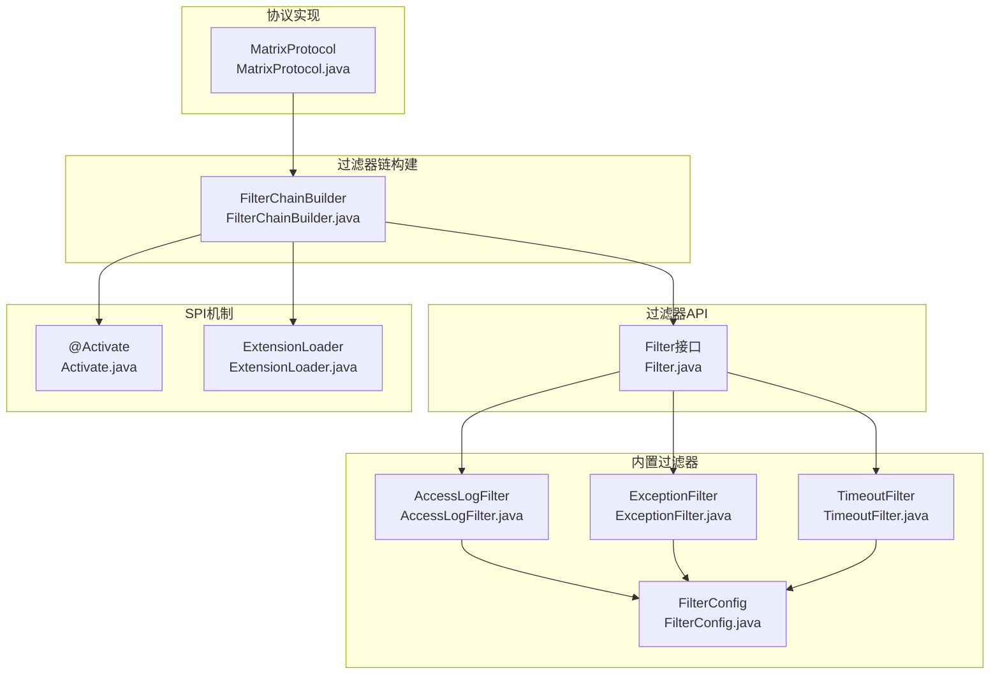
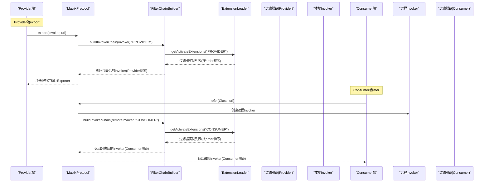
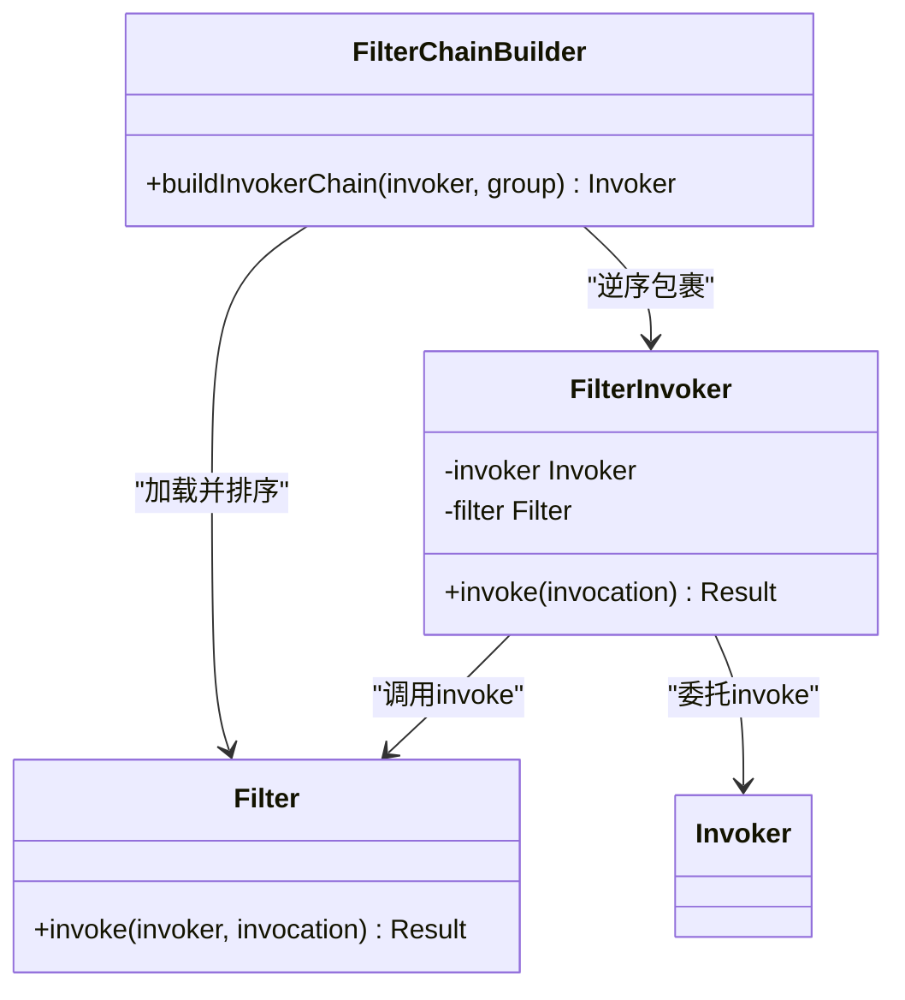
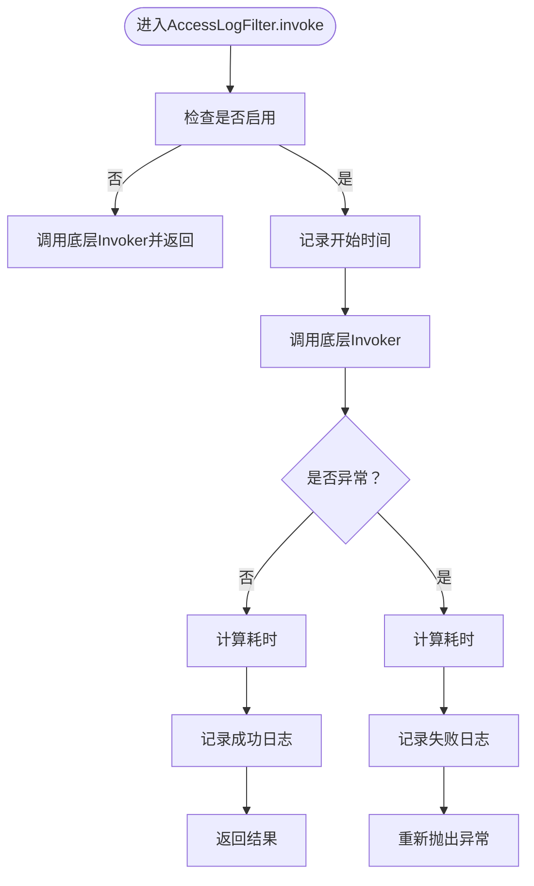
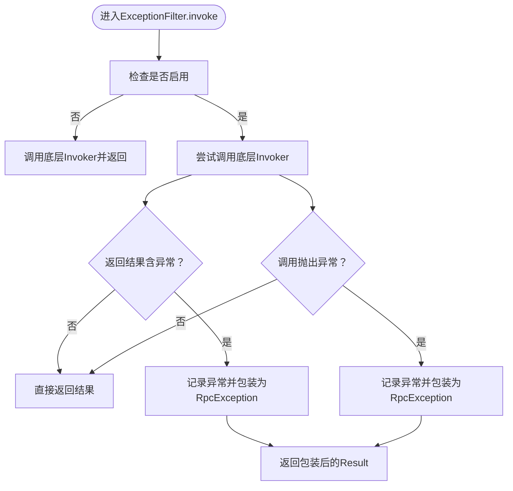
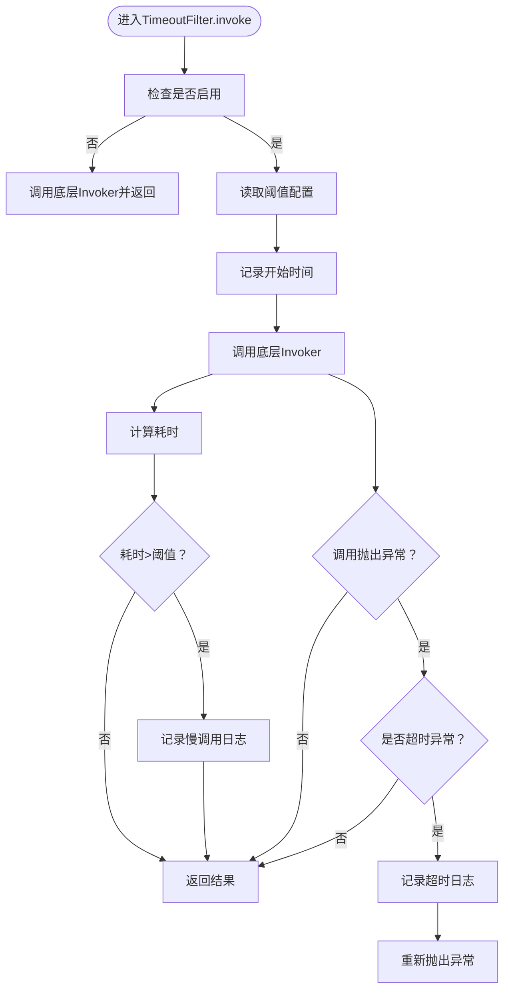
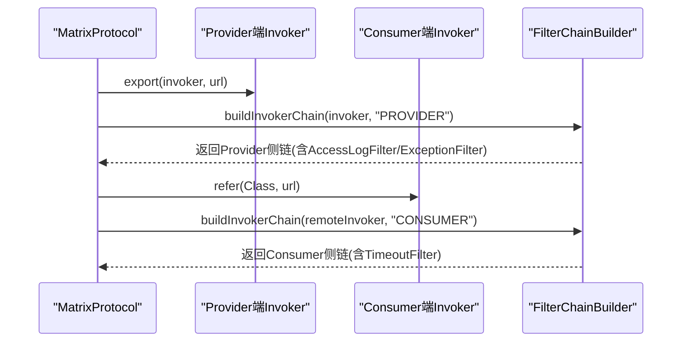
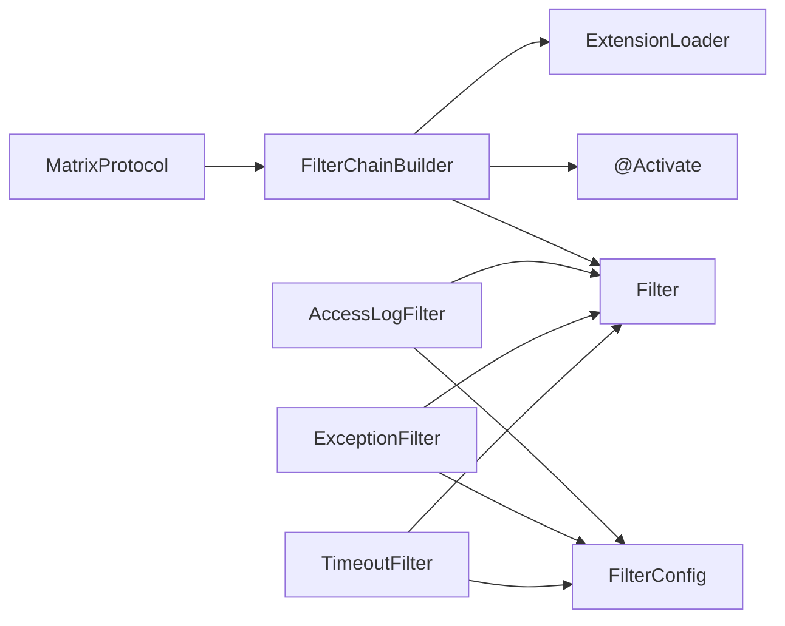

# 过滤器链

<cite>
**本文引用的文件**
- [Filter.java](file://matrix-rpc-filter/matrix-rpc-filter-api/src/main/java/io/homeey/matrix/rpc/filter/Filter.java)
- [FilterChainBuilder.java](file://matrix-rpc-runtime/src/main/java/io/homeey/matrix/rpc/runtime/support/FilterChainBuilder.java)
- [AccessLogFilter.java](file://matrix-rpc-filter/matrix-rpc-filter-builtin/src/main/java/io/homeey/matrix/rpc/filter/builtin/AccessLogFilter.java)
- [ExceptionFilter.java](file://matrix-rpc-filter/matrix-rpc-filter-builtin/src/main/java/io/homeey/matrix/rpc/filter/builtin/ExceptionFilter.java)
- [TimeoutFilter.java](file://matrix-rpc-filter/matrix-rpc-filter-builtin/src/main/java/io/homeey/matrix/rpc/filter/builtin/TimeoutFilter.java)
- [FilterConfig.java](file://matrix-rpc-filter/matrix-rpc-filter-builtin/src/main/java/io/homeey/matrix/rpc/filter/builtin/FilterConfig.java)
- [MatrixProtocol.java](file://matrix-rpc-runtime/src/main/java/io/homeey/matrix/rpc/runtime/MatrixProtocol.java)
- [Activate.java](file://matrix-rpc-spi/src/main/java/io/homeey/matrix/rpc/spi/Activate.java)
- [ExtensionLoader.java](file://matrix-rpc-spi/src/main/java/io/homeey/matrix/rpc/spi/ExtensionLoader.java)
- [README.md](file://README.md)
</cite>

## 目录
1. [简介](#简介)
2. [项目结构](#项目结构)
3. [核心组件](#核心组件)
4. [架构总览](#架构总览)
5. [详细组件分析](#详细组件分析)
6. [依赖关系分析](#依赖关系分析)
7. [性能考量](#性能考量)
8. [故障排查指南](#故障排查指南)
9. [结论](#结论)
10. [附录](#附录)

## 简介
本篇文档围绕矩阵式RPC框架的“过滤器链”能力展开，系统阐述：
- Filter接口的invoke方法职责与调用约定
- 责任链模式通过FilterChainBuilder构建调用链的机制
- 内置过滤器AccessLogFilter、ExceptionFilter、TimeoutFilter的实现要点与作用范围
- 结合MatrixProtocol的export与refer方法，说明Provider端与Consumer端过滤器链的构建时机与执行顺序
- 如何开发自定义过滤器并使用@Activate注解进行条件激活
- 过滤器链在实现AOP式功能（日志、监控、熔断）中的核心地位

## 项目结构
围绕过滤器链的相关模块与文件分布如下：
- 过滤器API：定义Filter接口与SPI标注
- 过滤器内置实现：AccessLogFilter、ExceptionFilter、TimeoutFilter及FilterConfig配置管理
- 过滤器链构建器：FilterChainBuilder负责按组别与优先级组装责任链
- 协议实现：MatrixProtocol在Provider端与Consumer端分别构建过滤器链
- SPI机制：Activate注解与ExtensionLoader负责条件激活与扩展加载

图表来源
- [Filter.java](file://matrix-rpc-filter/matrix-rpc-filter-api/src/main/java/io/homeey/matrix/rpc/filter/Filter.java#L1-L24)
- [AccessLogFilter.java](file://matrix-rpc-filter/matrix-rpc-filter-builtin/src/main/java/io/homeey/matrix/rpc/filter/builtin/AccessLogFilter.java#L1-L72)
- [ExceptionFilter.java](file://matrix-rpc-filter/matrix-rpc-filter-builtin/src/main/java/io/homeey/matrix/rpc/filter/builtin/ExceptionFilter.java#L1-L82)
- [TimeoutFilter.java](file://matrix-rpc-filter/matrix-rpc-filter-builtin/src/main/java/io/homeey/matrix/rpc/filter/builtin/TimeoutFilter.java#L1-L87)
- [FilterConfig.java](file://matrix-rpc-filter/matrix-rpc-filter-builtin/src/main/java/io/homeey/matrix/rpc/filter/builtin/FilterConfig.java#L1-L86)
- [FilterChainBuilder.java](file://matrix-rpc-runtime/src/main/java/io/homeey/matrix/rpc/runtime/support/FilterChainBuilder.java#L1-L53)
- [MatrixProtocol.java](file://matrix-rpc-runtime/src/main/java/io/homeey/matrix/rpc/runtime/MatrixProtocol.java#L1-L190)
- [Activate.java](file://matrix-rpc-spi/src/main/java/io/homeey/matrix/rpc/spi/Activate.java#L1-L29)
- [ExtensionLoader.java](file://matrix-rpc-spi/src/main/java/io/homeey/matrix/rpc/spi/ExtensionLoader.java#L1-L231)

章节来源
- [README.md](file://README.md#L103-L183)

## 核心组件
- Filter接口：定义统一的invoke方法，接收Invoker与Invocation，返回Result；作为责任链节点的契约。
- FilterChainBuilder：基于SPI扩展加载器按组别筛选并按@Activate.order排序，构建逆序包裹的责任链Invoker。
- MatrixProtocol：在Provider端export时为本地Invoker包裹Provider侧过滤器链，在Consumer端refer时为远程Invoker包裹Consumer侧过滤器链。
- Activate与ExtensionLoader：提供条件激活与扩展发现能力，支持按group与order组织过滤器链。

章节来源
- [Filter.java](file://matrix-rpc-filter/matrix-rpc-filter-api/src/main/java/io/homeey/matrix/rpc/filter/Filter.java#L1-L24)
- [FilterChainBuilder.java](file://matrix-rpc-runtime/src/main/java/io/homeey/matrix/rpc/runtime/support/FilterChainBuilder.java#L1-L53)
- [MatrixProtocol.java](file://matrix-rpc-runtime/src/main/java/io/homeey/matrix/rpc/runtime/MatrixProtocol.java#L52-L128)
- [Activate.java](file://matrix-rpc-spi/src/main/java/io/homeey/matrix/rpc/spi/Activate.java#L1-L29)
- [ExtensionLoader.java](file://matrix-rpc-spi/src/main/java/io/homeey/matrix/rpc/spi/ExtensionLoader.java#L161-L213)

## 架构总览
过滤器链在Provider端与Consumer端的构建与执行路径如下：

图表来源
- [MatrixProtocol.java](file://matrix-rpc-runtime/src/main/java/io/homeey/matrix/rpc/runtime/MatrixProtocol.java#L52-L128)
- [FilterChainBuilder.java](file://matrix-rpc-runtime/src/main/java/io/homeey/matrix/rpc/runtime/support/FilterChainBuilder.java#L23-L39)
- [ExtensionLoader.java](file://matrix-rpc-spi/src/main/java/io/homeey/matrix/rpc/spi/ExtensionLoader.java#L161-L213)

## 详细组件分析

### Filter接口与invoke方法
- 角色定位：Filter是责任链节点，每个过滤器通过invoke方法决定是否继续调用下一个节点或提前返回。
- 调用约定：invoke接收当前Invoker与Invocation，返回Result；若需要短路，可在自身逻辑中直接返回Result或抛出异常。
- SPI标注：Filter接口带有@SPI，表明其为可扩展的SPI接口，由ExtensionLoader加载具体实现。

章节来源
- [Filter.java](file://matrix-rpc-filter/matrix-rpc-filter-api/src/main/java/io/homeey/matrix/rpc/filter/Filter.java#L1-L24)

### FilterChainBuilder：责任链构建器
- 组装策略：
  - 通过ExtensionLoader.getActivateExtensions(group)按组别筛选已激活的过滤器实现。
  - 使用@Activate.order进行升序排序，随后逆序包裹到原始Invoker上，形成责任链。
- 包裹实现：内部使用FilterInvoker记录当前Invoker与当前Filter，调用时先执行Filter.invoke，再委托给下一个Invoker。
- 执行方向：由于逆序包裹，最先执行的是order最小的过滤器，最后执行的是最靠近底层Invoker的过滤器。

图表来源
- [FilterChainBuilder.java](file://matrix-rpc-runtime/src/main/java/io/homeey/matrix/rpc/runtime/support/FilterChainBuilder.java#L23-L53)
- [Filter.java](file://matrix-rpc-filter/matrix-rpc-filter-api/src/main/java/io/homeey/matrix/rpc/filter/Filter.java#L1-L24)

章节来源
- [FilterChainBuilder.java](file://matrix-rpc-runtime/src/main/java/io/homeey/matrix/rpc/runtime/support/FilterChainBuilder.java#L23-L53)

### 内置过滤器：AccessLogFilter（Provider端）
- 作用：在Provider端记录RPC调用的访问日志，包含服务名、方法名、参数类型、耗时与结果状态。
- 激活条件：@Activate(group={"PROVIDER"}, order=100)，默认启用。
- 配置开关：通过FilterConfig.isEnabled("accesslog")控制是否启用；默认开启。
- 执行流程：记录开始时间，调用底层Invoker，计算耗时，输出成功/失败日志；异常时同样记录失败并重新抛出。

图表来源
- [AccessLogFilter.java](file://matrix-rpc-filter/matrix-rpc-filter-builtin/src/main/java/io/homeey/matrix/rpc/filter/builtin/AccessLogFilter.java#L28-L72)
- [FilterConfig.java](file://matrix-rpc-filter/matrix-rpc-filter-builtin/src/main/java/io/homeey/matrix/rpc/filter/builtin/FilterConfig.java#L21-L41)

章节来源
- [AccessLogFilter.java](file://matrix-rpc-filter/matrix-rpc-filter-builtin/src/main/java/io/homeey/matrix/rpc/filter/builtin/AccessLogFilter.java#L28-L72)
- [FilterConfig.java](file://matrix-rpc-filter/matrix-rpc-filter-builtin/src/main/java/io/homeey/matrix/rpc/filter/builtin/FilterConfig.java#L21-L41)

### 内置过滤器：ExceptionFilter（Provider端）
- 作用：在Provider端捕获并处理服务实现抛出的异常，将非RpcException包装为RpcException，记录异常日志，保护服务端稳定。
- 激活条件：@Activate(group={"PROVIDER"}, order=200)，默认启用。
- 配置开关：通过FilterConfig.isEnabled("exception")控制是否启用；默认开启。
- 执行流程：调用底层Invoker，检查Result中是否包含异常；若是，记录并包装后返回；若在调用过程中抛出异常，同样记录并包装后返回。

图表来源
- [ExceptionFilter.java](file://matrix-rpc-filter/matrix-rpc-filter-builtin/src/main/java/io/homeey/matrix/rpc/filter/builtin/ExceptionFilter.java#L23-L82)
- [FilterConfig.java](file://matrix-rpc-filter/matrix-rpc-filter-builtin/src/main/java/io/homeey/matrix/rpc/filter/builtin/FilterConfig.java#L21-L41)

章节来源
- [ExceptionFilter.java](file://matrix-rpc-filter/matrix-rpc-filter-builtin/src/main/java/io/homeey/matrix/rpc/filter/builtin/ExceptionFilter.java#L23-L82)
- [FilterConfig.java](file://matrix-rpc-filter/matrix-rpc-filter-builtin/src/main/java/io/homeey/matrix/rpc/filter/builtin/FilterConfig.java#L21-L41)

### 内置过滤器：TimeoutFilter（Consumer端）
- 作用：在Consumer端检测RPC调用耗时，记录慢调用与超时相关信息，辅助可观测性与性能分析。
- 激活条件：@Activate(group={"CONSUMER"}, order=100)，默认启用。
- 配置开关：通过FilterConfig.isEnabled("timeout")控制是否启用；默认开启。
- 阈值配置：通过FilterConfig.getLongConfig("timeout","threshold",1000)读取慢调用阈值（毫秒），默认1000ms。
- 执行流程：记录开始时间，调用底层Invoker，计算耗时；若超过阈值则记录慢调用；若底层抛出超时相关异常则记录超时信息并重新抛出。

图表来源
- [TimeoutFilter.java](file://matrix-rpc-filter/matrix-rpc-filter-builtin/src/main/java/io/homeey/matrix/rpc/filter/builtin/TimeoutFilter.java#L25-L87)
- [FilterConfig.java](file://matrix-rpc-filter/matrix-rpc-filter-builtin/src/main/java/io/homeey/matrix/rpc/filter/builtin/FilterConfig.java#L43-L86)

章节来源
- [TimeoutFilter.java](file://matrix-rpc-filter/matrix-rpc-filter-builtin/src/main/java/io/homeey/matrix/rpc/filter/builtin/TimeoutFilter.java#L25-L87)
- [FilterConfig.java](file://matrix-rpc-filter/matrix-rpc-filter-builtin/src/main/java/io/homeey/matrix/rpc/filter/builtin/FilterConfig.java#L43-L86)

### Provider端与Consumer端过滤器链构建时机与顺序
- Provider端（export）：
  - 在MatrixProtocol.export中，先初始化传输与注册中心，然后对传入的Invoker调用FilterChainBuilder.buildInvokerChain(invoker, "PROVIDER")，得到包裹了Provider侧过滤器链的Invoker，再注册服务。
  - 因此，Provider端的调用链顺序为：外层过滤器（低order）→…→AccessLogFilter（order=100）→ExceptionFilter（order=200）→底层Invoker。
- Consumer端（refer）：
  - 在MatrixProtocol.refer中，创建远程Invoker后，调用FilterChainBuilder.buildInvokerChain(remoteInvoker, "CONSUMER")，得到包裹了Consumer侧过滤器链的Invoker。
  - 因此，Consumer端的调用链顺序为：外层过滤器（低order）→…→TimeoutFilter（order=100）→底层远程Invoker。

图表来源
- [MatrixProtocol.java](file://matrix-rpc-runtime/src/main/java/io/homeey/matrix/rpc/runtime/MatrixProtocol.java#L52-L128)
- [FilterChainBuilder.java](file://matrix-rpc-runtime/src/main/java/io/homeey/matrix/rpc/runtime/support/FilterChainBuilder.java#L23-L39)

章节来源
- [MatrixProtocol.java](file://matrix-rpc-runtime/src/main/java/io/homeey/matrix/rpc/runtime/MatrixProtocol.java#L52-L128)

### 开发自定义过滤器指南
- 实现Filter接口并提供invoke方法，按需决定是否继续调用下一个过滤器或提前返回。
- 使用@Activate注解声明：
  - group：限定生效范围（如"PROVIDER"或"CONSUMER"），默认全生效。
  - order：数值越小越靠前，用于控制过滤器链顺序。
  - value：预留条件键（当前未使用）。
- 通过SPI配置文件暴露扩展：
  - 在资源目录META-INF/matrix下新增文件，内容形如“扩展名=完全限定类名”，以便ExtensionLoader加载。
- 配置开关与参数：
  - 使用FilterConfig进行开关控制与参数读取，遵循“matrix.filter.{name}.enabled”、“matrix.filter.{name}.threshold”等命名规范。
- 最佳实践：
  - 将通用横切关注点（日志、监控、限流、熔断）以过滤器形式实现，保持业务代码干净。
  - 合理设置order，确保前置过滤器（如鉴权、限流）在后置过滤器（如日志、指标）之前执行。

章节来源
- [Filter.java](file://matrix-rpc-filter/matrix-rpc-filter-api/src/main/java/io/homeey/matrix/rpc/filter/Filter.java#L1-L24)
- [Activate.java](file://matrix-rpc-spi/src/main/java/io/homeey/matrix/rpc/spi/Activate.java#L1-L29)
- [ExtensionLoader.java](file://matrix-rpc-spi/src/main/java/io/homeey/matrix/rpc/spi/ExtensionLoader.java#L106-L160)
- [FilterConfig.java](file://matrix-rpc-filter/matrix-rpc-filter-builtin/src/main/java/io/homeey/matrix/rpc/filter/builtin/FilterConfig.java#L21-L86)

## 依赖关系分析
- FilterChainBuilder依赖：
  - SPI扩展加载器ExtensionLoader：用于按组别筛选并实例化过滤器实现。
  - Activate注解：用于条件激活与排序依据。
- MatrixProtocol依赖：
  - FilterChainBuilder：在Provider端与Consumer端分别构建过滤器链。
- 内置过滤器依赖：
  - FilterConfig：统一的配置读取与开关控制。
  - Filter接口：作为责任链节点契约。

图表来源
- [MatrixProtocol.java](file://matrix-rpc-runtime/src/main/java/io/homeey/matrix/rpc/runtime/MatrixProtocol.java#L52-L128)
- [FilterChainBuilder.java](file://matrix-rpc-runtime/src/main/java/io/homeey/matrix/rpc/runtime/support/FilterChainBuilder.java#L23-L39)
- [ExtensionLoader.java](file://matrix-rpc-spi/src/main/java/io/homeey/matrix/rpc/spi/ExtensionLoader.java#L161-L213)
- [Activate.java](file://matrix-rpc-spi/src/main/java/io/homeey/matrix/rpc/spi/Activate.java#L1-L29)
- [AccessLogFilter.java](file://matrix-rpc-filter/matrix-rpc-filter-builtin/src/main/java/io/homeey/matrix/rpc/filter/builtin/AccessLogFilter.java#L28-L72)
- [ExceptionFilter.java](file://matrix-rpc-filter/matrix-rpc-filter-builtin/src/main/java/io/homeey/matrix/rpc/filter/builtin/ExceptionFilter.java#L23-L82)
- [TimeoutFilter.java](file://matrix-rpc-filter/matrix-rpc-filter-builtin/src/main/java/io/homeey/matrix/rpc/filter/builtin/TimeoutFilter.java#L25-L87)
- [FilterConfig.java](file://matrix-rpc-filter/matrix-rpc-filter-builtin/src/main/java/io/homeey/matrix/rpc/filter/builtin/FilterConfig.java#L21-L86)

章节来源
- [MatrixProtocol.java](file://matrix-rpc-runtime/src/main/java/io/homeey/matrix/rpc/runtime/MatrixProtocol.java#L52-L128)
- [FilterChainBuilder.java](file://matrix-rpc-runtime/src/main/java/io/homeey/matrix/rpc/runtime/support/FilterChainBuilder.java#L23-L39)
- [ExtensionLoader.java](file://matrix-rpc-spi/src/main/java/io/homeey/matrix/rpc/spi/ExtensionLoader.java#L161-L213)

## 性能考量
- 过滤器链开销：每次调用都会产生一次方法调用与可能的对象分配，应避免在高频路径中引入重型操作。
- 排序与加载：ExtensionLoader对扩展类进行缓存，减少重复加载成本；但过多过滤器仍会增加链路长度。
- 配置开关：通过FilterConfig的isEnabled快速关闭过滤器，便于在压测或生产问题定位时降低影响面。
- 顺序优化：合理设置order，将轻量且必要的过滤器置于链前端，减少不必要的后续处理。

## 故障排查指南
- Provider端异常未被捕获：
  - 检查ExceptionFilter是否启用（FilterConfig.isEnabled("exception")）。
  - 确认@Activate(group={"PROVIDER"})与order配置正确。
- 日志缺失：
  - 检查AccessLogFilter开关与日志输出位置。
  - 确认FilterConfig.isEnabled("accesslog")为true。
- Consumer端慢调用/超时告警：
  - 检查TimeoutFilter开关与阈值配置（FilterConfig.getLongConfig("timeout","threshold",...)）。
  - 关注网络与服务端性能，结合日志定位瓶颈。
- 过滤器未生效：
  - 确认SPI配置文件已正确放置于META-INF/matrix。
  - 检查@Activate.group与当前端（PROVIDER/CONSUMER）是否匹配。
  - 核对@Activate.order，确保顺序符合预期。

章节来源
- [ExceptionFilter.java](file://matrix-rpc-filter/matrix-rpc-filter-builtin/src/main/java/io/homeey/matrix/rpc/filter/builtin/ExceptionFilter.java#L23-L82)
- [AccessLogFilter.java](file://matrix-rpc-filter/matrix-rpc-filter-builtin/src/main/java/io/homeey/matrix/rpc/filter/builtin/AccessLogFilter.java#L28-L72)
- [TimeoutFilter.java](file://matrix-rpc-filter/matrix-rpc-filter-builtin/src/main/java/io/homeey/matrix/rpc/filter/builtin/TimeoutFilter.java#L25-L87)
- [FilterConfig.java](file://matrix-rpc-filter/matrix-rpc-filter-builtin/src/main/java/io/homeey/matrix/rpc/filter/builtin/FilterConfig.java#L21-L86)
- [ExtensionLoader.java](file://matrix-rpc-spi/src/main/java/io/homeey/matrix/rpc/spi/ExtensionLoader.java#L106-L160)

## 结论
- 过滤器链是Matrix RPC实现AOP式横切能力的核心机制，通过Filter接口与FilterChainBuilder构建责任链，配合@Activate与ExtensionLoader实现条件激活与顺序控制。
- Provider端与Consumer端分别在export/refer阶段构建各自过滤器链，确保调用路径上的日志、异常处理与超时观测等横切关注点得以统一实现。
- 通过合理的过滤器设计与配置管理，可以低成本地扩展监控、限流、熔断等能力，满足不同场景下的运维与质量需求。

## 附录
- AOP式功能落地建议：
  - 日志：AccessLogFilter提供基础访问日志，可扩展为结构化日志与审计日志。
  - 监控：在Filter中采集QPS、延迟、错误率等指标，结合外部监控系统。
  - 熔断：基于失败率与慢调用统计触发熔断，结合TimeoutFilter与自定义统计。
  - 限流：在Filter中实现令牌桶/漏桶算法，拦截过载请求。
- 与README的呼应：
  - README明确指出Filter是实现超时、限流、熔断、追踪、指标等能力的关键抽象，与本文分析一致。

章节来源
- [README.md](file://README.md#L162-L183)