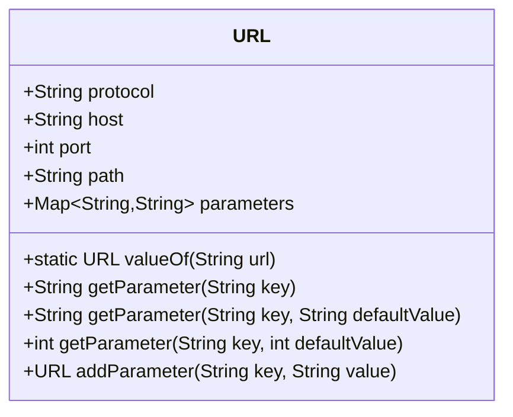
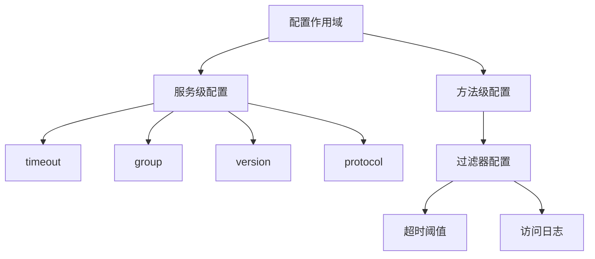
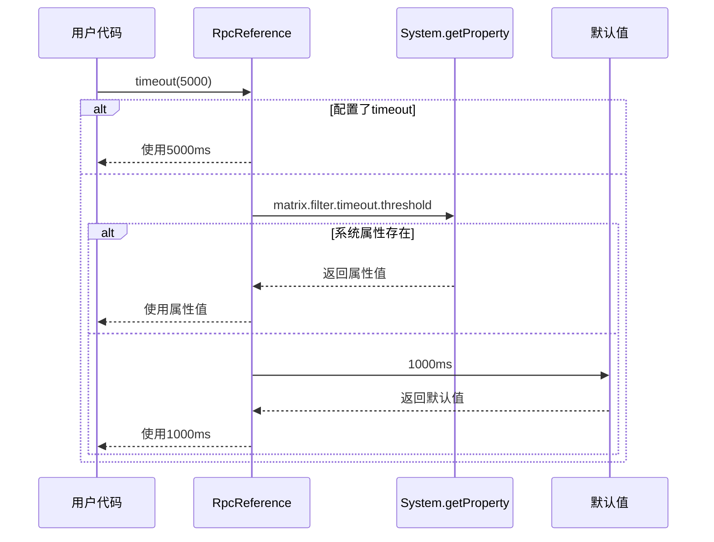

# 配置参考

<cite>
**本文档引用的文件**  
- [URL.java](file://matrix-rpc-common/src/main/java/io/homeey/matrix/rpc/common/URL.java)
- [RpcReference.java](file://matrix-rpc-runtime/src/main/java/io/homeey/matrix/rpc/runtime/RpcReference.java)
- [RpcService.java](file://matrix-rpc-runtime/src/main/java/io/homeey/matrix/rpc/runtime/RpcService.java)
- [FilterConfig.java](file://matrix-rpc-filter/matrix-rpc-filter-builtin/src/main/java/io/homeey/matrix/rpc/filter/builtin/FilterConfig.java)
- [TimeoutFilter.java](file://matrix-rpc-filter/matrix-rpc-filter-builtin/src/main/java/io/homeey/matrix/rpc/filter/builtin/TimeoutFilter.java)
- [RegistryFactory.java](file://matrix-rpc-registry/matrix-rpc-register-api/src/main/java/io/homeey/matrix/rpc/registry/api/RegistryFactory.java)
- [NettyTransportClient.java](file://matrix-rpc-transport/matrix-rpc-transport-netty/src/main/java/io/homeey/matrix/rpc/transport/netty/client/NettyTransportClient.java)
</cite>

## 目录
1. [简介](#简介)
2. [URL类：统一配置总线](#url类统一配置总线)
3. [核心配置项详解](#核心配置项详解)
4. [配置作用域](#配置作用域)
5. [配置优先级](#配置优先级)
6. [配置格式与示例](#配置格式与示例)
7. [最佳实践](#最佳实践)

## 简介
Matrix RPC框架采用统一的配置模型，通过`URL`类作为配置总线承载所有配置信息。该设计借鉴了Dubbo等成熟RPC框架的理念，将协议、地址、端口、参数等信息统一管理，实现了配置的集中化和标准化。本文档详细说明配置系统的实现机制、可用配置项、作用域、优先级规则以及使用最佳实践。

## URL类：统一配置总线

`URL`类是Matrix RPC配置系统的核心，它不仅表示网络地址，更是一个承载所有配置信息的容器。该类实现了`Serializable`接口，确保配置可以在网络间传输。

`URL`类包含以下核心字段：
- **protocol**：协议类型，如`matrix`、`http`等
- **host**：主机地址
- **port**：端口号
- **path**：路径，通常为服务接口的全限定名
- **parameters**：参数集合，存储所有配置项

`URL`类提供了`valueOf`静态方法用于解析字符串格式的URL，以及`addParameter`方法用于创建带有新参数的不可变URL实例。这种不可变设计保证了配置在传递过程中的安全性。



**图表来源**  
- [URL.java](file://matrix-rpc-common/src/main/java/io/homeey/matrix/rpc/common/URL.java#L12-L163)

**本节来源**  
- [URL.java](file://matrix-rpc-common/src/main/java/io/homeey/matrix/rpc/common/URL.java#L7-L163)

## 核心配置项详解

Matrix RPC框架支持多种配置项，这些配置项通过URL的查询参数形式传递。以下是主要配置项的详细说明：

| 配置项 | 类型 | 默认值 | 说明 |
|--------|------|--------|------|
| timeout | int | 3000 | 调用超时时间（毫秒） |
| group | String | "" | 服务分组 |
| version | String | "1.0.0" | 服务版本 |
| protocol | String | "matrix" | 协议类型 |
| proxyType | String | "jdk" | 代理类型 |

此外，框架还支持过滤器相关的配置项：
- **matrix.filter.enabled**：全局过滤器开关
- **matrix.filter.{filterName}.enabled**：特定过滤器开关
- **matrix.filter.{filterName}.threshold**：过滤器阈值配置

例如，`TimeoutFilter`使用的配置项包括：
- `matrix.filter.timeout.enabled`：超时检测开关
- `matrix.filter.timeout.threshold`：慢调用阈值（默认1000毫秒）

```mermaid
flowchart TD
A[配置项] --> B[timeout]
A --> C[group]
A --> D[version]
A --> E[protocol]
A --> F[proxyType]
A --> G[filter配置]
G --> H[matrix.filter.enabled]
G --> I[matrix.filter.{name}.enabled]
G --> J[matrix.filter.{name}.threshold]
```

**图表来源**  
- [RpcReference.java](file://matrix-rpc-runtime/src/main/java/io/homeey/matrix/rpc/runtime/RpcReference.java#L38-L40)
- [RpcService.java](file://matrix-rpc-runtime/src/main/java/io/homeey/matrix/rpc/runtime/RpcService.java#L42-L44)
- [FilterConfig.java](file://matrix-rpc-filter/matrix-rpc-filter-builtin/src/main/java/io/homeey/matrix/rpc/filter/builtin/FilterConfig.java#L21-L22)

**本节来源**  
- [RpcReference.java](file://matrix-rpc-runtime/src/main/java/io/homeey/matrix/rpc/runtime/RpcReference.java#L38-L40)
- [RpcService.java](file://matrix-rpc-runtime/src/main/java/io/homeey/matrix/rpc/runtime/RpcService.java#L42-L44)
- [FilterConfig.java](file://matrix-rpc-filter/matrix-rpc-filter-builtin/src/main/java/io/homeey/matrix/rpc/filter/builtin/FilterConfig.java#L19-L85)

## 配置作用域

Matrix RPC的配置项具有不同的作用域，主要分为服务级和方法级：

### 服务级配置
服务级配置影响整个服务的暴露或引用行为，包括：
- `timeout`：服务调用超时时间
- `group`：服务分组标识
- `version`：服务版本号
- `protocol`：通信协议

这些配置在服务暴露（Provider）和引用（Consumer）时设置，通过`RpcService`和`RpcReference`的构建器方法进行配置。

### 方法级配置
方法级配置针对特定方法调用，目前主要通过过滤器机制实现。例如：
- `TimeoutFilter`可以针对特定方法设置不同的超时阈值
- `AccessLogFilter`可以控制特定方法的访问日志记录

通过`@Activate`注解的`group`属性，可以控制过滤器的作用范围：
- `group = {"CONSUMER"}`：仅在消费端生效
- `group = {"PROVIDER"}`：仅在提供端生效
- `group = {"CONSUMER", "PROVIDER"}`：在两端都生效



**图表来源**  
- [RpcService.java](file://matrix-rpc-runtime/src/main/java/io/homeey/matrix/rpc/runtime/RpcService.java#L135-L151)
- [RpcReference.java](file://matrix-rpc-runtime/src/main/java/io/homeey/matrix/rpc/runtime/RpcReference.java#L108-L110)
- [Activate.java](file://matrix-rpc-spi/src/main/java/io/homeey/matrix/rpc/spi/Activate.java#L17-L18)

**本节来源**  
- [RpcService.java](file://matrix-rpc-runtime/src/main/java/io/homeey/matrix/rpc/runtime/RpcService.java#L135-L151)
- [RpcReference.java](file://matrix-rpc-runtime/src/main/java/io/homeey/matrix/rpc/runtime/RpcReference.java#L108-L110)
- [Activate.java](file://matrix-rpc-spi/src/main/java/io/homeey/matrix/rpc/spi/Activate.java#L17-L18)

## 配置优先级

Matrix RPC框架遵循"就近原则"的配置优先级策略，具体优先级顺序如下：

1. **代码配置**：通过API直接设置的配置具有最高优先级
2. **系统属性**：通过JVM系统属性设置的配置
3. **默认值**：框架内置的默认配置

以超时配置为例，其优先级处理流程如下：



在`FilterConfig`类中，通过`System.getProperty`方法获取系统属性配置，如果没有设置则使用默认值。这种设计允许用户在不同环境（开发、测试、生产）中灵活调整配置，而无需修改代码。

**图表来源**  
- [FilterConfig.java](file://matrix-rpc-filter/matrix-rpc-filter-builtin/src/main/java/io/homeey/matrix/rpc/filter/builtin/FilterConfig.java#L51-L54)
- [RpcReference.java](file://matrix-rpc-runtime/src/main/java/io/homeey/matrix/rpc/runtime/RpcReference.java#L109-L110)

**本节来源**  
- [FilterConfig.java](file://matrix-rpc-filter/matrix-rpc-filter-builtin/src/main/java/io/homeey/matrix/rpc/filter/builtin/FilterConfig.java#L30-L85)
- [RpcReference.java](file://matrix-rpc-runtime/src/main/java/io/homeey/matrix/rpc/runtime/RpcReference.java#L108-L110)

## 配置格式与示例

Matrix RPC的配置URL遵循标准的URI格式：`protocol://host:port/path?key1=value1&key2=value2`

### 配置格式说明
- **protocol**：协议名称，如`matrix`
- **host**：主机地址，如`localhost`
- **port**：端口号，如`20880`
- **path**：服务路径，通常是接口的全限定名
- **query parameters**：查询参数，以`key=value`形式表示配置项

### 使用示例

#### 服务暴露配置
```java
RpcService.export(EchoService.class, new EchoServiceImpl(), 20880)
    .group("demo")
    .version("2.0.0")
    .export();
```
对应的URL为：`matrix://0.0.0.0:20880/io.homeey.matrix.rpc.example.api.EchoService?group=demo&version=2.0.0`

#### 服务引用配置
```java
EchoService service = RpcReference.create(EchoService.class)
    .address("localhost", 20880)
    .timeout(5000)
    .get();
```
对应的URL为：`matrix://localhost:20880/io.homeey.matrix.rpc.example.api.EchoService?timeout=5000`

#### 系统属性配置
```bash
-Dmatrix.filter.enabled=true
-Dmatrix.filter.timeout.enabled=true
-Dmatrix.filter.timeout.threshold=2000
```

**本节来源**  
- [RpcService.java](file://matrix-rpc-runtime/src/main/java/io/homeey/matrix/rpc/runtime/RpcService.java#L145-L150)
- [RpcReference.java](file://matrix-rpc-runtime/src/main/java/io/homeey/matrix/rpc/runtime/RpcReference.java#L108-L110)
- [FilterConfig.java](file://matrix-rpc-filter/matrix-rpc-filter-builtin/src/main/java/io/homeey/matrix/rpc/filter/builtin/FilterConfig.java#L11-L16)

## 最佳实践

### 1. 合理设置超时时间
为避免服务雪崩，建议为每个服务设置合理的超时时间。对于核心服务，可以设置较短的超时时间；对于依赖外部系统的服务，可以适当延长。

### 2. 使用分组和版本进行服务隔离
通过`group`和`version`参数，可以实现服务的灰度发布和A/B测试。例如：
- `group=canary`：金丝雀发布组
- `version=2.0.0`：新版本服务

### 3. 过滤器配置管理
建议通过系统属性统一管理过滤器配置，便于在不同环境中调整。例如在生产环境开启所有过滤器，在测试环境关闭部分过滤器以提高性能。

### 4. 配置的可维护性
避免在代码中硬编码配置值，建议将常用配置提取为常量或通过配置文件管理。对于动态配置，可以考虑集成配置中心。

### 5. 错误处理
在配置URL时，应捕获可能的`IllegalArgumentException`异常，确保配置的正确性。建议在应用启动时进行配置验证。

**本节来源**  
- [RpcService.java](file://matrix-rpc-runtime/src/main/java/io/homeey/matrix/rpc/runtime/RpcService.java)
- [RpcReference.java](file://matrix-rpc-runtime/src/main/java/io/homeey/matrix/rpc/runtime/RpcReference.java)
- [URL.java](file://matrix-rpc-common/src/main/java/io/homeey/matrix/rpc/common/URL.java)