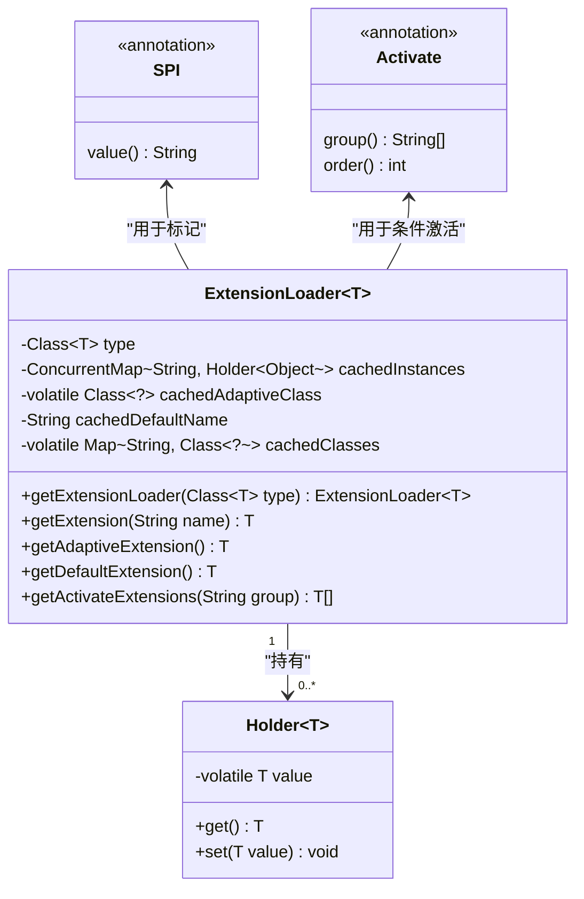
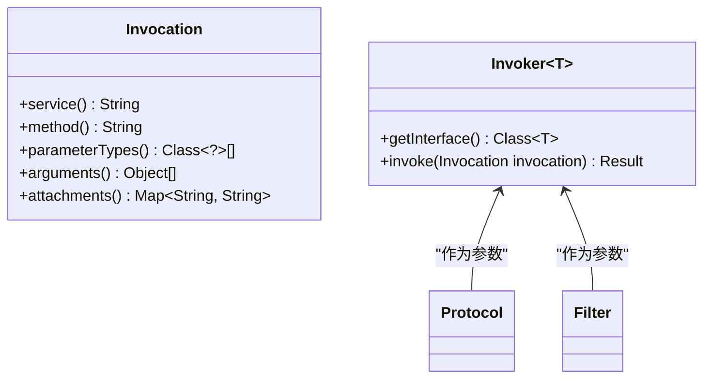
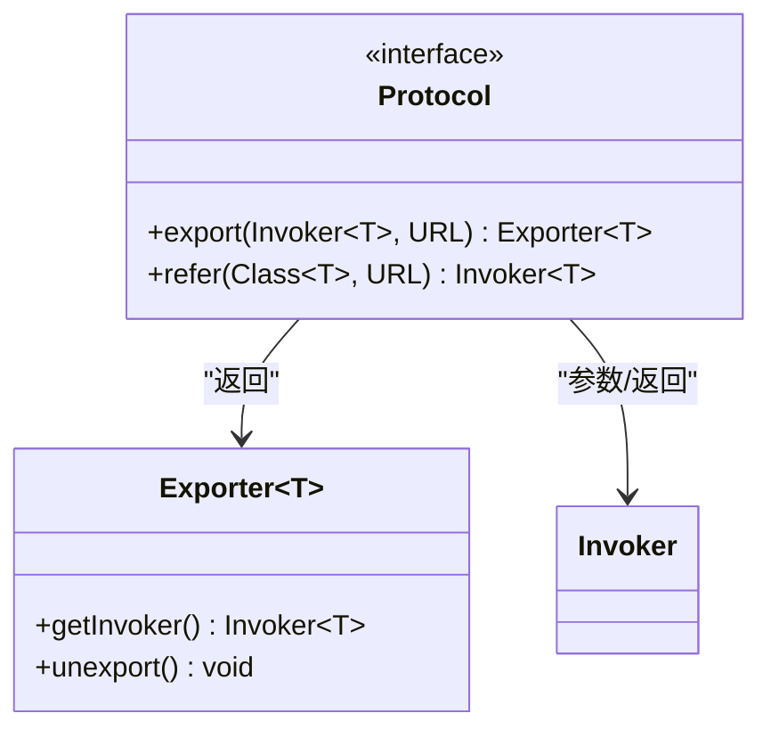
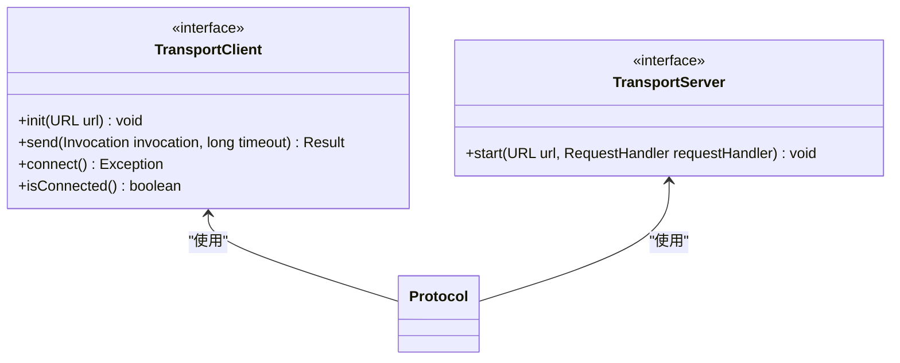
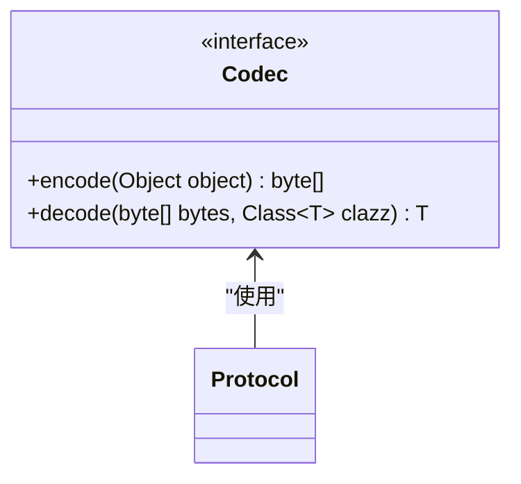
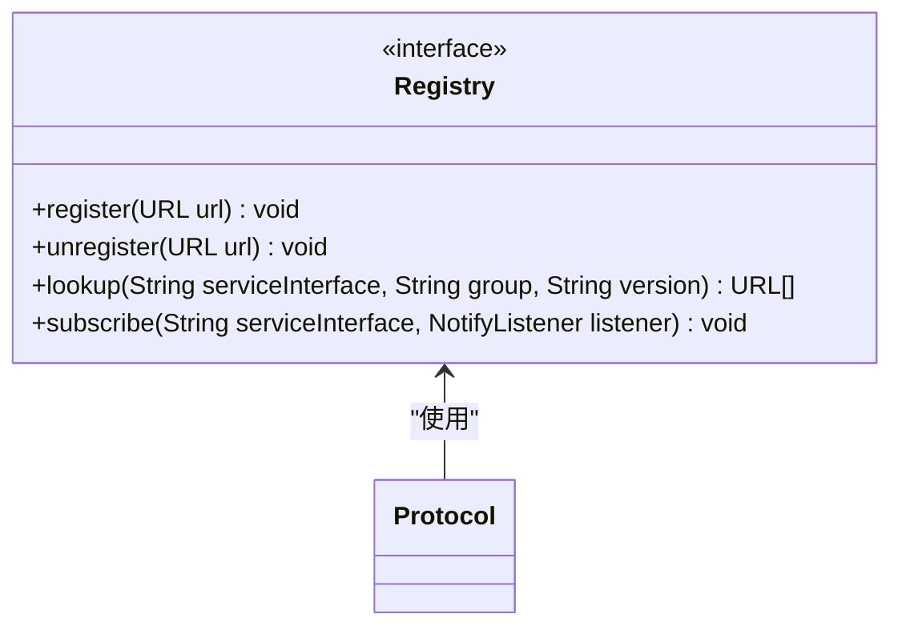
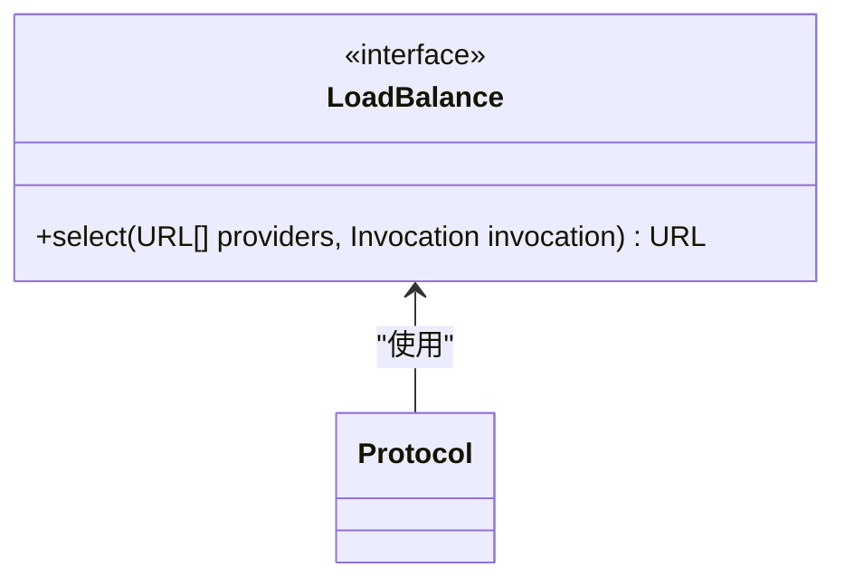
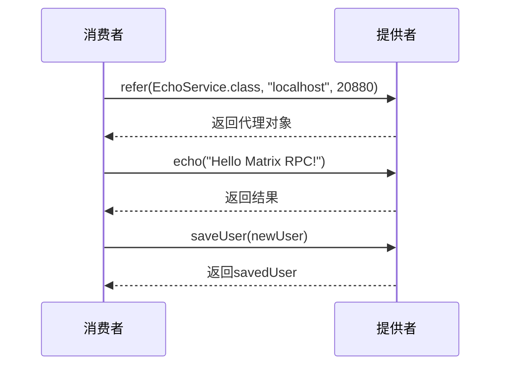
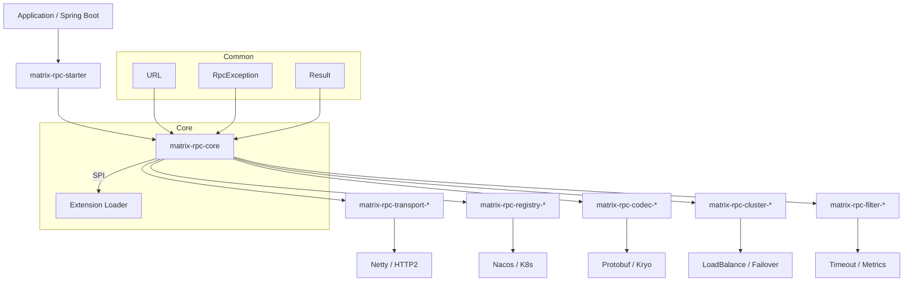

# 项目概述

<cite>
**本文档引用的文件**  
- [README.md](file://README.md)
- [pom.xml](file://pom.xml)
- [RpcException.java](file://matrix-rpc-common/src/main/java/io/homeey/matrix/rpc/common/RpcException.java)
- [URL.java](file://matrix-rpc-common/src/main/java/io/homeey/matrix/rpc/common/URL.java)
- [Protocol.java](file://matrix-rpc-core/src/main/java/io/homeey/matrix/rpc/core/Protocol.java)
- [SPI.java](file://matrix-rpc-spi/src/main/java/io/homeey/matrix/rpc/spi/SPI.java)
- [ExtensionLoader.java](file://matrix-rpc-spi/src/main/java/io/homeey/matrix/rpc/spi/ExtensionLoader.java)
- [Exporter.java](file://matrix-rpc-core/src/main/java/io/homeey/matrix/rpc/core/Exporter.java)
- [Invoker.java](file://matrix-rpc-core/src/main/java/io/homeey/matrix/rpc/core/Invoker.java)
- [ConsumerMain.java](file://matrix-rpc-examples/src/main/java/io/homeey/matrix/rpc/example/consumer/ConsumerMain.java)
- [TransportClient.java](file://matrix-rpc-transport/matrix-rpc-transport-api/src/main/java/io/homeey/matrix/rpc/transport/api/TransportClient.java)
- [TransportServer.java](file://matrix-rpc-transport/matrix-rpc-transport-api/src/main/java/io/homeey/matrix/rpc/transport/api/TransportServer.java)
- [Codec.java](file://matrix-rpc-codec/matrix-rpc-codec-api/src/main/java/io/homeey/matrix/rpc/codec/api/Codec.java)
- [Registry.java](file://matrix-rpc-registry/matrix-rpc-register-api/src/main/java/io/homeey/matrix/rpc/registry/api/Registry.java)
- [LoadBalance.java](file://matrix-rpc-cluster/matrix-rpc-cluster-api/src/main/java/io/homeey/matrix/rpc/cluster/api/LoadBalance.java)
</cite>

## 目录

1. [简介](#简介)
2. [核心目标与优势](#核心目标与优势)
3. [微内核架构设计](#微内核架构设计)
4. [SPI扩展机制](#spi扩展机制)
5. [模块化分层与Maven设计](#模块化分层与maven设计)
6. [核心抽象组件](#核心抽象组件)
7. [可扩展性支持](#可扩展性支持)
8. [集成技术栈](#集成技术栈)
9. [示例应用分析](#示例应用分析)
10. [系统上下文架构图](#系统上下文架构图)

## 简介

Matrix RPC 是一个轻量级、高性能、云原生的Java远程过程调用（RPC）框架，专为现代微服务架构设计。该项目旨在提供一个灵活、可扩展且易于集成的RPC解决方案，支持多种传输协议、序列化方式、注册中心和集群策略。通过微内核架构和基于SPI（Service Provider Interface）的扩展机制，Matrix RPC实现了高度的模块化和可定制性，适用于从单体应用到大规模分布式系统的各种场景。

**Section sources**  
- [README.md](file://README.md#L1-L277)

## 核心目标与优势

Matrix RPC的核心目标是构建一个最小可用但功能完备的RPC内核，具备以下关键优势：

- **轻量级**：核心依赖少，启动速度快，资源占用低
- **高性能**：基于Netty实现异步非阻塞通信，支持高并发调用
- **云原生就绪**：设计上支持Kubernetes、Nacos等云原生基础设施
- **高度可扩展**：通过SPI机制实现插件化扩展，无需修改核心代码
- **模块化设计**：各功能组件独立成模块，按需引入
- **开发者友好**：提供简洁的API和Spring Boot集成支持

项目遵循渐进式演进蓝图，从Phase 1的最小可用内核逐步发展到支持完整云原生特性的成熟框架。

**Section sources**  
- [README.md](file://README.md#L228-L277)

## 微内核架构设计

Matrix RPC采用微内核架构设计，将核心调度逻辑与具体实现解耦。微内核负责基本的RPC调用流程控制，而具体的功能如传输、序列化、负载均衡等通过插件方式扩展。这种设计使得框架核心保持精简稳定，同时允许用户根据实际需求灵活替换或扩展功能组件。

微内核主要包含`Protocol`、`Invoker`、`Exporter`等核心接口，它们定义了RPC调用的基本语义和生命周期管理。所有外部功能都通过标准化接口接入内核，确保了系统的松耦合和高内聚。

**Section sources**  
- [README.md](file://README.md#L126-L139)
- [Protocol.java](file://matrix-rpc-core/src/main/java/io/homeey/matrix/rpc/core/Protocol.java#L1-L25)

## SPI扩展机制

Matrix RPC实现了自定义的SPI机制，作为框架的“中枢神经”，替代了Java原生的ServiceLoader。该机制具有以下特性：

- **注解驱动**：通过`@SPI`注解标记可扩展接口，并指定默认实现
- **条件激活**：支持通过`@Activate`注解按分组（如provider/consumer）和优先级激活扩展
- **Wrapper包装**：支持AOP式的包装器模式，实现责任链模式
- **自适应扩展**：支持动态生成适配器类
- **多目录加载**：从`META-INF/matrix/`和`META-INF/services/`加载扩展配置

`ExtensionLoader`是SPI机制的核心类，负责扩展类的加载、实例化、依赖注入和缓存管理。



**Diagram sources**  
- [SPI.java](file://matrix-rpc-spi/src/main/java/io/homeey/matrix/rpc/spi/SPI.java#L1-L15)
- [ExtensionLoader.java](file://matrix-rpc-spi/src/main/java/io/homeey/matrix/rpc/spi/ExtensionLoader.java#L1-L231)

## 模块化分层与Maven设计

Matrix RPC采用清晰的模块化分层设计，各模块职责分明，通过Maven进行依赖管理：

```text
matrix-rpc
├── matrix-rpc-bom                # 统一版本管理
├── matrix-rpc-common             # 通用工具 & 基础模型
├── matrix-rpc-spi                # SPI机制（微内核核心）
├── matrix-rpc-core               # RPC核心调度
├── matrix-rpc-transport          # 传输层抽象
│   ├── matrix-rpc-transport-api
│   ├── matrix-rpc-transport-netty
├── matrix-rpc-codec              # 序列化抽象
│   ├── matrix-rpc-codec-api
│   ├── matrix-rpc-codec-protobuf
│   └── matrix-rpc-codec-kryo
├── matrix-rpc-registry           # 注册中心抽象
│   ├── matrix-rpc-registry-api
│   ├── matrix-rpc-registry-nacos
├── matrix-rpc-cluster            # 集群策略
│   ├── matrix-rpc-cluster-api
│   └── matrix-rpc-cluster-loadbalance
├── matrix-rpc-filter             # 过滤器
├── matrix-rpc-runtime            # 运行时支持
├── matrix-rpc-proxy              # 代理生成
└── matrix-rpc-examples           # 示例应用
```

这种设计实现了关注点分离，开发者可以根据需要选择性引入特定模块。

**Section sources**  
- [README.md](file://README.md#L61-L102)
- [pom.xml](file://pom.xml#L7-L26)

## 核心抽象组件

Matrix RPC定义了一系列核心抽象接口，构成了框架的“灵魂”：

### Invocation与Invoker（调用语义）

`Invocation`封装了一次方法调用的所有信息，包括服务名、方法名、参数类型、参数值和附加属性。`Invoker`是RPC世界的“函数指针”，代表一个可执行的服务引用。



**Diagram sources**  
- [README.md](file://README.md#L109-L120)
- [Invoker.java](file://matrix-rpc-core/src/main/java/io/homeey/matrix/rpc/core/Invoker.java#L1-L8)

### Protocol（协议编排者）

`Protocol`接口是RPC的核心编排者，负责将`Invoker`暴露为网络服务或将网络服务引用为`Invoker`。它不直接处理网络通信，而是协调底层传输、序列化等组件。



**Diagram sources**  
- [Protocol.java](file://matrix-rpc-core/src/main/java/io/homeey/matrix/rpc/core/Protocol.java#L1-L25)
- [Exporter.java](file://matrix-rpc-core/src/main/java/io/homeey/matrix/rpc/core/Exporter.java#L1-L21)

## 可扩展性支持

Matrix RPC通过SPI机制支持多种可扩展点：

### 传输协议扩展

通过`TransportClient`和`TransportServer`接口支持多种传输协议，当前已实现Netty传输。



**Diagram sources**  
- [TransportClient.java](file://matrix-rpc-transport/matrix-rpc-transport-api/src/main/java/io/homeey/matrix/rpc/transport/api/TransportClient.java#L1-L48)
- [TransportServer.java](file://matrix-rpc-transport/matrix-rpc-transport-api/src/main/java/io/homeey/matrix/rpc/transport/api/TransportServer.java#L1-L23)

### 序列化扩展

通过`Codec`接口支持多种序列化方式，如Protobuf、Kryo等。



**Diagram sources**  
- [Codec.java](file://matrix-rpc-codec/matrix-rpc-codec-api/src/main/java/io/homeey/matrix/rpc/codec/api/Codec.java#L1-L31)

### 注册中心扩展

通过`Registry`接口支持多种服务注册与发现机制。



**Diagram sources**  
- [Registry.java](file://matrix-rpc-registry/matrix-rpc-register-api/src/main/java/io/homeey/matrix/rpc/registry/api/Registry.java#L1-L39)

### 集群策略扩展

通过`LoadBalance`接口支持多种负载均衡策略。



**Diagram sources**  
- [LoadBalance.java](file://matrix-rpc-cluster/matrix-rpc-cluster-api/src/main/java/io/homeey/matrix/rpc/cluster/api/LoadBalance.java#L1-L18)

## 集成技术栈

Matrix RPC集成了业界主流的技术组件：

- **Netty**：作为默认传输层，提供高性能异步通信能力
- **Protobuf**：作为默认序列化方式，提供高效的数据编码
- **Kryo**：提供另一种高效的二进制序列化选项
- **Nacos**：作为注册中心实现，支持服务发现与配置管理
- **SLF4J/Logback**：日志框架
- **Lombok**：简化Java代码编写

这些集成通过独立的模块实现，保持了核心的轻量性。

**Section sources**  
- [pom.xml](file://pom.xml#L34-L43)
- [README.md](file://README.md#L8-L11)

## 示例应用分析

Matrix RPC提供了完整的示例应用，展示了框架的使用方式：

```java
// 消费者端：通过一行代码获取远程服务代理
EchoService echoService = RpcReference.refer(EchoService.class, "localhost", 20880);

// 支持字符串参数调用
String result = echoService.echo("Hello Matrix RPC!");

// 支持复杂对象作为参数和返回值
User newUser = new User(null, "张三", "zhangsan@example.com", 30);
User savedUser = echoService.saveUser(newUser);
```

示例展示了框架对基本类型和复杂对象的完整支持，以及简洁的API设计。



**Diagram sources**  
- [ConsumerMain.java](file://matrix-rpc-examples/src/main/java/io/homeey/matrix/rpc/example/consumer/ConsumerMain.java#L1-L37)

## 系统上下文架构图



**Diagram sources**  
- [README.md](file://README.md#L19-L58)
- [URL.java](file://matrix-rpc-common/src/main/java/io/homeey/matrix/rpc/common/URL.java#L1-L164)
- [RpcException.java](file://matrix-rpc-common/src/main/java/io/homeey/matrix/rpc/common/RpcException.java#L1-L24)