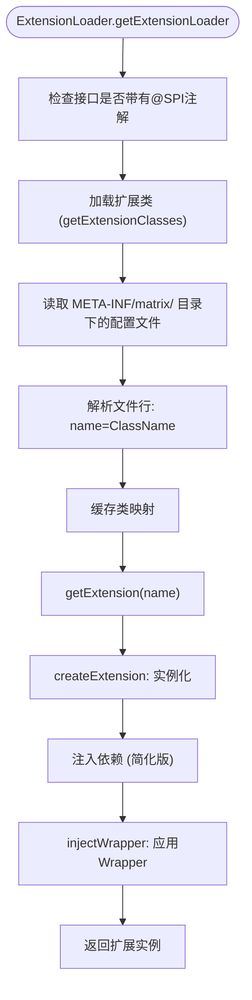
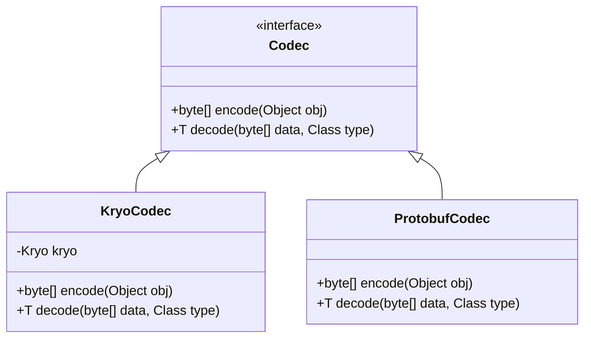
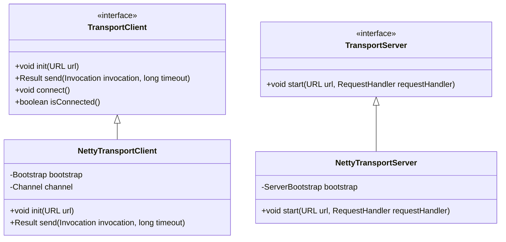
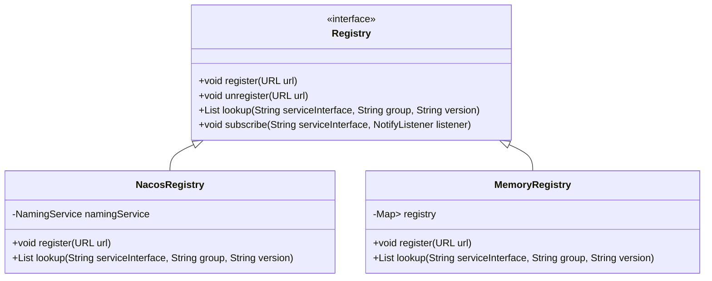
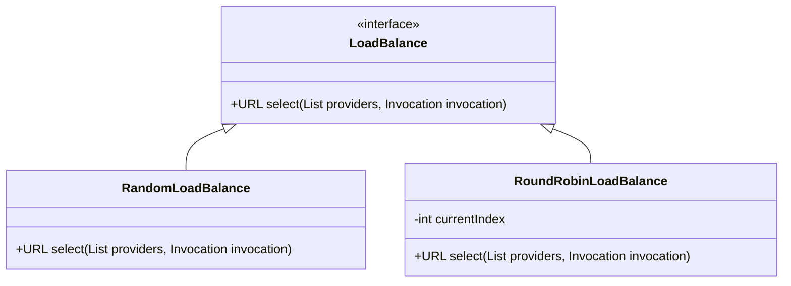
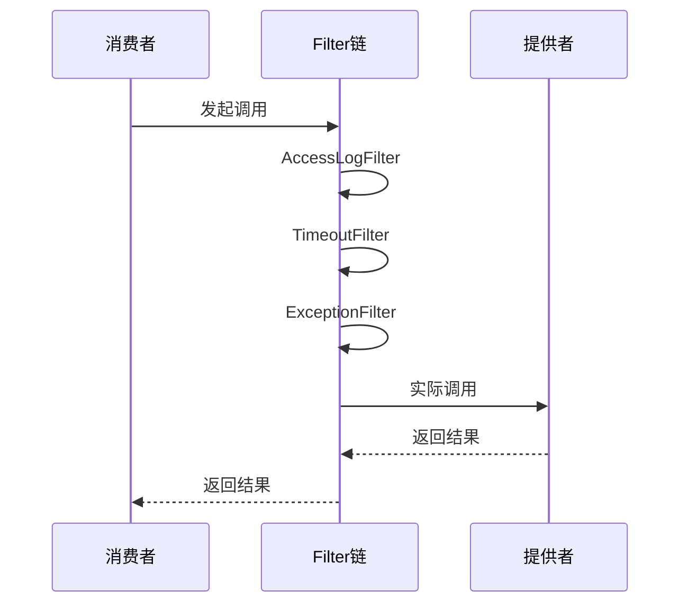
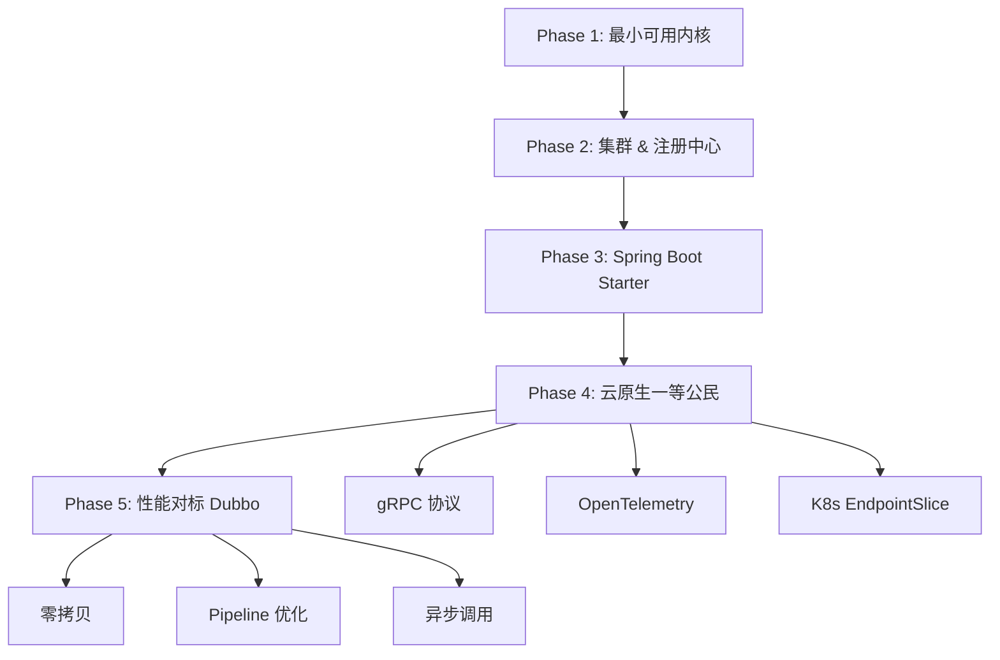

# 高级特性

<cite>
**本文档中引用的文件**  
- [README.md](file://README.md)
- [pom.xml](file://pom.xml)
- [SPI.java](file://matrix-rpc-spi/src/main/java/io/homeey/matrix/rpc/spi/SPI.java)
- [ExtensionLoader.java](file://matrix-rpc-spi/src/main/java/io/homeey/matrix/rpc/spi/ExtensionLoader.java)
- [Activate.java](file://matrix-rpc-spi/src/main/java/io/homeey/matrix/rpc/spi/Activate.java)
- [Protocol.java](file://matrix-rpc-core/src/main/java/io/homeey/matrix/rpc/core/Protocol.java)
- [Codec.java](file://matrix-rpc-codec/matrix-rpc-codec-api/src/main/java/io/homeey/matrix/rpc/codec/api/Codec.java)
- [TransportClient.java](file://matrix-rpc-transport/matrix-rpc-transport-api/src/main/java/io/homeey/matrix/rpc/transport/api/TransportClient.java)
- [TransportServer.java](file://matrix-rpc-transport/matrix-rpc-transport-api/src/main/java/io/homeey/matrix/rpc/transport/api/TransportServer.java)
- [Registry.java](file://matrix-rpc-registry/matrix-rpc-register-api/src/main/java/io/homeey/matrix/rpc/registry/api/Registry.java)
- [LoadBalance.java](file://matrix-rpc-cluster/matrix-rpc-cluster-api/src/main/java/io/homeey/matrix/rpc/cluster/api/LoadBalance.java)
- [Filter.java](file://matrix-rpc-filter/matrix-rpc-filter-api/src/main/java/io/homeey/matrix/rpc/filter/Filter.java)
</cite>

## 目录
1. [简介](#简介)
2. [SPI扩展机制详解](#spi扩展机制详解)
3. [自定义扩展开发指南](#自定义扩展开发指南)
   - [实现自定义Codec](#实现自定义codec)
   - [实现自定义Transport](#实现自定义transport)
   - [实现自定义Registry](#实现自定义registry)
   - [实现自定义LoadBalance](#实现自定义loadbalance)
   - [实现自定义Filter](#实现自定义filter)
4. [性能优化建议](#性能优化建议)
5. [安全考虑](#安全考虑)
6. [未来演进蓝图](#未来演进蓝图)

## 简介

Matrix RPC 是一个轻量级、高性能、云原生的RPC框架，其核心设计理念基于微内核架构与SPI（Service Provider Interface）扩展机制。该框架通过清晰的抽象分层，实现了高度的可扩展性与灵活性。本文档深入探讨Matrix RPC的高级特性，重点介绍如何通过SPI机制进行自定义扩展开发，并提供性能优化与安全实现的指导建议。

**文档来源**  
- [README.md](file://README.md)

## SPI扩展机制详解

Matrix RPC的扩展能力依赖于其自研的SPI机制，该机制不依赖于Java原生的`ServiceLoader`，而是通过`ExtensionLoader`类实现更强大的功能，包括扩展优先级、条件激活、Wrapper包装等。

### SPI注解

`@SPI`注解用于标记一个接口为可扩展点，其`value()`属性指定默认实现的名称。例如，`Protocol`接口的默认实现为`matrix`：

```java
@SPI("matrix")
public interface Protocol { ... }
```

### Activate注解

`@Activate`注解用于控制扩展的激活条件，支持按分组（如`provider`或`consumer`）和优先级（`order`）进行排序。例如：

```java
@Activate(group = "provider", order = 100)
public class MetricsFilter implements Filter { ... }
```

### ExtensionLoader核心流程

`ExtensionLoader`是SPI机制的核心，其加载流程如下：
1. **加载类**：从`META-INF/matrix/`和`META-INF/services/`目录下读取扩展配置文件。
2. **构建激活扩展**：根据`@Activate`注解的`group`和`order`属性筛选并排序扩展。
3. **实例化与包装**：创建扩展实例，并应用Wrapper模式进行功能增强。



**图示来源**  
- [ExtensionLoader.java](file://matrix-rpc-spi/src/main/java/io/homeey/matrix/rpc/spi/ExtensionLoader.java#L32-L231)
- [SPI.java](file://matrix-rpc-spi/src/main/java/io/homeey/matrix/rpc/spi/SPI.java)
- [Activate.java](file://matrix-rpc-spi/src/main/java/io/homeey/matrix/rpc/spi/Activate.java)

**本节来源**  
- [ExtensionLoader.java](file://matrix-rpc-spi/src/main/java/io/homeey/matrix/rpc/spi/ExtensionLoader.java#L32-L231)
- [SPI.java](file://matrix-rpc-spi/src/main/java/io/homeey/matrix/rpc/spi/SPI.java)
- [Activate.java](file://matrix-rpc-spi/src/main/java/io/homeey/matrix/rpc/spi/Activate.java)

## 自定义扩展开发指南

Matrix RPC通过模块化设计，允许开发者轻松实现并集成自定义的`Codec`、`Transport`、`Registry`、`LoadBalance`和`Filter`。

### 实现自定义Codec

`Codec`接口负责请求与响应的序列化与反序列化。要实现自定义编解码器，需遵循以下步骤：

1. **创建实现类**：实现`Codec`接口，提供`encode`和`decode`方法的具体逻辑。
2. **添加SPI注解**：使用`@SPI`和`@Activate`注解标记类。
3. **配置SPI文件**：在`resources/META-INF/matrix/`目录下创建文件`io.homeey.matrix.rpc.codec.api.Codec`，内容为`yourName=your.package.YourCodec`。



**图示来源**  
- [Codec.java](file://matrix-rpc-codec/matrix-rpc-codec-api/src/main/java/io/homeey/matrix/rpc/codec/api/Codec.java)
- [KryoCodec.java](file://matrix-rpc-codec/matrix-rpc-codec-kryo/src/main/java/io/homeey/matrix/rpc/codec/kryo/KryoCodec.java)
- [ProtobufCodec.java](file://matrix-rpc-codec/matrix-rpc-codec-protobuf/src/main/java/io/homeey/matrix/rpc/codec/protobuf/ProtobufCodec.java)

**本节来源**  
- [Codec.java](file://matrix-rpc-codec/matrix-rpc-codec-api/src/main/java/io/homeey/matrix/rpc/codec/api/Codec.java)
- [KryoCodec.java](file://matrix-rpc-codec/matrix-rpc-codec-kryo/src/main/java/io/homeey/matrix/rpc/codec/kryo/KryoCodec.java)
- [ProtobufCodec.java](file://matrix-rpc-codec/matrix-rpc-codec-protobuf/src/main/java/io/homeey/matrix/rpc/codec/protobuf/ProtobufCodec.java)

### 实现自定义Transport

`Transport`模块负责底层的网络通信。`TransportClient`和`TransportServer`接口分别定义了客户端与服务端的行为。

1. **实现接口**：基于Netty或其他网络库实现`TransportClient`和`TransportServer`。
2. **SPI配置**：在`resources/META-INF/matrix/`下创建`io.homeey.matrix.rpc.transport.api.TransportClient`和`io.homeey.matrix.rpc.transport.api.TransportServer`文件。



**图示来源**  
- [TransportClient.java](file://matrix-rpc-transport/matrix-rpc-transport-api/src/main/java/io/homeey/matrix/rpc/transport/api/TransportClient.java)
- [TransportServer.java](file://matrix-rpc-transport/matrix-rpc-transport-api/src/main/java/io/homeey/matrix/rpc/transport/api/TransportServer.java)
- [NettyTransportClient.java](file://matrix-rpc-transport/matrix-rpc-transport-netty/src/main/java/io/homeey/matrix/rpc/transport/netty/client/NettyTransportClient.java)
- [NettyTransportServer.java](file://matrix-rpc-transport/matrix-rpc-transport-netty/src/main/java/io/homeey/matrix/rpc/transport/netty/server/NettyTransportServer.java)

**本节来源**  
- [TransportClient.java](file://matrix-rpc-transport/matrix-rpc-transport-api/src/main/java/io/homeey/matrix/rpc/transport/api/TransportClient.java)
- [TransportServer.java](file://matrix-rpc-transport/matrix-rpc-transport-api/src/main/java/io/homeey/matrix/rpc/transport/api/TransportServer.java)

### 实现自定义Registry

`Registry`接口负责服务的注册与发现。通过实现此接口，可接入Nacos、Etcd等注册中心。

1. **实现接口**：完成`register`、`unregister`、`lookup`和`subscribe`方法。
2. **SPI配置**：在`META-INF/matrix/`下创建`io.homeey.matrix.rpc.registry.api.RegistryFactory`文件。



**图示来源**  
- [Registry.java](file://matrix-rpc-registry/matrix-rpc-register-api/src/main/java/io/homeey/matrix/rpc/registry/api/Registry.java)
- [NacosRegistry.java](file://matrix-rpc-registry/matrix-rpc-registry-nacos/src/main/java/io/homeey/matrix/rpc/registry/nacos/NacosRegistry.java)
- [MemoryRegistry.java](file://matrix-rpc-registry/matrix-rpc-registy-memory/src/main/java/io/homeey/matrix/rpc/registry/MemoryRegistry.java)

**本节来源**  
- [Registry.java](file://matrix-rpc-registry/matrix-rpc-register-api/src/main/java/io/homeey/matrix/rpc/registry/api/Registry.java)

### 实现自定义LoadBalance

`LoadBalance`接口用于在多个服务提供者间选择一个实例。框架已提供`RandomLoadBalance`等实现。

1. **实现接口**：编写选择逻辑，如轮询、一致性哈希等。
2. **SPI配置**：在`META-INF/matrix/`下创建`io.homeey.matrix.rpc.cluster.api.LoadBalance`文件。



**图示来源**  
- [LoadBalance.java](file://matrix-rpc-cluster/matrix-rpc-cluster-api/src/main/java/io/homeey/matrix/rpc/cluster/api/LoadBalance.java)
- [RandomLoadBalance.java](file://matrix-rpc-cluster/matrix-rpc-cluster-loadbalance/src/main/java/io/homeey/matrix/rpc/cluster/loadbalance/RandomLoadBalance.java)

**本节来源**  
- [LoadBalance.java](file://matrix-rpc-cluster/matrix-rpc-cluster-api/src/main/java/io/homeey/matrix/rpc/cluster/api/LoadBalance.java)

### 实现自定义Filter

`Filter`是Matrix RPC中实现横切关注点的核心机制，所有如超时、限流、熔断、追踪等功能均通过Filter链实现。

1. **实现接口**：在`invoke`方法中实现拦截逻辑。
2. **激活配置**：使用`@Activate`注解指定分组和顺序。



**图示来源**  
- [Filter.java](file://matrix-rpc-filter/matrix-rpc-filter-api/src/main/java/io/homeey/matrix/rpc/filter/Filter.java)
- [TimeoutFilter.java](file://matrix-rpc-filter/matrix-rpc-filter-builtin/src/main/java/io/homeey/matrix/rpc/filter/builtin/TimeoutFilter.java)

**本节来源**  
- [Filter.java](file://matrix-rpc-filter/matrix-rpc-filter-api/src/main/java/io/homeey/matrix/rpc/filter/Filter.java)

## 性能优化建议

为充分发挥Matrix RPC的性能潜力，建议采取以下措施：

- **序列化选择**：在高吞吐场景下优先使用`ProtobufCodec`，在开发调试阶段可使用`KryoCodec`以获得更好的可读性。
- **Netty线程池调整**：根据CPU核心数合理配置`bossGroup`和`workerGroup`的线程数，避免过多线程导致上下文切换开销。
- **连接池配置**：对`TransportClient`启用连接池，复用TCP连接，减少握手开销。
- **异步调用**：利用框架的异步API，避免阻塞主线程，提高并发处理能力。

**本节来源**  
- [README.md](file://README.md)
- [pom.xml](file://pom.xml)

## 安全考虑

Matrix RPC框架支持以下安全机制的实现：

- **传输层加密（TLS）**：可在`TransportServer`和`TransportClient`的Netty配置中启用SSL/TLS，确保通信数据的机密性与完整性。
- **调用认证**：通过自定义`Filter`实现，例如在`Invocation`的`attachments`中添加认证令牌，并在服务端进行验证。

**本节来源**  
- [README.md](file://README.md)

## 未来演进蓝图

根据项目规划，Matrix RPC的未来演进方向包括：

- **Phase 1**：已完成最小可用内核，支持单机RPC与SPI扩展。
- **Phase 2**：集成Nacos等注册中心，实现集群负载均衡与故障转移。
- **Phase 3**：开发Spring Boot Starter，通过`@RpcService`和`@RpcReference`实现自动装配。
- **Phase 4**：成为云原生一等公民，支持K8s EndpointSlice、gRPC协议和OpenTelemetry集成。
- **Phase 5**：性能对标Dubbo，实现零拷贝、Pipeline优化和异步调用。



**图示来源**  
- [README.md](file://README.md#L227-L274)

**本节来源**  
- [README.md](file://README.md#L227-L274)